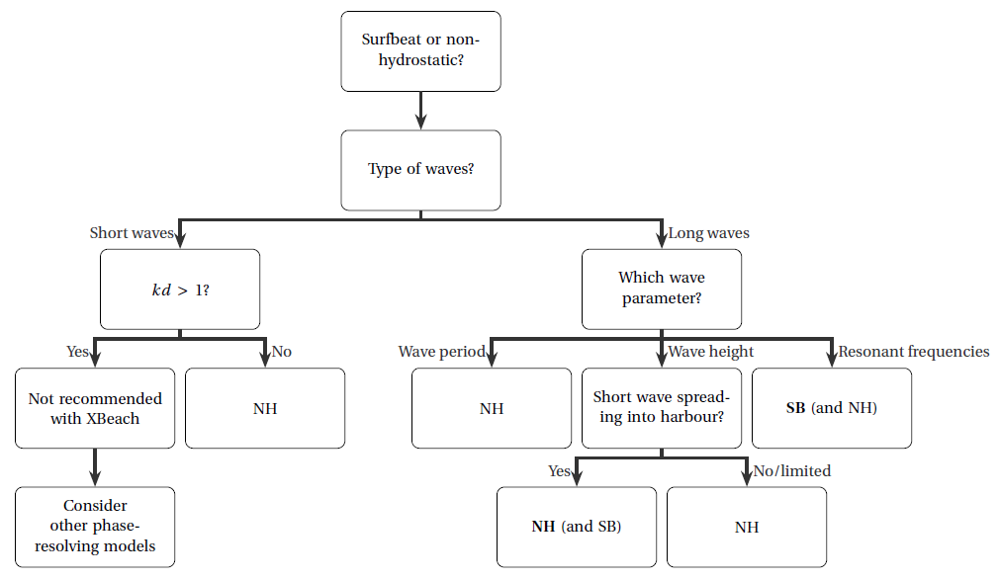

Tutorial: Hydrodynamics in ports using XBeach
=============================================

Introduction
------------

This guideline describes how to use XBeach in harbour applications. The main focus of this application is to predict wave motions in harbours. XBeach has been developed to predict the impact of storms on coastal areas, where the long waves (i.e. surfbeat, infragravity waves) are relevant. These long wave motions are also relevant in harbours, because it can interrupt harbour operations or causes hazardous situations for vessels. XBeach surfbeat could be an alternative for the existing calculation models because of its reasonable computational time and the ability to fully resolve long waves. For example, it might serve as a first estimate to predict possible resonance in the harbour. If short waves are not to be neglected, a switch is easily made to the more complete non-hydrostatic mode within XBeach. This is also of interest because it is able to compute both the primary and (second order) long waves, but at the expense of the computational ease. Wong (2016) studied the applicability of XBeach (both surfbeat and non-hydrostatic) in predicting wave climates and the determination of application limits for hydrodynamics in harbours in general. Based on his study, this guideline will first elaborate on the model choise in various situations, next it will give the necessary tips and tricks for setting up a typical harbour model.

Decision tree
-------------
Figure :numref:`fig-decisionTree` shows a decision tree set up by Wong in order to make a well-considered choise of the XBeach mode in various situations. The first step is to decide in which waves you are interested, short or long (surfbeat or infragravity waves). When the interest is on short waves, the surfbeat mode has appeared to be not applicable as this model lacks several processes that are of importance in harbour situations (diffraction, reflection). For short waves in shallow water (*kd* < 1), Wong has proved that XBeach non-hydrostatic works quite well. In deeper water (*kd* > 1) the model is not recommended as XBeach uses only 1 vertical layer.

.. _fig-decisionTree:

