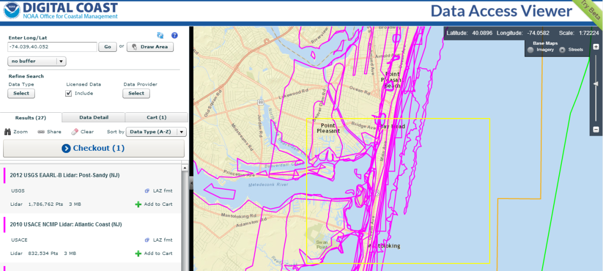
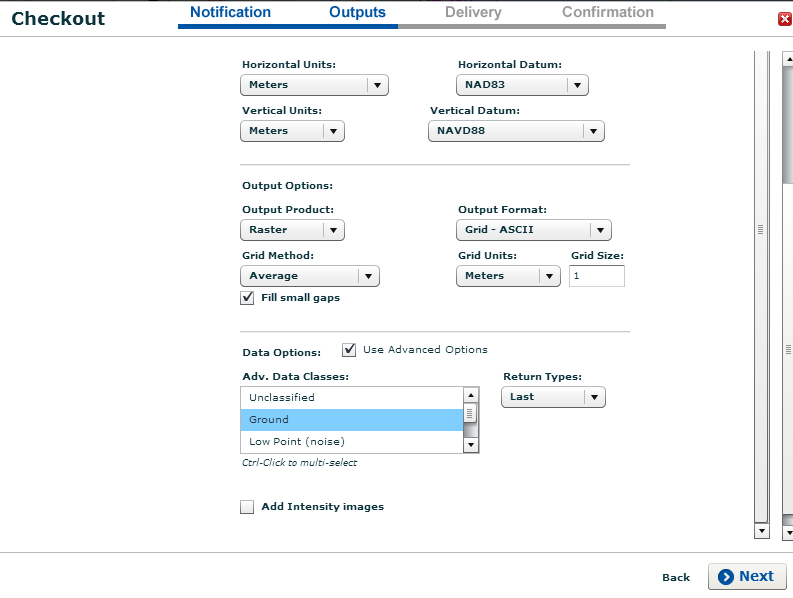
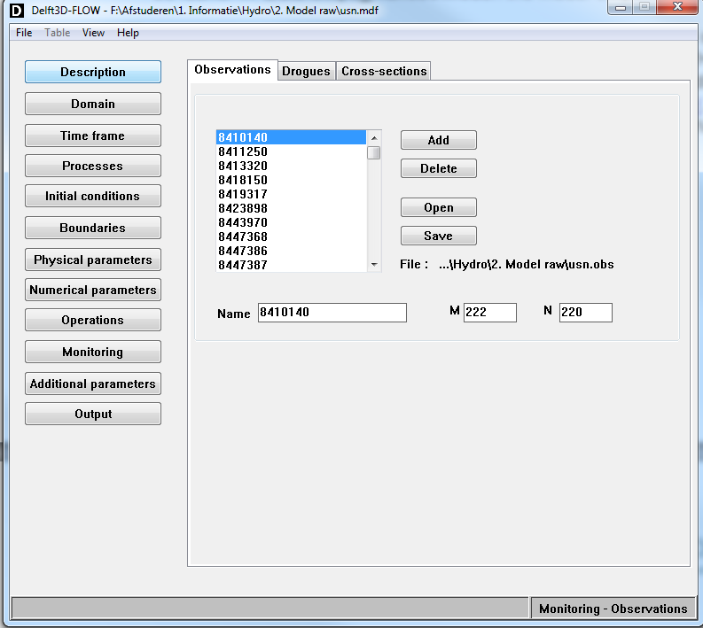
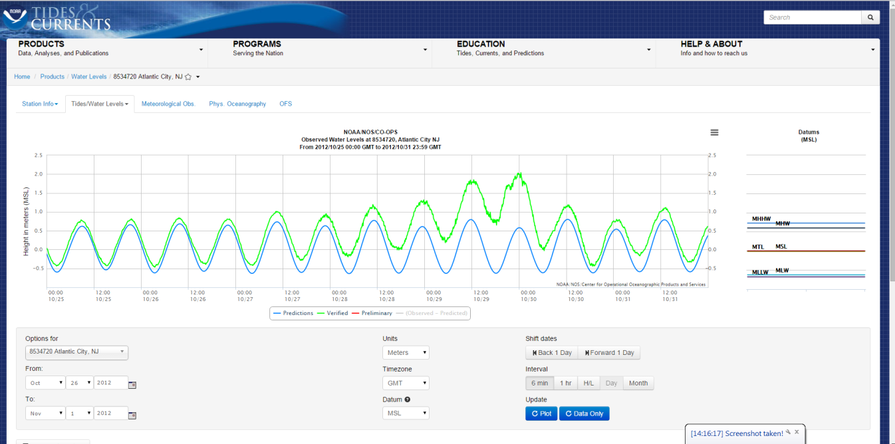
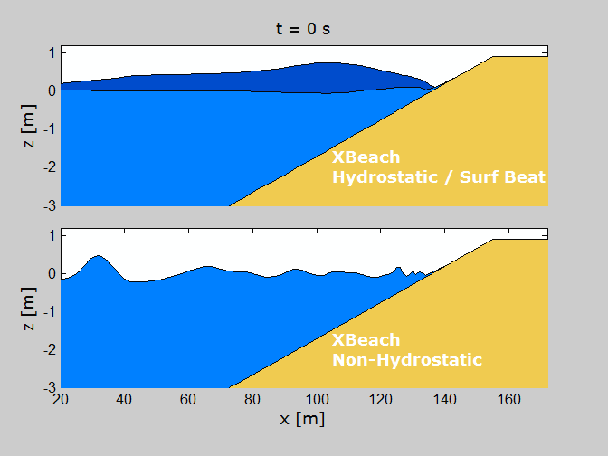

Tutorial: hindcast hurricane impact Sandy
=========================================

Introduction in the case
------------------------

In this tutorial the sandy coast of Bay Head (New Jersey, United
States) during Hurricane Sandy is modeled. Hurricane Sandy originated
from the Western North Atlantic Ocean in October 2012. The storm
caused flooding, wind and wave damage. During Hurricane Sandy the
state of New York and New Jersey were most severely hit (National
Hurricane Center, 2012), see :numref:`fig-photos`. Sandy made landfall
on October 29, 2012 at 12:00 PM UTC during spring tide near Atlantic
City, NJ. Hurricane Sandy caused wide-spread erosion of the coastal
system as well as barrier island breaching at several spots. Sandy was
the second costliest hurricane in the United States history with a
total of 68 billion dollar in property damage (National Hurricane
Center, 2012). XBeach (Roelvink et al., 2009) is a process-based model
designed to describe the different storm regimes described by
Sallenger (2000) and is used in as a tool to model the impact of
Hurricane Sandy on the New Jersey coast.

.. _fig-photos1:
   :align: center

   .. image:: images/image2.jpeg
      :width: 200px

   .. image:: images/image3.jpeg
      :width: 200px

.. _fig-photos2:
   :align: center
           
   .. image:: images/image4.png
      :width: 200px
              
   .. image:: images/image5.png
      :width: 200px

.. _fig-photos:

.. figure:: images/blank.png
   :width: 0px

   Upper pictures show characteristic examples of damage which
   occurred during Sandy (Lopez-Feliciano, 2014). Bottom pictures
   shows examples of depositional features such as described by
   Donneley (2007) (source: Google Earth). Pictures are in the area of
   Bay Head, NJ and taken on November 3th 2012.   
 
Tools and ingredients needed
----------------------------

We need the following tools:

* Matlab with the OpenEarth toolbox

  * Can be retrieved via: https://svn.oss.deltares.nl/repos/openearthtools/trunk
      
* An XBeach executable
  
  * Can be retrieved via: http://www.xbeach.org
      
* This tutorial data folder with scripts, data and model set-up
   
  * Can be retrieved via: https://github.com/openearth/xbeach-docs/tree/master/docs/tutorials/sandy/files
      
* Add the files in the folder ``Functions`` to your Matlab
  folder. Antoher option is to ad the entire path of
  ``Functions``. This can be done with the Matlab command ``addpath``.
   
The ingredients of every XBeach model set-up contains 5 steps:

#. Bathymetric information: pre and post storm of several sources
   (LiDAR and Coastal Relief Model). LiDAR is gathered by the USGS,
   both pre and post Sandy. The Coastal Relief Model (CRM) doesn’t
   have specific date.
   
#. Boundary conditions: water levels and wave spectra. This can either
   be measured by a buoy or simulated by another model (nesting). In
   this tutorial we are going to nest XBeach in an existing Delft3D
   model of the Atlantic coast.
   
#. Generate your XBeach model: once we have the bathymetry (step 1)
   and boundary conditions (step 2) we can generate the XBeach
   model. It’s recommended to start with default values in XBeach.
   
#. Calibrate and validate your XBeach model: a process-based model is
   a schematic reproduction of the reality. It’s however always
   important to have some idea of the skill of your model (eg. bias,
   RMSE, BSS, see Van Rijn, 2003). One can either only validate the
   default model set-up or also calibrate different model
   parameters. A straight-forward method of calibrating an XBeach
   model is by applying the two-step calibration approach of Nederhoff
   et al. (2015).
   
#. Post-processing: make graphs and animations of the final run to
   present your supervisor or client.   
 
Step 1: make a bathymetry
-------------------------

In this first step we are going to use two different data sources in
order to define all the bathymetric information we need to model this
area with XBeach. There are two important steps. First of all, we need
to interpolate the different data sources to our area of
interest. Secondly, we need to combine the different data sources
together. In this tutorial we will use Coastal Relief Model (CRM;
NGDC, 2014) as a basis of our model. Everywhere we have LiDAR data
from the USGS the CRM values will be overwritten. An optional third
step is applying a small smoothing function in order to get rid of
large disturbances or add more data sources.

#. Download the data sources. In this example we use two sources: LiDAR and CRM

   * For LiDAR information one goes to the website:
     http://www.csc.noaa.gov/dataviewer. LiDAR is a remote sensing
     technology that measures distance by illuminating a target with a
     laser and analyzing the reflected light. This technique is often
     used to measure barrier erosion during extreme events like
     Hurricane Sandy.
     
     * Draw a box around the barrier that you want to model.
       
     * Select the ‘2012 USGS Pre Sandy LiDAR’ and click on ‘add to
       chart’. See :numref:`fig-selectlidar`.
       
     * Repeat this step if you would like to have more data (eg. Post
       Sandy data).
       
     * Click on ‘Checkout’ and define output settings. XBeach uses a
       Cartesian grid laid out (eg. UTM) in meters. It’s recommended
       to use grid output instead of points cloud and to select
       ‘ground-based’ on the ‘last return’. This makes it possible to
       model the ‘bare earth’ without small trees and bushes. See
       :numref:`fig-selectoutput` for the recommended settings.
     
     * You will receive an email from NOAA in a few minutes where you
       can download the files.

   * For CRM data one goes to the website:
     http://maps.ngdc.noaa.gov/viewers/wcs-client/. Coastal Relief
     Model provides a comprehensive view of the U.S. coastal zone,
     integrating offshore bathymetry with land topography.
     
     * Draw a box around the barrier that you want to model
       
     * Select ASCII grid and click on download. See :numref:`fig-downloadcrm`
       
     * The function to read .asc files (arcgridread_v2.m) wants to
       read a no data header. The CRM doesn’t provides such a values,
       so we have to enter it manually. See the .asc files of the
       LiDAR for the format.
       
   *NB: For this tutorial one can use the ``crm.asc``,
   ``2012_USGS_preSandy_NJ.asc`` and ``2012_USGS_postSandy_NJ.asc``,
   see*
   https://github.com/openearth/xbeach-docs/tree/master/docs/tutorials/sandy/files/Data/Step1_makebathy/

#. Interpolate the data to the area of interest on a defined grid resolution
   
   * A minimum resolution of 2x2m is recommended in order to keep
     enough information of the exact shape of the dune face.
     
   * CRM needs to be converted to the UTM coordinate system because
     XBeach cannot handle geographic coordinate systems (eg. lat/lon)

#. Optional steps:
   
   * Add more data sources of for example beach profiles
     
   * Smooth the data in cross-shore and longshore direction

After this first step one will have bathymetric information both pre
and post storm of the area of interest. This data sources can be used
in a data analysis (eg. determine erosion volumes) and will be used as
an input in order to set-up and compare the model with (step 3 and
4). The different steps as described are coded in the Matlab m-file
``JIP_1_combinebathy.m``. One can found the data in
https://github.com/openearth/xbeach-docs/tree/master/docs/tutorials/sandy/files/Data/Step1_makebathy/
. The final bathy is saved in the mat-file ``bathy_final.mat`` and
will be used when we will make the actual XBeach model.

.. _fig-selectlidar:

           
   Select the LiDAR data for the area of interest

.. _fig-selectoutput:

           
   Define the output variables. Make sure you use UTM coordinates!

.. _fig-downloadcrm:

.. figure:: images/image8.png
   :width: 400px
   :align: center
           
   Also download the CRM model in order to have values for all the grid cells.
   
Step 2: determine boundary conditions
-------------------------------------

In this second step we are going to determine the boundary conditions
(waves and water levels) for XBeach by nesting (offline coupling) the
model in a Delft3D model of the Atlantic Ocean during Hurricane Sandy
(van Ormondt, personal communication, 2014). The results of the
Delft3D model needs be validated with available measurement data in
order to have an idea of the quality of the nesting procedure (skill
scores: eg. R2, RMSE, bias).

#. Determine the water levels and wave information on sea by making an
   observation points in Delft3D-FLOW and WAVE.  The water levels can
   be extracted from the trih-file, see :numref:`fig-wavessurge`. The
   wave information can be saved as a sp2-file which can directly be
   read by XBeach, :numref:`fig-obswave`.

   * Validate the wave information.  Wave heights and periods are
     determined at buoy 44065 and 44025 offshore of Sandy Hook. Data
     can be retrieved from the `National Data Buoy Center` from NOAA at
     http://www.ndbc.noaa.gov/, see :numref:`fig-ndbc`.
  
     * Go to buoy, click on it a select ‘view history’.
       
     * Go to Standard meteorological data and the year of the event
       (Sandy it is 2012). WVHT is the significant wave height, DPD is
       the dominant wave period and the MWD is the wave direction (in
       nautical degrees).
    
     * Validate the wave height and period. What is the RMSE per
       station per parameter?

   * Validate the water levels. Information of NOAA with the use of
     tide gauge 8534720 near Atlantic City, 8531680 near Sandy Hook,
     8518750 near Battery. Data can be retrieved at
     https://tidesandcurrents.noaa.gov/map/. Make sure you select the
     same horizontal and vertical reference as the bathymetry (for
     example NAVD88 and MSL).

     *The full URL for water level data during Hurricane Sandy of the
     station of Atlantic City, for other stations change the gauge
     number (8534720) in the required gauge number (eg. 8531680,
     8518750)*
     https://tidesandcurrents.noaa.gov/waterlevels.html?id=8534720&units=metric&bdate=20121025&edate=20121031&timezone=GMT&datum=MSL&interval=6&action=

     * Select the measurement station and click on it
       
     * Click on gauge height. This will automatically refer you to the
       webpage of the USGS waterbase were all the USGS measurements
       can be found.
       
     * Validate the water level. What is the RMSE per station?

In this tutorial we will not go through all the validation steps,
however Nederhoff (2014; Section F5, page 145) gives an elaborate
validation of the Delft3D model. In
https://github.com/openearth/xbeach-docs/tree/master/docs/tutorials/sandy/files/Data/Step2_makebc/Measurements
some measurements of the water levels and waves can be found. In
https://github.com/openearth/xbeach-docs/tree/master/docs/tutorials/sandy/files/Data/Step2_makebc/Model
the model output of Delft3D can be found.

#. Determine the water levels in the bay. The Delft3D-model doesn’t
   contain water levels in the Barnegat Bay. For the bay surge
   information the USGS website ‘Waterbase’ can be visited. Data can
   be retrieved at http://nwis.waterdata.usgs.gov/. There are in total
   four different stations in Barnegat Bay, however not all data is
   quality approved. The data at Barnegat Light NJ is approved
   (01409125). One should search for the name of gauge number. Make
   sure you select the same reference system as the bathymetry, see
   :numref:`fig-usgs`.

   *For the full URL of the Waterbase website for data of the Barnegat
   Bay during Sandy:*
   http://nwis.waterdata.usgs.gov/usa/nwis/uv/?cb_00065=on&format=gif_default&site_no=01409125&period=&begin_date=2012-10-25&end_date=2012-10-31

After this first step one will have the boundary conditions needed to
force XBeach. These data sources can be used in a data analysis
(eg. determine maximum wave height) and will be used as an input in
order to set-up and compare the model with (step 3 and 4). The
different steps as described are not coded in Matlab. The data can be
found in https://github.com/openearth/xbeach-docs/tree/master/docs/tutorials/sandy/files/Data/Step2_makebc/ . The result of the waves, water levels
(sea and bay) can be found in :numref:`fig-wavessurge`.

.. _fig-wavessurge:

.. figure:: images/image9.png
   :width: 400px
   :align: center

   The wave and surge level data at sea are obtained by a nesting
   procedure between XBeach and Delft3D. The bay water level are
   measured. Reference level: NAVD88.

.. _fig-obsflow:

   Observation points in Delft3D-FLOW
 
.. _fig-obswave:

.. figure:: images/image11.png
   :width: 400px
   :align: center

   Observation points in Delft3D-WAVE

.. _fig-ndbc:

.. figure:: images/image12.png
   :width: 400px
   :align: center

   The `National Data Buoy Center`. All information related to wave
   buoys can be found here.

.. _fig-noaa:

   NOAA: tides and currents. A useful website for tide information
   along the US coast

.. _fig-usgs:

.. figure:: images/image14.png
   :width: 400px
   :align: center

   USGS: Waterbase. Information related to rivers and bays
   (eg. discharges, temperature, gauge height, salinity) can be found here.

Step 3: generate a XBeach model
-------------------------------

We now have the two most basic input requirements for the XBeach
model: bathymetry and boundary conditions. Step 3 will be the load
everything into Matlab and generate the actual XBeach grid and
settings file (so called params.txt). One can found a Matlab script to
generate the model with the name JIP_3_makeXBeach.m

We will go no trough the basic set-up steps one should consider the
following when applying the Matlab function xb_generate_model. A full
list of options in the params.txt can be found in the XBeach
manual. On top of that the params.txt of this tutorial is added.

#. Bathymetry
   
   * Location: think about the area of interest, shadow zone of waves
     (depends on the incident wave angle) and offshore boundary depth
     (no wave breaking, cg / c < 0.8).

   * Resolution. Grid resolution should be sufficient to describe long
     wave (10-20 points) and multiple grid points per feature
     (5-10). For dune erosion and overwash cases a minimum resolution
     in cross-shore (dx) of 1 till 2 meter is advised in order to have
     enough accuracy to solve the morphological processes. A
     resolution of 5 till 10 meters is advised; however it is possible
     to increase this to higher values.  The toolbox will make a
     robust model set-up based on a set of default settings (like
     points per wave length and Courant number).

   * Other settings which are important are for example settings the
     grid in world coordinates, and seaward flatten and extending of
     the model. The last step is needed to have no bathymetry gradient
     at the boundary.  Offshore boundary at sufficiently deep water
     for realistic long wave boundary conditions (n < 0.8). Uniform
     coast (three cells) near lateral boundaries and offshore boundary
     This is needed to have realistic long waves and proper
     boundaries.

#. Boundary conditions

   * Waves. Different types (keyword ‘instat’, see :numref:`fig-wbc`)
     | Stationary: no wave groups, short wave action
     | Wave group forcing: resolving long wave (‘surf-beat’)
     | Parameterized JONSWAP/PM spectrum (instat = jons)
     | 2D Variance density input (instat = vardens)
     | SWAN sp2 output (instat = swan)
     | Reusing exact previous realization (instat = reuse)
     | Non-hydrostatic: also resolving short waves
     
   * Waterlevels.

     To initialize with a given (possibly spatially varying)
     waterlevel zsinitfile specifying a water level per grid cell zs0
     imposes one initial water level across the domain

   * Lateral boundary
     | Neumann: no-gradient boundary
     | Wall: no flux boundary

   * Offshore boundary
     | abs1d / abs2d absorbing generation; long waves can enter / leave
     | wall no flux boundary
     | waterlevel a waterlevel is prescribed on the boundary

#. Other settings

   * Bed friction
     
     There are multiple bed friction formulations (keyword:
     bedfriction) in XBeach. This gives the user the possiblity to
     calculate with for example Chezy, Manning, cf

   * Sediment transport
     
     A common used method to calibrate the sediment transport time is
     the facua option. This will change the offshore sediment
     transport. A value between 0.1 and 0.3 is advised.

   * Morphology

     A common used method to decrease the computational time is the
     morfac option. A value between 1 and 10 is advised.

.. _fig-wbc:

   Different wave boundary options: surf beat versus non-hydrostatic.

.. literalinclude:: files/Model/params.txt
   :language: text
   :caption: Example params.txt
  
Step 4: running XBeach
----------------------

There are four ways to run a XBeach simulation:

#. Windows: with one core. This can be done by making a bat file. One
   can make a bat-file with a simple texteditor like Notepad or
   Textpad and type: call "folderofXBeachsource\XBeach.exe" The bat
   file needs to be save as ‘run_XBeach.bat’

#. Windows: with multiple cores via MPI. MPI is a standardized and
   portable system designed by a to function on a wide variety of
   parallel computers. Fortran (the programming languages of XBeach)
   can use MPI. For Windows computers one can use MPICH. For more
   information about MPICH one is referred to
   http://www.mpich.org/downloads/. For a tutorial to install MPICH on
   Windows
   (http://oss.deltares.nl/web/xbeach/forum/-/message_boards/view_message/718128).

   Running xbeach in mpi mode with mpich is quite easy once the
   previous steps have been successfully completed. Firstly, mpi jobs
   should be started with the mpiexec.exe process (not with a call to
   xbeach.exe directly). To do so open a command prompt window and
   enter the following command:
   
   mpiexec.exe –n [N] –wdir [xbeach_params.txt_dir] –mapall [dirtoxbeach\xbeach.exe]

#. UNIX: It is also possible to calculate on a UNIX system.  For more
   information about compiling XBeach on your UNIX system see
   https://oss.deltares.nl/web/xbeach/compile-code.

#. Cloud computing: we support a virtual machine on Amazon. The newest
   release can be found as a AMI (Amazon Machine Image). Search for
   XBeach_Kingsday.

XBeach has an unit speed of about :math:`3 - 4 \cdot 10^{-6}` per
second. This means that 1 million grid cells (nx: 1000 and ny: 1000)
for one hour (3600 seconds) will take 3.66 hours to calculate. When
running on 8 cores this will decrease to 0,5 till 1,0 hours. So when
calculating large grids or for long times, the simulation time of
XBeach can get out of hand. Below a couple of tips in order to reduce
the computational expenses:

* Disable processes that you don’t need (eg. morphology = 0)
  
* Calculating on multiple cores with MPI.
  
* Reduce the simulation time. Model for example only the ‘real’ peak
  of the storm.
  
* Increase the morfac. Morfac of 10 is the maximum for strom
  conditions
  
* When running in multi_dir:
  
  * Decrease the wave grid by reducing the thetamin, thetamax and
    dtheta.
    
  * Run with single_dir = 1.  This will turn on stationary model for
    refraction and use surfbeat based on the mean direction. Settings
    needed are dtheta = thetamax – thetamin and dtheta_s = 10.
    
* Optimize the model grid by making use of the OpenEarth toolbox. The
  function xb_generate_bathy optimize the grid by varying the grid
  size in x and y.
  
Step 5: calibrate / validate the model
--------------------------------------

An important fourth step in modeling with any morphological
process-based model is the calibrating and validation part.  In this
tutorial we propose to calibrate by applying a two-step morphological
calibration approach as suggested and demonstrated by Nederhoff
(2014). This is a simple straight-forward calibration method for
morphological development during extreme conditions in XBeach when
multiple regimes of Sallanger (2000) are of importance (combination of
dune erosion and overwash).

The first substep is to increase the parameterized wave asymmetry
sediment transport component (facua). A higher value will result in
less net offshore sediment transport and is suitable for calibrating
dune erosion. XBeach considers the wave energy of short waves as
averaged over their length, and hence does not simulate the wave
shape. A discretization of the wave skewness and asymmetry was
introduced by Van Thiel de Vries (2009), to affect the sediment
advection velocity. One hypothesis is that on steep beaches wave
asymmetry becomes more important and since the facua parameter is
determined for Dutch beaches, calibration is needed (Nederhoff,
2014). Nederhoff et al. (2015) shown that a facua of 0.25 leads to
good agreement in morphological development during Sandy for New
Jersey. This is much higher that the default value of XBeach (0.1).

The second substep is to increase the roughness of the barrier
(parameter: bedfricvalue). A higher roughness will result in less
sediment transport on top of the barrier and is applied to calibrate
the overwash regime. Friction is used for the bed stability and the
sediment transport via the formulation of the bed shear stress
(τb). For a situation with hydraulic rough flow on top of a barrier
island the roughness needs to be higher than the default value, since
a higher Manning value represents friction due to the presence of
structures and/or vegetation. In fact the friction can be used as a
sum for all kind of different contributions that can have an impact on
the flow. The reason is that small constructions have limited impact
on the morphological development of the barrier. However to take into
account some of the effect friction (with a higher Manning value) can
be used as a sum for all kind of different contribution. De Vet et
al. (2015) shown that a Manning value of 0.04 leads to good agreement
in morphological development during Sandy for New York. Nederhoff et
al. (2015) did a similar calibration however with a Chezy coefficient
and for the state of New Jersey, however this lead to a similar
dimensionless friction value.

Step 6: Post-processing: make graphs and animations
---------------------------------------------------

When one is happy with its result (in terms of skill score) post
processing needs to be carried out. Post processing is the term used
for all work related to making figures, animations and graphs. An
example of an XBeach animation can be foud here
(https://www.youtube.com/watch?v=qw7kvt-aBdU) or in

.. _fig-sandy:

.. figure:: images/image16.png
   :width: 400px
   :align: center
            
   Pre (top panel) and post Sandy (lower panel) in a three dimensional
   plot with both bed and water levels. (Nederhoff et al., 2015)  

References
----------

De Vet, P. L. M., McCall, R. T., Den Bieman, J. P., Stive, M. J. F.,
Van Ormondt, M. (2015). Modelling dune erosion, overwash and breaching
at Fire Island (NY) during Hurricane Sandy. Proceedings Coastal
Sediments, San Diego, CA.

Donnelly, C. (2007). Morphologic Change by Overwash : Establishing and
Evaluating Predictors. Journal of Coastal Research, (50), 520–526.

National Hurricane Center. (2012). Hurricane Sandy Advisory Archive.

Lopez-Feliciano, O. L. (2014). Implementation of CMS high resolution
model to study morphology change in a groin field during Hurricane
Sandy. Hoboken, New Jersey.

Nederhoff, C. M. (2014). Modeling the effects of hard structures on
dune erosion and overwash Hindcasting the impact of Hurricane Sandy on
New Jersey.

Nederhoff, C. M., Lodder, Q. J., Boers, M., Den Bieman, J. P., &
Miller, J. K. (2015). Modeling the effects of hard structures on dune
erosion and overwash - a case study of the impact of Hurricane Sandy
on the New Jersey coast. Proceedings Coastal Sediments, San Diego, CA.

Roelvink, J. A., Reniers, A. J. H. M., van Dongeren, A. R., van Thiel
de Vries, J. S. M., McCall, R. T., & Lescinski, J. (2009). Modelling
storm impacts on beaches, dunes and barrier islands. Coastal
Engineering, 56(11-12),
1133–1152. doi:10.1016/j.coastaleng.2009.08.006

Sallenger, A. (2000). Storm impact scale for barrier islands. Journal
of Coastal Research, 16(3), 890–895.

Van Ormondt, M. (2014). Delft3D model of waves and surge among the
East coast of the USA. Personal communication. Deltares, Delft.

Van Rijn, L. C. (2003). The predictability of cross-shore bed
evolution of sandy beaches at the time scale of storms and seasons
using process-based models. Coastal Engineering, 47(3),
295–327. doi:10.1016/S0378-3839(02)00120-5

Van Thiel de Vries, J. S. M. (2009). Dune erosion during storm
surges. PhD thesis, Delft Unversity of Technology, Delft.
