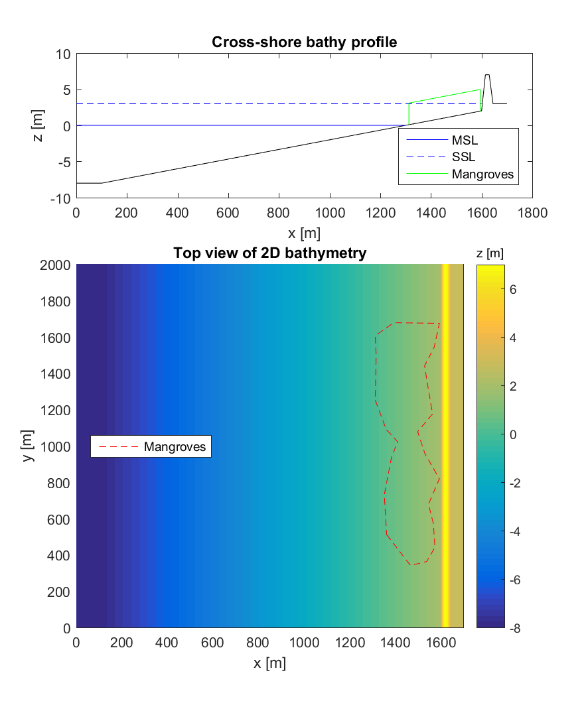
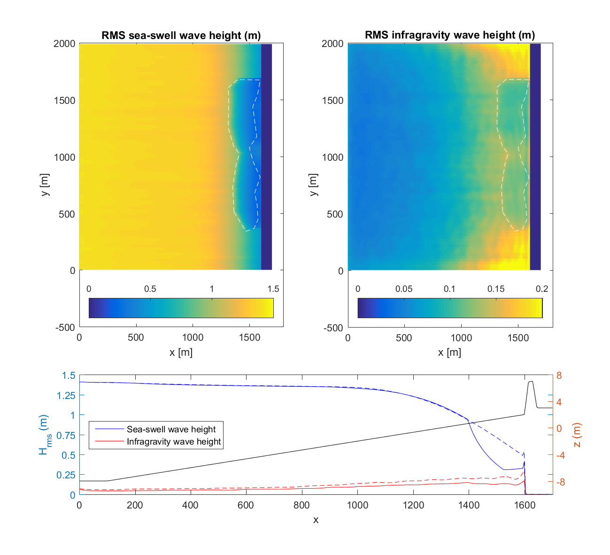

Tutorial: Modeling wave attenuation by vegetation (2D)
======================================================

Introduction
------------

Many coastlines around the world are fronted by vegetation (e.g. seagrass, mangroves, kelp, salt marsh) and recent studies have shown that the presence of aquatic vegetation can result in wave attenuation and flow reduction. In addition, these ecosystems may play a very important role of the coastal morphodynamics. To be able to take into account the effect of vegetation on coastal hydrodynamics in XBeach a vegetation module was developed (Van Rooijen et al., 2016; Roelvink et al., 2015). The main objective of this tutorial is to get familiar with the vegetation module of XBeach. All files mentioned below can be found in https://github.com/openearth/xbeach-docs/tree/master/docs/tutorials/vegetation_field2d. 

Tutorial
--------

In this tutorial you will set up an idealized 2D XBeach model with mangrove vegetation, which is based on the study by Phan et al. (2014), see 'files/Literature/Phan - 2014 - Coastal Mangrove Squeeze in the Mekong Delta.pdf'. The idealized case considers a coastal profile with the offshore boundary at z = -8 m and a constant slope of 1/150 up to z = 2 m. From there a sea dike with slope of 1/3 and height of 5 m characterizes the profile. The mangroves are located between MSL (z = 0 m) and z = 2 m. We furthermore assume a storm surge level of z = +3 m, a wave height Hm0 of 2m and a wave peak period of 6 second. The goal is to study the wave dissipation by the mangrove trees, for which the vegetation characteristics can be obtained from Phan et al. (2014). Fig. 1 shows a possible model setup, and the resulting model input files can be found under 'files/Model'.

   
   Fig. 1. XBeach-Veg model setup for 2D mangrove case.
   

MATLAB Toolbox for XBeach
-------------------------

For users that have access to MATLAB, it is recommended to download the XBeach MATLAB Toolbox, which can be accessed via the Open Earth initiative (https://publicwiki.deltares.nl/display/OET/OpenEarth). The toolbox contains a variety of handy functions that can help you set up your model. To give you an idea on how you can use the toolbox for this particular tutorial, a script was added that will generate all the model files itself ('files/MatlabScripts/setup_xbveg_2D.m'). This script makes use of another file that defines the area with mangroves ('files/MatlabScripts/mangrove_forest.txt'). In addition, a script is added that can plot some of the results ('files/MatlabScripts/plot_waveheight.m', see also Fig.2).

Please note that XBeach is entirely independent from MATLAB and you do not need MATLAB in order to use XBeach. It is, however, handy for pre- and postprocessing.

   
   Fig. 2. Sea swell and infragravity wave height as computed by XBeach.
