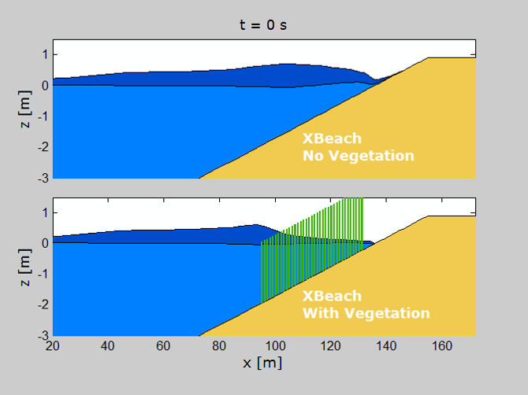
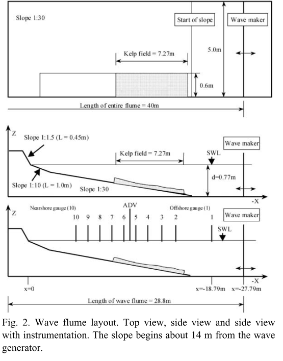
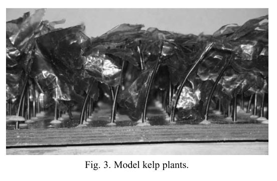
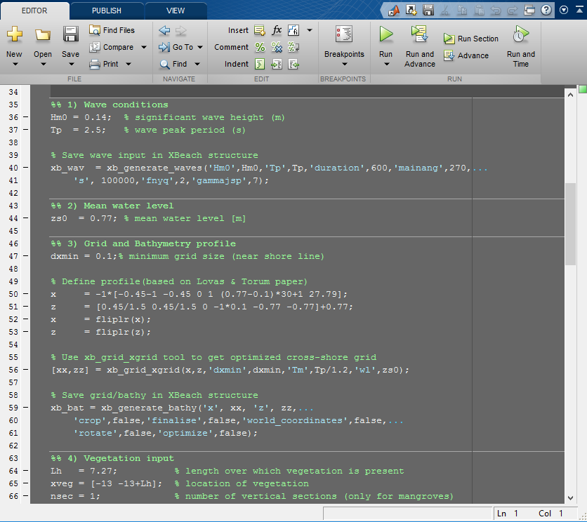

Modeling wave attenuation by vegetation (1D)
============================================

Introduction
------------

Many coastlines around the world are fronted by vegetation (e.g. seagrass, mangroves, kelp, salt marsh) and recent studies have shown that the presence of aquatic vegetation can result in wave attenuation and flow reduction. In addition, these ecosystems may play a very important role of the coastal morphodynamics. To be able to take into account the effect of vegetation on coastal hydrodynamics in XBeach a vegetation module was developed (Van Rooijen et al., 2016; Roelvink et al., 2015). The main objective of this tutorial is to get familiar with the vegetation module of XBeach (Fig. 1). 

   
   Fig. 1. Snapshot of XBeach-Veg.
   
Case description
----------------

The tutorial is based on a large scale laboratory experiment that was carried out in Norway as part of the PhD project of S.M. Løvås at the Norwegian University of Science and Technology (Løvås, 2000; Løvås & Tørum, 2001, see Fig.2). The experiments were carried out in a wave tank and tests were carried out with and without mimic kelp vegetation (Fig. 3). The goal was to study the effect of the mimic kelp on wave propagation, velocities and dune erosion. For more background on this study, reference is made to Løvås & Tørum (2001).

Tutorial
--------

The tutorial considers one of the experiments of Løvås, which was carried out twice: with and without the kelp vegetation present. In the directory (https://github.com/openearth/xbeach-docs/tree/master/docs/tutorials/vegetation_lab) you can find a number of files that can be of use:

* Løvås & Tørum, 2001, Coastal Engineering paper (files/Literature)
* Løvås & Tørum, 2000, ICCE Proceedings conference paper (files/Literature)
* measured wave heights for test 1 (lovas_waves_test1.txt), this is the case without vegetation (files/Data)
* measured wave heights for test 2 (lovas_waves_test2.txt), this is the case with vegetation (files/Data)

Based on this information you can set up two seperate models that represent the experiments: one with vegetation and one without the vegetation. The resulting model files for both models are available in the 'model_files' directory (files/Model). In addition to the standard XBeach input files (e.g. params, grid, bathymetry, wave conditions), this directory contains the following vegetation files:

* veggiefile ('vegetation.txt') - this file describes which vegetation types are present in the model (in this case only one)

* veggiemapfile ('kelpbed.txt') - this file describes which vegetation type is present at each grid point (0 = no vegetation, 1 = type 1, 2 = type 2 etc.)

* veggiecharsfile ('kelp.txt') - this files describes the characteristics of the specific vegetation type (number of sections, height, stem diameter, density, drag coefficient), each vegetation type should have its own veggiecharsfile.

Using the XBeach MATLAB Toolbox
-------------------------------

For users that have access to MATLAB, it is recommended to download the XBeach MATLAB Toolbox, which can be accessed via the Open Earth initiative (https://publicwiki.deltares.nl/display/OET/OpenEarth). The toolbox contains a variety of handy functions that can help you set up your model. To give you an idea on how you can use the toolbox for this particular tutorial, a script was added that will generate all the model files itself ('files/MatlabScripts/setup_lovas_model.m', see screenshot Fig. 4). In addition, a script is added that can plot some of the results ('files/MatlabScripts/plot_lovas.m'). 

Please note that XBeach is entirely independent from MATLAB and you do not need MATLAB in order to use XBeach. It is, however, handy for pre- and postprocessing.

Fig.4. Screenshot of MATLAB script that can be used to set up the model ('files/MatlabScripts/setup_lovas_model.m').

References
----------

Løvås, S. M., & Tørum, A. (2001). Effect of the kelp Laminaria hyperborea upon sand dune erosion and water particle velocities. Coastal Engineering, 44(1), 37-63.

Løvås, S. M. (2000). Hydro-physical conditions in kelp forests and the effect on wave damping and dune erosion: A case study on Laminaria hyperborea. Norwegian University of Science and Technology.

Roelvink, D., van Dongeren, A., McCall, R., Hoonhout, B., van Rooijen, A., Van Geer, P., De Vet, L., Nederhoff, K. & Quataert, E. (2015). XBeach Technical Reference: Kingsday Release.

van Rooijen, A. A., McCall, R. T., van Thiel de Vries, J. S. M., van Dongeren, A. R., Reniers, A. J. H. M., & Roelvink, J. A. (2016). Modeling the effect of wave?vegetation interaction on wave setup. Journal of Geophysical Research: Oceans. 
