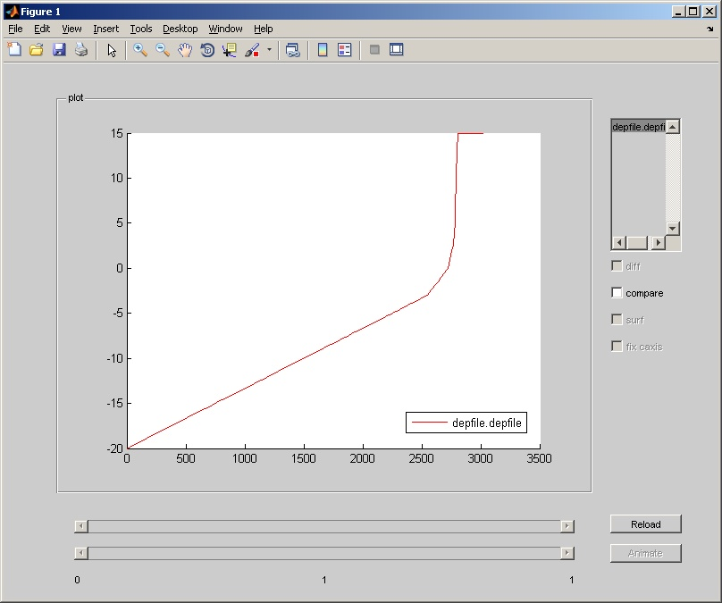
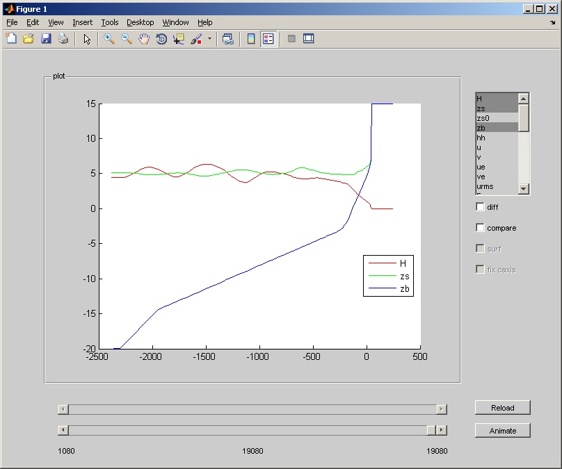
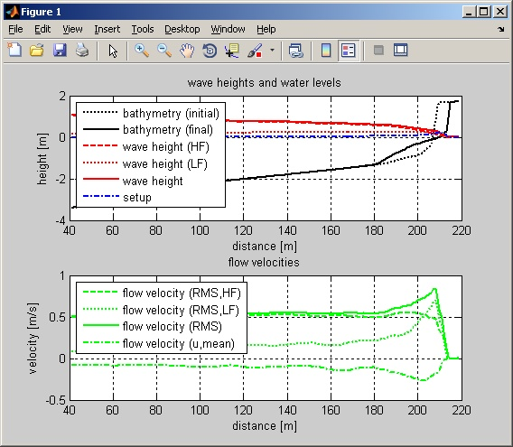
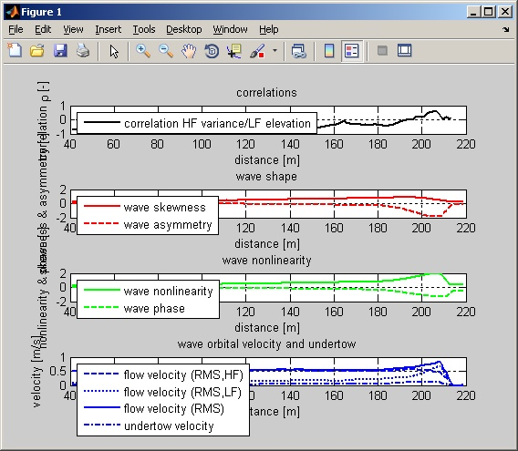
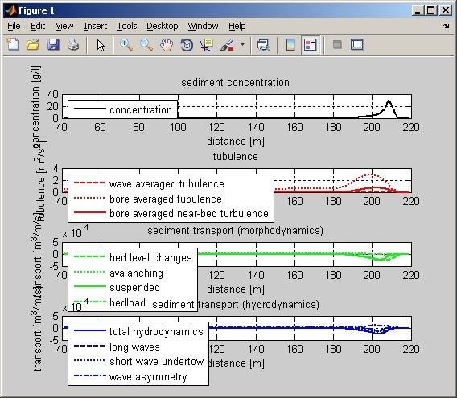
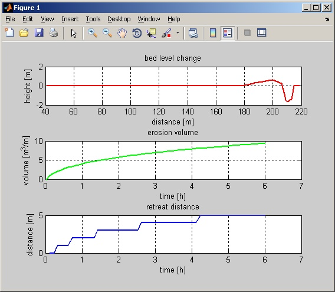

XBeach Matlab Toolbox (tutorial)
================================

Set-up model
------------

XBeach is configured using a collection of files that hold information
on the bathymertry, boundary conditions, model settings, etcetera. All
files are plain text files that should be in a single directory, the
model run directory. Running the XBeach executable in this directory,
will make XBeach use those files and save the model output in the very
same directory.

Using the Matlab Toolbox, setting up your model is made much
easier. On this page we explain how to set-up a simple model using the
Matlab Toolbox. The toolbox creates a bunch of files, which we will
explain. Setting up a model manually, without the toolbox, implies
creating these files in any other way of your preference. A collection
of example models can be found in the Documentation section.

Generate model with xb_generate_model
^^^^^^^^^^^^^^^^^^^^^^^^^^^^^^^^^^^^^

Having started Matlab and incLuded the Matlab XBeach Toolbox to your
path, you should be able to run the following command:

.. code-block:: text

   xbi = xb_generate_model;

   
When done, the ``xbo`` variable now contains a structure with a full
XBeach model set-up. You can write the model to disk by running the
following command:

.. code-block:: text

   xb_write_input('params.txt', xbi);

   
The file *params.txt*, which contains all model settings, is now
written to your current directory along with several other files which
are referred to from the *params.txt* file. The different files are
listed below:

+--------------+--------------------------------------------------------------------+
|File          |Description                                                         |
+==============+====================================================================+
|params.txt    |File with model settings. Each line containing an =-sign and not    | 
|              |starting with a %-sign is interpreted as a model setting in the form|
|              |"name = value". This file is obligatory when running XBeach. It also|
|              |refers to the other files.                                          |
+--------------+--------------------------------------------------------------------+
|bed.dep       |File with bathymetry information. It simply contains the heights for|
|              |all grid points. On row corresponds to one cross-shore transect.    |
|              |This file is obligatory when running XBeach.                        |
+--------------+--------------------------------------------------------------------+
|x.grd         |File with x-coordinates of the grid. This file is only used with a  |
|              |non-equidistant grid.                                               |
+--------------+--------------------------------------------------------------------+
|y.grd         |File with y-coordinates of the grid. This file is only used with a  |
|              |non-equidistant two-dimensional grid.                               |
+--------------+--------------------------------------------------------------------+
|jonswap.txt   |File with boundary condition information. In this case the          |
|              |description of a JONSWAP spectrum. Severel flavours exist for this  |
|              |file. This one has a syntax similar to the params.txt file.         |
+--------------+--------------------------------------------------------------------+

When we open the file **params.txt** with a text editor, we get the
following content:

.. code-block:: text

   %%%%%%%%%%%%%%%%%%%%%%%%%%%%%%%%%%%%%%%%%%%%%%%%%%%%%%%%%%%%%%%%%%%%%%%%%%%%%%%%
   %%% XBeach parameter settings input file                                     %%%
   %%%                                                                          %%%
   %%% date:     29-Jun-2016 07:40:37                                           %%%
   %%% function: xb_write_params                                                %%%
   %%%%%%%%%%%%%%%%%%%%%%%%%%%%%%%%%%%%%%%%%%%%%%%%%%%%%%%%%%%%%%%%%%%%%%%%%%%%%%%%
   
   %%% Grid parameters %%%%%%%%%%%%%%%%%%%%%%%%%%%%%%%%%%%%%%%%%%%%%%%%%%%%%%%%%%%%
   
   depfile   = bed.dep
   posdwn    = 0
   nx        = 580
   ny        = 0
   alfa      = 0
   vardx     = 1
   xfile     = x.grd
   yfile     = y.grd
   xori      = 0
   yori      = 0
   thetamin  = 225
   thetamax  = 315
   dtheta    = 90
   thetanaut = 1
   
   %%% Initial conditions %%%%%%%%%%%%%%%%%%%%%%%%%%%%%%%%%%%%%%%%%%%%%%%%%%%%%%%%%
   
   zs0       = 5
   
   %%% Model time %%%%%%%%%%%%%%%%%%%%%%%%%%%%%%%%%%%%%%%%%%%%%%%%%%%%%%%%%%%%%%%%%
   
   tstop     = 2000
   
   %%% Wave boundary condition parameters %%%%%%%%%%%%%%%%%%%%%%%%%%%%%%%%%%%%%%%%%
   
   instat    = jons
   
   %%% Wave-spectrum boundary condition parameters %%%%%%%%%%%%%%%%%%%%%%%%%%%%%%%%
   
   bcfile    = jonswap.txt
   rt        = 1800
   dtbc      = 1
   
   %%% Output variables %%%%%%%%%%%%%%%%%%%%%%%%%%%%%%%%%%%%%%%%%%%%%%%%%%%%%%%%%%%
   

The files describe a simple one-dimensional model with a schematized
dune profile (see Figure) and a statistically constant boundary
conditions described by a JONSWAP spectrum with a significant wave
height of 7.6m and a peak wave period of 12s.

Arguments of the xb_generate_model
^^^^^^^^^^^^^^^^^^^^^^^^^^^^^^^^^^

.. seealso:: xb_generate_model

The model created in the previous example uses default settings only,
which is not very interesting. Altering the model is done by supplying
preferences to the function `xb_generate_model` as shown in the next
example:

.. code-block:: text
                
   xbi = xb_generate_model( ...
            'bathy',    { 'x', x, 'z', z, 'xgrid', {'vardx', 0} }, ...
            'waves',    { 'Hm0', 9, 'Tp', 18 }, ...
            'tide',     { 'front', 5, 'back', 0 }, ...
            'wavegrid', { 'nbins', 5 }, ...
            'settings', { 'tstop', 7200, 'morfac', 5 });

            
Now, two vectors x and z with bathymetry information are supplied. The
toolbox generates a grid based on the bathymetry and wave
conditions. In this case the grid will not vary in x-direction
(``vardx=0``). The boundary conditions in terms of significant wave
height and peak wave period are changed and the tidal surge is now
different for the offshore and onshore boundary. The number of wave
direction grids is increased to 5 in order to support directional
spreading. The simulation end time is set to 7200 seconds
morphological time with a morphological factor of 5. For all possible
settings is referred to the documentation of the Matlab Toolbox and
the XBeach model.

In the next example 
the tidal surge and wave boundary conditions are made varying by 
supplying multiple values for several parameters:

.. code-block:: text
                
   xbi = xb_generate_model( ...
      'bathy',    { 'x', x, 'z', z, 'xgrid', {'vardx', 0} }, ...
      'waves',    { 'Hm0', [5 7 9 7 5], 'Tp', [12 14 18 14 12], 'duration', 1800 }, ...
      'tide',     { 'front', [4 5 4], 'back', 0, 'time', [0 3000 6000] }, ...
      'wavegrid', { 'nbins', 5 }, ...
      'settings', { 'tstop', 45000, 'morfac', 5 });

      
Be aware that the `xb_generate_model` function adapts different model
parameters to eachother. Like it adapts the grid to the boundary
conditions. Model settings can also be changed after a model is
generated. In that case, the correlation between different parameters
might be lost.

Run model
---------

You can run your model by simply executing the XBeach executable in
the directory where you wrote your models settings to. This is the
directory where the *params.txt* file is located.

If your created your model using the Matlab Toolbox, you can run the
model from within Matlab. As shown in the previous step, you can store
an entire XBeach model setup in a single Matlab variable. To run this
model, simply use one of the following commands:

.. code-block:: text

   xbr = xb_run(xbi);
   xbr = xb_run(xbi, 'binary', 'xbeach.exe', 'name', 'MyFirstXBeachModel');

   
When you use the first command, a directory with a unique name is
created in your current working directory. The model setup is written
to that directory, the latest XBeach executable is downloaded from
this open-source software portal and the model is run. The function
returns a structure with information on the run just started.

When you want to use another executable, you can define the executable
using the *binary* option. Also, you can give the run a name, which is
used as directory name as well. This is shown in the second command.

If you have a UNIX cluster available running Sun Grid Engine (SGE),
you might be able to use the remote version of the run command. The
cluster should be able by SSH. The command looks like this:

.. code-block:: text

   xbr = xb_run_remote( ...``
            'binary', 'xbeach', 'name', 'MyFirstXBeachModel', ...
            'ssh_host', 'h4', 'ssh_prompt', true);

            
Visualize results
-----------------

Once your model finished running, it is time to have a look at the
model output. Two types of output can be generated: Fortran and
netCDF. The former type generates a series of DAT files as output,
while the latter generates a single NC file with all data in it. The
Matlab Toolbox supports both and there are no significant differences
in the usage of the commands shown.

To have a quick view on your model output, use the `xb_view`
command. This command works as well while the model is still
running. Just run the command in the model directory, supply the model
directory or supply the result structure from the `xb_run` command:

.. code-block:: text

   xb_view;
   xb_view('MyFirstXBeachModel/');
   xb_view(xbr);

   
The result will be somethink like this:

           
If you need to manipulate the output data or the visualization a bit
more than the `xb_view` command offers, you will need to load the
output data. The output is read using the `xb_read_output` command,
which stores the data in an XBeach structure.  The `xs_peel` command
converts this structure to a regular structure with matrices with
dimensions time, y and x. The dimensions itself are read by the
`xb_read_dims` command. Try the following commands to figure out how
it all works:

.. code-block:: text
                
   xbo = xb_read_output;
   xbo = xb_read_output('MyFirstXBeachModel/');
   xbo = xb_read_output(xbr);
   
   xbo = xb_read_output(pwd, 'vars', 'H');
   xbo = xb_read_output(pwd, 'vars', {'H' 'zb'});
   xbo = xb_read_output(pwd, 'vars', {'H' 'zb'}, 'length', 1);
   xbo = xb_read_output(pwd, 'vars', {'H' 'zb'}, 'length', [1 1 -1]);
   xbo = xb_read_output(pwd, 'vars', {'H' 'zb'}, 'length', [1 1 -1], 'start', 100);
   xbo = xb_read_output(pwd, 'vars', {'H' 'zb'}, 'length', [1 1 -1], 'start', [100 2 1]);
   xbo = xb_read_output(pwd, 'vars', {'H' 'zb'}, 'length', [1 1 -1], 'start', [100 2 1], 'stride', [1 1 5]);
   xbo = xb_read_output(pwd, 'vars', '*_mean');
   xbp = xs_peel(xbo);
   xs_peel(xbo);
   
   xbd = xb_read_dims;
   xbd = xb_read_dims('MyFirstXBeachModel/');
   xbd = xb_peel(xbp.DIMS);
   
   plot(xbd.x, squeeze(xbp(end,1,:)));
 
 
Analyze results
---------------
 
 What we did so far is setting-up and running a simple model and
 visualizing the results. The visualization was limited to a plain
 representation of the model output. Often, it is necessary to obtain
 insight in the overall characteristics of the model results in wave
 propagation and erosion progression in terms of volumes or retreat
 distances. This section describes a few simple tools to extract these
 characteristics from the model output.
 
 Analysis methods for the following aspects of dune and beach
 morphology are currently available:
 
 * Profiles
 * Hydrodynamics
 * Sediment transports
 * Morphodynamics
 
 The following collection of commands and screenshots provide an
 overview of what is possible. Of course, you are encouraged to write
 your own analysis scripts and, if generally applicable, provide it to
 the community!
 
Profiles
^^^^^^^^
 
 .. code-block:: text

    xb_plot_profile(xbo);

    
 .. figure:: images/matlabtools/profiles.jpg
   :width: 400px
   :align: center
           

Hydrodynamics
^^^^^^^^^^^^^

 .. code-block:: text
                 
    xbh = xb_get_hydro(xbo);
    xb_plot_hydro(xbh);
    xb_plot_hydro2(xbh);

    

           

           
Sediment transports
^^^^^^^^^^^^^^^^^^^

.. code-block:: text
                
   xbs = xb_get_sedtrans(xbo);
   xb_plot_sedtrans(xbs);

   

           
Morphology
^^^^^^^^^^

.. code-block:: text
                
   xbm = xb_get_morpho(xbo);
   xb_plot_morpho(xbm);

   

