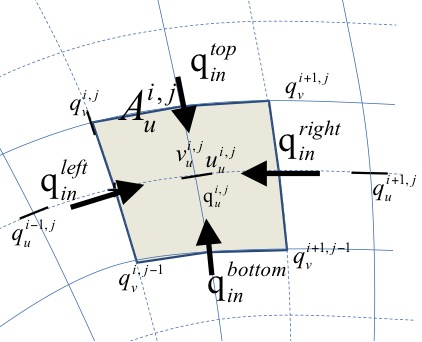

Numerical implementation 
-------------------------

Grid set-up
~~~~~~~~~~~

The new implementation utilizes a curvilinear, staggered grid where
depths, water levels, wave action and sediment concentrations are
given in the cell centers (denoted by subscript z) and velocities and
sediment fluxes at the cell interfaces (denoted by subscript u or
v). In :numref:`fig-staggered-grid` the z, u, v and c (corner) points
with the same numbering are shown.  The grid directions are named s
and n; grid distances are denoted by :math:`\Delta s`\ and
:math:`\Delta n`, with subscripts referring to the point where they
are defined. A finite-volume approach is utilized where mass, momentum
and wave action are strictly conserved. In the middle panel of
:numref:`fig-staggered-grid`, the control volume for the mass balance
is shown with the corresponding grid distances around the *u-* and
*v-*\ points.  The right panel explains the numbering of the fluxes
*Q* and the volume *V*.

.. _fig-staggered-grid:

   Location of staggered grid points (left panel); definition
   of grid distances (middle) and terms in volume balance (right)

Wave action balance
~~~~~~~~~~~~~~~~~~~

Surfbeat solver
^^^^^^^^^^^^^^^

The time-varying wave action balance solved in XBeach is as follows:

.. math::
   :label:

   \frac{\partial E}{\partial t} +\frac{\partial EC_{g,u} }{\partial s} +\frac{\partial EC_{g,v} }{\partial n} +\frac{\partial EC_{\vartheta } }{\partial \vartheta } =-Sink

Where :math:`E` is the wave energy or wave action, :math:`C_g` is the
group velocity, :math:`C_{\vartheta}`\ the refraction speed in
theta-space and :math:`Sink` refers to effects of wave breaking and
bottom friction.

Again, the advection terms are the only ones affected by the
curvilinear scheme so we will discuss their treatment in detail. The
control volume is the same as for the mass balance. In equation
:eq:`wave-energy-flux` the procedure to compute the wave energy fluxes
across the cell boundaries is outlined.  All variables should also
have an index :math:`itheta` referring to the directional grid, but
for brevity these are omitted here.

The component of the group velocity normal to the cell boundary, at
the cell boundary, is interpolated from the two adjacent cell center
points.  Depending on the direction of this component, the wave energy
at the cell boundary is computed using linear extrapolation based on
the two upwind points, taking into account their grid distances. This
second order upwind discretization preserves the propagation of wave
groups with little numerical diffusion.

.. math::
   :label: wave-energy-flux
           
   \begin{array}{l} {Cg_{u,u}^{i,j} =\frac{1}{2} (Cg_{u}^{i,j} +Cg_{u}^{i+1,j} )} \\ {E_{u}^{i,j} =E^{i,j} +\frac{1}{2} \Delta s_{u}^{i,j} \frac{E^{i,j} -E^{i-1,j} }{\Delta s_{u}^{i-1,j} } =} \\ {=\left(\left(\Delta s_{u}^{i-1,j} +\frac{1}{2} \Delta s_{u}^{i,j} \right)E^{i,j} -\frac{1}{2} \Delta s_{u}^{i,j} E^{i-1,j} \right)/\Delta s_{u}^{i-1,j} \, \, \, \, \, ,Cg_{u,u}^{i,j} >0} \\ {E_{u}^{i,j} =E^{i+1,j} -\frac{1}{2} \Delta s_{u}^{i,j} \frac{E^{i+2,j} -E^{i+1,j} }{\Delta s_{u}^{i+1,j} } =} \\ {=\left(\left(\Delta s_{u}^{i+1,j} +\frac{1}{2} \Delta s_{u}^{i,j} \right)E^{i+1,j} -\frac{1}{2} \Delta s_{u}^{i,j} E^{i+2,j} \right)/\Delta s_{u}^{i+1,j} \, \, \, \, \, ,Cg_{u,u}^{i,j} <0} \\ {} \\ {Flux_{u}^{i,j} =Cg_{u,u}^{i,j} E_{u}^{i,j} \Delta n_{u}^{i,j} } \end{array}

The other three fluxes are computed in a similar way; for brevity we
will not present all formulations.

The time integration is explicit and the same as in the original
implementation. The advection in u- and v-direction is computed simply
by adding the four fluxes and dividing by the cell area. This procedure
guarantees conservation of wave energy.

           

The procedure for the roller energy balance is identical to that for the
wave energy balance and will not be repeated here.

Stationary solver
^^^^^^^^^^^^^^^^^

In the stationary solver the wave energy and roller energy balances
are solved line by line, from the seaward boundary landward. For each
line the automatic timestep is computed and the quasi-time-dependent
balance is solved until convergence or the maximum number of
iterations is reached, after which the solver moves to the next line.

The iteration is controlled by the parameters :par:`maxiter` and :par:`maxerror`.

Shallow water equations
~~~~~~~~~~~~~~~~~~~~~~~

Mass balance equation
^^^^^^^^^^^^^^^^^^^^^

The mass balance reads as follows:

.. math::
   :label:

   \frac{\partial V}{\partial t} =Q_{u}^{i,j} -Q_{u}^{i-1,j} +Q_{v}^{i,j} -Q_{v}^{i,j-1}

This is discretized according to:

.. math::
   :label:

   \begin{array}{l} {A_{z}^{i,j} \frac{z_{s}^{i,j,n+1} -z_{s}^{i,j,n} }{\Delta t} =u_{u}^{i,j,n+1/2} h_{u}^{i,j,n} \Delta n_{u}^{i,j} -u_{u}^{i-1,j,n+1/2} h_{u}^{i-1,j,n} \Delta n_{u}^{i-1,j} } \\ {\, \, \, \, \, \, \, \, \, \, \, \, \, \, \, \, \, \, \, \, \, \, \, \, \, \, \, \, \, \, \, \, \, \, \, \, \, \, +v_{v}^{i,j,n+1/2} h_{v}^{i,j,n} \Delta s_{v}^{i,j} -v_{v}^{i,j-1,n+1/2} h_{v}^{i,j-1,n} \Delta s_{v}^{i,j-1} } \end{array}

Here, :math:`{A}_{z}` is the area of the cell around the cell centre,
:math:`{z}_{s}` is the surface elevation, :math:`{u}_{u}` is the
u-velocity in the u-point, :math:`{h}_{u}` the water depth in the
u-point and :math:`{v}_{v}` the v-velocity in the v-point. The indices
:math:`i,j` refer to the grid number in u resp. v direction; the index
:math:`n` refers to the time step.

Momentum balance equation
^^^^^^^^^^^^^^^^^^^^^^^^^

Second, we will outline the derivation of the u-momentum balance. The
control volume is given in :numref:`fig-momentum-and-fluxes`. It is
centeredaround the u-point.  We now consider the rate of change of the
momentum in the local u-direction as follows:

.. Math::
   :label:

   \frac{d\left(Vu\right)}{dt} -\sum Q_{in} u_{in}  +\sum Q_{out} u +Vg\frac{\partial z_{s} }{\partial s} +A\frac{\tau _{b,u} }{\rho } =A\frac{\tau _{s,u} }{\rho } +A\frac{F_{u} }{\rho }

where V is the cell volume, u the velocity in local grid direction, Q
the fluxes,\ :math:`\rho` the density, g acceleration of gravity,
:math:`\tau_{b,u}, \tau_{b,u}, F_{u}` the bed shear stress, wind
shear stress and wave force in u-direction. We consider that the
outgoing fluxes carry the velocity inside the cell, :math:`u`, and that
:math:`{u}_{in}` is determined at each inflow boundary by
interpolation, reconstructing the component in the same direction as
:math:`u`.

The volume balance for the same volume reads:

.. math::
   :label:

   \frac{dV}{dt} -\sum Q_{in} + \sum Q_{out} =0

By multiplying the volume balance by :math:`u`, subtracting it from the
momentum balance and dividing the result by :math:`V` we arrive at the
following equation:

.. math::
   :label:

   \frac{du}{dt} +\frac{\sum Q_{in} \left(u-u_{in} \right) }{Ah_{um} } +g\frac{\partial z_{s} }{\partial s} +\frac{\tau _{b,s} }{\rho h_{um} } =\frac{\tau _{s,u} }{\rho h_{um} } +\frac{F_{u} }{\rho h_{um} }

where :math:`A` is the cell area and :math:`{h}_{um}` is the average depth
of the cell around the *u*-point. The procedure for the second term (the
others are straightforward) now boils down to integrating (only) the
incoming fluxes over the interfaces and multiplying them with the
difference between :math:`u` in the cell and the component of velocity in the
same direction at the upwind cell.

.. _fig-momentum-and-fluxes:

   Control volume u-momentum balance and
   definition of fluxes

In the following three quations the procedure for computing the u-momentum balance
is outlined. The discharges in the u-points are computed by multiplying
the velocity in the u- or v-point by the water depth at that point.
These discharges are then interpolated to the borders of the control
volume around the u-point. The difference :math:`\Delta \alpha`\ in
grid orientation between the incoming cell and the u-point is computed
and used to compute the component of the incoming velocity in the local
u-direction, from the left and right side of the control volume.

.. math::
   :label:

   \begin{array}{rclcrcl}
     q_u^{i,j} &=& u_u^{i,j,n-1/2} h_u^{i,j,n}  &~& ~ &~& ~ \\
     q_{in}^{left} &=& \frac{1}{2} \left( q_u^{i,j} + q_u^{i-1,j} \right )
       &,& q_{in}^{right} &=& -\frac{1}{2} \left( q_u^{i+1,j} + q_u^{i,j} \right ) \\
     \Delta \alpha^{left} &=& \alpha_u^{i,j} - \alpha_u^{i-1,j}
       &,& \Delta \alpha^{right} &=& \alpha_u^{i+1,j} - \alpha_u^{i,j} \\
     u_{in}^{left} &=& u_u^{i-1,j} \cos \left( \Delta \alpha \right ) - v_u^{i-1,j} \sin \left( \Delta \alpha \right )
       &,& u_{in}^{right} &=& u_u^{i+1,j} \cos \left( \Delta \alpha \right ) - v_u^{i+1,j} \sin \left( \Delta \alpha \right ) \\
   \end{array}

The same is done for the top and bottom of the control volume, based on
the discharges in v-direction:

.. math::
   :label:

   \begin{array}{rclcrcl}
     q_v^{i,j}       &=& v_v^{i,j,n-1/2} h_v^{i,j,n} &~& ~ &~& \\
     q_{in}^{bottom} &=& \frac{1}{2} \left( q_v^{i,j-1} + q_v^{i+1,j-1} \right )
       &,& q_{in}^{top} &=& -\frac{1}{2} \left( q_v^{i,j} + q_v^{i+1,j} \right ) \\
     \Delta \alpha ^{bottom} &=& \alpha_u^{i,j} - \alpha_u^{i,j-1}
       &,& \Delta \alpha ^{top} &=& \alpha_u^{i,j+1} - \alpha_u^{i,j} \\
     u_{in}^{bottom} &=& u_u^{i,j-1} \cos \left( \Delta \alpha \right ) - v_u^{i,j-1} \sin \left( \Delta \alpha \right )
       &,& u_{in}^{top} &=& u_u^{i,j+1} \cos \left( \Delta \alpha \right ) - v_u^{i,j+1} \sin \left( \Delta \alpha \right ) \\
   \end{array}

Finally, the advective term in the momentum balance is given as:

.. math::
   :label:

   \begin{array}{l} {\left(\frac{\sum Q_{in} \left(u-u_{in} \right) }{Ah_{um} } \right)^{i,j} =\, {max(q}_{in}^{left} ,0){(}u_{u}^{i,j} {-}u_{in}^{left} {)}\frac{\Delta n_{z}^{i,j} }{h_{um}^{i,j} A_{u}^{i,j} } \, \, \, } \\ {\, \, \, \, \, \, \, \, \, \, \, \, \, \, \, \, \, \, \, \, \, \, \, \, \, \, \, \, \, \, \, \, \, \, \, \, \, \, \, \, +\, \, {max(q}_{in}^{right} ,0){(}u_{u}^{i,j} {-}u_{in}^{right} {)}\frac{\Delta n_{z}^{i+1,j} }{h_{um}^{i,j} A_{u}^{i,j} } \, } \\ {\, \, \, \, \, \, \, \, \, \, \, \, \, \, \, \, \, \, \, \, \, \, \, \, \, \, \, \, \, \, \, \, \, \, \, \, \, \, \, \, \, +\, {max(q}_{in}^{bottom} ,0){(}u_{u}^{i,j} {-}u_{in}^{bottom} {)}\frac{\Delta s_{c}^{i,j-1} }{h_{um}^{i,j} A_{u}^{i,j} } } \\ {\, \, \, \, \, \, \, \, \, \, \, \, \, \, \, \, \, \, \, \, \, \, \, \, \, \, \, \, \, \, \, \, \, \, \, \, \, \, \, \, +\, \, {max(q}_{in}^{top} ,0){(}u_{u}^{i,j} {-}u_{in}^{top} {)}\frac{\Delta s_{c}^{i,j} }{h_{um}^{i,j} A_{u}^{i,j} } \, } \end{array}

Time integration scheme
^^^^^^^^^^^^^^^^^^^^^^^^

The time integration of the mass and momentum balance equations is
combined in an explicit leap-frog scheme, as depicted in :numref:`fig-leapfrog`. The
velocities are updated using the momentum balance,
the water levels are updated using the mass balance. The water level
gradients influence the momentum balance and the velocities and derived
discharges affect the mass balance. Because of the leap-frog scheme
these influences are always computed at the half time step level, which
makes the scheme second order accurate.

.. _fig-leapfrog:

   Leap-frog time integration scheme

Using this straightforward finite volume approach, complicated
transformations of the equations are avoided and the solution scheme
remains transparent. It is also completely compatible with the original
rectilinear implementation and is even slightly more efficient.

Groundwater flow
~~~~~~~~~~~~~~~~

In order to solve the equations in xx, the spatial and temporal domain
of the groundwater system is split into the same spatial grid and time
steps as the XBeach surface water model it is coupled to. At each time
step in the numerical model, the depth average groundwater head is
calculated in the center of the groundwater cells, and the fluxes
(specific discharge, submarine exchange, infiltration and exfiltration)
are calculated on the cell interfaces

At the start of the time step, every cell is evaluated whether the
groundwater and surface water are connected:

.. math::
   :label: gw-kappa
           
   \kappa _{i,j} =\eta _{gw,i,j} \ge z_{b,i,j} -\varepsilon \wedge \eta _{i,j} \ge z_{b,i,j} +\varepsilon

In equation :eq:`gw-kappa` :math:`\varepsilon` is a numerical smoothing
constant used to deal with numerical round off errors near the bed (equal to
the parameter :par:`dwetlayer` in the case of hydrostatic groundwater flow,
and to the parameter :par:`eps` in the case of non-hydrostatic groundwater flow), and
:math:`i` and :math:`j` represent cross-shore and longshore coordinates in the
numerical solution grid, respectively. Infiltration is calculated in
cells where the groundwater and surface water are not connected and
there exists surface water. As shown in equation :eq:`gw-surface-flow` the
infiltration rate is a function of the thickness of the wetting front, which
is zero at the start of infiltration, and increases as a function of the infiltration
rate. The equations for the infiltration rate and the thickness of the
wetting front are approximated by first-order schemes, in which the
wetting front is updated using a backward-Euler scheme, which ensures
numerical stability:

.. math::
   :label:

   \begin{array}{c} {S_{inf,i,j}^{n} =K_{i,j} \left(\frac{1}{\rho g} \frac{\left. p_{lpf,i,j} \right|^{z=z_{b} } }{\delta _{infill,i,j}^{n} } 1\right)} \\ {{\; }\delta _{infill,i,j}^{n} =\delta _{infill,i,j}^{n-1} +S_{inf,i,j}^{n} \frac{\Delta t}{n_{p} } } \end{array}

In the pressure term :math:`{p}_{lpf}` is the surface water pressure
at the bed, which in the case of non-hydrostatic surface water flow is
high-pass filtered at :math:`4/{T}_{rep}`, the superscript :math:`n`
corresponds to the time step number and :math:`\Delta t` is the size
of the time step. The infiltration rate in the coupled relationship can
be solved through substitution:

.. math::
   :label:

   S_{inf,i,j}^{n} =\frac{-\delta _{infill,i,j}^{n-1} +\frac{\Delta t}{n_{p} K_{i,j} } +\sqrt{\left(\delta _{infill,i,j}^{n-1} \right)^{2} +\frac{2}{n_{p} } \frac{\Delta t}{\delta _{infill,i,j}^{n-1} K_{i,j} } +\frac{4\rho g}{n_{p} } \frac{\Delta t}{p_{i,j} \left|^{z=\xi } \right. K_{i,j} } +\frac{\Delta t^{2} }{K_{_{i,j} }^{2} } } }{\frac{2\Delta t}{n_{p} } }

At the end of infiltration, i.e. when the groundwater and surface water
become connected or there is no surface water left, the wetting front
thickness is reset to zero. If the infiltration rate exceeds the
Reynolds number for the start of turbulence, the local hydraulic
conductivity is updated using the local Reynolds number:

.. math::
   :label:

   K_{i,j} =K_{lam} \sqrt{\frac{Re_{crit} }{\max (Re_{i,j} ,Re_{crit} )} }

XBeach iterates until a minimum threshold difference between iterations
is found for and . Infiltration in one time step is limited to the
amount of surface water available in the cell and to the amount of water
required to raise the groundwater level to the level of the bed:

.. math::
   :label:

   S_{inf,i,j}^{n} =\min \left(S_{inf,i,j}^{n} ,\frac{\eta _{i,j-} z_{b,i,j} }{\Delta t} ,\frac{z_{b,i,j} -\eta _{gw,i,j-} }{n_{p} \Delta t} \right)

If during infiltration the groundwater level reaches the bed level, the
fraction of the time step required to do so is estimated (x) and the
remaining fraction is used in the submarine exchange.

.. math::
   :label:

   \begin{array}{c} {\Lambda _{t,i,j} =\frac{n_{p} \left(z_{b,i,j} -\eta _{gw,i,j} \right)}{K_{i,j} \left(\frac{1}{\rho g} \frac{\left. p_{i,j} \right|^{z=\xi } }{z_{b,i,j} -\eta _{gw,i,j} } +1\right)} \frac{1}{\Delta t} } \\ {} \\ {0\le \Lambda _{t,i,j} \le 1} \end{array}

Exfiltration is calculated in cells where the groundwater and surface
water are not connected and the groundwater level exceeds the bed level:

.. math::
   :label:

   S_{exf,i,j} =n_{p} \frac{z_{b,i,j} -\eta _{gw,i,j} }{\Delta t}

Horizontal infiltration and exfiltration (keyword: :par:`gwhorinfil` = *1*) is
computed across the numerical vertical interface between the groundwater
domain and the surface water domain in adjoining cells. The direction of
exchange is determined by the head gradient, and the bed level slope
direction:

.. math::
   :label:

   \begin{array}{l} {S_{i,j,hor}^{u} =\left\{\begin{array}{cc} {K_{_{i,j} }^{u} \left(\frac{\eta _{i,j} +\frac{q_{i,j} }{g} -H_{gw,i+1,j} }{\Delta x} \right)\left(z_{b,i+1,j} -z_{b,i,j} \right)} & {z_{b,i+1,j} >z_{b,i,j} \wedge \eta _{i,j} >eps} \\ {K_{_{i,j} }^{u} \left(\frac{\eta _{i+1,j} +\frac{q_{i+1,j} }{g} -H_{gw,i,j} }{\Delta x} \right)\left(z_{b,i,j} -z_{b,i+1,j} \right)} & {z_{b,i+1,j} <z_{b,i,j} \wedge \eta _{i+1,j} >eps} \end{array}\right. } \\ {S_{i,j,hor}^{v} =\left\{\begin{array}{cc} {K_{_{i,j} }^{v} \left(\frac{\eta _{i,j} +\frac{q_{i,j} }{g} -H_{gw,i,j+1} }{\Delta y} \right)\left(z_{b,i,j+1} -z_{b,i,j} \right)} & {z_{b,i,j+1} >z_{b,i,j} \wedge \eta _{i,j} >eps} \\ {K_{_{i,j} }^{v} \left(\frac{\eta _{i,j+1} +\frac{q_{i,j+1} }{g} -H_{gw,i,j} }{\Delta y} \right)\left(z_{b,i,j} -z_{b,i,j+1} \right)} & {z_{b,i,j+1} <z_{b,i,j} \wedge \eta _{i,j+1} >eps} \end{array}\right. } \end{array}

After infiltration and exfiltration have been calculated, the
groundwater level and surface water level are updated:

.. math::
   :label:

   \begin{array}{l} {\eta _{gw,i,j}^{n+\frac{1}{2} } =\eta _{gw,i,j}^{n} +\frac{\Delta t}{n_{p} } \left(S_{\inf } +S_{exf} +S_{hor} \right)} \\ {\eta _{i,j}^{n+\frac{1}{2} } =\eta _{i,j}^{n} +\Delta t\left(-S_{\inf } -S_{exf} -S_{hor} \right)} \end{array}

All updated cells are subsequently re-evaluated on whether the surface
water and groundwater are connected or unconnected

The cell height at the center of the groundwater cells
(:math:`\Delta z_{H,i,j}`) is calculated from the
groundwater level and the bottom of the aquifer in the center of the
cell, whereas the cell heights at the horizontal cell interfaces are
calculated using an upwind procedure:

.. math::
   :label:

   \begin{array}{c} {\Delta z_{H,i,j} =\eta _{gw,i,j} -z_{aquifier,i,j} =h_{gw,i,j} } \\ {} \\ {\Delta z_{u,i,j} =\left\{\begin{array}{l} {\Delta z_{H,i+1,j} {\; \; if\; }q_{qw,i,j}^{x} <0} \\ {\Delta z_{H,i,j} {\; \; \; \; if\; }q_{qw,i,j}^{x} \ge 0} \end{array}\right. } \\ {\Delta z_{v,i,j} =\left\{\begin{array}{l} {\Delta z_{H,i+1,j} {\; \; if\; }q_{qw,i,j}^{y} <0} \\ {\Delta z_{H,i,j} {\; \; \; \; if\; }q_{qw,i,j}^{y} \ge 0} \end{array}\right. } \end{array}

In :math:`{z}_{aquifer}` is the level of the bottom of the aquifer.
As described in :ref:`sec-sediment-transport`, the head applied on the top boundary of
the groundwater domain (:math:`{H}_{bc}`) depends on whether the
groundwater and surface water are connected or unconnected:

.. math::
   :label:

   \begin{array}{l} {H_{bc,i,j} =\left(1-\kappa _{r,i,j} \right)\eta _{gw,i,j} +\kappa _{r,i,j} \left(z_{b,i,j} {+}\frac{\left. p_{i,j} \right|^{z=z_{b} } }{\rho g} \right)} \\ {\begin{array}{ccc} {\kappa _{r,i,j} =1-\frac{z_{b,i,j} -\eta _{gw,i,j} }{\varepsilon } } & {} & {0\le \kappa _{r,i,j} \le 1} \end{array}} \end{array}

In the parameter :math:`\kappa_{r}` is the relative
numerical 'connectedness' of the groundwater and surface water head,
determined by linear interpolation across the numerical smoothing
constant :math:`\varepsilon`.

In the case of hydrostatic groundwater flow, the groundwater head in
each cell is set equal to the head applied on the top boundary of the
groundwater domain (:math:`{H}_{bc}`) and the horizontal groundwater
flux is computed from the groundwater head gradient:

.. math::
   :label:

   \begin{array}{l} {q_{gw,i,j}^{x} =-K_{u,i,j} \Delta z_{u,i} \frac{H_{i+1,j} -H_{i,j} }{\Delta x_{u,i,j} } =-K_{u,i,j} \Delta z_{u,i} \frac{H_{bc,i+1,j} -H_{bc,i,j} }{\Delta x_{u,i,j} } } \\ {q_{gw,i,j}^{y} =-K_{v,i,j} \Delta z_{v,i} \frac{H_{i+1,j} -H_{i,j} }{\Delta y_{v,i,j} } =-K_{v,i,j} \Delta z_{v,i} \frac{H_{bc,i+1,j} -H_{bc,i,j} }{\Delta y_{v,i,j} } } \end{array}

In the superscripts :math:`x` and :math:`y` refer to the components of the variable
in the cross-shore and longshore direction, respectively, and the
subscripts :math:`u` and :math:`v` refer to variables approximated at the horizontal
cell interfaces in the cross-shore and longshore direction,
respectively.

In the case of non-hydrostatic groundwater flow, the horizontal specific
discharge on each cell interface can be found through an approximation
of the non-hydrostatic groundwater head gradient:

.. math::
   :label:

   \begin{array}{l} {q_{gw,i,j}^{x} =-K_{u,i,j} \Delta z_{u,i} \frac{H_{i+1,j} -H_{i,j} }{\Delta x_{u,i,j} } =-K_{u,i,j} \Delta z_{u,i} \frac{H_{bc,i+1,j} -\frac{2}{3} \beta _{i+1,j} \Delta z_{H,i+1,j}^{2} -H_{bc,i,j} +\frac{2}{3} \beta _{i,j} \Delta z_{H,i,j}^{2} }{\Delta x_{u,i,j} } } \\ {q_{gw,i,j}^{y} =-K_{v,i,j} \Delta z_{v,i} \frac{H_{i+1,j} -H_{i,j} }{\Delta y_{v,i,j} } =-K_{v,i,j} \Delta z_{v,i} \frac{H_{bc,i+1,j} -\frac{2}{3} \beta _{i+1,j} \Delta z_{H,i+1,j}^{2} -H_{bc,i,j} +\frac{2}{3} \beta _{i,j} \Delta z_{H,i,j}^{2} }{\Delta y_{v,i,j} } } \end{array}

In the subscript :math:`H` refers to variables approximated at the cell
centers. The hydraulic conductivity may be different at each cell
interface and is therefore computed at every interface where every K is
calculated separately.

Continuity in the groundwater cell is found following:

.. math::
   :label:

   q_{gw,i-1,j}^{x} -q_{gw,i,j}^{x} +q_{gw,i,j-1}^{y} -q_{gw,i,j}^{y} -q_{gw,i,j}^{z} =0

In the variable :math:`{q}^{z}` refers to the vertical groundwater
discharge (e.g., submarine exchange if connected to the surface water,
or groundwater level fluctuations if the groundwater is not connected to
the surface water).

In the case of hydrostatic groundwater flow, the variable
:math:`{q}^{z}` can be solved through the known variables
:math:`{q}^{x}` and :math:`{q}^{y}`. However, in the case of
non-hydrostatic groundwater flow, all variables in contain an unknown
value for the groundwater pressure head, described in terms of a known
head at the surface of the groundwater (:math:`{H}_{bc}`) and the
unknown curvature of the vertical groundwater head function
(:math:`\beta`). Since water is incompressible, the groundwater
pressure must be solved for all cells simultaneously using matrix
algebra:

.. math::
   :label:

   Ax+b=0

In A is a matrix containing coefficients for the horizontal and vertical
specific discharge, x is a vector containing the unknown groundwater
head curvature, and b contains the known forcing terms. For a one
dimensional cross-shore case, A is reduced to a tridiagonal matrix. The
vector of known forcing consists of the numerical gradients in the
contribution of the head applied on the top boundary of the groundwater
domain to the horizontal specific discharge.

In the one dimensional case, the solution to the tridiagonal matrix A
can be computed using the efficient Thomas algorithm (:cite:`Thomas1949`). In
the two dimensional case, matrix A contains two additional diagonals
that are not placed along the main diagonal, and vector b contains
additional forcing terms from the alongshore contribution. The solution
to the two dimensional case requires a more complex and less
computationally efficient matrix solver. In this case the Strongly
Implicit Procedure (:cite:`Stone1968`) is used in a manner similar to
:cite:`Zijlema2011a`. The horizontal and vertical groundwater fluxes are
calculated using the solution of *x* plus and .

Since in both hydrostatic and non-hydrostatic groundwater flow some
local velocities may exceed the critical Reynolds number for the start
of turbulence (:math:`{Re}_{crit}`), the turbulent hydraulic
conductivity (:math:`K`) is updated using the local Reynolds number. The
solution to and the update of the turbulent hydraulic conductivity are
iterated until a minimum threshold difference between iterations is
found. Note that this approach is only used is the turbulent groundwater
model is selected (keyword: :par:`gwscheme` = *turbulent*).

The (iterated) solution for the specific vertical discharge is used to
update the groundwater level and surface water level:

.. math::
   :label:

   \begin{array}{rcl} {\eta _{_{gw,i,j} }^{n+1} } & {=} & {\left\{\begin{array}{l} {\eta _{_{gw,i,j} }^{n+\frac{1}{2} } {\; \; \; \; \; \; \; \; \; \; \; \; \; \; \; \; \; \; \; \; \; \; \; \; \; }C_{i,j} } \\ {\eta _{_{gw,i,j} }^{n+\frac{1}{2} } +\frac{\Delta t}{n_{p} } \frac{q_{i,j}^{z} }{\Delta x_{H,i,j} } {\; \; \; }\neg C_{i,j} {\; \; \; }} \end{array}\right. } \\ {\eta _{_{i,j} }^{n+1} } & {=} & {\left\{\begin{array}{l} {\eta _{_{i,j} }^{n+\frac{1}{2} } +\Delta t\frac{q_{i,j}^{z} }{\Delta x_{H,i,j} } {\; \; \; \; \; }C_{i,j} } \\ {\eta _{_{i,j} }^{n+\frac{1}{2} } {\; \; \; \; \; \; \; \; \; \; \; \; \; \; \; \; \; \; \; \; \; \; \; }\neg C_{i,j} } \end{array}\right. } \end{array}

If the groundwater and surface water are connected, and the submarine
exchange from the surface water to the groundwater estimated in is
greater than the amount of surface water available in the cell,
continuity is enforced by lowering the groundwater level to compensate
for the lack of permeating water:

.. math::
   :label:

   \eta _{_{gw,i,j} }^{n+1} =\eta _{_{gw,i,j} }^{n+1} +\frac{1}{n_{p} } \left(\eta _{_{i,j} }^{n+\frac{1}{2} } -z_{b,i,j} -\Delta t\frac{q_{i,j}^{z} }{\Delta x_{H,i,j} } \right){\; if\; \; }\kappa _{i,j} \wedge \eta _{i,j}^{n+\frac{1}{2} } -z_{b,i,j} <\Delta t\frac{q_{i,j}^{z} }{\Delta x_{H,i,j} }

Sediment transport
~~~~~~~~~~~~~~~~~~

The advection-diffusion equation for suspended sediment is the basis for
the sediment transport computations in XBeach. The partial differential
equation to solve is:

.. math::
   :label:

   \frac{\partial hc}{\partial t} +\nabla \vec{S}_{s} =\frac{hc_{eq} -hc}{T_{s} } =-\frac{hc}{T_{s} } +Ero

Here :math:`c` is the depth-averaged concentration, :math:`{c}_{eq}` the
equilibrium concentration, :math:`Ts` a typical timescale proportional to
water depth divided by fall velocity. As is often done to increase
robustness, we treat the erosion term explicitly but take an implicit
scheme for the sedimentation term:

.. math::
   :label:

   \frac{{c}_{{z}}^{{i,j,n+1}} h_{h}^{i,j,n+1} -h_{h}^{i,j,n} {c}_{z}^{{i,j,n}} }{\Delta {t}} {\; =\; }-\frac{h_{h}^{i,j,n+1} {c}_{z}^{{i,j,n+1}} }{{T}_{{s}}^{{i,j}} } -\left(\nabla \vec{S}_{s} \right)^{i,j,n} {+\; \; }Ero^{i,j,n}

This can be rewritten as:

.. math::
   :label:

   {c}_{{c}}^{{i,j,n+1}} {\; =\; }\frac{{T}_{{s}}^{{i,j}} \Delta {t}}{h_{h}^{i,j,n+1} \left({T}_{{s}}^{{i,j}} +\Delta {t}\right)} \left(\frac{h_{h}^{i,j,n} {c}_{{c}}^{{i,j,n}} }{\Delta t} -\left(\nabla \vec{S}_{s} \right)^{i,j,n} {+}Ero^{i,j,n} \right)

The sediment transport gradient is discretized in a similar way as the
mass balance:

.. math::
   :label:

   \left(\nabla \vec{S}_{s} \right)^{i,j} =\frac{\left(S_{u,s}^{i,j} \Delta n_{u}^{i,j} -S_{u,s}^{i-1,j} \Delta n_{u}^{i-1,j} +S_{v,s}^{i,j} \Delta s_{v}^{i,j} -S_{v,s}^{i,j-1} \Delta s_{v}^{i,j-1} \right)}{A_{z}^{i,j} }

The sediment transports in the u- points contain an advective term, a
diffusive term and a bed slope term:

.. math::
   :label:

   {S}_{{u,s}} {=c}_{u} {u}_{{rep,s}} {h}_{{u}} {-D}_{{c}} {h}_{{u}} \frac{\partial c}{\partial s} {-f}_{slope} {c}_{{u}} \left|v\right|_{u} {h}_{{u}} \frac{\partial z_{b} }{\partial s} {)}

Here :math:`{u}_{rep,s}` is a representative velocity for suspended
transport, which contains contributions due to return flow, wave
skewness and wave asymmetry; :math:`{D}_{c}` is a horizontal
diffusion coefficient and :math:`{f}_{slope}` a coefficient. In
discretized form the expression for the suspended transport in the
u-point is:

.. math::
   :label:

   S_{u,s}^{i,j} = c_u^{i,j} u_{rep,s}^{i,j} h_u^{i,j} -D_c^{i,j} h_u^{i,j} \frac{c_c^{i+1,j} -c_c^{i,j} }{\Delta s_u^{i,j} } -f_{slope} c_u^{i,j} \left|v\right|_u^{i,j} h_u^{i,j} \frac{z_b^{i+1,j} -z_b^{i,j} }{\Delta s_u^{i,j} } )

The concentrations in the u-points are computed with a
:math:`\theta` -method, where :math:`\theta=1` means a fully upwind
approximation, and :math:`\theta=0.5` a central scheme. In practice, we
mostly use the upwind approximation for its robustness.

.. math::
   :label:

   \begin{array}{l} {c_{u}^{i,j} =\theta c_{z}^{i,j} +\left(1-\theta \right)c_{z}^{i+1,j} \, \, \, \, \, \, \, ,u_{rep,s}^{i,j} >0} \\ {c_{u}^{i,j} =\left(1-\theta \right)c_{z}^{i,j} +\theta c_{z}^{i+1,j} \, \, \, \, \, \, \, ,u_{rep,s}^{i,j} <0} \end{array}

The erosion and deposition terms, which may also be used in the bed
updating, are finally computed from:

.. math::
   :label:

   \begin{array}{l} {Ero^{i,j,n} {=\; h}_{{h}}^{i,j,n} {c}_{{eq}}^{{i,j,n}} {/T}_{{s}}^{{i,j}} } \\ {Depo^{i,j} ={h}_{{h}}^{i,j,n+1} {c}_{z}^{{i,j,n+1}} {/T}_{{s}}^{{i,j}} } \end{array}

The evaluation of the bedload transport takes place in the same way as
in the previous versions of XBeach, except for the fact that the
directions are taken in local grid direction, and will not be repeated
here.

Bottom updating schemes
~~~~~~~~~~~~~~~~~~~~~~~

Two alternative formulations are available for the bed updating: one
where the bottom changes are computed based on the gradients of
suspended and bed load transport, equation :eq:`dz-gradients` , and one where the changes
due to suspended transport are accounted for through the erosion and
deposition terms, equation :eq:`dz-sourcesink`.

.. math::
   :label: dz-gradients
           
   \left(1-n_{p} \right)\frac{\partial z_{b} }{\partial t} +MF\left(\nabla \overrightarrow{S}_{s} +\nabla \overrightarrow{S}_{b} \right)=0

.. math::
   :label: dz-sourcesink
           
   \left(1-n_{p} \right)\frac{\partial z_{b} }{\partial t} +MF\left(Ero-Depo+\nabla \overrightarrow{S}_{b} \right)=0

In both cases :math:`MF` is the morphological factor used to accelerate
morphological changes. In the first case, the sediment in the bottom is
conserved in all cases, but changes in the amount of sediment in the
water are not considered; one can also say that the sediment in
suspension is added to the bottom sediment. In the second case, the
storage of sediment in the water is accounted for, but will be distorted
in cases of high :math:`MF`. Since under most circumstances the real effect of
the storage in the water phase is small we prefer the first formulation
which guarantees mass conservation in the bottom. Both formulations are
calculated using an explicit scheme:

.. math::
   :label:

   \Delta z_{b} ^{i,j,n+1} =\Delta t\frac{MF}{\left(1-n_{p} \right)} \left(\left(\nabla \overrightarrow{S}_{s} \right)^{i,j,n} +\left(\nabla \overrightarrow{S}_{b} \right)^{i,j,n} \right)

.. math::
   :label:

   \Delta z_{b} ^{i,j,n+1} =\Delta t\frac{MF}{(1-n_{p} )} \left(Ero^{i,j,n} -Depo^{i,j,n} +\left(\nabla \overrightarrow{S}_{b} \right)^{i,j,n} \right)

Avalanching
^^^^^^^^^^^

XBeach implements avalanching as described in section :ref:`sec-avalanching`. It first
calculates bed level change due to avalanching in the cross-shore
dimension. It then calculates the slopes in alongshore direction and
bottom change due to avalanching in this direction. To avoid disrupted
sediment balance XBeach does not calculate bottom change due to
avalanching at the boundary grid cells. Consequently XBeach cannot
calculate avalanching at the boundary between two MPI domains.

Bed composition
^^^^^^^^^^^^^^^

The bed is discretized into layers with mass :math:`M(i,j)` in which :math:`i`
refers to the layer number and :math:`j` to the sediment class. The mass
fraction per sediment class :math:`p`, layer thickness :math:`\Delta` and
bed level :math:`{z}_{b}` are defined by:

.. math::
   :label:

   \begin{array}{l} {p(i,j)=\frac{M(i,j)}{\sum _{j=1}^{J}M(i,j) } } \\ {\Delta (i)=\frac{1}{\left(1-n_{p} \right)\rho _{s} } \sum _{j=1}^{J}M(i,j) } \\ {z_{b} =z_{0} +\sum _{i=1}^{I}\Delta (i) } \end{array}

with porosity :math:`{n}_{p}` and sediment density :math:`\rho`.
The level :math:`{z}_{0}` is the lowest point of the array of bed
layers.

Due to bed load transport, sediment is exchanged between the top layer
and the four horizontally neighboring top layers. Exchange with the
water column and the top layer is due to erosion rate :math:`E` and deposition
rate :math:`D`. A mixed Eulerian/Lagrangian framework is proposed. Within the
set of layers, one layer is defined as the variable layer. This is the
only layer that has a variable total mass. All other layers have a
constant total mass, which implies for a constant porosity a constant
thickness. Above the variable layer, the layers move with the bed level
(Lagrangian): upwards in case of aggradation and downwards in case of
degradation. This vertical movement gives an advective flux with
advection velocity equal to the bed level change :math:`A=dz/dt`. The variable
layer is the transition to the lower layers, which are passive. The
number of layers below the variable layer has thus no influence on the
computation time. Note that diffusive processes within the bed are not
considered yet. These could lead to fluxes between the layers below the
variable layer.

The mass balance for the top layer can now be defined by:

.. math::
   :label:

   \begin{array}{l} {\frac{\partial M(1,j)}{\partial t} =dy\left\{p(1,j)S_{b} (j)\right\}_{W} -dy\left\{p(1,j)S_{b} (j)\right\}_{E} } \\ {\quad \quad \quad \quad dx\left\{p(1,j)S_{b} (j)\right\}_{S} -dx\left\{p(1,j)S_{b} (j)\right\}_{N} } \\ {\quad \quad \quad \quad -dxdyp(1,j)E(j)+dxdyD(j)+dxdy\delta Ap_{bot} (1,j)} \\ {} \\ {A=\sum _{j=1}^{J}\left\{\begin{array}{l} {dy\left\{p(1,j)S_{b} (j)\right\}_{W} -dy\left\{p(1,j)S_{b} (j)\right\}_{E} } \\ {\quad \quad dx\left\{p(1,j)S_{b} (j)\right\}_{S} -dx\left\{p(1,j)S_{b} (j)\right\}_{N} } \\ {\quad \quad -dxdyp(1,j)E(j)+dxdyD(j)} \end{array}\right\} } \end{array}

in which :math:`{S}_{b}` is the bed-load transport (e.g. Meyer-Peter-Muller), based on the sediment properties of the specific
class. The dimensions of the grid cell are defined by :math:`dx` and :math:`dy`. The
subscripts W, E, S and N refer to West, East, South and North indicating
the four vertical faces of the bed cell. The horizontal faces are
indicated with bot for the bottom of the cell and ceil for the ceiling
of the cell. As the fraction p is not defined at the faces but in the
cell centers, the upstream fraction is required. For the bed load
fluxes, the velocity direction used. For the vertical advection term,
the upstream value is based on the bed level variation: in case of
aggradation the value in the top layer is used and in case of
degradation the value of the second layer is used. If the top layer is
the variable layer, there is no advective flux: :math:`\delta=0`
otherwise :math:`\delta=1`.

The mass balance for the layers in between the top layer and the
variable layer is:

.. math::
   :label:

   \frac{\partial M(i,j)}{\partial t} =dxdyA\left(p_{bot} (i,j)-p_{ceil} (i,j)\right)

and for the variable layer, it reads:

.. math::
   :label:

   \frac{\partial M(i,j)}{\partial t} =Ap_{ceil} (i,j)

In order to avoid too thin a or too thick a variable layer, the variable
layer is merged or split. If the thickness is smaller than the critical
value :math:`\Delta_{merge}`, the variable layer is
merged with the lower layer. To keep the same number of cells, a cell is
added at the bottom of the array, implying that :math:`{z}_{0} = z_{0} - \Delta`.
Similarly, the variable is split into two layers if the critical value
:math:`\Delta_{split}` is exceeded. Then, the array is
shifted upwards: :math:`{z}_{0} = z_{0} + \Delta`.

As the bed level update is explicit, the timestep is limited. A
conservative estimate can be made by assuming that no more mass can be
eroded than available in the top layer:

.. math::
   :label:

   \begin{array}{l} {dy\left\{p(1,j)S_{b} (j)\right\}_{W/E} +dx\left\{p(1,j)S_{b} (j)\right\}_{S/N} +dxdyp(1,j)E(j)<\frac{M(1,j)}{dt} } \\ {dt<\frac{dxdy\left(1-n_{p} \right)\rho _{s} \Delta (1)}{dyS_{b,W/E} (1)+dyS_{b,N/S} (1)+dxdyE(1)} } \end{array}

The transport rate depends on the direction of the transport. The
transport rates and erosion rates should be based on the formulation for
the smallest fraction: :math:`j=1`. Note that the fraction p falls out. This
time step restriction is less severe than the one for shallow water
flow. Only in case of very top layers and/or the use of a morphological
factor, this time step restriction might be relevant.

Boundary conditions
~~~~~~~~~~~~~~~~~~~

At the start of the XBeach simulation, XBeach checks whether
non-stationary varying wave boundary conditions are to be used. If this
is the case, it next checks whether the wave spectrum of the wave
boundary conditions is to change over time, or remain constant. If the
wave spectrum is to remain constant, XBeach will only read from one
input file to generate wave boundary conditions. If the wave spectrum is
to vary in time, XBeach reads from multiple files.

Whether or not the wave spectrum of the boundary conditions changes over
time, the XBeach module requires a record length during which the
current wave spectral parameters are applied. For the duration of the
record length, boundary conditions are calculated at every boundary
condition file time step. These time steps are not required to be the
same as the time steps in the XBeach main program; XBeach will
interpolate where necessary. The boundary condition time steps should
therefore only be small enough to accurately describe the incoming bound
long waves. The statistical data for the generation of the wave boundary
conditions is read from user-specified files. The XBeach module tapers
the beginning and end of the boundary condition file. This is done to
ensure smooth transitions from one boundary condition file to the next.

The combination of a large record length and a small time step lead to
large demands on the system memory. If the memory requirement is too
large XBeach will shut down. The user must choose to either enlarge the
boundary condition time step, or to reduce the record length. In case of
the latter, several boundary condition files can be generated and read
sequentially. It is unwise however to reduce the record length too much,
as then the transitions between the boundary condition files may affect
the model results.

Every time the XBeach wave boundary condition module is run, it outputs
data to the local directory. Metadata about the wave boundary conditions
are stored in list files: *ebcflist.bcf* and *qbcflist.bcf*. The main
XBeach program uses the list files to know how and when to read and
generate boundary condition files. The actual incoming short-wave energy
and long-wave mass flux data is stored in other files. These files have
*E\_* and *q\_* prefixes. The main XBeach program uses these files for
the actual forcing along the offshore edge.

Description second order waves
^^^^^^^^^^^^^^^^^^^^^^^^^^^^^^

When the keyword :par:`order` is set to 2, the second order bound waves are included at the boundary. 
With the keyword :par:`highcomp` both the sub-harmonics and the super-harmonics are included and otherwise only the sub-harmonics are included.
A boundary without these bound waves will generate spurious free waves at the frequency of the bound waves with an equal amplitude but oppsing phase.
These bound waves are generated by a pair of primairy waves or by the self-interaction of a single primairy wave. 
Thus, when a spectrum is forced at the boundary, the wave interactions for every component within the spectrum are computed. 

The radial frequency and wave number of these bound waves are given by,

.. math::
   :label:
      
   $\omega_3 = \omega_1 \pm \omega_2$
	
.. math::
   :label:
      
   k_3 = |\vec{k_1} \pm \vec{k_2}| = \sqrt{k_1^2 + k_2^2 \pm 2 k_1 k_2 \cos{(\Delta \theta)}}
	
Where :math:`\Delta \theta` is the difference in direction between the two primary waves (:math:`\Delta \theta = \theta_1 - \theta_2`). 
Summation result in the super-harmonic and substraction result in the sub-harmonic.
:cite:`Hasselmann1962` derived a theory, based on a weakly non-linear wave theory, to determine the amplitude of these bound waves (:math:`a/d<<1`). 
In :cite:`Okihiro1992` this theory is used to derive an expression for the second order energy density of a given  wave-spectrum. 
According to this theory the energy of the super-harmonics is given by,

.. math::
   :label:
      
   E_3(\omega_3) = 2 \int_{\Delta f}^{\infty} \int_0^{2\pi} \int_0^{2\pi} D(\omega_1,\omega_2,\Delta \theta)^2 E_1(\omega_1,\theta_1) E_2(\omega_2,\theta_2) d\theta_2 d\theta_1 df

and the energy of the sub-harmonics is given by,
	
.. math::
   :label:
      
   E_3(\omega_3) = 2 \int_{\Delta f}^{\infty} \int_0^{2\pi} \int_0^{2\pi} D(\omega_1,-\omega_2,\Delta \theta+\pi)^2 E_1(\omega_1,\theta_1) E_2(\omega_2,\theta_2) d\theta_2 d\theta_1 df	

Where :math:`E_1` is the energy density of the first primary wave, :math:`E_2` the energy density of the second primary wave and :math:`E_3` the energy of the generated bound wave.
The interaction coefficient, :math:`D(\omega_1,\omega_2,\Delta \theta)`, is given by,

.. math::
   :label:
      
   D(\omega_1,\omega_2,\Delta \theta) & =  -\frac{g  k_1  k_2  \cos{(\Delta \theta)}}{2\omega_1\omega_2} + \frac{(\omega_1+\omega_2)^2}{2g} + 
	\left\{ (\omega_1+\omega_2)\left[\frac{(\omega_1 \omega_2)^2}{g^2} - k_1 k_2 \cos{(\Delta \theta)}\right] - 0.5\left(\frac{\omega_1 k_2^2}{\cosh{(k_2 d)}} + \frac{\omega_2 k_1^2}{\cosh{(k_1 d)}}\right)\right\} 
	\frac{g (\omega_1 + \omega_2)}{\left[g k_3 \tanh{(k_3 d)} - (\omega_1+\omega_2)^2\right](\omega_1+\omega_2)}

The phase of the bound wave is given by the sign of the coefficient.
The amplitude of the bound wave for every pair of primary waves can be found with,

.. math::
   :label:
      
   A_3 = \sqrt{2 E_3 df} sgn(D)
   
Where :math:`df` is the resolution of the primary spectrum and :math:`sgn(D)` the sign of the interaction coefficient. 
Note that the :math:`df` is different than the difference frequency :math:`f_3=f_2-f_1`. 
The direction of the bound wave can be derived from geometry relations and it is given by,

.. math::
   :label:
      
   \theta_3 = \arctan{\left(\frac{k_2\sin{\theta_2}-k_1\sin{\theta_1}}{k_2\cos{\theta_2}-k_1\cos{\theta_1}} \right)}

Combing all these wave properties the following wave can be constructed,

.. math::
   :label:
   
   \eta_3(\vec{x},t) = A_3 \cos{(\vec{k_3}\vec{x} - \omega_3 t + \phi_3)}

For every par of primary waves, the bound wave is included in the boundary signal. 
When there are :math:`n` primary components in the spectrum, :math:`n-1` sub-harmonics will be generated and :math:`2n-1` super-harmonics will be generated.
In the case of the reduced two layer model (nh+), the bound wave velocity will be divided over both layers.
 
.. _fig-boundwaves:

   Second order wave interaction for a given spectrum. 
   The grey lines represent the primary waves and the coloured lines show the bound waves. 
   The arrows indicate the interaction between two waves. The dots show the self-interaction of the primary waves.
 
	
Non-hydrostatic
~~~~~~~~~~~~~~~

Global continuity equation
^^^^^^^^^^^^^^^^^^^^^^^^^^

As was outlined in the previous chapter the global continuity equation,
which describes the relation between the free surface and the depth
averaged discharge, is given by

.. math::
   :label:

   \frac{\partial \eta }{\partial t} +\frac{\partial }{\partial x} \left(UH\right)+\frac{\partial }{\partial x} \left(VH\right)=0

A simple semi-discretisation of using central differences for the space
derivative and using the Hansen scheme for the coupling between velocity
and free surface results in

.. math::
   :label:

   \frac{\eta_{i,j}^{\*} - \eta_{i,j}^{n}}{\Delta t} +
     \frac{{}^{x} q_{i+{\tfrac{1}{2}},j}^{\*} - {}^{x} q_{i-{\tfrac{1}{2}},j}^{\*}}{\Delta x} +
     \frac{{}^{y} q_{i,j+{\tfrac{1}{2}}}^{\*} - {}^{y} q_{i,j-{\tfrac{1}{2}}}^{\*}}{\Delta y} = 0

With
:math:`{}^{x} q_{i+{\tfrac{1}{2}} ,j}^{\*} = H_{i+{\tfrac{1}{2}} ,j}^{n} U_{i+{\tfrac{1}{2}} ,j}^{n+{\tfrac{1}{2}} }`,\ :math:`{}^{y} q_{i,j+{\tfrac{1}{2}} }^{\*} =H_{i,j+{\tfrac{1}{2}} }^{n} V_{i,j+{\tfrac{1}{2}} }^{n+{\tfrac{1}{2}} }`
and the water depth is defined by a first order accurate upwind
interpolation

.. math::
   :label:

   H_{i+{\tfrac{1}{2}} ,j}^{n} =\left\{\begin{array}{c} {\zeta _{i,j}^{n} +d_{i,j} {\; \; \; \; \; \; \; \; \; \; \; \; \; \; \; \; \; \; \; \; \; \; \; \; \; \; \; \; \; \; \; \; \; }if{\; }U_{i+{\tfrac{1}{2}} ,j}^{n+{\tfrac{1}{2}} } >0} \\ {\zeta _{i+1,j}^{n} +d_{i+1,j} {\; \; \; \; \; \; \; \; \; \; \; \; \; \; \; \; \; \; \; \; \; \; \; \; \; \; \; \; \; }if{\; }U_{i+{\tfrac{1}{2}} ,j}^{n+{\tfrac{1}{2}} } <0} \\ {\max \left(\zeta _{i,j}^{n} ,\zeta _{i+1,j}^{n} \right)+\min \left(d_{i} ,d_{i+1,j} \right){\; }if{\; }U_{i+{\tfrac{1}{2}} ,j}^{n+{\tfrac{1}{2}} } =0} \end{array}\right. {\; }

The resulting scheme is only first order accurate by virtue of the
upwind interpolations and mass conservative. When first order
computations are considered accurate enough :math:`\eta_{i,j}^{n+1}`
is set to :math:`\eta_{i,j}^{n\*}`. For higher order accuracy the first
order prediction is corrected using a limited version of the McCormack
scheme. The corrector step reads

.. math::
   :label:

   \frac{\eta _{i,j}^{n+1} -\eta _{i,j}^{*} }{\Delta t} +\frac{{}^{x} \Delta q_{i+{\tfrac{1}{2}} ,j}^{*} -{}^{x} \Delta q_{i-{\tfrac{1}{2}} ,j}^{*} }{\Delta x} +\frac{{}^{y} \Delta q_{i,j+{\tfrac{1}{2}} }^{*} -{}^{y} \Delta q_{i,j-{\tfrac{1}{2}} }^{*} }{\Delta y} =0

With
:math:`{}^{x} \Delta q_{i+{\tfrac{1}{2}} ,j}^{n\*} = U_{i+{\tfrac{1}{2}} ,j}^{n+{\tfrac{1}{2}} } \Delta H_{i+{\tfrac{1}{2}} ,j}`
and :math:`\Delta H_{i+{\tfrac{1}{2}} ,j}` is given for positive
flow as

.. math::
   :label:

   \Delta H_{i+{\tfrac{1}{2}} ,j}^{n\*} ={\tfrac{1}{2}} \psi \left(^{\zeta } r_{i+{\tfrac{1}{2}} } \right)\left(\zeta _{i+1,j}^{n\*} -\zeta _{i,j}^{n} \right){\; \; \; \; \; \; \; \; \; \; }^{\zeta } {r}_{{i+}{\tfrac{{1}}{{2}}} } =\frac{\zeta _{i,j}^{n\*} -\zeta _{i-1,j}^{n} }{\zeta _{i+1,j}^{n\*} -\zeta _{i,j}^{n} } {\; \; \; \; \; \; \; \; \; \; }\psi \left(r\right)=\max \left(0,\min \left(r,1\right)\right)

Here :math:`\psi \left(r\right)` denotes the minmod limiter. Similar
expression can be constructed for negative flow. The expression for
:math:`{}^{y} \Delta q_{i,j+{\tfrac{1}{2}} }^{n\*}` and
:math:`\Delta H_{i,j+{\tfrac{1}{2}} }` are obtained in a similar
manner. Note that the total flux
:math:`{}^{x} q_{i+{\tfrac{1}{2}} ,j}^{n+{\tfrac{1}{2}} }`\ at the cell
boundaries thus reads

.. math::
   :label:

   {}^{x} q_{i+{\tfrac{1}{2}} ,j}^{n+{\tfrac{1}{2}} } ={}^{x} q_{i+{\tfrac{1}{2}} ,j}^{\*} +{}^{x} \Delta q_{i+{\tfrac{1}{2}} ,j}^{\*} {,\; \; \; \; }{}^{y} q_{i,j+{\tfrac{1}{2}} }^{n+{\tfrac{1}{2}} } ={}^{y} q_{i,j+{\tfrac{1}{2}} }^{\*} +{}^{y} \Delta q_{i,j+{\tfrac{1}{2}} }^{\*} {\; }

The predictor-corrector set is second order accurate in regions where
the solution is smooth, and reduces locally to first order accuracy near
discontinuities. Furthermore, the method remains mass conservative. Note
that other flux limiters can be used instead of the minmod limiter.
However, as the minmod limiter performed adequately, this has not been
investigated. (for an overview of flux limiters see :cite:`Hirsch2007`)

Local continuity equation
^^^^^^^^^^^^^^^^^^^^^^^^^

The depth averaged local continuity equation is given by

.. math::
   :label:

   \frac{\partial HU}{\partial x} +\frac{\partial HV}{\partial y} +\left. w\right|_{z=\eta } -\left. u\frac{\partial z}{\partial x} \right|_{z=-\zeta } -\left. v\frac{\partial z}{\partial y} \right|_{z=-\zeta } =0

This equation is discretized using central differences

.. math::
   :label:

   \frac{H_{i+{\tfrac{1}{2}} ,j}^{n+1} U_{i+{\tfrac{1}{2}} ,j}^{n+1{\tfrac{1}{2}} } -H_{i-{\tfrac{1}{2}} ,j}^{n+1} U_{i-{\tfrac{1}{2}} ,j}^{n+1{\tfrac{1}{2}} } }{\Delta x} +\frac{H_{i+{\tfrac{1}{2}} ,j}^{n+1} V_{i,j+{\tfrac{1}{2}} }^{n+1{\tfrac{1}{2}} } -H_{i,j-{\tfrac{1}{2}} }^{n+1} V_{i,j-{\tfrac{1}{2}} }^{n+1{\tfrac{1}{2}} } }{\Delta y} +w_{i,j,s}^{n+1{\tfrac{1}{2}} } -\bar{U}_{i,j}^{n+1{\tfrac{1}{2}} } \frac{\eta _{i+{\tfrac{1}{2}} ,j}^{n+1} -\eta _{i-{\tfrac{1}{2}} ,j}^{n+1} }{\Delta x} -\bar{V}_{i,j}^{n+1{\tfrac{1}{2}} } \frac{\eta _{i,j+{\tfrac{1}{2}} }^{n+1} -\eta _{i,j-{\tfrac{1}{2}} }^{n+1} }{\Delta x} =0

Missing grid
variables\ :math:`\eta _{i+{\tfrac{1}{2}} ,j}^{n+1} ,\eta _{i,j+{\tfrac{1}{2}} }^{n+1}`
are approximated with upwind interpolation. Because there is no separate
time evolution equation for the pressure the local continuity equation
will be used to setup a discrete set of poison type equations in which
the pressures are the only unknown quantities.

Horizontal Momentum
^^^^^^^^^^^^^^^^^^^

To obtain a conservative discretisation of the momentum equation the
approach from :cite:`Stelling2003b` is followed. However, to
improve the accuracy of the method the combined space-time
discretisation of the advection is done using a variant of the
:cite:`MacCormack1969` is used. This scheme consists of a first order
predictor step and a flux limited corrector step. The hydrostatic
pressure is integrated using the midpoint rule and central differences,
while the source terms and the turbulent stresses are integrated using
an explicit Euler time integration. Formally the time integration is
therefore first order accurate, but in regions where the turbulent
stresses are negligible the scheme is of almost second order accuracy.

The depth averaged horizontal momentum equation for :math:`HU`\ is given
by

.. math::
   :label:

   \frac{\partial }{\partial t} \left(HU\right)+\frac{\partial }{\partial x} \left(HU^{2} +{\tfrac{1}{2}} gH^{2} +H\bar{p}-\tau _{xx} \right)+\frac{\partial }{\partial y} \left(HUV-\tau _{yx} \right)=gH\frac{\partial d}{\partial x} -p\frac{\partial d}{\partial x} +S_{x}

A first order accurate predictor step in time and space is then given as

.. math::
   :label:

   \begin{array}{l} {\frac{\left(HU\right)_{i+{\tfrac{1}{2}} ,j}^{*} -\left(HU\right)_{i+{\tfrac{1}{2}} ,j}^{n+{\tfrac{1}{2}} } }{\Delta t} +\frac{{}^{x} \bar{q}_{i+1,j}^{n+{\tfrac{1}{2}} } U_{i+1,j}^{n+{\tfrac{1}{2}} } -{}^{x} \bar{q}_{i,j}^{n+{\tfrac{1}{2}} } U_{i,j}^{n+{\tfrac{1}{2}} } }{\Delta x} +\frac{{}^{y} \bar{q}_{i+{\tfrac{1}{2}} ,j+{\tfrac{1}{2}} }^{n+{\tfrac{1}{2}} } U_{i+{\tfrac{1}{2}} ,j+{\tfrac{1}{2}} }^{n+{\tfrac{1}{2}} } -{}^{y} \bar{q}_{i+{\tfrac{1}{2}} ,j-{\tfrac{1}{2}} }^{n+{\tfrac{1}{2}} } U_{i+{\tfrac{1}{2}} ,j-{\tfrac{1}{2}} }^{n+{\tfrac{1}{2}} } }{\Delta y} } \\ {+g\frac{\left(H^{2} \right)_{i+1,j}^{n+1} -\left(H^{2} \right)_{i,j}^{n+1} }{2\Delta x} =g\bar{H}_{i+{\tfrac{1}{2}} ,j}^{n} \frac{d_{i+{\tfrac{1}{2}} ,j} -d_{i-{\tfrac{1}{2}} ,j} }{\Delta x} +{}^{x} {Pr}_{i+{\tfrac{1}{2}} ,j}^{n+{\tfrac{1}{2}} } +{}^{x} {S}_{i+{\tfrac{1}{2}} ,j}^{n+{\tfrac{1}{2}} } +{}^{x} {T}_{i+{\tfrac{1}{2}} ,j}^{n+{\tfrac{1}{2}} } } \end{array}

Here Pr represents a discretisation of the dynamic pressure; T the
effect of (turbulent) viscosity and S includes all other source terms.
The discretisation of the (turbulent) viscous terms is given by central
differences:

.. math::
   :label:

   \begin{array}{rcl} {{}^{x} T_{i+{\tfrac{1}{2}} ,j}^{n+{\tfrac{1}{2}} } } & {=} & {\frac{2}{\Delta x_{i+{\tfrac{1}{2}} } } \left[\nu _{i+1,j}^{n} H_{i+1,j}^{n+1} \frac{U_{i+1{\tfrac{1}{2}} ,j}^{n+{\tfrac{1}{2}} } -U_{i+{\tfrac{1}{2}} ,j}^{n+{\tfrac{1}{2}} } }{\Delta x_{i+1} } -\nu _{i,j}^{n} H_{i,j}^{n+1} \frac{U_{i+{\tfrac{1}{2}} ,j}^{n+{\tfrac{1}{2}} } -U_{i-{\tfrac{1}{2}} ,j}^{n+{\tfrac{1}{2}} } }{\Delta x_{i} } \right]} \\ {} & {} & {+\frac{1}{\Delta y_{i} } \left[\bar{\bar{\nu }}_{i+{\tfrac{1}{2}} ,j+{\tfrac{1}{2}} }^{n+{\tfrac{1}{2}} } \bar{\bar{H}}_{i+{\tfrac{1}{2}} ,j+{\tfrac{1}{2}} }^{n+{\tfrac{1}{2}} } \frac{U_{i+{\tfrac{1}{2}} ,j+1}^{n+1} -U_{i+{\tfrac{1}{2}} ,j}^{n+{\tfrac{1}{2}} } }{\Delta y_{i+{\tfrac{1}{2}} } } -\bar{\bar{\nu }}_{i+{\tfrac{1}{2}} ,j-{\tfrac{1}{2}} }^{n+{\tfrac{1}{2}} } \bar{\bar{H}}_{i+{\tfrac{1}{2}} ,j-{\tfrac{1}{2}} }^{n+1} \frac{U_{i+{\tfrac{1}{2}} ,j}^{n+{\tfrac{1}{2}} } -U_{i+{\tfrac{1}{2}} ,j-1}^{n+{\tfrac{1}{2}} } }{\Delta y_{i-{\tfrac{1}{2}} } } \right]} \\ {} & {} & {+\frac{1}{\Delta y_{i} } \left[\bar{\bar{\nu }}_{i+{\tfrac{1}{2}} ,j+{\tfrac{1}{2}} }^{n+{\tfrac{1}{2}} } \bar{\bar{H}}_{i+{\tfrac{1}{2}} ,j+{\tfrac{1}{2}} }^{n+{\tfrac{1}{2}} } \frac{V_{i+1,j+{\tfrac{1}{2}} }^{n+1} -V_{i,j+{\tfrac{1}{2}} }^{n+{\tfrac{1}{2}} } }{\Delta x_{i+{\tfrac{1}{2}} } } -\bar{\bar{\nu }}_{i+{\tfrac{1}{2}} ,j-{\tfrac{1}{2}} }^{n+{\tfrac{1}{2}} } \bar{\bar{H}}_{i+{\tfrac{1}{2}} ,j-{\tfrac{1}{2}} }^{n+1} \frac{V_{i+1,j-{\tfrac{1}{2}} }^{n+{\tfrac{1}{2}} } -V_{i,j-{\tfrac{1}{2}} }^{n+{\tfrac{1}{2}} } }{\Delta x_{i+{\tfrac{1}{2}} } } \right]} \end{array}

Here
:math:`\bar{\bar{\nu }}_{i+{\tfrac{1}{2}} ,j+1}^{n+{\tfrac{1}{2}} }`
and
:math:`\bar{\bar{H}}_{i+{\tfrac{1}{2}} ,j+1{\tfrac{1}{2}} }^{n+{\tfrac{1}{2}} }`
are obtained from the surrounding points by simple linear interpolation.

Due to the incompressible flow assumption the dynamic pressure does not
have a separate time evolution equation, but instead it satisfies an
elliptical equation in space. As such its effect cannot be calculated
explicitly using values at the previous time level. However to improve
the accuracy of the predictor step the effect of the dynamic pressure is
included explicitly. To do this first the unknown pressure is decomposed
as:

.. math::
   :label:

   p_{i,j}^{n+1{\tfrac{1}{2}} } =p_{i,j}^{n+{\tfrac{1}{2}} } +\Delta p_{i,j}^{n+1{\tfrac{1}{2}} }

where the difference in
pressure\ :math:`\Delta p_{i,j}^{n+1{\tfrac{1}{2}} }` is generally
small. In the predictor step the effect of the pressure is included
explicitly using\ :math:`p_{i,j}^{n+{\tfrac{1}{2}} }`. In the corrector
step the full Poisson equation is then solved for
:math:`\Delta p_{i,j}^{n+1{\tfrac{1}{2}} }`. The pressure term in the
predictor step is thus given as

.. math::
   :label:

   {}^{{x}} {Pr}_{i+{\tfrac{1}{2}} ,j}^{n+{\tfrac{1}{2}} } {=}\frac{H_{i+1,j}^{n+1} \bar{p}_{i+1,j}^{n+{\tfrac{1}{2}} } -H_{i,j}^{n+1} \bar{p}_{i,j}^{n+{\tfrac{1}{2}} } }{\Delta x} -p_{i+{\tfrac{1}{2}} ,j}^{n+{\tfrac{1}{2}} } \frac{d_{i+{\tfrac{1}{2}} ,j} -d_{i-{\tfrac{1}{2}} ,j} }{\Delta x} =\frac{\left(\eta _{i+1,j}^{n+1} +d_{i,j}^{n+1} \right)p_{i+1,j}^{n+{\tfrac{1}{2}} } -\left(\eta _{i,j}^{n+1} -d_{i+1,j}^{n+1} \right)p_{i,j}^{n+{\tfrac{1}{2}} } }{2\Delta x}

Here :math:`\bar{p}_{i+1,j}^{n+{\tfrac{1}{2}} }`\ represents the
average pressure over the vertical which is approximated
with\ :math:`\bar{p}_{i+1,j}^{n+{\tfrac{1}{2}} } ={\tfrac{1}{2}} p_{i+1,j}^{n+{\tfrac{1}{2}} }`,
in which :math:`p_{i+1,j}^{n+{\tfrac{1}{2}} }` is the pressure at the
bottom. Furthermore :math:`p_{i+{\tfrac{1}{2}} ,j}^{n+{\tfrac{1}{2}} }`
is given
as\ :math:`p_{i+{\tfrac{1}{2}} ,j}^{n+{\tfrac{1}{2}} } ={\tfrac{1}{2}} \left(p_{i+1,j}^{n+{\tfrac{1}{2}} } +p_{i,j}^{n+{\tfrac{1}{2}} } \right)`.

Currently is formulated with the depth integrated momentum as the
primitive variable, and not the depth averaged velocity. To reformulate
in terms of :math:`U`\ we use the method by :cite:`Stelling2003b`. First note that
:math:`\left(HU\right)_{i+{\tfrac{1}{2}} ,j}^{n+{\tfrac{1}{2}} }` and
:math:`\left(HU\right)_{i+{\tfrac{1}{2}} ,j}^{\*}` are approximated as
:math:`\bar{H}_{i+{\tfrac{1}{2}} ,j}^{n} U_{i+{\tfrac{1}{2}} ,j}^{n+{\tfrac{1}{2}} }`
and
:math:`\bar{H}_{i+{\tfrac{1}{2}} ,j}^{n+1} U_{i+{\tfrac{1}{2}} ,j}^{\*}`.
Now using
:math:`\left(HU\right)_{i+{\tfrac{1}{2}} ,j}^{n+{\tfrac{1}{2}} }` is
equivalent to:

.. math::
   :label:

   \left(HU\right)_{i+{\tfrac{1}{2}} ,j}^{n+{\tfrac{1}{2}} } =\bar{H}_{i+{\tfrac{1}{2}} ,j}^{n+1} U_{i+{\tfrac{1}{2}} ,j}^{n+{\tfrac{1}{2}} } -U_{i+{\tfrac{1}{2}} ,j}^{n+{\tfrac{1}{2}} } \Delta t\frac{{}^{x} \bar{q}_{i+1,j}^{n+{\tfrac{1}{2}} } -{}^{x} \bar{q}_{i,j}^{n+{\tfrac{1}{2}} } }{\Delta x} -U_{i+{\tfrac{1}{2}} ,j}^{n+{\tfrac{1}{2}} } \Delta t\frac{{}^{y} \bar{q}_{i+{\tfrac{1}{2}} ,j+{\tfrac{1}{2}} }^{n+{\tfrac{1}{2}} } -{}^{y} \bar{q}_{i+{\tfrac{1}{2}} ,j-{\tfrac{1}{2}} }^{n+{\tfrac{1}{2}} } }{\Delta y}

.. math::
   :label:

   \bar{H}_{i+{\tfrac{1}{2}} ,j}^{n+1} ={\tfrac{1}{2}} \left(H_{i+1,j}^{n+1} +H_{i,j}^{n+1} \right){,\; \; }{}^{x} \bar{q}_{i,j}^{n+{\tfrac{1}{2}} } ={\tfrac{1}{2}} \left({}^{x} q_{i+{\tfrac{1}{2}} ,j}^{n+{\tfrac{1}{2}} } +{}^{x} q_{i-{\tfrac{1}{2}} ,j}^{n+{\tfrac{1}{2}} } \right){,\; \; \; }{}^{y} \bar{q}_{i+{\tfrac{1}{2}} ,j+{\tfrac{1}{2}} }^{n+{\tfrac{1}{2}} } ={\tfrac{1}{2}} \left({}^{y} q_{i+{\tfrac{1}{2}} ,j+{\tfrac{1}{2}} }^{n+{\tfrac{1}{2}} } +{}^{y} q_{i+{\tfrac{1}{2}} ,j-{\tfrac{1}{2}} }^{n+{\tfrac{1}{2}} } \right)

Substituting into the full expressions (including those for
:math:`V_{i,j+{\tfrac{1}{2}} }^{\*}`) become:

.. math::
   :label:

   \begin{array}{r} {\frac{U_{i+{\tfrac{1}{2}} ,j}^{*} -U_{i+{\tfrac{1}{2}} ,j}^{n+{\tfrac{1}{2}} } }{\Delta t} +\frac{{}^{x} \bar{q}_{i+1,j}^{n+{\tfrac{1}{2}} } U_{i+1,j}^{n+{\tfrac{1}{2}} } -{}^{x} \bar{q}_{i,j}^{n+{\tfrac{1}{2}} } U_{i,j}^{n+{\tfrac{1}{2}} } }{\bar{H}_{i+{\tfrac{1}{2}} ,j}^{n+1} \Delta x} +\frac{{}^{y} \bar{q}_{i,j+1}^{n+{\tfrac{1}{2}} } U_{i,j+1}^{n+{\tfrac{1}{2}} } -{}^{y} \bar{q}_{i,j}^{n+{\tfrac{1}{2}} } U_{i,j}^{n+{\tfrac{1}{2}} } }{\bar{H}_{i+{\tfrac{1}{2}} ,j}^{n+1} \Delta y} -\frac{U_{i+{\tfrac{1}{2}} ,j}^{n+{\tfrac{1}{2}} } }{\bar{H}_{i+{\tfrac{1}{2}} ,j}^{n+1} } \frac{{}^{x} \bar{q}_{i+1,j}^{n+{\tfrac{1}{2}} } -{}^{x} \bar{q}_{i,j}^{n+{\tfrac{1}{2}} } }{\Delta x} } \\ {-\frac{U_{i+{\tfrac{1}{2}} ,j}^{n+{\tfrac{1}{2}} } }{\bar{H}_{i+{\tfrac{1}{2}} ,j}^{n+1} } \frac{{}^{y} \bar{q}_{i,j+1}^{n+{\tfrac{1}{2}} } -{}^{y} \bar{q}_{i,j}^{n+{\tfrac{1}{2}} } }{\Delta y} +g\frac{\eta _{i+1,j}^{n+1} -\eta _{i,j}^{n+1} }{\Delta x} =\frac{^{{x}} {Pr}_{i+{\tfrac{1}{2}} ,j}^{n+{\tfrac{1}{2}} } +{}^{x} {S}_{i+{\tfrac{1}{2}} ,j}^{n+{\tfrac{1}{2}} } +{}^{x} {T}_{i+{\tfrac{1}{2}} ,j}^{n+{\tfrac{1}{2}} } }{\bar{H}_{i+{\tfrac{1}{2}} ,j}^{n+1} } } \\ {\frac{V_{i,j+{\tfrac{1}{2}} }^{*} -V_{i,j+{\tfrac{1}{2}} }^{n+{\tfrac{1}{2}} } }{\Delta t} +\frac{{}^{y} \bar{q}_{i,j+1}^{n+{\tfrac{1}{2}} } V_{i,j+1}^{n+{\tfrac{1}{2}} } -{}^{y} \bar{q}_{i,j}^{n+{\tfrac{1}{2}} } V_{i,j}^{n+{\tfrac{1}{2}} } }{\bar{H}_{i,j+{\tfrac{1}{2}} }^{n+1} \Delta y} +\frac{{}^{x} \bar{q}_{i+1,j}^{n+{\tfrac{1}{2}} } V_{i+1,j}^{n+{\tfrac{1}{2}} } -{}^{x} \bar{q}_{i,j}^{n+{\tfrac{1}{2}} } V_{i,j}^{n+{\tfrac{1}{2}} } }{\bar{H}_{i,j+{\tfrac{1}{2}} }^{n+1} \Delta x} -\frac{V_{i+{\tfrac{1}{2}} ,j}^{n+{\tfrac{1}{2}} } }{\bar{H}_{i,j+{\tfrac{1}{2}} }^{n+1} } \frac{{}^{y} \bar{q}_{i,j+1}^{n+{\tfrac{1}{2}} } -{}^{y} \bar{q}_{i,j}^{n+{\tfrac{1}{2}} } }{\Delta y} } \\ {\frac{V_{i,j+{\tfrac{1}{2}} }^{n+{\tfrac{1}{2}} } }{\bar{H}_{i,j+{\tfrac{1}{2}} }^{n+1} } \frac{{}^{x} \bar{q}_{i+1,j}^{n+{\tfrac{1}{2}} } -{}^{x} \bar{q}_{i,j}^{n+{\tfrac{1}{2}} } }{\Delta x} +g\frac{\eta _{i,j+1}^{n+1} -\eta _{i,j}^{n+1} }{\Delta x} =\frac{{}^{y} {Pr}_{i,j+{\tfrac{1}{2}} }^{n+{\tfrac{1}{2}} } +{}^{y} {S}_{i,j+{\tfrac{1}{2}} }^{n+{\tfrac{1}{2}} } +{}^{y} {T}_{i,j+{\tfrac{1}{2}} }^{n+{\tfrac{1}{2}} } }{\bar{H}_{i,j+{\tfrac{1}{2}} }^{n+1} } } \end{array}

Where we again use a first order upwind interpolation for
:math:`U_{i+1,j}^{n+{\tfrac{1}{2}} }`\ and\ :math:`U_{i,j+1}^{n+{\tfrac{1}{2}} }`.
This is exactly the approximation used by :cite:`Stelling2003b`
and is fully momentum conservative.

The predictor step is first order accurate in both space and time due to
the use of upwind approximations for and Euler explicit time integration
for the advective terms, and first order time integration for the
source/viscous terms. This level of accuracy is acceptable near shore,
where strong non-linearity (wave breaking, flooding and drying) will
force the use of small steps in space and time anyway. However, in the
region where waves only slowly change (e.g. shoaling/refraction on mild
slopes), the first order approximations suffer from significant
numerical damping. To improve the accuracy of the numerical model in
these regions a corrector step is implemented after the predictor step.

The corrector step is given by:

.. math::
   :label:

   \begin{array}{l} {\frac{\left(HU\right)_{i+{\tfrac{1}{2}} ,j}^{n+1{\tfrac{1}{2}} } -\left(HU\right)_{i+{\tfrac{1}{2}} ,j}^{n*} }{\Delta t} +\frac{{}^{x} \bar{q}_{i+1,j}^{n+{\tfrac{1}{2}} } \Delta U_{i+1,j}^{} -{}^{x} \bar{q}_{i,j}^{n+{\tfrac{1}{2}} } \Delta U_{i,j}^{} }{\Delta x} +\frac{{}^{y} \bar{q}_{i,j+1}^{n+{\tfrac{1}{2}} } \Delta U_{i,j+1}^{} -{}^{y} \bar{q}_{i,j}^{n+{\tfrac{1}{2}} } \Delta U_{i,j}^{} }{\Delta y} +} \\ {\frac{\left(\eta _{i+1,j}^{n+1} +d_{i,j}^{n+1} \right)\Delta p_{i+1,j}^{n+1{\tfrac{1}{2}} } -\left(\eta _{i,j}^{n+1} -d_{i+1,j}^{n+1} \right)\Delta p_{i,j}^{n+1{\tfrac{1}{2}} } }{2\Delta x} =0} \end{array}

Or, when formulated in terms of the depth averaged velocity

.. math::
   :label:

   \begin{array}{r} {\frac{U_{i+{\tfrac{1}{2}} ,j}^{n+1{\tfrac{1}{2}} } -U_{i+{\tfrac{1}{2}} ,j}^{n*} }{\Delta t} +\frac{{}^{x} \bar{q}_{i+1,j}^{n+{\tfrac{1}{2}} } \Delta U_{i+1,j}^{} -{}^{x} \bar{q}_{i,j}^{n+{\tfrac{1}{2}} } \Delta U_{i,j}^{n*} }{\bar{H}_{i+{\tfrac{1}{2}} ,j}^{n+1} \Delta x} +\frac{{}^{y} \bar{q}_{i+{\tfrac{1}{2}} ,j+{\tfrac{1}{2}} }^{n+{\tfrac{1}{2}} } \Delta U_{i+{\tfrac{1}{2}} ,j+{\tfrac{1}{2}} }^{} -{}^{y} \bar{q}_{i+{\tfrac{1}{2}} ,j-{\tfrac{1}{2}} }^{n+{\tfrac{1}{2}} } \Delta U_{i+{\tfrac{1}{2}} ,j-{\tfrac{1}{2}} }^{} }{\bar{H}_{i+{\tfrac{1}{2}} ,j}^{n+1} \Delta y} +...} \\ {...+\frac{\left(\eta _{i+1,j}^{n+1} +d_{i,j}^{n+1} \right)\Delta p_{i+1,j}^{n+1{\tfrac{1}{2}} } -\left(\eta _{i,j}^{n+1} -d_{i+1,j}^{n+1} \right)\Delta p_{i,j}^{n+1{\tfrac{1}{2}} } }{2\bar{H}_{i+{\tfrac{1}{2}} ,j}^{n+1} \Delta x} =0} \\ {\frac{V_{i,j+{\tfrac{1}{2}} }^{n+1{\tfrac{1}{2}} } -V_{i,j+{\tfrac{1}{2}} }^{n*} }{\Delta t} +\frac{{}^{y} \bar{q}_{i,j+1}^{n+{\tfrac{1}{2}} } \Delta V_{i,j+1}^{} -{}^{y} \bar{q}_{i,j}^{n+{\tfrac{1}{2}} } \Delta V_{i,j}^{} }{\bar{H}_{i,j+{\tfrac{1}{2}} }^{n+1} \Delta y} +\frac{{}^{x} \bar{q}_{i+{\tfrac{1}{2}} ,j+{\tfrac{1}{2}} }^{n+{\tfrac{1}{2}} } \Delta V_{i+{\tfrac{1}{2}} ,j+{\tfrac{1}{2}} }^{} -{}^{y} \bar{q}_{i-{\tfrac{1}{2}} ,j+{\tfrac{1}{2}} }^{n+{\tfrac{1}{2}} } \Delta V_{i-{\tfrac{1}{2}} ,j+{\tfrac{1}{2}} }^{} }{\bar{H}_{i,j+{\tfrac{1}{2}} }^{n+1} \Delta y} +...} \\ {...+\frac{\left(\eta _{i,j+1}^{n+1} +d_{i,j}^{n+1} \right)\Delta p_{i,j+1}^{n+1{\tfrac{1}{2}} } -\left(\eta _{i,j}^{n+1} -d_{i,j+1}^{n+1} \right)\Delta p_{i,j}^{n+1{\tfrac{1}{2}} } }{2\bar{H}_{i,j+{\tfrac{1}{2}} }^{n+1} \Delta x} =0} \end{array}

The values of :math:`\Delta U_{i+1,j}^{n\*}` are obtained from slope
limited expressions. For positive flow these read:

.. math::
   :label:

   \Delta U_{i,j}^{n*} ={\tfrac{1}{2}} \psi \left(^{{u}} {r}_{{i+}{\tfrac{{1}}{{2}}} }^{} \right)\left(U_{i+{\tfrac{1}{2}} ,j}^{*} -U_{i-{\tfrac{1}{2}} ,j}^{n} \right){\; \; \; \; \; }^{{u}} {r}_{{i+}{\tfrac{{1}}{{2}}} }^{} =\frac{U_{i-{\tfrac{1}{2}} ,j}^{*} -U_{i-1{\tfrac{1}{2}} ,j}^{n} }{U_{i+{\tfrac{1}{2}} ,j}^{*} -U_{i-{\tfrac{1}{2}} ,j}^{n} } {\; \; \; \; \; \; \; \; if\; q}_{{i},j}^{{n+}{\tfrac{{1}}{{2}}} } >0

Where :math:`\psi` again denotes the minmod limiter. Similar
expressions can be constructed
for\ :math:`\Delta U_{i+{\tfrac{1}{2}} ,j+{\tfrac{1}{2}} }`,\ :math:`\Delta V_{i,j}`
and\ :math:`\Delta V_{i+{\tfrac{1}{2}} ,j+{\tfrac{1}{2}} }`.

The predictor-corrector set is second order accurate in regions where
the solution is smooth, and reduces to first order accuracy near sharp
gradients in the solutions to avoid unwanted oscillations. Furthermore,
the method remains momentum conservative.

Vertical momentum equations
^^^^^^^^^^^^^^^^^^^^^^^^^^^

The vertical momentum equation is discretized in a similar manner to the
horizontal momentum equations using the McCormack scheme. In terms of
the depth averaged vertical velocity the predictor step is:

.. math::
   :label:

   \begin{array}{r} {\frac{\bar{W}_{i,j}^{*} -\bar{W}_{i,j}^{n+{\tfrac{1}{2}} } }{\Delta t} +\frac{{}^{x} q_{i+{\tfrac{1}{2}} ,j}^{n+{\tfrac{1}{2}} } \bar{W}_{i+{\tfrac{1}{2}} ,j}^{n+{\tfrac{1}{2}} } -{}^{x} q_{i-{\tfrac{1}{2}} ,j}^{n+{\tfrac{1}{2}} } \bar{W}_{i-{\tfrac{1}{2}} ,j}^{n+{\tfrac{1}{2}} } }{H_{i,j}^{n+1} \Delta x} -\frac{\bar{W}_{i,j}^{n+{\tfrac{1}{2}} } }{H_{i,j}^{n+1} } \frac{{}^{x} q_{i+{\tfrac{1}{2}} ,j}^{n+{\tfrac{1}{2}} } -{}^{x} q_{i-{\tfrac{1}{2}} ,j}^{n+{\tfrac{1}{2}} } }{\Delta x} +\frac{{}^{y} q_{i,j+{\tfrac{1}{2}} }^{n+{\tfrac{1}{2}} } \bar{W}_{i,j+{\tfrac{1}{2}} }^{n+{\tfrac{1}{2}} } -{}^{y} q_{i,j-{\tfrac{1}{2}} }^{n+{\tfrac{1}{2}} } \bar{W}_{i,j-{\tfrac{1}{2}} }^{n+{\tfrac{1}{2}} } }{H_{i,j}^{n+1} \Delta y} } \\ {-\frac{\bar{W}_{i,j}^{n+{\tfrac{1}{2}} } }{H_{i,j}^{n+1} } \frac{{}^{y} q_{i,j+{\tfrac{1}{2}} }^{n+{\tfrac{1}{2}} } -{}^{y} q_{i,j-{\tfrac{1}{2}} }^{n+{\tfrac{1}{2}} } }{\Delta y} +\frac{p_{i,j,1}^{n+{\tfrac{1}{2}} } -p_{i,j,0}^{n+{\tfrac{1}{2}} } }{H_{i,j}^{n+1} } =\frac{{}^{w} {S}_{i,j}^{n+{\tfrac{1}{2}} } +{}^{w} {T}_{i,j}^{n+{\tfrac{1}{2}} } }{H_{i,j}^{n+1} } } \end{array}

The pressures are defined on the cell faces and therefore do not have to
be interpolated. Furthermore, we can exactly set the dynamic pressure at
the free surface :math:`p_{i,j,1}^{n+{\tfrac{1}{2}} }` to zero. The
vertical velocities are defined on the cell faces and therefore the
depth averaged velocity :math:`\bar{W}_{i,j}^{n+{\tfrac{1}{2}} }` needs
to be expressed in terms of the bottom and surface velocities. Using a
simple central approximation gives

.. math::
   :label:

   \bar{W}_{i,j}^{n+{\tfrac{1}{2}} } ={\tfrac{1}{2}} \left(w_{i,j,1}^{n+{\tfrac{1}{2}} } +w_{i,j,0}^{n+{\tfrac{1}{2}} } \right),{\; \; \; \; \; \; }\bar{W}_{i,j}^{*} ={\tfrac{1}{2}} \left(w_{i,j,1}^{*} +w_{i,j,0}^{*} \right)

At the bottom the kinematic boundary condition is used for the vertical
velocity:

.. math::
   :label:

   w_{i,j,0}^{*} ={\tfrac{1}{2}} \left(U_{i+{\tfrac{1}{2}} ,j}^{*} +U_{i-{\tfrac{1}{2}} ,j}^{*} \right)\frac{d_{i+{\tfrac{1}{2}} ,j} -d_{i-{\tfrac{1}{2}} ,j} }{\Delta x_{i} } +{\tfrac{1}{2}} \left(V_{i,j+{\tfrac{1}{2}} }^{*} +V_{i,j-{\tfrac{1}{2}} }^{*} \right)\frac{d_{i,j+{\tfrac{1}{2}} } -d_{i,j-{\tfrac{1}{2}} } }{\Delta x_{j} }

Horizontal interpolation of
:math:`\bar{W}_{i+{\tfrac{1}{2}} ,j}^{n+{\tfrac{1}{2}} }` and
:math:`\bar{W}_{i,j+{\tfrac{1}{2}} }^{n+{\tfrac{1}{2}} }` is done using
first order upwind similar to . The turbulent stresses are again
approximated using a central scheme as

.. math::
   :label:

   \begin{array}{rcl} {{}^{w} T_{i+{\tfrac{1}{2}} ,j}^{n+{\tfrac{1}{2}} } } & {=} & {\frac{1}{\Delta x_{i} } \left[{}^{x} \bar{\nu }_{i+{\tfrac{1}{2}} ,j}^{n} {}^{x} \bar{H}_{i+{\tfrac{1}{2}} ,j}^{n+1} \frac{W_{i+1,j}^{n+{\tfrac{1}{2}} } -W_{i,j}^{n+{\tfrac{1}{2}} } }{\Delta x_{i+{\tfrac{1}{2}} } } -{}^{x} \bar{\nu }_{i-{\tfrac{1}{2}} ,j}^{n} {}^{x} \bar{H}_{i-{\tfrac{1}{2}} ,j}^{n+1} \frac{W_{i,j}^{n+{\tfrac{1}{2}} } -W_{i-1,j}^{n+{\tfrac{1}{2}} } }{\Delta x_{i+{\tfrac{1}{2}} } } \right]} \\ {} & {} & {+\frac{1}{\Delta y_{i} } \left[{}^{y} \bar{\nu }_{i,j+{\tfrac{1}{2}} }^{n} {}^{y} \bar{H}_{i,j+{\tfrac{1}{2}} }^{n+1} \frac{W_{i,j+1}^{n+{\tfrac{1}{2}} } -W_{i,j}^{n+{\tfrac{1}{2}} } }{\Delta x_{j+{\tfrac{1}{2}} } } -{}^{y} \bar{\nu }_{i,j-{\tfrac{1}{2}} }^{n} {}^{y} \bar{H}_{i,j-{\tfrac{1}{2}} }^{n+1} \frac{W_{i,j}^{n+{\tfrac{1}{2}} } -W_{i,j-1}^{n+{\tfrac{1}{2}} } }{\Delta y_{j+{\tfrac{1}{2}} } } \right]} \end{array}

Thus combining, and explicit expressions for :math:`w_{i,j,1}^{\*}` and
:math:`w_{i,j,0}^{\*}` are obtained.

The predicted values are again corrected using a variant of the
McCormack scheme and including the pressure difference implicitly gives
the corrector step:

.. math::
   :label:

   \frac{\bar{W}_{i,j}^{n+1{\tfrac{1}{2}} } -\bar{W}_{i,j,1}^{*} }{\Delta t} +\frac{{}^{x} q_{i+{\tfrac{1}{2}} ,j}^{n+{\tfrac{1}{2}} } \Delta \bar{W}_{i+{\tfrac{1}{2}} ,j}^{} -{}^{x} q_{i-{\tfrac{1}{2}} ,j}^{n+{\tfrac{1}{2}} } \Delta \bar{W}_{i-{\tfrac{1}{2}} ,j}^{} }{H_{i,j}^{n+1} \Delta x} +\frac{{}^{y} q_{i,j+{\tfrac{1}{2}} }^{n+{\tfrac{1}{2}} } \Delta \bar{W}_{i,j+{\tfrac{1}{2}} }^{} -{}^{y} q_{i,j-{\tfrac{1}{2}} }^{n+{\tfrac{1}{2}} } \Delta \bar{W}_{i,j-{\tfrac{1}{2}} }^{} }{H_{i,j}^{n+1} \Delta y} -\frac{\Delta p_{i,j}^{n+1{\tfrac{1}{2}} } }{H_{i,j}^{n+1} } =0

Where :math:`\Delta \bar{W}_{i+{\tfrac{1}{2}} ,j}` and
:math:`\Delta \bar{W}_{i,j+{\tfrac{1}{2}} }` are obtained using
relations similar to . Note that similar to
:math:`\bar{W}_{i,j}^{n+1{\tfrac{1}{2}} } ={\tfrac{1}{2}} \left(w_{i,j.1}^{n+1{\tfrac{1}{2}} } +w_{i,j,0}^{n+1{\tfrac{1}{2}} } \right)`\ and
again the kinematic boundary conditions is substituted for
:math:`w_{i,j,0}^{n+1{\tfrac{1}{2}} }`.

The discrete vertical momentum balance of and looks very different from
the relations found in :cite:`Zijlema2005`, :cite:`Zijlema2008` and
:cite:`Smit2008`. This is mainly due to the application of the
McCormack scheme for the advection. The discretisation of the pressure
term is numerically fully equivalent to either the Keller box scheme as
used in :cite:`Zijlema2005`, :cite:`Zijlema2008` or the
Hermetian relation used in :cite:`Smit2008`.

Advanced model coefficients
---------------------------

In :ref:`sec-input-general` the main input parameters and files required by XBeach to start a
simulation are explained. It explained how the user can switch on and
off specific processes and how the user can define the model initial and
boundary conditions. XBeach offers, however, many more parameters to
fine-tune the simulation of different processes. These parameters are
listed in the following subsections grouped by process. Most parameters
are not relevant for the average XBeach user. Parameters marked with a
plus (+) are considered advanced options that are recommended to stay
untouched unless you know what you are doing.

Long and short wave boundary conditions
~~~~~~~~~~~~~~~~~~~~~~~~~~~~~~~~~~~~~~~
The parameters listed in the table below relate to boundary conditions for short waves (wave action balance model) and long waves (infragravity waves).

.. include:: tables/partable_advanced_boundary.tab

Wave numerics
~~~~~~~~~~~~~

The parameters listed in the table below involve the numerical aspects
of the wave action balance that solves the wave propagation in the
model. The keyword :par:`scheme` can be used to set the numerical scheme. To overcome the undesired effects of steepening of wave groups we implemented a correction to the second-order upwind scheme according to (:cite:`Beam1976`), which implies a small additional diffusion term which is a function of time step and group velocity. By default Warming and Beam (1976) is used. 

.. include:: tables/partable_wave_numerics_parameters.tab

Wave dissipation
~~~~~~~~~~~~~~~~

The parameters listed in the table below involve the wave dissipation
process. For instationary model runs use either :par:`break` = *roelvink1*,
*roelvink2* or *roelvink\_daly.* Note that the standard value
:par:`gamma` = *0.46* and :par:`n` = *10* was calibrated for option :par:`break`
= *roelvink_daly*. For :par:`break` = *roelvink2* the wave dissipation is proportional to
:math:`{H}^{3}/h` instead of :math:`{H}^{2}`; this affects the
calibration. For stationary runs the :par:`break` = *baldock* option is suitable.
The :par:`break` = *roelvink\_daly* option is a model in which waves start and
stop breaking. Reducing :par:`gammax` will reduce wave heights in very
shallow water, probably 2 is a reasonable value.

.. include:: tables/partable_wave_breaking_parameters.tab

Rollers
~~~~~~~

The parameters listed in the table below involve the wave roller model.
Using the roller model will give a shoreward shift in wave-induced
setup, return flow and alongshore current. This shift becomes greater
for lower :par:`beta` values.

.. include:: tables/partable_roller_parameters.tab

Wave-current interaction
~~~~~~~~~~~~~~~~~~~~~~~~

The parameters listed in the table below involve the process of
wave-current interaction. With the switch :par:`wci` one can turn off or on
the wave-current interaction, the wave current interaction will result
in a feedback of currents on the wave propagation. On top of that,
:par:`hwci` limits the computation of wave-current interaction in very
shallow water where the procedure may not converge.

.. include:: tables/partable_wave_current_interaction_parameters.tab

Bed friction and viscosity
~~~~~~~~~~~~~~~~~~~~~~~~~~

The parameters listed in the table below involve the settings for bed
friction and viscosity influencing the flow in XBeach. The bed friction
is influenced by the dimensionless friction coefficient :par:`cf` or other
formulation like the dimensional Chzy or Manning. The bed friction
formulation applied needs to be determined with the keyword
:par:`bedfriction`. It is possible both to define one value (keyword:
:par:`bedfriccoef`) or to apply, spatially varying values for the bed
friction. A spatial varying friction can be provided through an external
file referenced via the keyword :par:`bedfricfile`. The file has the same
format as the bathymetry file explained in :ref:`sec-grid-bathymetry`.

The horizontal viscosity is composed of an overall background viscosity
:par:`nuh` and a viscosity depending on the roller dissipation tuned by
:par:`nuhfac`. In the alongshore direction the viscosity may be multiplied by
a factor :par:`nuhv` to account for additional advective mixing. It is also
possible to use a user-defined value for the horizontal viscosity
(keyword :par:`smag` = *0*)

.. include:: tables/partable_flow_parameters.tab

Flow numerics
~~~~~~~~~~~~~

The parameters listed in the table below involve the numerical aspects
of the shallow water equations that solve the water motions in the
model. Especially in very shallow water some processes need to be
limited to avoid unrealistic behavior. For example :par:`hmin` prevents very
strong return flows or high concentrations and the :par:`eps` determines
whether points are dry or wet and can be taken quite small.

To prevent that the numerical limiter :par:`hmin` is affected
by the scale of the simulation the :par:`hmin` is defined as

.. math::
   :label:

   hmin= \begin{cases} h  & H<=h \\ h+\delta_{hmin}H(H/h-1) & H>h \end{cases} 

when :par:`oldhmin` is 0 (default). This means that hmin is equal to the water depth (:par:`h`)
when the wave height (:par:`H`) is smaller than the water depth. When the wave height is larger
than the water depth, the hmin is equal to the water depth plus an additional contribution related
to the wave height times the (:par:`deltahmin`). if :par:`oldhmin` is set to 1, the old implementation
of :par:`hmin` is applied, in which the minimum water depth for the retun flow computation is set to the
value of :par:`hmin`.

.. include:: tables/partable_flow_numerics_parameters.tab

Sediment transport
~~~~~~~~~~~~~~~~~~

The parameters listed in the table below involve the process of sediment
transport. The keywords :par:`facAs` and :par:`facSk` determine the effect of the
wave form on the sediment transport, this is especially important in the
nearshore. The :par:`facua` is an alias setting in which both parameters can
be varied at once. The wave form model itself is selected using the
keyword :par:`waveform`. Processes like short- and long-wave stirring and
turbulence can be switched on or off using the keywords :par:`sws`, :par:`lws` and
:par:`lwt`. Several options for calibrating the sediment transport
formulations are available as well as keywords to incorporate the bed
slope effect.

.. include:: tables/partable_sediment_transport_parameters.tab

Sediment transport numerics
~~~~~~~~~~~~~~~~~~~~~~~~~~~

The parameters listed in the table below involve the numerical aspects
of sediment transport that are all considered advanced options. For
example the maximum allowed sediment concentration can be varied with
the keyword :par:`cmax`. It is however not recommended varying these
settings.

.. include:: tables/partable_sediment_transport_numerics_parameters.tab

Quasi-3D sediment transport
~~~~~~~~~~~~~~~~~~~~~~~~~~~

The parameters listed in the table below involve the tuning of quasi-3D
sediment transport, if enabled. The most important setting is the :par:`kmax`
in which the user specifies the number of layers used in the quasi 3D
sediment model.

.. include:: tables/partable_q3d_sediment_transport_parameters.tab

Morphology
~~~~~~~~~~

The parameters listed in the table below involve the morphological
processes. The :par:`dryslp` and :par:`wetslp` keyword define the critical
avalanching slope above and below water respectively. If the bed exceeds
the relevant critical slope it collapses and slides downward
(avalanching). To reduce the impact of these landslides the maximum bed
level change due to avalanching is limited by the :par:`nTrepAvaltime` parameter. 

The keyword :par:`morfac` enables the user to decouple the hydrodynamical and
the morphological time. This is suitable for situations where the
morphological process is much slower than the hydrodynamic process. The
factor defined by the :par:`morfac` keyword is applied to all morphological
change. A :par:`morfac` = *10* therefore results in 10 times more erosion and
deposition in a given time step than usual. The simulation time is
however then shortened with the same factor to obtain an approximate
result more quickly. The user can prevent the simulation time to be
adapted to the :par:`morfac` value by setting :par:`morfacopt` to zero. The
keywords :par:`morstart` and :par:`morstop` let the user enable the morphological
processes in XBeach only for a particular period during the
(hydrodynamic) simulation. These options can be useful if a spin-up time
is needed for the hydrodynamics.

The :par:`struct` and :par:`ne_layer` keywords enable the user to specify
non-erodible structures in the model. To switch on non-erodible
structures use :par:`struct` = *1*. The location of the structures is specified
in an external file referenced by the :par:`ne_layer` keyword. The file has
the same format as the bathymetry file explained in :ref:`sec-grid-bathymetry`.
The values of the file define the thickness of the erodible
layer on top of the non-erodible layer. A :par:`ne_layer` file with only
zeros therefore defines a fully non-erodible bathymetry and a file with
only tens means a erodible layer of 10 meters. Only at the grid cells
where the value in the :par:`ne_layer` file is larger than zero erosion can
occur. Non-erodible layers are infinitely deep and thus no erosion
underneath these layers can occur.

.. include:: tables/partable_morphology_parameters.tab

.. _sec-bed-update:

Bed update
~~~~~~~~~~

The parameters listed in the table below involve the settings for the
bed update process especially in the case multiple sediment fractions
and bed layers are involved. The :par:`frac_dz`, :par:`split` and :par:`merge` keywords
determine the fraction of the variable bed layer thickness at which the
layer is split or merged respectively with the surrounding bottom
layers. The variable layer is chosen using the :par:`nd_var` keyword.

Pre-defined bed evolution can be used with the keywords :par:`setbathy` that
is used to turn user-imposed bed level change on, :par:`nsetbathy` that
determines the number of imposed bed level conditions and :par:`setbathyfile`
that references a file that specifies the time series of imposed bed
levels. If the :par:`setbathy` option is used, XBeach will automatically
interpolate the bed level at each computational time step from the
imposed bed level time series.

The :par:`setbathyfile` file must contain a time series (of length
:par:`nsetbathy`) of the bed level at every grid point in the XBeach model.
The format of the :par:`setbathyfile` file is such that each imposed bed
level starts with the time at which the bed level should be applied (in
seconds relative to the start of the simulation), followed on a new line
by the bed level in each grid cell in an identical manner to the normal
initial bathymetry file (e.g., one line per transect in the
x-direction). The following imposed bed level condition starts on a new
line with the time at which the condition is imposed and the bed levels
at that time, etc. An example of a :par:`setbathyfile` is given below.

**setbathyfile.dep (generalized)**

.. code-block:: text
                
   <t 0>   
   <z 1,1> <z 2,1> <z 3,1> ... <z nx,1> <z nx+1,1>   
   <z 1,2> <z 2,2> <z 3,2> ... <z nx,2> <z nx+1,2>   
   <z 1,3> <z 2,3> <z 3,3> ... <z nx,3> <z nx+1,3>
   
   ...
   
   <z 1,ny> <z 2,ny> <z 3,ny> ... <z nx,ny> <z nx+1,ny>   
   <z 1,ny+1> <z 2,ny+1> <z 3,ny+1> ... <z nx,ny+1> <z nx+1,ny+1>   
   <t 1>  
   <z 1,1> <z 2,1> <z 3,1> ... <z nx,1> <z nx+1,1>   
   <z 1,2> <z 2,2> <z 3,2> ... <z nx,2> <z nx+1,2>  
   <z 1,3> <z 2,3> <z 3,3> ... <z nx,3> <z nx+1,3>
   
   ...
   
   <z 1,ny> <z 2,ny> <z 3,ny> ... <z nx,ny> <z nx+1,ny>   
   <z 1,ny+1> <z 2,ny+1> <z 3,ny+1> ... <z nx,ny+1> <z nx+1,ny+1>
   
   ...
   
   ...
   
   <t nsetbathy>   
   <z 1,1> <z 2,1> <z 3,1> ... <z nx,1> <z nx+1,1>   
   <z 1,2> <z 2,2> <z 3,2> ... <z nx,2> <z nx+1,2>   
   <z 1,3> <z 2,3> <z 3,3> ... <z nx,3> <z nx+1,3>
   
   ...
   
   <z 1,ny> <z 2,ny> <z 3,ny> ... <z nx,ny> <z nx+1,ny>   
   <z 1,ny+1> <z 2,ny+1> <z 3,ny+1> ... <z nx,ny+1> <z nx+1,ny+1>

**setbathyfile.dep (short 1D example, nx = 20, ny = 0, nsetbathy = 4)**

.. code-block:: text
                
   0    -20 -18 -16 -14 -12 -10 -8 -6 -5 -4 -3   -2   -1    -0.5  0    0.5 1   2   3   4   5
   1200 -20 -18 -16 -14 -12 -10 -8 -6 -5 -4 -3   -1.8 -0.75 -0.25 0    0.2 0.7 2   3   4   5
   2400 -20 -18 -16 -14 -12 -10 -8 -6 -5 -4 -2.5 -1.6 -0.5  -0.3  0    0.1 0.6 1.5 3   4   5
   3600 -20 -18 -16 -14 -12 -10 -8 -6 -5 -4 -2   -1.4 -0.3   0    0.05 0.1 0.6 1   2.2 3.5 5

Note that if the :par:`setbathy` option is used, the initial bed level is
derived from an interpolation of the :par:`setbathyfile` file time series,
not from the :par:`depfile` file. It is strongly advised to turn of the
computation of morphological updating (keyword: :par:`morphology` = *0*) if
the :par:`setbathy` option is used, as the computed morphological change will
be overridden by the imposed morphological change.

.. include:: tables/partable_bed_update_numerics_parameters.tab

Groundwater flow
~~~~~~~~~~~~~~~~

The parameters listed in the table below involve the process of
groundwater flow. The vertical permeability coefficient in the vertical
can be set differently than that of the horizontal using the keywords
:par:`kz` and :par:`kz` respectively. The initial bed level of the aquifer is read
from an external file referenced by the :par:`aquiferbotfile` keyword and the
initial groundwater head can be set to either a uniform value using the
:par:`gw0` keyword or to spatially varying values using an external file
referenced by the :par:`gw0file` keyword. Both files have the same format as
the bathymetry file explained in :ref:`sec-grid-bathymetry`.

.. include:: tables/partable_groundwater_parameters.tab

Non-hydrostatic correction
~~~~~~~~~~~~~~~~~~~~~~~~~~

The parameters listed in the table below involve the settings for the
non-hydrostatic option (keyword: :par:`wavemodel` = *nonh*). These are all
considered advanced options and it is thus recommended not to change
these

.. include:: tables/partable_non_hydrostatic_correction_parameters.tab

Physical constants
~~~~~~~~~~~~~~~~~~

The parameters listed in the table below involve physical constants used
by XBeach. The gravitational acceleration and density of water are
universally used coefficient. The :par:`depthscale` is a factor in order to
set different cut-off values like :par:`eps` and :par:`hswitch`. A value of the
:par:`depthscale` lower than one means the cut-off values will increase.

.. include:: tables/partable_physical_constants.tab

Coriolis force
~~~~~~~~~~~~~~

The parameters listed in the table below involve the settings for
incorporating the effect of Coriolis on the shallow water equations. The
keywords are universally used coefficients.

.. include:: tables/partable_coriolis_force_parameters.tab

MPI
~~~

The parameters listed in the table below involve the settings for
parallelization of XBeach. When running XBeach in parallel mode, the
model domain is subdivided in sub models and each sub model is then
computed on a separate core. This will increase the computational speed
of the model. The sub models only exchange information over their
boundaries when necessary. The MPI parameters determine how the model
domain is subdivided. The keyword :par:`mpiboundary` can be set to *auto, x,
y* or *man*. In *auto* mode the model domain is subdivided such that the
internal boundary is smallest. In *x* or *y* mode the model domain is
subdivided in sub models extending to either the full alongshore or the
full cross-shore extent of the model domain. In *man* mode the model
domain is manually subdivided using the values specified with the :par:`mmpi`
and :par:`nmpi` keywords. The number of sub models is not determined by
XBeach itself, but by the MPI wrapper (e.g. MPICH2 or OpenMPI).

.. include:: tables/partable_mpi_parameters.tab

Output projection
~~~~~~~~~~~~~~~~~

The parameters listed in the table below involve the projection of the
model output. These settings do not influence the model results in
anyway. The :par:`rotate` keyword can be used to rotate the model output with
an angle specified by the keyword :par:`alfa`. The :par:`projection` string can
hold a string specifying the coordinate reference system used and is
stored in the netCDF output file as metadata.

.. include:: tables/partable_output_projection.tab

