Processes and model formulation
===============================

.. _sec-domain-definitions:

Domain and definitions
----------------------

Coordinate system
~~~~~~~~~~~~~~~~~

XBeach uses a coordinate system where the computational x-axis is
always oriented towards the coast, approximately perpendicular to the
coastline, and the y-axis is alongshore, see
:numref:`fig-coordsys-rect` and :numref:`fig-coordsys-curvi`.  This
coordinate system is defined in world coordinates. The grid size in x-
and y-direction may be variable but the grid must be curvilinear.
Alternatively, in case of a rectangular grid (a special case of a
curvilinear grid) the user can provide coordinates in a local
coordinate system that is oriented with respect to world coordinates
(xw, yw) through an origin (xori, yori) and an orientation (alfa) as
depicted in :numref:`fig-coordsys-rect`. The orientation is defined
counter-clockwise w.r.t. the xw-axis (East).

.. _fig-coordsys-rect:

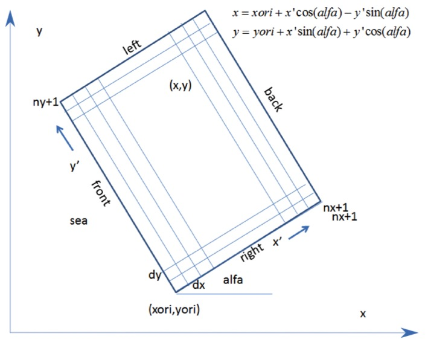

   Rectangular coordinate system of XBeach

Grid set-up
~~~~~~~~~~~

The grid applied is a staggered grid, where the bed levels, water
levels, water depths and concentrations are defined in cell centers, and
velocities and sediment transports are defined in u- and v-points, viz.
at the cell interfaces. In the wave energy balance, the energy, roller
energy and radiation stress are defined at the cell centers, whereas the
radiation stress gradients are defined at u- and v-points.

Velocities at the u- and v-points are denoted by the output variables uu
and vv respectively; velocities u and v at the cell centers are obtained
by interpolation and are for output purpose only. The water level, zs,
and the bed level, zb, are both defined positive upward. uv and vu are
the u-velocity at the v-grid point and the v-velocity at the u-grid
point respectively. These are obtained by interpolation of the values of
the velocities at the four surrounding grid points.

The model solves coupled 2D horizontal equations for wave propagation,
flow, sediment transport and bottom changes, for varying (spectral) wave
and flow boundary conditions.

.. _fig-coordsys-curvi:

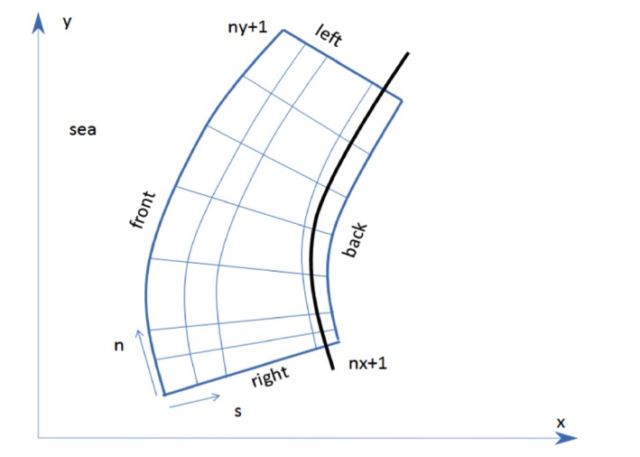

   Curvilinear coordinate system of XBeach

Hydrodynamics options
---------------------

XBeach was originally developed as a short-wave averaged but wave-group
resolving model, allowing resolving the short wave variations on the
wave group scale and the long waves associated with them. Since the
original paper by :cite:t:`Roelvink2009` a number of additional model
options have been implemented, thereby allowing users to choose which
time-scales to resolve:

#. Stationary wave model (keyword: :par:`wavemodel` = *stationary*),
   efficiently solving wave-averaged equations but neglecting
   infragravity waves;

#. Surfbeat mode (instationary) (keyword: :par:`wavemodel` =
   *surfbeat*), where the short wave variations on the wave group
   scale (short wave envelope) and the long waves associated with them
   are resolved;

#. Non-hydrostatic mode (wave-resolving) (keyword: :par:`wavemodel` =
   *nonh*), where a combination of the non-linear shallow water
   equations with a pressure correction term is applied, allowing to
   model the propagation and decay of individual waves.

In the following these options are discussed in more detail. Important
to note that all times in XBeach are prescribed on input in
morphological time. If you apply a morphological acceleration factor
(keyword: :par:`morfac`) all input time series and other time
parameters are divided internally by :par:`morfac`. This way, you can
specify the time series as real times, and vary the :par:`morfac`
without changing the rest of the input files (keyword:
:par:`morfacopt` = *1*).

.. _Wave_processes:

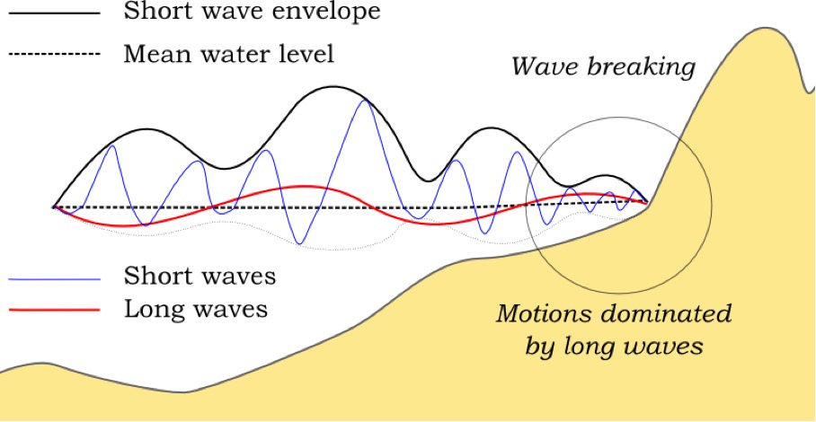

   Principle sketch of the relevant wave processes

Stationary mode
~~~~~~~~~~~~~~~

.. seealso:: The stationary mode is implemented in `mod:wave_stationary_module`.
             
In stationary mode the wave-group variations and thereby all
infragravity motions are neglected. This is useful for conditions
where the incident waves are relatively small and/or short, and these
motions would be small anyway. The model equations are similar to
HISWA (:cite:`Holthuijsen1989`) but do not include wave growth or wave
period variations. Processes that are resolved are wave propagation,
directional spreading, shoaling, refraction, bottom dissipation and
wave breaking, and a roller model is included; these processes are
usually dominant in nearshore areas of limited extent. For the
breaking dissipation we use the :cite:t:`Baldock1998` model, which is
valid for wave-averaged modeling. The radiation stress gradients from
the wave and roller model force the shallow water equations, drive
currents and lead to wave setdown and setup. Additionally, wind and
tidal forcing can be applied.

The mean return flow due to mass flux and roller is included in the
model and affects the sediment transport, leading to an offshore
contribution. To balance this, effects of wave asymmetry and skewness
are included as well. Bed slope effects can further modify the
cross-shore behavior. A limited number of model coefficients allow the
user to calibrate the profile shape resulting from these interactions.

A typical application would be to model morphological changes during
moderate wave conditions, often in combination with tides. The wave
boundary conditions can be specified as constant (keyword:
:par:`wbctype` = params) or as a time-series of wave conditions
(keyword: :par:`wbctype` = jonstable). Typical examples of such
model applications are given below for tombolo formation behind an
offshore breakwater (left panel) and development of an ebb delta at a
tidal inlet (right panel). A big advantage of the stationary XBeach
wave model over other models is that the lateral boundaries are
entirely without disturbance if the coast is longshore uniform near
these boundaries.

.. _stationary_examples1:
   :align: center

   .. image:: images/image11.jpg
      :width: 200px

   .. image:: images/image12.jpg
      :width: 200px

.. _stationary_examples2:
   :align: center

   .. image:: images/image13.jpg
      :width: 200px

   .. image:: images/image14.jpg
      :width: 200px

   Root-mean square wave height (left panels) and final bathymetry
   (right panels) for an offshore breakwater case (upper panels) and
   a tidal inlet with waves from 330 degrees (lower panels).

Surf beat mode (instationary)
~~~~~~~~~~~~~~~~~~~~~~~~~~~~~

.. seealso:: The surfbeat mode is implemented in `mod:wave_instationary_module`.

The short-wave motion is solved using the wave action equation which
is a time-dependent forcing of the HISWA equations
:cite:`Holthuijsen1989`. This equation solves the variation of
short-waves envelope (wave height) on the scale of wave groups. It
employs a dissipation model for use with wave groups
:cite:`Roelvink1993a,Daly2012` and a roller model
:cite:`Svendsen1984,Nairn1990,Stive1994` to represent momentum
stored at the surface after breaking. These variations, through
radiation stress gradients
:cite:`Longuet-Higgins1962,LonguetHiggins1964` exert a force on the
water column and drive longer period waves (infragravity waves) and
unsteady currents, which are solved by the nonlinear shallow water
equations :cite:`Phillips1977`. Thus, wave-driven currents
(longshore current, rip currents and undertow), and wind-driven
currents (stationary and uniform) for local wind set-up, long
(infragravity) waves, and runup and rundown of long waves (swash) are
included.

Using the surfbeat mode is necessary when the focus is on swash zone
processes rather than time-averaged currents and setup. It is fully
valid on dissipative beaches, where the short waves are mostly
dissipated by the time they are near the shoreline. On intermediate
beaches and during extreme events the swash motions are still
predominantly in the infragravity band and so is the runup.

Under this surfbeat mode, several options are available, depending on
the circumstances:

#. **1D cross-shore;** in this case the longshore gradients are
   ignored and the domain reduces to a single gridline (keyword:
   :par:`ny` = *0*).  Within this mode the following options are
   available:

   #. Retaining directional spreading (keyword: :par:`dtheta` <
      :par:`thetamax` - :par:`thetamin`); this has a limited effect on
      the wave heights because of refraction, but can also allow
      obliquely incident waves and the resulting longshore currents;

   #. Using a single directional bin (keyword: :par:`dtheta` =
      :par:`thetamax`- :par:`thetamin`); this leads to perpendicular
      waves always and ignores refraction. If the keyword :par:`snells` =
      *1* is applied, the mean wave direction is determined based on
      Snells law. In this case also longshore currents are generated.

#. **2DH area;** the model is solved on a curvilinear staggered grid
   (rectilinear is a special case). The incoming short wave energy will
   vary along the seaward boundary and in time, depending on the wave
   boundary conditions. This variation is propagated into the model
   domain. Within this mode the following options are available:

   #. Resolving the wave refraction 'on the fly' using the propagation
      in wave directional space. For large directional spreading or
      long distances this can lead to some smoothing of groupiness
      since the waves from different directions do not interfere but
      their energy is summed up. This option is possible for arbitrary
      bathymetry and any wave direction. The user must specify the
      width of the directional bins for the surfbeat mode (keyword:
      :par:`dtheta`)

   #. Solving the wave direction at regular intervals using the
      stationary solver, and then propagating the wave energy along
      the mean wave direction. This preserves the groupiness of the
      waves therefore leads to more forcing of the infragravity waves
      (keyword: :par:`single_dir` = *1*). The user must now specify a
      single directional bin for the instationary mode (:par:`dtheta`
      = :par:`thetamax` - :par:`thetamin`) and a smaller bin size for
      the stationary solver (keyword: :par:`dtheta_s`).

   #. For schematic, longshore uniform cases the mean wave direction
      can also be computed using Snells law (keyword: :par:`snells` =
      1). This will then give comparable results to the
      :par:`single_dir` option.

In the figures below some typical applications of 1D and 2D models are
shown; a reproduction of a large-scale flume test, showing the ability
of XBeach to model both short-wave (HF) and long-wave (LF) wave
heights and velocities; and a recent 2DH simulation
:cite:`Nederhoff2015` of the impact of hurricane Sandy on Camp
Osborne, Brick, NJ.

.. _lip_tests:

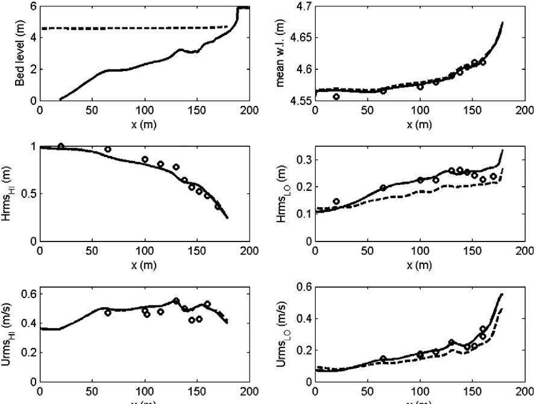

   Computed and observed hydrodynamic parameters for test 2E of the
   LIP11D experiment. Top left: bed level and mean water level. Top
   right: measured (dots) and computed as simulated by XBeach

.. _sandy_example1:

   .. image:: images/image16.jpg
      :width: 200px
              
   .. image:: images/image17.jpg
      :width: 200px 

   Pre (left) and post-Sandy (right) in a three dimensional plot with
   both bed and water levels as simulated by XBeach
   (:cite:`Nederhoff2015`)

Non-hydrostatic mode (wave resolving) 
~~~~~~~~~~~~~~~~~~~~~~~~~~~~~~~~~~~~~~

.. seealso:: The non-hydrostatic mode is implemented in `mod:nonh_module`.
             
For non-hydrostatic XBeach calculations (keyword: :par:`wavemodel` =
*nonh*) depth-averaged flow due to waves and currents are computed
using the non-linear shallow water equations, including a
non-hydrostatic pressure. The depth-averaged normalized dynamic
pressure (:math:`q`) is derived in a method similar to a one-layer
version of the SWASH model :cite:`Zijlema2011a`. The depth averaged
dynamic pressure is computed from the mean of the dynamic pressure at
the surface and at the bed by assuming the dynamic pressure at the
surface to be zero and a linear change over depth.

Under these formulations dispersive behavior is added to the long wave
equations and the model can be used as a short-wave resolving model.
Wave breaking is implemented by disabling the non-hydrostatic pressure
term when waves exceed a certain steepness, after which the bore-like
breaking implicit in the momentum-conserving shallow water equations
takes over.

In case the non-hydrostatic mode is used, the short wave action
balance is no longer required. This saves computation time. However,
in the wave-resolving mode we need much higher spatial resolution and
associated smaller time steps, making this mode much more
computationally expensive than the surfbeat mode.

The main advantages of the non-hydrostatic mode are that the
incident-band (short wave) runup and overwashing are included, which
is especially important on steep slopes such as gravel
beaches. Another advantage is that the wave asymmetry and skewness are
resolved by the model and no approximate local model or empirical
formulation is required for these terms. Finally, in cases where
diffraction is a dominant process, wave-resolving modeling is needed
as it is neglected in the short wave averaged mode. The XBeach-G
formulations for gravel beaches :cite:`McCall2014` are based on the
non-hydrostatic mode.  Although sandy morphology can be simulated
using the wave-resolving mode, it has not been extensively validated
and it is likely that changes in the sediment transport formulations
will be implemented in the near future.

To improve the dispersive behaviour a (reduced) 2-layer non-hydrostatic is implemented as well :cite:`de2021efficient`.
In this version (keyword: :par:`nhq3d` = *1*, see Section :ref:`sec-twolayer`), the pressure in the vertical is 
described by a hydrostatic pressure assumption in the bottom layer, and a non-hydrostatic distribution in the upper layer. 

An interesting recent application that has been validated for a number
of cases concerns the modeling of primary waves generated by large
ships, see :ref:`sec-ship-induced-wave-motions`.

.. _bardex_example:

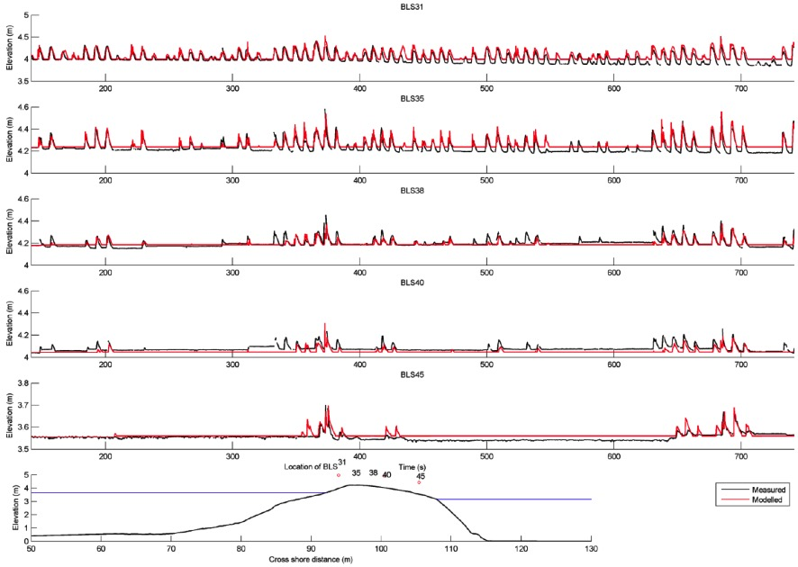

   Measured (black) and modeled (red) time series of overtopping during
   BARDEX experiment, from :cite:`McCall2014`.

Short wave action 
------------------

.. _sec-short-wave-action-balance:

Short wave action balance
~~~~~~~~~~~~~~~~~~~~~~~~~

.. seealso:: The short wave action balance is implemented
             in `func:wave_instationary_module/wave_instationary`.

The wave forcing in the shallow water momentum equation is obtained
from a time dependent version of the wave action balance
equation. Similar to Delft University (stationary) HISWA model
(:cite:`Holthuijsen1989`) the directional distribution of the action
density is taken into account, whereas the frequency spectrum is
represented by a frequency, best represented by the spectral parameter
:math:`{f}_{m-1,0}`. The wave action balance (keyword: :par:`swave`)
is then given by:

.. math::
   :label:

   \frac{\partial A}{\partial t} +\frac{\partial c_{x} A}{\partial x} +\frac{\partial c_{y} A}{\partial y} +\frac{\partial c_{\theta } A}{\partial \theta } =-\frac{D_{w} +D_{f} +D_{v} }{\sigma }

In which the wave action :math:`A` is calculated as:

.. math::
   :label:

   A(x,y,t,\theta )=\frac{S_{w} (x,y,t,\theta )}{\sigma (x,y,t)}

where :math:`\theta` represents the angle of incidence with respect
to the x-axis, :math:`{S}_{w}` represents the wave energy density in
each directional bin and :math:`\sigma` the intrinsic wave frequency.
The intrinsic frequency :math:`\sigma` and group velocity
:math:`{c}_{g}` is obtained from the linear dispersion relation. The
intrinsic frequency is for example obtained with:

.. math::
   :label:

   \sigma =\sqrt{gk\tanh kh}

The wave action propagation speeds in :math:`x`, :math:`y` and
directional space are given by:

.. math::
   :label:

   \begin{array}{l} {c_{x} (x,y,t,\theta )=c_{g} \cos (\theta )} \\ {c_{y} (x,y,t,\theta )=c_{g} \sin (\theta )} \\ {c_{\theta } (x,y,t,\theta )=\frac{\sigma }{\sinh 2kh} \left(\frac{\partial h}{\partial x} \sin \theta -\frac{\partial h}{\partial y} \cos \theta \right)} \end{array}

where :math:`h` represents the local water depth and :math:`k` the
wave number. The intrinsic wave frequency :math:`\sigma` is determined
without wave current interaction (keyword: :par:`wci` = *1*, see
Section 2.3.1.1), which means it is equal to the absolute radial
frequency :math:`\omega`.

Wave-current interaction (wci)
^^^^^^^^^^^^^^^^^^^^^^^^^^^^^^

.. seealso:: The wave-current interaction is implemented
             in `func:wave_instationary_module/wave_instationary`.

Wave-current interaction is the interaction between waves and the mean
flow. The interaction implies an exchange of energy, so after the
start of the interaction both the waves and the mean flow are affected
by each other. This feature is especially of importance in gullies and
rip-currents (:cite:`Reniers2007a`).

In XBeach this is taken into account by correcting the wave number
:math:`k` with the use of Eikonal equations, which will have impact on
the group and wave propagation speed (x, y, and directional
space). The cross-shore and alongshore wave numbers, :math:`{k}_{x}`
and :math:`{k}_{y}`, are defined according to equation
:eq:`eikonal`. In these formulations the subscripts refer to the
direction of the wave vector components.

.. math::
   :label: eikonal
           
   \begin{array}{l}
     {k_{x} =k_{x}^{n-1} +k_{x}^{:} } \\
     {k_{y} =k_{y}^{n-1} +k_{y}^{:} } \\
   \end{array}

Where subscript :math:`n-1` refers the wave number of the previous
time step, :math:`k_{x}^{:}` and :math:`k_{y}^{:}` are the wave number
corrections and :math:`{k}_{x}` and :math:`{k}_{y}` are the corrected
wave numbers that take into account the presence of a current.  The
correction terms are determined with a second set of equations, the
Eikonal equations:

.. math::
   :label:

   \begin{array}{l} {\frac{\partial k_{x} }{\partial t} +\frac{\partial \omega }{\partial x} =0} \\ {\frac{\partial k_{y} }{\partial t} +\frac{\partial \omega }{\partial y} =0} \end{array}

The wave number is then given by:

.. math::
   :label:

   k=\sqrt{k_{x}^{2} +k_{y}^{2} }

The absolute radial frequency :math:`\omega` is calculated with:

.. math::
   :label:

   \omega =\sigma +k_{x} u^{L} +k_{y} v^{L}

where :math:`{u}^{L}` and :math:`{v}^{L}` are the cross-shore
and alongshore depth-averaged Lagrangian velocities respectively. The
wave action propagation speed (in x and y direction) is given by:

.. math::
   :label:

   \begin{array}{l} {c_{x} (x,y,t,\theta )=c_{g} \cos (\theta )+u^{L} } \\ {c_{y} (x,y,t,\theta )=c_{g} \sin (\theta )+v^{L} } \end{array}

The propagation speed in directional (:math:`\theta`) space, where
bottom refraction (first term) and current refraction (last two terms)
are taken into account, is obtained from:

.. math::
   :label:

   \begin{array}{r} {c_{\theta } (x,y,t,\theta )=\frac{\sigma }{\sinh 2kh} \left(\frac{\partial h}{\partial x} \sin \theta -\frac{\partial h}{\partial y} \cos \theta \right)+\cos \theta \left(\sin \theta \frac{\partial u}{\partial x} -\cos \theta \frac{\partial u}{\partial y} \right)} \\ {+\, \sin \theta \left(\sin \theta \frac{\partial v}{\partial x} -\cos \theta \frac{\partial v}{\partial y} \right)} \end{array}

.. _sec-dissipation:

Dissipation
~~~~~~~~~~~

In XBeach there are three short wave dissipation processes that can be
accounted for: wave breaking (:math:`{D}_{w}`), bottom friction
(:math:`{D}_{f}`) and vegetation (:math:`{D}_{v}`). The three
processes are explained in more detail in the following subsections.

Wave breaking
^^^^^^^^^^^^^

.. seealso:: Short wave dissipation by breaking is implemented
             in `mod:roelvink_module`.
             
Five different wave breaking formulations are implemented in XBeach. The
formulations can be selected using the keyword :par:`break`
(:numref:`tab-wave-breaking`).

.. _tab-wave-breaking:

.. table:: Different wave breaking formulations implemented

   +-----------------------------+-----------------+------------------+
   | Wave breaking formula       | Type of waves   | keyword          |
   +=============================+=================+==================+
   | Roelvink (1993a)            | Instationary    | roelvink1        |
   +-----------------------------+-----------------+------------------+
   | Roelvink (1993a) extended   | Instationary    | roelvink2        |
   +-----------------------------+-----------------+------------------+
   | Daly et al. (2010)          | Instationary    | roelvink_daly    |
   +-----------------------------+-----------------+------------------+
   | Baldock et al. (1998)       | Stationary      | baldock          |
   +-----------------------------+-----------------+------------------+
   | Janssen & Battjes (2007)    | Stationary      | janssen          |
   +-----------------------------+-----------------+------------------+

For the surf beat approach the total wave energy dissipation, i.e.
directionally integrated, due to wave breaking can be modeled
according to :cite:`Roelvink1993a` (keyword: :par:`break` =
*roelvink1*). In the formulation of the dissipation due to wave
breaking the idea is to calculate the dissipation with a fraction of
breaking waves (:math:`{Q}_{b}`) multiplied by the dissipation per
breaking event. In this formulation :math:`\alpha` is applied as wave
dissipation coefficient of O (keyword: :par:`alpha`),
:math:`{T}_{rep}` is the representative wave period and
:math:`{E}_{w}` is the energy of the wave. The fraction of wave
breaking is determined with the root-mean-square wave height
(:math:`{H}_{rms}`) and the maximum wave height
(:math:`{H}_{max}`). The maximum wave height is calculated as ratio of
the water depth (:math:`h`) plus a fraction of the wave height
(:math:`\delta H_{rms}`, keyword: :par:`delta`) using a breaker index
:math:`\gamma` (keyword: :par:`gamma`). In the formulation for
:math:`{H}_{rms}` the :math:`\rho` represents the water density and :math:`g`
the gravitational constant. The total wave energy :math:`{E}_{w}` is
calculated by integrating over the wave directional bins.

.. math::
   :label: wave-breaking-roelvink1

   \begin{array}{c} {\bar{D}_{w} =2\frac{\alpha }{T_{rep} } Q_{b} E_{w} {\; }} \\ {Q_{b} {=1-exp}\left(-\left(\frac{H_{rms} }{H_{\max } } \right)^{n} \right),\quad H_{rms} =\sqrt{\frac{8E_{w} }{\rho g} } ,\quad H_{\max } =\gamma \cdot (h+\delta H_{rms} )} \\ {E_{w} (x,y,t)=\int _{0}^{2\pi }S_{w} (x,y,t,\theta )d\theta  } \end{array}

In variation of :eq:`wave-breaking-roelvink1`, one could also use 
another wave breaking formulation, presented in :eq:`wave-breaking-roelvink2`. 
This formulation is somewhat different than the formulation of 
:cite:`Roelvink1993a` and selected using keyword 
:par:`break` = *roelvink2*. The main difference with the
original formulation is that wave dissipation with :par:`break` =
*roelvink2* is proportional to :math:`{H}^{3} / h` instead of
:math:`{H}^{2}`.

.. math::
   :label: wave-breaking-roelvink2

   \bar{D}_{w} =2\frac{\alpha }{T_{rep} } Q_{b} E_{w} \frac{H_{rms} }{h}

Alternatively the formulation of :cite:`Daly2010` states that waves
are fully breaking if the wave height exceeds a threshold
(:math:`\gamma`) and stop breaking if the wave height fall below
another threshold (:math:`\gamma_{2}`). This formulation is selected
by :par:`break` = *roelvink\_daly* and the second threshold,
:math:`\gamma_{2}`, can be set using keyword :par:`gamma2`.

.. math::
   :label: wave-breaking-daly

   \left\{\begin{array}{l} {Q_{b} =1\quad if\quad H_{rms} >\gamma h} \\ {Q_{b} =0\quad if\quad H_{rms} <\gamma _{2} h} \end{array}\right.

In case of stationary waves :cite:`Baldock1998` is applied (keyword:
:par:`break` = *baldock*), which is presented in :eq:`wave-breaking-baldock`. 
In this breaking formulation the fraction breaking waves :math:`{Q}_{b}` and breaking
wave height :math:`{H}_{b}` are calculated differently compared to the
breaking formulations used for the non-stationary situation. In
:math:`\alpha` is applied as wave dissipation coefficient,
:math:`{f}_{rep}` represents a representative intrinsic frequency and
:math:`y` is a calibration factor.

.. math::
   :label: wave-breaking-baldock

   \begin{array}{l} {\bar{D}_{w} =\frac{1}{4} \alpha Q_{b} \rho gf_{rep} \left(H_{b}^{2} +H_{rms}^{2} \right)} \\ {Q_{b} =\exp \left[-\left(\frac{H_{b}^{2} }{H_{rms}^{2} } \right)\right]{\; ,\; \; }H_{b} =\frac{0.88}{k} \tanh \left[\frac{\gamma kh}{0.88} \right]} \end{array}

Finally, it is possible to use the :cite:`Janssen2007` formulation for
wave breaking of stationary waves (keyword: :par:`break` =
*janssen*). This formulation is a revision of Baldock's formulation.

.. math::
   :label:

   \begin{array}{l} {\bar{D}_{w} =\frac{3\sqrt{\pi } \alpha f_{rep} \rho gH_{rms}^{3} }{16 h} Q_{b} } \\ {Q_{b} =1+\frac{4}{3\sqrt{\pi } } \left(R^{3} +\frac{3}{2} R\right)\exp \left(-R^{2} \right)-erf\left(R\right)} \\ {R=\frac{H_{b} }{H_{rms} } } \end{array}

In both the instationary or stationary case the total wave dissipation
is distributed proportionally over the wave directions with the
formulation in :eq:`wave-breaking-distribution`.

.. math::
   :label: wave-breaking-distribution

   D_{w} (x,y,t,\theta )=\frac{S_{w} (x,y,t,\theta )}{E_{w} (x,y,t)} \bar{D}_{w} (x,y,t)

Bottom friction
^^^^^^^^^^^^^^^

.. seealso:: Short wave dissipation by bottom friction is implemented
             in `func:wave_instationary_module/wave_instationary`.

The short wave dissipation by bottom friction is modeled as

.. math::
   :label: sw-bottom-friction

   D_{f} =\frac{2}{3\pi } \rho f_{w} \left(\frac{\pi H_{rms} }{T_{m01} \sinh kh} \right)^{3}

In :eq:`sw-bottom-friction` the :math:`{f}_{w}` is the short-wave
friction coefficient. This value only affects the wave action equation
and is unrelated to bed friction in the flow equation. Studies
conducted on reefs (e.g. :cite:`Lowe2007`) indicate that
:math:`{f}_{w}` should be an order of magnitude (or more) larger than
the friction coefficient for flow (:math:`{c}_{f}`) due to the
dependency of wave frictional dissipation rates on the frequency of
the motion.

The derivation of the short wave dissipation term is based
time-averaged instantaneous bottom dissipation using the Johnson
friction factor :math:`{f}_{w}` of the bed shear stress:

.. math::
   :label: sw-bottom-friction-0

   \tilde{D}_{f} =\left|\tau u\right|=\frac{1}{2} \rho f_{w} \left|\tilde{u}\right|^{3}

The evaluation of the term
:math:`\left\langle\left|\tilde{u}\right|^{3}\right\rangle`, the
so-called third even velocity moment, depends on the situation. First
we need expressions for the orbital velocity amplitude, which is
expressed as:

.. math::
   :label: orbital-velocity

   u_{orb} =\frac{\pi H_{rms} }{T_{p} \sinh (kh)}

In this formulation :math:`{T}_{p}` is the peak wave period,
:math:`{H}_{rms}` is the root-mean-square wave height, :math:`k` is
the wave number and :math:`h` is the local water depth.

If we consider the slowly-varying dissipation in wave groups, we need
only to average over a single wave period and we can use a
monochromatic (regular wave) expression. If we want to have the
time-average dissipation over a full spectrum we get the best
approximation from considering a linear Gaussian
distribution. :cite:`Guza1985` give pragmatic expressions for both
cases.

For the monochromatic case:

.. math::
   :label: orbital-velocity-monochomatic

   \left\langle \left|\tilde{u}\right|^{3} \right\rangle =1.20\left\langle \left|\tilde{u}\right|^{2} \right\rangle ^{3/2} =1.20\left(\frac{1}{2} u_{orb}^{2} \right)^{3/2} =0.42u_{orb}^{3}

For the linear Gaussian approximation:

.. math::
   :label: orbital-velocity-gaussian

   \left\langle \left|\tilde{u}\right|^{3} \right\rangle =1.60\left\langle \left|\tilde{u}\right|^{2} \right\rangle ^{3/2} =1.60\left(\frac{1}{2} u_{orb}^{2} \right)^{3/2} =0.57u_{orb}^{3}

Combining :eq:`sw-bottom-friction-0` and
:eq:`orbital-velocity-monochomatic` we get:

.. math::
   :label: sw-bottom-friction-instationary

   \left\langle \tilde{D}_{f} \right\rangle =0.21\rho f_{w} u_{orb}^{3}

In XBeach the orbital velocity amplitude is computed as in
:eq:`orbital-velocity-monochromatic` and the dissipation according to
:eq:`sw-bottom-friction-instationary`, which is correct for the case
of instationary simulations on wave-group scale.

For the stationary case formulations :eq:`sw-bottom-friction-0` and
:eq:`orbital-velocity-gaussian` are similarly combined into:

.. math::
   :label: sw-bottom-friction-stationary

   \left\langle \tilde{D}_{f} \right\rangle =0.28\rho f_{w} u_{orb}^{3}

Vegetation
^^^^^^^^^^

.. seealso:: Short wave dissipation by vegetation is implemented
             in `mod:vegetation_module`.

The presence of aquatic vegetation within the area of wave propagation
or wave breaking results in an additional dissipation mechanism for
short waves. This is modeled using the approach of :cite:`Mendez2004a`,
which was adjusted by :cite:`Suzuki2012` to take into account
vertically heterogeneous vegetation, see :cite:`VanRooijen2015`. The
short wave dissipation due to vegetation is calculated as function of
the local wave height and several vegetation parameters. The vegetation
can be schematized in a number of vertical elements with each specific
property. In this way the wave damping effect of vegetation such as
mangrove trees, with a relatively dense root system but sparse stem
area, can be modeled. The dissipation term is then computed as the sum
of the dissipation per vegetation layer (:cite:`Suzuki2012`):

.. math::
   :label:

   D_{v} =\sum _{i=1}^{n_{v} }D_{v,i}

where :math:`{D}_{v,i}` is the dissipation by
vegetation in vegetation layer :math:`i` and :math:`{n}_{v}` is the number
of vegetation layers. The dissipation per layer is given by:

.. math::
   :label:

   \begin{array}{l} {D_{v,i} =A_{v} \cdot \frac{\rho \widetilde{C}_{D,i} b_{v,i} N_{v,i} }{2\sqrt{\pi } } \left(\frac{kg}{2\sigma } \right)^{3} H_{rms} ^{3} ,{\; with}} \\ {A_{v} =\frac{\left(\sinh ^{3} k\alpha _{i} h-\sinh ^{3} k\alpha _{i-1} h\right)+3\left(\sinh k\alpha _{i} h-\sinh k\alpha _{i-1} h\right)}{3k\cosh ^{3} kh} } \end{array}

where :math:`\widetilde{C}_{D,i}` is a (bulk) drag coefficient,
:math:`{b}_{v,i}` is the vegetation stem diameter,
:math:`{N}_{v,i}` is the vegetation density, and
:math:`\alpha_{i}` is the relative vegetation height (=
:math:`{h}_{v} / h`) for layer :math:`i`. In case only
one vegetation layer is specified, the plants are assumed to be
vertically uniform, which would for example typically apply in case of
modeling sea grass.

Radiation stresses
~~~~~~~~~~~~~~~~~~

Given the spatial distribution of the wave action (and therefore wave
energy) the radiation stresses can be evaluated by using linear wave
theory as described by:

.. math::
   :label:

   \begin{array}{l} {S_{xx,r} (x,y,t)=\int \cos ^{2} \theta S_{r} d\theta  } \\ {S_{xy,r} (x,y,t)=S_{yx,r} (x,y,t)=\int \sin \theta \cos \theta S_{r}  d\theta } \\ {S_{yy,r} (x,y,t)=\int \sin ^{2} \theta S_{r} d\theta  } \end{array}

.. _sec-wave-shape:

Wave shape
~~~~~~~~~~

.. seealso:: Wave shapes are implemented in `func:morphevolution/RvR`
             and `func:morphevolution/vT`.
             
The morphodynamic model considered is (short) wave averaged and resolves
hydrodynamics associated with the wave group time scale. As a result the
short wave shape is not solved for. However, as waves propagate from
deep water onto beaches, their surface form and orbital water motion
become increasingly non-linear because of the amplification of the
higher harmonics.

There are two wave forms implemented to take this non-linearity into
account:

#. A formulation of :cite:`Ruessink2012` based on a parameterization
   with the Ursell number. (keyword: :par:`waveform` = *ruessink\_vanrijn*)

#. A formulation of :cite:`VanThieldeVries2009a` based on the parameterized
   wave shape model of :cite:`Rienecker1981` (keyword: :par:`waveform` =
   vanthiel)

The formulation of :cite:`Ruessink2012` relies on parameterizations
for the non-linearity parameter :math:`r` and phase :math:`\Phi`. The
parameterizations are based on a data set of 30.000+ field observations
of the orbital skewness :math:`{S}_{k}` and asymmetry
:math:`{A}_{s}`, collected under non-breaking and breaking wave
conditions. The only variable parameter is the Ursell number, since
according to :cite:`Ruessink2012` the Ursell that includes
:math:`{H}_{s}`, :math:`T` and :math:`h`, describes the variability in
:math:`{S}_{k}` and :math:`{A}_{s}` well. The Ursell number is
calculated with the equation below.

.. math::
   :label:

   U_{r} =\frac{3}{4} \frac{0.5H_{s} k}{(kh)^{3} }

The value for the skewness and asymmetry is calculated with the use of a
Boltzmann sigmoid. The skewness and asymmetry are a function of
:math:`\Psi`. In the formulation of :cite:`Ruessink2012` the
:math:`{p}_{1:6}` are used as parameterized factors on the data set
of field observations.

.. math::
   :label:

   \begin{array}{c} {B=p_{1} +\frac{p_{2} -p_{1} }{1+\exp \frac{p_{3} -\log Ur}{p_{4} } } } \\ {\psi =-90+90\tanh (p_{5} /Ur^{p_{6} } )} \\ {} \\ {S_{k} =B\cos \psi {\; \; \; and\; \; \; }A_{s} =B\sin \psi } \end{array}

Alternatively, :cite:`VanThieldeVries2009a` utilized and extended the
wave shape model of :cite:`Rienecker1981`. In this model the short
wave shape is described by a Rienecker and Fenton lookup table with
amongst others amplitudes non-linear components obtained with stream
function theory. Therefore, wave skewness (:math:`{S}_{k}`) and
asymmetry (:math:`{A}_{s})` is computed in each grid point based on the
water depth, dimensionless wave height and dimensionless wave period.

For :math:`w` equals one a skewed (Stokes) wave is obtained with high peaks
and flat troughs whereas :math:`w` equals zero results in an asymmetric (saw
tooth) wave with steep wave fronts. It is hypothesized that the
weighting :math:`w` can be expressed as a function of wave skewness and
asymmetry. The relation between the phase and the weighting is studied
in more detail by :cite:`VanThieldeVries2009a` by varying :math:`w` between zero
and one in small steps and computing the amplitudes with Rienecker and Fenton for a
range of wave heights, wave periods and water depths. It is found that a
unique relation between :math:`w` and :math:`\Phi` exists for any
combination of wave height, wave period and water depth that is
described by:

.. math::
   :label:

   w=0.2719\ln \left(\left|\frac{\phi -1.8642}{0.2933-\phi } \right|\right)+0.5

As explained in the next section, short-wave turbulence can be computed
averaged over the bore interval (:math:`{T}_{bore}`). The bore interval
is directly related to the wave shape and hence requires the weighting
function :math:`w` is determined. For the formulation of :cite:`Ruessink2012`
no exact wave shape is determined and therefore no bore interval
can be calculated. Therefore this approach cannot be combined with bore
averaged short-wave turbulence.

Turbulence
~~~~~~~~~~

.. seealso:: Wave breaking induced turbulence is implemented
             in `func:morphevolution/waveturb`.

Wave breaking induced turbulence at the water surface has to be
transported towards the bed in order to affect the up-stirring of
sediment. :cite:`Roelvink1989` used an exponential decay model with
the mixing length proportional to :math:`{H}_{rms}` to estimate the
time averaged turbulence energy at the bed from turbulence at the water
surface:

.. math::
   :label:

   k_{b} =\frac{k}{\exp (h/H_{rms} )-1}

where :math:`{k}_{b}` is turbulence variance at the bed and :math:`k` is
the time averaged turbulence variance at the water surface.

There are three possibilities for the turbulence variance at the bed
(:math:`{k}_{b}`) implemented into XBeach:

#. Wave averaged near-bed turbulence energy (keyword: :par:`turb` =
   wave\_averaged):

   .. math::
      :label:

      k_{b} =\frac{\overline{k_{s} }}{\exp (h/L_{mix} )-1}

#. Bore-averaged near-bed turbulence energy [#1]_ (keyword: :par:`turb` =
   bore\_averaged)

   .. math::
      :label:

      k_{b} =\frac{\overline{k_{s} }\cdot T_{rep} /T_{bore} }{\exp (h/L_{mix} )-1}

#. Not taking into account the turbulence variance at the bed (keyword:
   :par:`turb` = *none*)

Both formulations make use of the wave-averaged turbulence energy
(:math:`{k}_{s}`) and a mixing length (:math:`{L}_{mix}`). The
wave averaged turbulence energy at the surface is computed from the
roller energy dissipation and following :cite:`Battjes1975a` in which
:math:`{D}_{r}` is roller dissipation:

.. math::
   :label:

   \overline{k_{s} }=\left(D_{r} /\rho _{w} \right)^{2/3}

The mixing length (:math:`{L}_{mix}`) is expressed as thickness of
the surface roller near the water surface and depends on the roller
volume :math:`{A}_{r}` (:cite:`Svendsen1984`):

.. math::
   :label:

   L_{mix} =\sqrt{A_{r} } =\sqrt{\frac{2E_{r} T_{rep} }{\rho _{w} c_{w} } }

.. _sec-roller-energy-balance:

Roller energy balance
~~~~~~~~~~~~~~~~~~~~~

.. seealso:: The roller energy balance is implemented
             in `func:wave_instationary_module/wave_instationary`.

While the short wave action balance adequately describes the propagation
and decay of organized wave energy, it has often been found that there
is a delay between the point where the waves start to break (which is
where you would expect the strongest radiation stress gradients to
occur) and the point where the wave set-up and longshore current start
to build. This transition zone effect is generally attributed to the
temporary storage of shoreward momentum in the surface rollers. Several
authors have analyzed the typical dimensions of such rollers and their
effect on the radiation stress (e.g. :cite:`Longuet-Higgins1974`,
:cite:`Svendsen1984`, :cite:`Roelvink1989`, :cite:`Nairn1990`, :cite:`Deigaard1993a`, :cite:`Stive1994`).

The rollers can be represented as a blob of water with cross-sectional
area A that slides down the front slope of a breaking wave. The roller
exerts a shear stress on the water beneath it equal to:

.. math::
   :label: roller-shear
           
   \tau _{roller} =\frac{\rho gR}{L} \beta _{s}

where :math:`\beta_{s}` is the slope of the breaking wave front, :math:`R`
is the roller area and :math:`L` is the wave length. The roller has a kinetic
energy equal to:

.. math::
   :label: roller-energy
           
   E_{r} =\frac{1}{2} \frac{\rho R(\overline{u_{roller}^{2} +w_{roller}^{2} })}{L}

and a contribution to the radiation stress equal to:

.. math::
   :label:

   S_{xx} =\frac{\rho R\overline{\left(u_{roller}^{2} -w_{roller}^{2} \right)}}{L}

We can now formulate an energy balance for the roller as follows:

.. math::
   :label:

   \frac{dE_{r} }{dt} =\frac{\partial E_{r} }{\partial t} +\frac{\partial E_{r} c\cos \theta }{\partial x} +\frac{\partial E_{r} c\sin \theta }{\partial y} =S-D

where :math:`S` is the loss of organized wave motion due to breaking and :math:`D`
is the dissipation. The latter is equal to the work done by the shear
stress between the roller and the wave:

.. math::
   :label: roller-dissipation
           
   D_{r} =\tau _{roller} c_{g}

Given the complex motion in the breaking waves, we can only give
approximate estimates of the order of magnitude of the parameters in
equations :eq:`roller-shear` till :eq:`roller-dissipation`.
Various authors have suggested that the velocity in the
roller can be approximated as purely horizontal and equal to the wave
celerity :math:`{c}_{g}`. In that case we get (for waves travelling
in x-direction):

.. math::
   :label:

   S_{xx,roller} =2E_{r}

However, this must be seen as an (unrealistic) upper limit on the
radiation stress contribution as this can only be valid for
:math:`{w}_{roller}=0`. :cite:`Nairn1990` showed that the
conceptual model of :cite:`Roelvink1989` would lead to a factor
0.22 instead of 2. However, a ratio in the order of 1 seems more
realistic. :cite:`Stive1994` found a discrepancy between the
roller shear stress derived from an energy balance and that derived from
the momentum balance, in the order of a factor two. They explained this
by a complicated analysis of the effect of water entering and leaving
the roller, which led to a modification of the propagation term in the
roller energy balance by a factor two. As this leads to the unphysical
result that rollers would propagate at twice the wave celerity, we
believe that the discrepancy must be sought in the ratio between roller
energy and radiation stress contribution. Therefore we stick to the
roller energy balance suggested by :cite:`Nairn1990` in
equation :eq:`roller-radiation` and the roller contribution to the radiation
stress:

.. math::
   :label: roller-radiation
           
   \begin{array}{l} {S_{xx,roller} \approx E_{r} \cos ^{2} \theta } \\ {S_{xy,roller} \approx E_{r} \cos \theta \sin \theta } \\ {S_{yy,roller} \approx E_{r} \sin ^{2} \theta } \end{array}

This leads to an elegant and consistent distribution of the wave-induced
forcing through the surfzone. To close the roller energy balance we need
to express the dissipation of the roller as a function of
:math:`{E}_{r}`. This can be done by introducing:

.. math::
   :label: roller-velocity
           
   \overline{\left(u_{roller}^{2} +w_{roller}^{2} \right)}=\beta _{2} c_{g} ^{2}

Combining this with equations :eq:`roller-energy` and :eq:`roller-velocity`
we then find:

.. math::
   :label:

   D_{r} =2\beta _{s} \beta _{u} \frac{g}{c_{g} } E_{r}

The coefficients :math:`\beta_{s}` and :math:`\beta_{u}` are usually
lumped together into a single coefficient. This coefficient
:math:`\beta` is in the O (keyword: :par:`beta`), which may vary through the
surf zone. The forcing of the longshore current by the radiation stress
gradient can be derived from the wave and roller energy balances and :

.. math::
   :label:

   \begin{array}{l} {F_{y} =-\frac{\partial S_{xy} }{\partial x} =-\frac{\partial }{\partial x} \left[\frac{c_{g} }{c} \left(E\cos \left(\theta \right)\sin \left(\theta \right)\right)+E_{r} \cos \left(\theta \right)\sin \left(\theta \right)\right]} \\ {\, \, \, \, \, \, \, \, \, \, \, =-\frac{\partial }{\partial x} \left[\frac{\sin \left(\theta \right)}{c} \left(Ec_{g} \cos \left(\theta \right)+E_{r} c\cos \left(\theta \right)\right)\right]} \\ {\, \, \, \, \, \, \, \, \, \, \, =-\left(Ec_{g} \cos \left(\theta \right)+E_{r} c\cos \left(\theta \right)\right)\frac{\partial }{\partial x} \left[\frac{\sin \left(\theta \right)}{c} \right]\, \, } \\ {\, \, \, \, \, \, \, \, \, \, \, \, \, \, \, -\frac{\sin \left(\theta \right)}{c} \frac{\partial }{\partial x} \left(Ec_{g} \cos \left(\theta \right)+E_{r} c\cos \left(\theta \right)\right)} \end{array}

In a longshore uniform situation, according to Snell's law, the first
term on the right-hand side equals zero; the second term exactly equals
the sum of the wave energy dissipation and the roller energy input and
dissipation terms, so the forcing term reduces to:

.. math::
   :label:

   F_{y} =\frac{D_{w} +(-D_{w} +D_{r} )}{c} \sin (\alpha )=\frac{D_{r} }{c} \sin (\alpha )

Shallow water equations
-----------------------

.. seealso:: The shallow water equations are implemented
             in `func:flow_timestep_module/flow`.

For the low-frequency waves and mean flows we use the shallow water
equations. To account for the wave induced mass-flux and the subsequent
(return) flow these are cast into a depth-averaged Generalized
Lagrangian Mean (GLM) formulation (:cite:`Andrews1978a`, :cite:`Walstra2000`). In such a framework, the momentum and continuity equations
are formulated in terms of the Lagrangian velocity :math:`{u}^{L}`
which is defined as the distance a water particle travels in one wave
period, divided by that period. This velocity is related to the Eulerian
velocity (the short-wave-averaged velocity observed at a fixed point)
by:

.. math::
   :label:

   u^{L} =u^{E} +u^{S} \quad and\quad v^{L} =v^{E} +v^{S}

where :math:`{u}^{S}` and :math:`{v}^{S}` represent the Stokes drift
in *x*- and *y*-direction respectively (:cite:`Phillips1977`). The Strokes
drift is calculated with in which the wave-group varying short wave
energy :math:`{E}_{w}` and direction are obtained from the
wave-action balance.

.. math::
   :label:

   u^{S} =\frac{E_{w} \cos \theta }{\rho hc} \quad and\quad v^{S} =\frac{E_{w} \sin \theta }{\rho hc}

The resulting GLM-momentum equations are given by:

.. math::
   :label: glm-momentum
           
   \begin{array}{c} {\frac{\partial u^{L} }{\partial t} +u^{L} \frac{\partial u^{L} }{\partial x} +v^{L} \frac{\partial u^{L} }{\partial y} -f\, v^{L} \, -\, \nu _{h} \left(\frac{\partial ^{2} u^{L} }{\partial x^{2} } +\frac{\partial ^{2} u^{L} }{\partial y^{2} } \right)=\frac{\tau _{sx} }{\rho h} -\frac{\tau _{bx}^{E} }{\rho h} -g\frac{\partial \eta }{\partial x} +\frac{F_{x} }{\rho h} +\frac{F_{v,x} }{\rho h} } \\ {\frac{\partial v^{L} }{\partial t} +u^{L} \frac{\partial v^{L} }{\partial x} +v^{L} \frac{\partial v^{L} }{\partial y} +f\, u^{L} \, -\, \nu _{h} \left(\frac{\partial ^{2} v^{L} }{\partial x^{2} } +\frac{\partial ^{2} v^{L} }{\partial y^{2} } \right)=\frac{\tau _{sy} }{\rho h} -\frac{\tau _{by}^{E} }{\rho h} -g\frac{\partial \eta }{\partial y} +\frac{F_{y} }{\rho h} +\frac{F_{v,y} }{\rho h} } \\ {\frac{\partial \eta }{\partial t} +\frac{\partial hu^{L} }{\partial x} +\frac{\partial hv^{L} }{\partial y} =0} \end{array}

where :math:`\tau_{sx}` and
:math:`\tau_{sy}` are the wind shear
stresses, :math:`\tau_{bx}` and
:math:`\tau_{by}` are the bed shear
stresses, :math:`\eta` is the water level, :math:`{F}_{x}` and
:math:`{F}_{y}` are the wave-induced stresses,
:math:`{F}_{v,x}`, and :math:`{F}_{v,y}` are the stresses
induced by vegetation, :math:`\nu_{h}` is the horizontal
viscosity and :math:`f` is the Coriolis coefficient. Note that the shear
stress terms are calculated with the Eulerian velocities as experienced
by the bed and not with the GLM velocities, as can be seen in .

Horizontal viscosity 
~~~~~~~~~~~~~~~~~~~~~

.. seealso:: The Smagorinsky model is implemented
             in `func:flow_timestep_module/visc_smagorinsky`.

The horizontal viscosity (:math:`{v}_{h}`) is by default computed
using the :cite:`Smagorinsky1963a` model to account for the exchange of
horizontal momentum at spatial scales smaller than the computational
grid size, which is given as:

.. math::
   :label:

   v_{h} =c_{S} ^{2} 2^{\frac{1}{2} } \sqrt{\left(\frac{\delta u}{\delta x} \right)^{2} +\left(\frac{\delta v}{\delta y} \right)^{2} +\frac{1}{2} \left(\frac{\delta u}{\delta x} +\frac{\delta v}{\delta y} \right)^{2} } \Delta x\Delta y

In :math:`{c}_{S}` is the Smagorinsky constant (keyword: :par:`nuh`), set
at 0.1 in all model simulations. It is also possible to use a
user-defined value for the horizontal viscosity by turning off the
Smagorinsky model (keyword: :par:`smag` = *0*) and specifying the value
directly (also keyword: :par:`nuh`).

Bed shear stress
~~~~~~~~~~~~~~~~

.. seealso:: Bed shear stresses are implemented in `mod:bedroughness_module`.
             
The bed friction associated with mean currents and long waves is
included via the formulation of the bed shear stress
(:math:`\tau_{b}`). Using the approach of :cite:`Ruessink2001`
the bed shear stress is calculated with:

.. math::
   :label:

   \begin{array}{l} {\tau _{bx}^{E} =c_{f} \rho u_{E} \sqrt{\left(1.16u_{rms} \right)^{2} +\left(u_{E} +v_{E} \right)^{2} } } \\ {\tau _{by}^{E} =c_{f} \rho v_{E} \sqrt{\left(1.16u_{rms} \right)^{2} +\left(u_{E} +v_{E} \right)^{2} } } \end{array}

There are 5 different formulations in order to determine the
dimensionless bed friction coefficient :math:`{c}_{f}` (keyword:
:par:`bedfriction`) implemented in XBeach (:numref:`tab-bed-friction`).

.. _tab-bed-friction:

.. table:: Different bed friction formulations implemented	

   +--------------------------------------+------------------------+-----------------------------+
   | Bed friction formulation             | Relevant coefficient   | keyword                     |
   +======================================+========================+=============================+
   | Dimensionless friction coefficient   | :math:`{c}_{f}`        | cf                          |
   +--------------------------------------+------------------------+-----------------------------+
   | Chezy                                | C                      | chezy                       |
   +--------------------------------------+------------------------+-----------------------------+
   | Manning                              | n                      | manning                     |
   +--------------------------------------+------------------------+-----------------------------+
   | White-Colebrook                      | :math:`{k}_{s}`        | white-colebrook             |
   +--------------------------------------+------------------------+-----------------------------+
   | White-Colebrook grain size           | D90                    | white-colebrook-grainsize   |
   +--------------------------------------+------------------------+-----------------------------+

The dimensionless friction coefficient can be calculated from the Chezy
value with equation :eq:`dimensionless-chezy`. A typical Chezy
value is in the order of :math:`55 {m}^{1/2}/s`.

.. math::
   :label: dimensionless-chezy
           
   c_{f} =\frac{g}{C^{2} }

In the Manning formulation the Manning coefficient (:math:`n`) must be
specified. The dimensionless friction coefficient is calculated from
equation :eq:`dimensionless-manning`. Manning can be seen as a
depth-dependent Chezy value and a typical Manning value would be in the
order of :math:`0.02 s/{m}^{1/3}`.

.. math::
   :label: dimensionless-manning
           
   c_{f} = \frac{gn^{2} }{h^{1/3} }

In the White-Colebrook formulation the geometrical roughness of
Nikuradse (:math:`{k}_{s}`) must be specified. The dimensionless
friction coefficient is calculated from equation :eq:`dimensionless-nikuradse`
The White-Colebrook formulation has al log relation with the water depth
and a typical :math:`{k}_{s}` value would be in the order of 0.01 - 0.15 m.

.. math::
   :label: dimensionless-nikuradse
           
   c_{f} =\sqrt{\frac{g}{\left(18\log \left(\frac{12h}{k_{s} } \right)\right)^{2} } }

The option of White-Colebrook based on the grain size is somewhat
different than the other four formulations. This formulation is based
on the relation between the :math:`{D}_{90}` of the top bed layer and
the geometrical roughness of Nikuradse according to equation
:eq:`dimensionless-nikuradse2`.  The user does not have to specify a
value for the bed friction coefficient.

.. math::
   :label: dimensionless-nikuradse2
           
   c_{f} =\sqrt{\frac{g}{\left(18\log \left(\frac{12h}{3D_{90} } \right)\right)^{2} } }

Values of the drag coefficient for different seabed sediment grain sizes
(flat beds) and similarly for bed form scenarios have been empirically
derived from field and laboratory data in previous studies for different
bed friction coefficients. The value of the friction coefficient (:math:`C`,
:math:`{c}_{f}`, :math:`n` or :math:`{k}_{s}`) can be defined with one
single value (keyword: :par:`bedfriccoef`) or for a separate value per grid
cell (keyword: :par:`bedfricfile`).

In XBeach-G, the bed shear stress is described in terms of a drag and an inertia component. This approach allows the effect of acceleration on sediment transport to be explicitly taken into account in the bed shear stress, rather than in a modification of the effective Shields parameter.

.. math::
   :label: tau-drag-and-inertia
           
   \tau_{b}=\tau_{bd}+\tau_{bi}\label{eq:bed_friction_total}

where :math:`\tau_{bd}` and :math:`\tau_{bi}` are bed shear stress terms due to drag and inertia, respectively. Note that the inertia component of the bed shear stress does not represent the actual inertia of the particles, but refers to the force on particles in the bed due to pressure gradients, as well as due to the disturbance of the accelerating flow, following potential flow theory.

The bed shear stress due to drag is computed with the XBeach-G default of White-Colebrook grain size (keyword: :par:`bedfriction=white-colebrook-grainsize`). The bed friction factor :math:`c_{f}` is computed following the description of :cite:`conley1994` to account for modified bed shear stress due to ventilated boundary layer effects in areas of infiltration and exfiltration 

.. math::
   :label: cf-infiltration
   
   {c_f} = {c_{f,0}}\left( {\frac{\Phi }{{{e^\Phi } - 1}}} \right)

Bed shear due to inertia effects (keyword: :par:`friction_acceleration`) is computed through analogy with the force exerted by water on a sphere in non-stationary flow. In this case, the force on an object due to inertia :math:`F_{i}` can be computed from the local flow acceleration:

.. math::
   :label: tau-inertia
   
   {F_i} = \rho {c_m}{c_v}{D^3}\frac{{\partial u}}{{\partial t}}

where :math:`c_{m}=1+c_{a}` is an inertia coefficient, :math:`c_{a}` is the added mass coefficient :math:`c_{a}=0.5` for spheres with zero autonomous acceleration),:math:`c_{v}` is the volume shape factor (:math:`c_{v}=\frac{\pi}{6}` for spheres) and :math:`D` is the characteristic grain size. Note that the inertial force is therefore the sum of the Froude Krylov force :math:`\rho c_{v}D^{3}\frac{\partial u}{\partial t}` and the hydrodynamic mass force :math:`\rho c_{a}c_{v}D^{3}\frac{\partial u}{\partial t}`. For the purpose of XBeach-G, the shear stress on the bed due to inertia is computed by assuming the characteristic grain size
to be the median sediment grain size and the number of grains affected by flow acceleration per unit area to scale with :math:`c_{n} D_{50}` such that:

.. math::
   :label: tau-bi
   
	\tau_{b,i}=\rho c_{m}c_{v}c_{n}\mathit{D_{50}}\frac{\partial u}{\partial t}

XBeach-G supports two different formulation to compute the bed shear due to inertia effects (keyword: :par:`friction_acceleration`): the McCall equation and the Nielsen equation. In the case of the McCall equation (keyword: :par:`friction_acceleration` = McCall), ROBERT. In the case of the Nielsen equation (keyword: :par:`friction_acceleration` = Nielsen), ROBERT. 

Damping by vegetation
~~~~~~~~~~~~~~~~~~~~~

.. seealso:: Infra-gravity wave damping by vegetation is implemented
             in `mod:vegetation_module`.
             
The presence of aquatic vegetation within the area of wave propagation
or wave breaking may not only result in short wave dissipation
(:ref:`sec-dissipation`), but also in damping of infragravity waves
and/or mean flow. Since both long waves and mean flow are fully resolved
with the nonlinear shallow water equations, the effect of vegetation can be
modeled using a drag force (e.g. :cite:`Dalrymple1984`), which can be
directly added to the momentum equations (:cite:`VanRooijen2015`,
equation :eq:`glm-momentum`):

.. math::
   :label:

   F_{v} =F_{D} =\frac{1}{2} \rho C_{D} b_{v} Nu\left|u\right|

Where :math:`{C}_{D}` is a drag coefficient, :math:`{b}_{v}` is the
vegetation stem diameter, :math:`N` is the vegetation density and
:math:`u` is the wave or current related velocity. To take into
account the velocity due to mean flow and infragravity waves, we use
the Lagrangian velocity (:math:`{u}^{L}`) here. The vegetation-induced
time varying drag force is then calculated as the sum of the
vegetation-induced drag force per vegetation layer:

.. math::
   :label:

   \begin{array}{l} {F_{v} (t)=\sum _{i=1}^{n_{v} }F_{v,i}  (t)} \\ {F_{v,i} (t)=\frac{1}{2} \rho \widetilde{C}_{D,i} b_{v,i} N_{v,i} h_{v,i} u^{L} (t)\left|u^{L} (t)\right|} \end{array}

where :math:`\widetilde{C}_{D,i}` is a (bulk) drag coefficient,
:math:`{b}_{v,i}` is the vegetation stem diameter,
:math:`{n}_{v,i}` is the vegetation density, and
:math:`{h}_{v,i}` is the vegetation height for layer :math:`i`.

Porous in-canopy flow
~~~~~~~~~~~~~~~~~~~~~

To include the resistance of corals in the simulations or when the in-canopy velocity is required, the porous in-canopy model can be applied. 
This model computes the flow though the coral canopy, based on the porosity (:math:`\epsilon`) and canopy height (:math:`h_c`).
The in-canopy cell is formulated within the flow grid-cell, which means that the forcing of the flow is used as forcing terms in the canopy cell.
The horizontal in-canopy momentum equation, derived by :cite:`lowe2008`, is given as,

.. math::
   :label:
      
   \underbrace{\frac{d U_c}{dt}}_\textrm{Local acceleration} = \underbrace{-g \frac{\partial \eta}{dx}}_\textrm{Pressure gradient} - \underbrace{\frac{\mu (1-\lambda_p)}{K_p}\bar{U}_c}_\textrm{Laminar resisting force} -\underbrace{\beta U_c|U_c|}_\textrm{Drag} - \underbrace{\frac{C_M\lambda_p}{1-\lambda_p}\frac{dU_c}{dt}}_\textrm{Inertia force} + \underbrace{\frac{|U-U_c|U-U_c}{2h_c/C_f}}_\textrm{Shear stress}

Where :math:`\lambda_p` is the dimensional plan area (:math:`1-\epsilon`), :math:`h_c` the canopy height, :math:`\mu` the kinematic viscosity, :math:`K_p` the laminar permeability, :math:`\beta` a drag coefficient  and :math:`C_f` an empirical friction factor.
Based on the in-canopy flow, the canopy-induced force (on the mean flow) can be derived. This canopy-induced force is given as,

.. math::
   :label:
      
   F_{v} = -\rho h_c \left[ \beta |U_c|U_c +  \frac{\mu (1-\lambda_p)}{K_p}U_c +  \frac{C_m\lambda_p}{1-\lambda_p}\frac{dU_c}{dt} \right]

This canopy-induced force is included in the horizontal momentum equation :eq:`glm-momentum` to represent the resitsance of the corals. For emergent corals, the canopy height is bounded by the water depth.   
   
Wind
~~~~

The first term on the right hand side of the momentum equations
(equation :eq:`glm-momentum`) represents the forcing due to the wind
stress. These forcing terms due to the wind are formulated as:

.. math::
   :label:

   \begin{array}{rcl}
     \tau _{sx} &=& \rho _{a} C_{d} W\left|W_{x} \right| \\
     \tau _{sy} &=& \rho _{a} C_{d} W\left|W_{y} \right| \\
   \end{array}

where :math:`\tau_{w}` is wind stress,
:math:`\rho_{a}` is density of air, :math:`{C}_{d}`
is the wind drag the coefficient, :math:`W` is the wind velocity. The wind
stress is turned off by default, and can be turned on specifying a
constant wind velocity (keyword: :par:`windv`) or by specifying a
time varying wind file.

Rainfall (beta feature)
~~~~~~~~~~~~~~~~~~~~~~~~

It is possible to include rainfall in the simulation. Based on
a constant or temporally- and/or spatially-varying rainfall rate (:math:`q_{rain}`), the continuity equation is given by,

.. math::
   :label:
   
   \frac{\partial \eta}{\partial t} = \frac{\partial h u}{\partial x} + \frac{\partial h v}{\partial y} + q_{rain} 

Note that this functionality is a beta feature and not fully tested. 

Non-hydrostatic pressure correction
-----------------------------------

.. seealso:: The non-hydrostatic pressure correction is implemented
             in `mod:nonh_module`.
             
For non-hydrostatic XBeach calculations (keyword: :par:`waveform` = *nonh*)
depth-averaged flow due to waves and currents are computed using the
non-linear shallow water equations, including a non-hydrostatic
pressure. The non-hydrostatic model accounts for all wave motions
(including short waves) within the shallow water equations, so the wave
action balance should be turned off (keyword: :par:`swave` = *0*). The
depth-averaged normalized dynamic pressure (:math:`q`) is derived in a method
similar to a one-layer version of the SWASH model (:cite:`Zijlema2011a`).
The depth averaged dynamic pressure is computed from the mean of the
dynamic pressure at the surface and at the bed by assuming the dynamic
pressure at the surface to be zero and a linear change over depth. In
order to compute the normalized dynamic pressure at the bed, the
contributions of advective and diffusive terms to the vertical momentum
balance are assumed to be negligible.

.. math::
   :label:

   \frac{\delta w}{\delta t} +\frac{\delta q}{\delta z} =0

In :math:`w` is the vertical velocity and :math:`z` is the vertical coordinate. The
vertical velocity at the bed is set by the kinematic boundary condition:

.. math::
   :label:

   w_{b} =u\frac{\delta (\eta -h)}{\delta x}

Combining the Keller-box method (:cite:`Lam1976`), as applied by
:cite:`Stelling2003b` for the description of the pressure gradient
in the vertical, the dynamic pressure at the bed can be described by:

.. math::
   :label:

   q_{b} =-\frac{h}{2} \left(\left. \frac{\delta q}{\delta z} \right|_{s} +\left. \frac{\delta q}{\delta z} \right|_{b} \right)

Substituting in allows the vertical momentum balance at the surface to
be described by:

.. math::
   :label:

   \frac{\delta w_{s} }{\delta t} =2\frac{q_{b} }{h} -\frac{\delta w_{b} }{\delta t}

In the subscript :math:`s` refers to the location at the surface. The dynamic
pressure at the bed is subsequently solved by combining and the local
continuity equation:

.. math::
   :label:

   \frac{\delta u}{\delta x} +\frac{w_{s} -w_{b} }{h} =0

In order to improve the computed location and magnitude of wave
breaking, the hydrostatic front approximation (HFA) of :cite:`Smit2014`
is applied, in which the pressure distribution under breaking
bores is assumed to be hydrostatic. Following the recommendations of
:cite:`Smit2014`, we consider hydrostatic bores if
:math:`\frac{\delta \eta }{\delta t} >0.6` and reform if
:math:`\frac{\delta \eta }{\delta t} <0.3`. The values can respectively
be changed with the keywords :par:`maxbrsteep` and :par:`secbrsteep`.

Although this method greatly oversimplifies the complex hydrodynamics of
plunging waves, :cite:`McCall2014` shows that the application of this
method provides sufficient skill to describe dominant characteristics of
the flow, without requiring computationally expensive high-resolution
discretization of the vertical and surface tracking of overturning
waves.

.. _sec-twolayer:
Reduced two layer model (nh+)
-----------------------------

.. seealso:: The non-hydrostatic pressure correction is implemented
             in `mod:nonh_module`.

The reduced two layer model was implemented to improve the dispersive behaviour of the non-hydrostatic model (keyword: par:`nhq3d`). 
Due to the additional layer, frequency dispersion is more accurately modelled than with the depth-averaged formulation. 
Mostly, the addition of an extra layer will increase the computational time significantly, but a simplified (reduced) lower layer is applied to reduce the extra computational effort.
It is assumed that the non-hydrostatic pressure is constant in the lower layer. 
This means that the non-hydrostatic pressure at the bottom has the same value as the non-hydrostatic pressure between the layers.
Still the non-hydrostatic pressure at the surface is zero, which means that for every location in the domain there is one non-hydrostatic unknown.

To make the simplification of the reduced layer, the layer velocities are transformed to a depth-averaged velocity :math:`U` and a velocity difference :math:`\Delta u` according to, 

.. math::
   :label: layer_transformation

	\begin{bmatrix}
	  u_1 \\[0.3em]
	  u_2 \\[0.3em]
	\end{bmatrix}
	=
	\begin{bmatrix}
	  1 & 1-\alpha \\[0.3em]
	  1 & -\alpha \\[0.3em]
	\end{bmatrix}
	\begin{bmatrix}
	  U \\[0.3em]
	  \Delta u \\[0.3em]
	\end{bmatrix}
	;
	\quad
	\begin{bmatrix}
	  U \\[0.3em]
	  \Delta u \\[0.3em]
	\end{bmatrix}
	=
	\begin{bmatrix}
	  1 & 1-\alpha \\[0.3em]
	  1 & -1 \\[0.3em]
	\end{bmatrix}
	\begin{bmatrix}
	  u_1 \\[0.3em]
	  u_2 \\[0.3em]
	\end{bmatrix}
        
Where :math:`\alpha` is the layer distribution.
Then, the momentum equations for :math:`U`, :math:`\Delta u` and :math:`w_2` are given by,

.. math::
   :label:
      
   \frac{\partial (h U)}{\partial t} + g h\frac{\partial \xi}{\partial x} + \frac{\partial}{\partial x}\left(hU^2\right) + \frac{\partial}{\partial x} \left(\frac{1+\alpha}{2}hq\right) - q \frac{\partial d}{\partial x} = \tau_0 

.. math::
   :label:
   
   \frac{\partial h \Delta u}{\partial t} + \frac{\partial h\Delta u U}{\partial x} + \frac{\partial}{\partial x}\left(\frac{hq}{2}\right) + \frac{hq}{2-2\alpha}\frac{\partial \alpha}{\partial x} - \frac{q}{1-1\alpha}\frac{\partial \xi}{\partial x} = - \frac{\tau_{0}}{\alpha} + \frac{\tau_{1}}{\alpha(1-\alpha)}

.. math::
   :label:
      
   \frac{\partial h w_2}{\partial t} + \frac{\partial}{\partial x} \left(hU w_2 \right) - \frac{ q}{(1-\alpha)} = 0   

Due to the simplified non-hydrostatic pressure in the lower layer, the vertical velocity between the layers is neglected. 
Thus, only the continuity relation for the upper layer is required. This relation in terms of the reduced two layer formulation is given as,

.. math::
   :label:
      
   \frac{\partial}{\partial x} \left[(1+\alpha)hU + (1-\alpha)h\alpha\Delta u\right] + 2 w_2-\bar{u}_2\frac{\partial \xi}{\partial x} - \bar{u}_1\frac{\partial z_1}{\partial x} = 0  

To determine the water elevation, the global continuity equation is applied, 

.. math::
   :label:
      
   \frac{\partial \xi}{\partial t} + \frac{\partial hU}{\partial x} = 0
	
These equatuons are used to solve :math:`U`, :math:`\Delta u`, :math:`w_2` and :math:`\xi`
	
When using the reduced two layer model, the model is forced with both :math:`U` and :math:`\Delta u`. 
Linear wave theory is used to generate the layer-averaged velocities, which can be transformed to :math:`U` and :math:`\Delta u` by applying equation :eq:`layer_transformation`.

	
   
Groundwater flow
----------------

.. seealso:: Groundwater flow is implemented in `mod:groundwaterflow`.
             
The groundwater module (keyword: :par:`gwflow` = *1*) in XBeach utilizes the
principle of Darcy flow for laminar flow conditions and a
parameterization of the Forchheimer equations for turbulent groundwater
flow. The module includes a vertical interaction flow between the
surface water and groundwater. This flow is assumed to be a magnitude
smaller than the horizontal flow and is not incorporated in the momentum
balance.

Continuity
~~~~~~~~~~

In order to solve mass continuity in the groundwater model, the
groundwater is assumed to be incompressible. Continuity is achieved by
imposing a non-divergent flow field:

.. math::
   :label: gw-continuity
           
   \nabla U=0

where :math:`U` is the total specific discharge velocity vector, with
components in the horizontal (:math:`{u}_{gw}`,
:math:`{v}_{gw}`) and vertical (:math:`{w}_{gw}`) direction:

.. math::
   :label:

   U=\left[\begin{array}{c} {u} \\ {v} \\ {w} \end{array}\right]

Equation of motions
~~~~~~~~~~~~~~~~~~~

Laminar flow of an incompressible fluid through a homogeneous medium can
be described using the well-known Law of :cite:`Darcy1856`, valid for laminar
flow conditions (keyword: :par:`gwscheme` = *laminar*)

.. math::
   :label: gw-motion
           
   \begin{array}{c} {u_{gw} =-K\frac{\partial H}{\partial x} } \\ {v_{gw} =-K\frac{\partial H}{\partial y} } \\ {w_{gw} =-K\frac{\partial H}{\partial z} } \end{array}

in which :math:`K` is the hydraulic conductivity of the medium (keyword: :math:`kx`
:math:`ky`, :math:`kz`, for each horizontal and vertical direction) and :math:`H` is the
hydraulic head.

In situations in which flow is not laminar, turbulent and inertial terms
may become important. In these cases the user can specify XBeach to use
a method (keyword: :par:`gwscheme` = *turbulent*) that is comparable with the
USGS MODFLOW-2005 groundwater model (:cite:`Harbaugh2005a`), in which the
turbulent hydraulic conductivity is estimated based on the laminar
hydraulic conductivity (:math:`{K}_{lam}`) and the Reynolds number
at the start of turbulence (:math:`{Re}_{crit}`) (:cite:`Halford2000`):

.. math::
   :label:

   \begin{array}{c} {u_{gw} =-K\left(Re\right)\frac{\partial H}{\partial x} {\; \; \; in\; which\; }Re=\frac{\left|U\right|D_{50} }{n_{p} v} } \\ {K\left(Re\right)=\left\{\begin{array}{l} {K_{lam} \sqrt{\frac{Re_{crit} }{Re} } {\; \; \; if\; \; }Re{\; >\; }Re_{crit} {\; }} \\ {K_{lam} {\; \; \; \; \; \; \; \; \; \; \; \; \; \; \; \; if\; \; }Re\le {\; }Re_{crit} {\; }} \end{array}\right. } \end{array}

In the Reynolds number (:math:`Re`) is calculated using the median grain size
(:math:`{D}_{50}`), the kinematic viscosity of water
(:math:`\nu`) and the groundwater velocity in the pores
(:math:`U/n_{p}`), where :math:`{n}_{p}` is the porosity.
Similar expressions exist for the other two components of the
groundwater flow.

The critical Reynolds number for the start of turbulence
(:math:`{Re}_{crit}`) is specified by the user, based on in-situ or
laboratory measurements, or expert judgment (keyword: :par:`gwReturb`). Since
the hydraulic conductivity in the turbulent regime is dependent on the
local velocity, an iterative approach is taken to find the correct
hydraulic conductivity and velocity.

Determination of the groundwater head
^^^^^^^^^^^^^^^^^^^^^^^^^^^^^^^^^^^^^

The XBeach groundwater model allows two methods to determine the
groundwater head: a hydrostatic approach (keyword: :par:`gwnonh` = *0*) and a
non-hydrostatic approach (keyword: :par:`gwnonh` = *1*).

*Hydrostatic approach*

In the hydrostatic approach, the groundwater head is computed as
follows:

#. In cells where there is no surface water the groundwater head is set
   equal to the groundwater surface level
   :math:`\eta_{gw}`.

#. In cells where there is surface water, but the groundwater surface
   level :math:`\eta_{gw}` is more than
   :math:`{d}_{wetlayer}` (keyword: :par:`dwetlayer`) below the surface
   of the bed, the groundwater head is set equal to the groundwater
   surface level.

#. In cells where there is surface water and the groundwater surface
   level :math:`\eta_{gw}` is equal to the surface of the
   bed, the groundwater head is set equal to the surface water level.

#. In cells where there is surface water and the groundwater surface
   level :math:`\eta_{gw}` is equal to or less than
   :math:`{d}_{wetlayer}` below the surface of the bed, the
   groundwater head is linearly weighted between that of the surface
   water level and the groundwater level, according to the distance from
   the groundwater surface to the surface of the bed.

It should be noted that the numerical parameter
:math:`{d}_{wetlayer}` is required to ensure numerical stability of
the hydrostatic groundwater model. Larger values of
:math:`{d}_{wetlayer}` will increase numerical stability, at the
expense of numerical accuracy.

*Non-hydrostatic approach*

Groundwater flow in the swash and surf zone has been shown to be
non-hydrostatic (e.g., :cite:`Li2000`; :cite:`Lee2007a`). In order to
capture this, it may be necessary in certain cases to reject the
Dupuit–Forchheimer assumption of hydrostatic groundwater pressure.

In the non-hydrostatic approach, the groundwater head is not assumed to
be constant in the vertical. Since XBeach is depth-averaged, the model
cannot compute true vertical profiles of the groundwater head and
velocity. In order to estimate of the groundwater head variation over
the vertical, a quasi-3D modeling approach is applied, which is set by
two boundary conditions and one non-hydrostatic shape assumption:

#. There is no exchange of groundwater between the aquifer and the
   impermeable layer below the aquifer.

#. The groundwater head at the upper surface of the groundwater is
   continuous with the head applied at the groundwater surface.

#. The shape of the non-hydrostatic head profile is parabolic (keyword:
   :par:`gwheadmodel` = *parabolic*), implying that the vertical velocity
   increases or decreases linearly from the bottom of the aquifer to the
   upper surface of the groundwater, or the non-hydrostatic head profile
   is hyperbolic (keyword: :par:`gwheadmodel` = *exponential*), cf.,
   :cite:`Raubenheimer1999`.

The vertical groundwater head approximation can be solved for the three
imposed conditions by a vertical head function, shown here for the
parabolic head assumption. The depth-average value of the groundwater
head is used to calculate the horizontal groundwater flux and is found
by integrating the groundwater head approximation over the vertical:

.. math::
   :label:

   \overline{H}=\frac{1}{h_{gw} } \int _{0}^{h_{gw} }H(\sigma )d\sigma =H_{bc} -\frac{2}{3} \beta h_{gw}^{1}

In the mean vertical ground water head (:math:`H`) is calculated using the
groundwater head imposed at the groundwater surface
(:math:`{H}_{bc}`), the groundwater head parabolic curvature
coefficient (:math:`\beta`) and the height of the groundwater level
above the bottom of the aquifer (:math:`{h}_{gw}`).

The unknown curvature coefficient (:math:`\beta`) in the vertical
groundwater head approximation is solved using the coupled equations for
continuity and motion (equations :eq:`gw-continuity` and :eq:`gw-motion`),
thereby producing the depth-average horizontal groundwater head
gradients and vertical head gradients at the groundwater surface.

Although the requirement for non-hydrostatic pressure has the benefit of
being a more accurate representation of reality, and does not require
the numerical smoothing parameter :math:`{d}_{wetlayer}`, resolving
the non-hydrostatic pressure field can be computationally expensive,
particularly in 2DH applications.

Exchange with surface water
^^^^^^^^^^^^^^^^^^^^^^^^^^^

In the groundwater model there are three mechanisms for the vertical
exchange of groundwater and surface water: 1) submarine exchange, 2)
infiltration and 3) exfiltration. The rate of exchange between the
groundwater and surface water (:math:`S`) is given in terms of surface water
volume, and is defined positive when water is exchanged from the surface
water to the groundwater.

Infiltration and exfiltration can only occur in locations where the
groundwater and surface water are not connected. Infiltration takes
place when surface water covers an area in which the groundwater level
is lower than the bed level. The flux of surface water into the bed is
related to the pressure gradient across the wetting front.

.. math::
   :label: gw-surface-flow
           
   \begin{array}{c} {S_{inf} =K\left(\frac{1}{\rho g} \frac{\left. p\right|^{z=\xi } }{\delta _{infill} } 1\right)} \\ {{in\; which\; }\delta _{infill} (t)=\int \frac{S}{n_{p} } dt } \end{array}

In equation :eq:`gw-surface-flow` the surface water-groundwater exchange
flow of infiltration (:math:`{S}_{inf}`) is calculated using the effective hydraulic
conductivity (:math:`K`), the surface water pressure at the bed
(:math:`\left. p\right|^{z=\xi }`) and the thickness of the wetting
front (:math:`\delta_{infill}`).

Since the groundwater model is depth-averaged and cannot track multiple
layers of groundwater infiltrating into the bed, the wetting front
thickness is reset to zero when there is no available surface water, the
groundwater exceeds the surface of the bed, or the groundwater and the
surface water become connected. In addition, all infiltrating surface
water is instantaneously added to the groundwater volume, independent of
the distance from the bed to the groundwater table. Since the
groundwater model neglects the time lag between infiltration at the
beach surface and connection with the groundwater table a phase error
may occur in the groundwater response to swash dynamics

Exfiltration (:math:`{S}_{exf}`) occurs where the groundwater and
surface water are not connected and the groundwater level exceeds the
bed level. The rate of exfiltration is related to the rate of the
groundwater level exceeding the bed level.

.. math::
   :label:

   S_{exf} =n_{p} \frac{\delta (z_{b} -\eta _{gw} )}{\delta t}

Submarine exchange (:math:`{S}_{sub}`) represents the high and low
frequency infiltration and exfiltration through the bed due pressure
gradients across the saturated bed. This process only takes place where
the groundwater and surface water are connected. In the case of the
non-hydrostatic groundwater model, the rate of submarine exchange is
determined by the vertical specific discharge velocity at the interface
between the groundwater and surface water. The value of this velocity
can be found using the vertical derivative of the approximated
groundwater head at the groundwater-surface water interface (shown for
the parabolic head approximation).

.. math::
   :label:

   S_{sub} =2\beta h_{gw} K

In the case of the hydrostatic groundwater model, the difference between
the surface water head and the groundwater head is used to drive
submarine discharge when the groundwater level is less than
:math:`{d}_{wetlayer}` from the bed surface.

While most beach systems can acceptably described through vertical
exchange of surface water and groundwater, in cases of very steep
permeable slopes (e.g., porous breakwaters), it is necessary to include
the horizontal exchange of groundwater and surface water between
neighboring cells (keyword: :par:`gwhorinfil` = *1*). In this case the
horizontal head gradient between the surface water and groundwater
across vertical interface between the cells is used to determine the
horizontal exchange flux:

.. math::
   :label:

   S_{hor} =-K\frac{\partial H_{s} }{\partial s} A

where :math:`\delta H_{s}` is the head gradient between
the surface water and groundwater in neighboring cell,
:math:`\delta s` is the gradient distance, defined as the numerical
grid size, and :math:`A` is the surface area through which the exchange takes
place, defined as the difference in bed level between the neighboring
cells.

Calculation of groundwater and surface water levels
^^^^^^^^^^^^^^^^^^^^^^^^^^^^^^^^^^^^^^^^^^^^^^^^^^^

Groundwater levels are updated through the continuity relation:

.. math::
   :label:

   n_{p} \frac{\delta \eta _{gw} }{\delta t} =-\frac{\partial h_{gw} u_{gw} }{\partial x} -\frac{\partial h_{gw} v_{gw} }{\partial y} +S_{inf} +S_{exf} +S_{sub} +S_{hor}

In these same areas the surface water level is modified to account for
exchange fluxes:

.. math::
   :label:

   \frac{\delta \eta }{\delta t} =-S_{inf} -S_{exf} -S_{sub} -S_{hor}

Boundary conditions
^^^^^^^^^^^^^^^^^^^

Since the groundwater dynamics are described by a parabolic equation,
the system of equations requires boundary conditions at all horizontal
and vertical boundaries, as well as an initial condition:

#. A zero flux condition is imposed at the horizontal boundaries and
   bottom of the aquifer.

#. The initial condition for the solution is specified by the model user
   in terms of the initial groundwater head (keyword: :par:`gw0`, or
   :par:`gw0file`).

.. _sec-sediment-transport:             
        
Sediment transport
------------------

.. seealso:: Sediment transport is implemented in `func:morphevolution/transus`.
             
Advection-diffusion equation
~~~~~~~~~~~~~~~~~~~~~~~~~~~~

Sediment concentrations in the water column are modeled using a
depth-averaged advection-diffusion scheme with a source-sink term based
on equilibrium sediment concentrations (:cite:`Galappatti1983`):

.. math::
   :label:

   \frac{\partial hC}{\partial t} +\frac{\partial hCu^{E} }{\partial x} +\frac{\partial hCv^{E} }{\partial y} +\frac{\partial }{\partial x} \left[D_{h} h\frac{\partial C}{\partial x} \right]+\frac{\partial }{\partial y} \left[D_{h} h\frac{\partial C}{\partial y} \right]=\frac{hC_{eq} -hC}{T_{s} }

In :math:`C` represents the depth-averaged sediment concentration which varies
on the wave-group time scale and :math:`{D}_{h}` is the sediment
diffusion coefficient. The entrainment of the sediment is represented by
an adaptation time :math:`{T}_{s}`, given by a simple approximation
based on the local water depth :math:`h` and sediment fall velocity
:math:`{w}_{s}`. A small value of :math:`{T}_{s}` corresponds to
nearly instantaneous sediment response. The adaptation time is limited
with a minimum period (:math:`{T}_{s,min}`) which is defined as a factor (:par:`dtlimts`) times 
the timestep. 
The factor :math:`{f}_{Ts}` is a correction and calibration factor to take into
account the fact that :math:`{w}_{s}` is determined on
depth-averaged data (keyword: :par:`tsfac`).

.. math::
   :label:

   T_{s} =\max \left(f_{Ts} \frac{h}{w_{s} } ,T_{s,\min } \right)\;

The entrainment or deposition of sediment is determined by the mismatch
between the actual sediment concentration :math:`C` and the equilibrium
concentration :math:`{C}_{eq}` thus representing the source term in
the sediment transport equation.

The sediment transport rate, required for the bed level update, is defined as (shown for the
x-direction),

.. math::

   q_x =Ch\rho - \text{diffusion term} 

General parameters
~~~~~~~~~~~~~~~~~~

In the sediment transport formulations, the equilibrium sediment
concentration :math:`{C}_{eq}` (for both the bed
load and the suspended load) is related to the velocity magnitude
(:math:`{v}_{mg}`), the orbital velocity (:math:`{u}_{rms}`) and
the fall velocity (:math:`{w}_{s}`). This section elaborates how
these are calculated. Important to note: XBeach calculates the
equilibrium concentration for the bed and suspended load *separately*.

First of all the Eulerian , if long wave stirring is turned on (keyword:
:par:`lws` = *1*), the velocity magnitude :math:`{v}_{mg}` is equal to the
magnitude of the Eulerian velocity, as can be seen in .

.. math::
   :label:

   v_{mg} =\sqrt{\left(u^{E} \right)^{2} +\left(v^{E} \right)^{2} }

If wave stirring is turned off (:par:`keyword`: lws = 0), the velocity
magnitude will be determined by two terms: first of all a factor of the
velocity magnitude of the previous time step
(:math:`{v}_{mg}^{n-1}`) and secondly a current-averaged
part. Averaging will be carried out based on a certain factor
:math:`{f}_{cats}` (keyword: :par:`cats`) of the representative wave
period :math:`{T}_{rep}`.

.. math::
   :label:

   v_{mg} =\left(1-\frac{dt}{f_{cats} T_{rep} } \right)v_{mg}^{n-1} +\frac{dt}{f_{cats} T_{rep} } \sqrt{\left(u^{E} \right)^{2} +\left(v^{E} \right)^{2} }

Secondly, the , the :math:`{u}_{rms}` is obtained from the wave
group varying wave energy using linear wave theory. In this formulation
:math:`{T}_{rep}` is the representative wave period and the
:math:`{H}_{rms}` is the root-mean-square wave height. In this
equation the water depth is enhanced with a certain factor of the wave
height (keyword: :par:`delta`).

.. math::
   :label:

   u_{rms} =\frac{\pi H_{rms} }{T_{rep} \sqrt{2} \sinh (k(h+\delta H_{rms} )}

To account for wave breaking induced turbulence due to short waves, the
orbital velocity is adjusted (:cite:`VanThieldeVries2009a`). In this
formulation :math:`{k}_{b}` is the wave breaking induced turbulence
due to short waves. The turbulence is approximated with an empirical
formulation in XBeach.

.. math::
   :label:

   u_{rms,2}^{2} =u_{rms}^{2} +1.45k_{b}

Thirdly, the , the :math:`{w}_{s}` is calculated using the
formulations of :cite:`Ahrens2000` which are derived based on a relationship
suggested by :cite:`Hallermeier1981`:

.. math::
   :label:

   w_{s} =\alpha _{1} \sqrt{\Delta gD_{50} } +\alpha _{2} \frac{\Delta gD_{50}^{2} }{\nu }

.. math::
   :label:

   \alpha _{1} =1.06\tanh \left(0.016A^{0.50} \exp \left(-120/A\right)\right)

.. math::
   :label:

   \alpha _{2} =0.055\tanh \left(12A^{-0.59} \exp \left(-0.0004A\right)\right)

For high sediment concentrations, the fall velocity is reduced
(keyword: :par:`fallvelred` = *1*) using the expression of :cite:`Richardson1954`:

.. math::
   :label:

   w_{s,reduced} =\left(1-C\right)^{\alpha } w_{s}

The exponent a is estimated using the equation of :cite:`Rowe1987`, which
depends purely on the Reynolds particle number R:

.. math::
   :label:

   \alpha =2.35\frac{2+0.175{R}^{3/4} }{1+0.175{R}^{3/4} }

.. math::
   :label:

   {R}=\frac{w_{s} D_{50} }{\nu }

Transport formulations
~~~~~~~~~~~~~~~~~~~~~~

.. seealso:: The sediment transport formulations are implemented
             in `func:sedtransform`

In the present version of XBeach, two sediment transport formulations
are available. The formulae of the two formulations are presented in the
following sections. For both methods the total equilibrium sediment
concentration is calculated with equation :eq:`equilibrium-transport-conc`.
In this equation the minimum value of the equilibrium sediment concentration
(for both bed load en suspended load) compared to the maximum allowed
sediment concentration (keyword: :par:`cmax`).

.. math::
   :label: equilibrium-transport-conc
           
   C_{eq} ={max\; }({min\; }(C_{eq,b} ,\frac{1}{2} C_{\max } )+{min\; }(C_{eq,s} ,\frac{1}{2} C_{\max } ),{\; }0)

The transport formulations implemented into XBeach distinguishes bed
load and suspended load transport. It is possible to in- and exclude
these transports components (keywords: :par:`bed` & :par:`sus`, with :par:`bed` = *1*
will include bed load transport). There is also a possibility to compute
the total bulk transport rather than bed and suspended load separately
(keyword: :par:`bulk` = *1*). The bed load will be calculated if it is
suspended transport. On top of that this switch will have impact on how
the bed slope effect (see Section 2.7.6) will be calculated

Soulsby-Van Rijn
^^^^^^^^^^^^^^^^

The first possible sediment transport formulation are the Soulsby-Van
Rijn equations (keyword: :par:`form` = *soulsby\_vanrijn*) (:cite:`Soulsby1997a`; :cite:`VanRijn1985`). The equilibrium sediment concentrations are calculated
according to:

.. math::
   :label:

   \begin{array}{l} {C_{eq,b} =\frac{A_{sb} }{h} \left(\sqrt{v_{mg} ^{2} +0.018\frac{u_{rms,2} ^{2} }{C_{d} } } -U_{cr} \right)^{2.4} } \\ {C_{eq,s} =\frac{A_{ss} }{h} \left(\sqrt{v_{mg} ^{2} +0.018\frac{u_{rms,2} ^{2} }{C_{d} } } -U_{cr} \right)^{2.4} } \end{array}

For which the bed load and suspended load coefficients are calculated
with:

.. math::
   :label:

   A_{sb} =0.005h\left(\frac{D_{50} }{h\Delta gD_{50} } \right)^{1.2} ,{\; }A_{ss} =0.012D_{50} \frac{D_{*}^{-0.6} }{(\Delta gD_{50} )^{1.2} }

In which the dimensionless sediment diameter (D\*) can be calculated
with the following formulation. The :math:`v` is the kinematic viscosity based
on the expression of Van Rijn and is a function of the water
temperature. XBeach assumes a constant temperature of 20 degrees
Celsius, this result in a constant kinematic viscosity of
:math:`{19}^{-6} {\rm m}^{2}/{\rm s}`.

.. math::
   :label:

   D_{*} =\left(\frac{\Delta g}{\nu ^{2} } \right)^{1/3} D_{50}

The critical velocity (:math:`{U}_{cr}`) defines at which depth
averaged velocity sediment motion is initiated:

.. math::
   :label:

   U_{cr} =\left\{\begin{array}{l} {0.19D_{50}^{0.1} \log 10\left(\frac{4h}{D_{90} } \right){\; for\; }D_{50} \le 0.0005} \\ {8.5D_{50}^{0.6} \log 10\left(\frac{4h}{D_{90} } \right){\; for\; }D_{50} >0.05} \end{array}\right.

Finally the drag coefficient (:math:`{C}_{d}`) is calculated with
equation :eq:`drag`. A drag coefficient is used to determine the equilibrium
sediment concentrations. On top of that :cite:`Soulsby1997a` gives a relation
between the bed shear stress of the depth-averaged current speed.

.. math::
   :label: drag
           
   C_{d} =\left(\frac{0.40}{\ln \left(\frac{\max (h,10z_{0} )}{z_{0} } \right)-1} \right)^{2}

In this equation :math:`z_0` is used for the bed roughness length and is used as
zero flow velocity level in the formulation of the sediment
concentration. In XBeach this is a fixed value (keyword: :par:`z0`), but
:cite:`Soulsby1997a` argues there is a relation between the Nikuradse and
kinematic viscosity.

Van Thiel-Van Rijn
^^^^^^^^^^^^^^^^^^

The second possible sediment transport formulation are the Van Thiel-Van
Rijn transport equations (keyword: :par:`form` = *vanthiel\_vanrijn*) (:cite:`VanRijn2007a`; :cite:`VanThieldeVries2009a`). The major difference between the
Soulsby - Van Rijn equations is twofold. First of all, there is no drag
coefficient calculated anymore and secondly the critical velocity is
determined by calculating separately the critical velocity for currents
(:math:`{U}_{crc}`) according to :cite:`Shields1936` and for waves
(:math:`{U}_{crw}`) according to :cite:`Komar1975`.

The equilibrium sediment concentrations are calculated according to

.. math::
   :label:

   \begin{array}{l} {C_{eq,b} =\frac{A_{sb} }{h} \left(\sqrt{v_{mg} ^{2} +0.64u_{rms,2}^{2} } -U_{cr} \right)^{1.5} } \\ {C_{eq,s} =\frac{A_{ss} }{h} \left(\sqrt{v_{mg} ^{2} +0.64u_{rms,2}^{2} } -U_{cr} \right)^{2.4} } \end{array}

For which the bed-load and suspended load coefficient are calculated
with:

.. math::
   :label:

   A_{sb} =0.015h\frac{\left(D_{50} /h\right)^{1.2} }{\left(\Delta gD_{50} \right)^{0.75} } ,{\; }A_{ss} =0.012D_{50} \frac{D_{*}^{-0.6} }{(\Delta gD_{50} )^{1.2} }

The critical velocity is computed as weighted summation of the separate
contributions by currents and waves (:cite:`VanRijn2007a`):

.. math::
   :label:

   U_{cr} =\beta U_{crc} +(1-\beta )U_{crw} {\; \; in\; which\; \; \; }\beta =\frac{v_{mg} }{v_{mg} +u_{rms} }

The critical velocity for currents is based on :cite:`Shields1936`:

.. math::
   :label:

   U_{crc} =\left\{\begin{array}{l} {0.19D_{50}^{0.1} \log 10\left(\frac{4h}{D_{90} } \right){\; \; \; \; \; for\; }D_{50} \le 0.0005} \\ {8.5D_{50}^{0.6} \log 10\left(\frac{4h}{D_{90} } \right){\; \; \; \; \; \; \; for\; }D_{50} \le 0.002} \\ {1.3\sqrt{\Delta gD_{50} } \left(\frac{h}{D_{50} } \right)^{1/6} {\; \; \; \; \; \; \; for\; }D_{50} >0.0005} \end{array}\right.

The critical velocity for waves is based on :cite:`Komar1975`:

.. math::
   :label:

   U_{crw} =\left\{\begin{array}{l} {0.24(\Delta g)^{2/3} {\; }\left(D_{50} T_{rep} \right)^{1/3} {\; \; \; \; \; \; \; \; for\; \; }D_{50} <=0.0005} \\ {0.95(\Delta g)^{0.57} {\; }\left(D_{50} \right)^{0.43} T_{rep} ^{0.14} {\; \; for\; \; }D_{50} >0.0005} \end{array}\right.

Van Rijn (1993)
^^^^^^^^^^^^^^^^^^

The third possible sediment transport formulation are the Van Rijn (1993 equations (keyword: :par:`form` = vanrijn1993) Van Rijn (1993) distinguishes between sediment transport below the reference height at which sediment is treated as bed-load transport and above the reference height which is treated as suspended-load. 

The bed-load transport is computed with

.. math::
   :label:

   {Sb}  = 0.006\rho {}_s{w_s}{D_{50}}{M^{0.5}}{M_e}^{0.7}

In which the sediment mobility number due to waves and currents ( (:math:`{M}`) ) can be calculated with the following formulation with (:math:`{v}_{e}`) being the effective velocity. The excess sediment mobility number ( (:math:`{M}_{e}`) ) is computed with the difference between the effective and critical velocity ( (:math:`{v}_{cr}`) ).

.. math::
   :label:

   M = \frac{{{v_e}^2}}{{(s - 1)g{D_{50}}}}

For the suspended-load, first the reference concentration is calculated in accordance with (:cite:`VanRijn1984`)

.. math::
   :label:

   {c_a} = 0.015{\rho _s}\frac{{{D_{50}}{T_a}^{1.5}}}{{\alpha {D_*}^{0.3}}}

Secondly, the concentration profile is resolved by calculating the bed-shear stresses due to waves and currents and estimating the concentration profile where the combined bed shear stress exceeds the critical bed shear stress. Depth-averaged mixing due to waves and currents.

Implementation of increased sediment grain size dependency
^^^^^^^^^^^^^^^^^^^^^^^^^^^^^^^^^^^^^^^^^^^^^^^^^^^^^^^^^^^^^
The default sediment transport relations in XBeach are not greatly sensitive to the sediment grain size (equilibrium sediment concentration approximately proportional to 
:math:`{D}_{50}^{-0.8}` and bed load transport approximately proportional to :math:`{D}_{50}^{0.45}`. Addition processes such as infragravity waves and wave turbulence often further decrease the sensitivity of the model morphodynamics to the grain size. 

To increase model sensitivity to grain size, a calibration term on the equilibrium sediment concentration and nonlinear wave-driven transport has been developed based on the work of :cite:`Steetzel1993`. 

The increased grain size sensitivity in this approach is achieved firstly by updating the equilibrium concentration at each time step, such that this concentration becomes relatively larger for small grain sizes, and smaller of large grain sizes:

.. math::
   :label:

   C_{eq,update} = (\frac{D_{50,ref}}{D_{50}})^{\alpha_{D50}}C_{eq}

In which :math:`{C}_{eq,update}` is the updated equilibrium concentration, :math:`{D}_{50,ref}=225 \mu m` is a fixed reference grain size, and :math:`\alpha_{D50} \geq 0` is a calibration factor for the sensitivity set by keyword :par:`alfaD50`.

The sensitivity to grain size is secondly increased through a modification of the effective sediment transport velocity in the direction of the waves due to nonlinear wave effects (:math:`u_{a}` , see Section :ref:`sec-effects-of-wave-non-linearity` ):

.. math::
   :label:

   U_{a,update} = (\frac{D_{50}}{D_{50,ref}})^{\alpha_{D50}}u_{a}

In which :math:`{u}_{a,update}` is the updated effective transport velocity. 
In this approach, the effective transport velocity in the direction of the waves increases (i.e., greater onshore transport) for grainsizes greater than :math:`{D}_{50,ref}`, and decreases for grain sizes smaller than  :math:`{D}_{50,ref}`. By default, :par:`alfaD50` is set to 0, which means that the sediment transport rate is computed without increased grain size sensitivity.

Gravel formulations
^^^^^^^^^^^^^^^^^^^
In XBeach-G, gravel sediment transport is, by default, computed using the bed load transport equation of :cite:`VanRijn2007a`, excluding coefficients for silt:

.. math::
   :label:
	q_{b}=\gamma D_{50}D_{*}^{-0.3}\sqrt{\frac{\tau_{b}}{\rho}}\frac{\theta'-\mathit{\theta_{cr}}}{\mathit{\theta_{cr}}}\frac{\tau_{b}}{\left|\tau_{b}\right|}

where :math:`q_{b}` is the volumetric bed load transport rate (excluding pore space), :math:`gamma` is a calibration coefficient, set to 0.5 in :cite:`VanRijn2007a`, 
:math:`D_{*}=D_{50}\left(\frac{\Delta g}{\nu^{2}}\right)^{\frac{1}{3}}` is the non-dimensional grain size, and :math:`theta_{cr}` is the critical Shields parameter for the initiation of transport, in this thesis computed using the relation of :cite:`Soulsby1997a`.

.. math::
   :label:
	\mathit{\theta_{cr}}=\frac{0.30}{1+1.2D_{*}}+0.055\left(1-e^{-0.020D_{*}}\right)

In the case of the Nielsen equation is applied, the sediment transport model is modified slightly from that presented in Chapter \ref{chap:Morphodynamics}. In this model the total gravel sediment transport is computed using a modification of the \citet{Meyer-Peter1948} equation for bed load transport derived by \citet{Nielsen2002}: 

.. math::
   :label:
	q_{b}=12\left(\theta'-0.05\right)\sqrt{\theta'}\sqrt{\Delta g\mathit{D_{50}^{3}}}\frac{u_{*}}{\left|u_{*}\right|}

Besides the McCall - Van Rijn and the Nielsen equation there are several other sediment gravel transport formulae implemented in XBeach-G. For more information on XBeach-G, download the PhD thesis of McCall (2015) on URL: URL: [http://hdl.handle.net/10026.1/3929]_.

.. table:: Sediment gravel transport formulae implemented in XBeach-G

   +--------------------------------------+-------------------------+
   | Sediment transport formulae          | keyword                 |
   +======================================+=========================+
   | McCall - Van Rijn   		  | mccall_vanrijn          | 
   +--------------------------------------+-------------------------+
   | Nielsen (2006)                       | nielsen2006             | 
   +--------------------------------------+-------------------------+
   | Wilcock & Crow                       | wilcock_crow            | 
   +--------------------------------------+-------------------------+
   | Engelund & Fredsoe                   | engelund_fredsoe        | 
   +--------------------------------------+-------------------------+
   | Meyer-Peter & Muller                 | mpm                     | 
   +--------------------------------------+-------------------------+
   | Wong & Parker                        | wong_parker             | 
   +--------------------------------------+-------------------------+
   | Fernandez Luque & van Beek           | fl_vb                   | 
   +--------------------------------------+-------------------------+
   | Fredoe & Deigaard 	           	  | fredsoe_deigaard        | 
   +--------------------------------------+-------------------------+

.. _sec-effects-of-wave-non-linearity:
Effects of wave non-linearity
~~~~~~~~~~~~~~~~~~~~~~~~~~~~~

Effects of wave skewness and asymmetry are accounted for in the
advection-diffusion equation, repeated here:

.. math::
   :label:

   \begin{array}{c} {\frac{\partial hC}{\partial t} +\frac{\partial hC(u^{E} -u_{a} \sin \theta _{m} )}{\partial x} +\frac{\partial hC(v^{E} -u_{a} \cos \theta _{m} )}{\partial y} } \\ {+\frac{\partial }{\partial x} \left[D_{h} h\frac{\partial C}{\partial x} \right]+\frac{\partial }{\partial y} \left[D_{h} h\frac{\partial C}{\partial y} \right]=\frac{hC_{eq} -hC}{T_{s} } } \end{array}

XBeach considers the wave energy of short waves as averaged over their
length, and hence does not simulate the wave shape. A discretization of
the wave skewness and asymmetry was introduced by :cite:`VanThieldeVries2009a`, to affect the sediment advection velocity. In this equation
:math:`{u}_{a}` is calculated as function of wave skewness
(:math:`{S}_{k}`), wave asymmetry parameter (:math:`{A}_{s}`),
root-mean square velocity :math:`{u}_{rms}` and two calibration
factor :math:`{f}_{Sk}` and :math:`{f}_{As}` (keyword: :par:`facSk` &
:par:`facAs`), see equation :eq:`ua`. To set both values one can use the keyword:
:par:`facua`. The method to determine the skewness and asymmetry is described
in section 2.3.4. A higher value for :math:`{u}_{a}` will simulate a
stronger onshore sediment transport component.

.. math::
   :label: ua
           
   u_{a} =(f_{Sk} S_{k} -f_{As} A_{s} )u_{rms}

Hindered erosion by dilatancy
~~~~~~~~~~~~~~~~~~~~~~~~~~~~~

Under overwash and breaching conditions (high flow velocities and large
bed level variations in time), dilatancy might hinder the erosion rates
(:cite:`DeVet2014`). To account for this effect, the theory of :cite:`VanRhee2010` could be applied (keyword: :par:`dilatancy` = *1*), reducing the
critical Shields parameter at high flow velocities:

.. math::
   :label:

   \theta _{cr}^{adjusted} =\theta _{cr} \left(1+\frac{v_{e} }{k_{l} } \frac{n_{l} -n_{0} }{1-n_{l} } \frac{A}{\Delta } \right)

In this equation, :math:`{v}_{e}` refers to the erosion velocity,
:math:`{k}_{l}` is the permeability, :math:`n0` is the porosity prior,
:math:`{n}_{l}` is the porosity in the sheared zone (keyword:
:par:`pormax`) and the parameter :math:`A` (keyword: :par:`rheeA`) is equal to 3/4 for
single particles and approximately 1.7 for a continuum.

The larger the permeability of the bed, the smaller the dilatancy
effect. :cite:`VanRhee2010` suggests using the equation proposed by :cite:`DenAdel1987`:

.. math::
   :label:

   k_{l} =\frac{g}{160\nu } D_{15}^{2} \frac{n_{0}^{3} }{\left(1-n_{0}^{2} \right)}

Finally, the erosion velocity :math:`{v}_{e}`, is the velocity at
which the bottom level decreases:

.. math::
   :label:

   v_{e} =\left\{\begin{array}{l} {-\frac{dz_{b} }{dt} {\; \; \; \; \; \; \; \; \; \; if\; \; \; \; \; \; \; \; \; \; \; }\frac{dz_{b} }{dt} <0} \\ {{\; \; \; \; }0{\; \; \; \; \; \; \; \; \; \; \; else}\; \; \; \; \; \; \; \; \; \; \; } \end{array}\right.

Bed slope effect
~~~~~~~~~~~~~~~~

The bed slope affects the sediment transport in various ways (:cite:`Walstra2007`):

#. The bed slope influences the local near-bed flow velocity;

#. The bed slope may change the transport rate once the sediment is in
   motion;

#. The bed slope may change the transport direction once the sediment is
   in motion;

#. The bed slope will change the threshold conditions for initiation of
   motion.

The influence of the bed slope on the local hydrodynamics is not
considered in XBeach.

Two possible expressions are implemented to change the magnitude of the
sediment transport. The first method is the default one in XBeach:

.. math::
   :label:

   \begin{array}{l} {q_{x,slope} =q_{x} -\alpha hC\sqrt{\left(u^{L} \right)^{2} +\left(v^{L} \right)^{2} } \frac{\partial z_{b} }{\partial x} } \\ {q_{y,slope} =q_{y} -\alpha hC\sqrt{\left(u^{L} \right)^{2} +\left(v^{L} \right)^{2} } \frac{\partial z_{b} }{\partial y} \; \; \; \; \; \; \; } \end{array}

This method could be applied on either the total sediment transport
(keyword: :par:`bdslpeffmag` = *roelvink\_total*) or only on the bed load
transport (keyword: :par:`bdslpeffmag` = *roelvink\_bed*). The second method is
based on the engineering formula of :cite:`Soulsby1997a`:

.. math::
   :label:

   q_{slope} =q\left(1-\alpha \frac{\partial z_{b} }{\partial s} \right)\;

Also this method could be applied on the total transport (keyword:
:par:`bdslpeffmag` = *soulsby\_total*) or on the bed load transport only
(keyword: :par:`bdslpeffmag` = *soulsby\_total*). To change the direction of
the bed load transport, the expressions of :cite:`VanBendegom1947` and
:cite:`Talmon1995` could be used (keyword: :par:`bdslpeffdir` = *talmon*):

.. math::
   :label:

   \tan \left(\alpha _{\psi ,new} \right)=\frac{\sin \left(\alpha _{\psi } \right)-f\left(\theta \right)\frac{dz_{b} }{dy} }{\cos \left(\alpha _{\psi } \right)-f\left(\theta \right)\frac{dz_{b} }{dx} }

.. math::
   :label:

   f\left(\theta \right)=\frac{1}{9\left(D_{50} /h\right)^{0.3} \theta ^{0.5} }

.. math::
   :label:

   \begin{array}{l} {q_{b,x} =\left|q_{b} \right|\cos \left(\alpha _{\psi ,new} \right)} \\ {q_{b,y} =\left|q_{b} \right|\sin \left(\alpha _{\psi ,new} \right)} \end{array}

Finally, it is possible to adjust the initiation of motion criteria for
the total transport (keyword: :par:`bdslpeffini` = *total*) or the bed load
transport only (keyword: :par:`bdslpeffini` = *bed*) through (:cite:`Soulsby1997a`):

.. math::
   :label:
   
   \theta _{cr}^{adjusted} =\theta _{cr} \frac{\cos \left(\psi \right)\sin \left(\beta \right)+\sqrt{\cos ^{2} \left(\beta \right)\tan ^{2} \left(\phi _{i} \right)-\sin ^{2} \left(\psi \right)\sin ^{2} \left(\beta \right)} }{\tan \left(\phi _{i} \right)}

In this equation is :math:`\psi` the difference in angle between the
flow direction and the on-slope directed vector, :math:`\beta` the
bed slope and :math:`{\phi}_{i}` the angle of repose.

:cite:`DeVet2014` provides a detailed overview on how the bed slope and flow
direction are calculated and how the bed slope effect is combined with
the dilatancy concept if the adjustment to the initiation of motion is
considered.

It is also possible to prescribe a given bed slope. The result is that the swash zone profile is teased towards a given bermslope. This functionality Works in surfbeat mode (where H/h>1) and in stationary mode (where h<1m) and have been tested for profiles Praia de Faro (keyword: :par:`bermslope` = desired slope).

In XBeach-G, bed slope effects on sediment transport are included by changing the effective Shields parameter :math:`theta'` is modified according to :cite:`Fredsoee1992`:

.. math::
   :label:
   
   \theta'=\theta\cos\beta\left(1\pm\frac{\tan\beta}{\tan\phi}\right)\label{eq:Fredsoe_bedslope}

where :math:`beta` is the local angle of the bed, :math:`phi` is the angle of repose of the sediment (approximately 30-40), and the right-hand term is less than 1 for up-slope transport, and greater than 1 for down-slope transport. 

.. _sec-bottom-updating:

Bottom updating
---------------

.. seealso:: Bed updating is implemented in `func:morphevolution/bed_update`.
             
Due to sediment fluxes
~~~~~~~~~~~~~~~~~~~~~~

Based on the gradients in the sediment transport the bed level changes
according to:

.. math::
   :label:

   \frac{\partial z_{b} }{\partial t} +\frac{f_{mor} }{\left(1-p\right)} \left(\frac{\partial q_{x} }{\partial x} +\frac{\partial q_{y} }{\partial y} \right)=0

In :math:`\rho` is the porosity, :math:`{f}_{mor}` (keyword:
:par:`morfac`) is a morphological acceleration factor of O(1-10) (:cite:`Reniers2004b`) and :math:`{q}_{x}` and :math:`{q}_{y}` represent the
sediment transport rates in x- and y-direction respectively. Sediment
transport can be activated with the keyword: :par:`sedtrans`.

The morphological acceleration factor speeds up the morphological time
scale relative to the hydrodynamic timescale. It means that if you have
a simulation of 10 minutes with a :par:`morfac` of 6 you effectively simulate
the morphological evolution over one hour. There are now two ways in
which you can input the time-varying parameters in combination with
:par:`morfac`:

#. All times are prescribed on input in morphological time. If you apply
   a :par:`morfac` all input time series and other time parameters are
   divided internally by :par:`morfac`. This is determined with keyword
   :par:`morfacopt` = *1*. If you now specify a :par:`morfac` of 6, the model just
   runs for 10 (hydrodynamic) minutes each hour, during which the bottom
   changes per step are multiplied by a factor 6. This of course saves a
   factor of 6 in computation time.

This method is appropriate for short-term simulations with extreme
events. This approach is only valid as long as the water level changes
that are now accelerated by :par:`morfac` do not modify the hydrodynamics too
much. This is the case if the tide is perpendicular to the coast and the
vertical variations do not lead to significant currents. If you have an
alongshore tidal current, as is the case in shallow seas, you cannot
apply this method because you would affect the inertia terms and thus
modify the tidal currents.

#. Alternatively you run the model over, say, over a tidal cycle, and
   apply the :par:`morfac` without modifying the time parameters. This means
   you leave all the hydrodynamic parameters unchanged and just
   exaggerate what happens within a tidal cycle. As long as the
   evolution over a single tidal cycle is limited, the mean evolution
   over a tidal cycle using a morfac is very similar to running :par:`morfac`
   tidal cycles without :par:`morfac`. See :cite:`Roelvink2006` for a more
   detailed description of this approach. This option is enabled with
   keyword: :par:`morfacopt` = *0*.

This method is more appropriate for longer-term simulations with not too
extreme events.

.. _sec-avalanching:

Avalanching
~~~~~~~~~~~

To account for the slumping of sandy material from the dune face to the
foreshore during storm-induced dune erosion avalanching (keyword:
:par:`avalanching`) is introduced to update the bed evolution. Avalanching is
introduced via the use of a critical bed slope for both the dry and wet
area (keyword: :par:`wetslp` and :par:`dryslp`). It is considered that inundated
areas are much more prone to slumping and therefore two separate
critical slopes for dry and wet points are used. The default values are
1 and 0.3 respectively. When this critical slope is exceeded, material
is exchanged between the adjacent cells to the amount needed to bring
the slope back to the critical slope.

.. math::
   :label:

   \left|\frac{\partial z_{b} }{\partial x} \right|>m_{cr}

To prevent the generation of large shockwaves due to sudden changes of
the bottom level, bottom updating due to avalanching has been limited to
a maximum speed, defined by a characteristic length and time scale. This speed is found by distributing the vertical change in bed level 
required to fulfill the criterium for the critical slope over the characteristic time scale (:par:`avaltime`). This avaltime is proportional to
the :par:`trep` by the :par:`nTrepAvaltime` parameter. Moreover, to remove grid size dependency, the bed level change is 
scaled with a ratio between the infragravity swash motion (following :cite:`Stockdon2006`) and the local grid size.

.. _sec-bed-composition:

Bed composition
~~~~~~~~~~~~~~~

If the effect of different sediment fractions, sorting and armoring are
of importance, a bed composition constituting multiple sediment
fractions can be defined. Each sediment fraction is characterized by a
median grain size (:math:`{D}_{50}`) and possible a
:math:`{D}_{15}` and :math:`{D}_{90}` as well. When using
multiple sediment fractions, multiple bed layers are needed as well to
describe the vertical distribution of the sediment fractions in the bed.

By specifying multiple bed layers, XBeach can keep track of the
different sediment fractions both in the horizontal and in the vertical.
Coarse sediments may be deposited on top of fine sediment after which
erosion of the coarse sediment is needed to expose the fine sediment
again, effectively armoring the bed. Three types of bed layers are
distinguished: 1) the top layers 2) the variable or 'breathing' layer
and 3) the bottom layers. The top layer is the only layer that interacts
with the water column and can be eroded, but preserves its thickness.
The bottom layers are layers of constant thickness that move with the
top layer. A single variable or'breathing' layer is defined that adapts
its thickness to the erosion and sedimentation of the bed. For example:
if a grid cell is eroded, particular fractions of sediment are removed
from the top layer, but the top layer preserves its thickness and thus
it takes the same volume of sediment, likely of different composition
than the eroded sediment, from the layer below. If this layer is a top
layer as well, the thickness is preserved and again the same volume of
sediment is taken form a lower bed layer. This continues until the
variable or 'breathing' layer is reached. This layer adapts its
thickness to the amount of erosion. If the thickness of the layer
becomes too small, the variable layer is merged with an adjacent bottom
layer and a new bottom layer is defined underneath the existing ones to
ensure a constant number of bed layers. Reversely, if a grid cell is
accreting, the thickness of the variable layer will be increased and
with sufficient increase the variable layer will be split in two
effectively creating a new bottom layer. The lowest existing bottom
layer is then discarded to ensure a constant number of bed layers. The
'breathing' layer can be the upper or bottom layer in which case the top
layer or bottom layer class does not exist. The thickness of the
different layer classes can be set separately (keyword: :par:`dzg1`, :par:`dzg2` and
:par:`dzg3`) or at once (keyword: :par:`dzg`).

Each grid cell in XBeach holds its own sediment distribution and the
sediment transport formulations are used differentiate between
fractions. Therefore the distribution of sediment may change over time
and processes like armoring and sorting can be simulated. Due to the
shifting of sediment between bed layers numerical mixing of sediment
occurs. Choosing bed layer thicknesses that are in balance with the
expected erosion and deposition during the simulation should keep the
numerical mixing to a minimum. A bed layer thickness that is too large
will result in relatively uniform behavior, while a bed layer thickness
that is too small will result in a lot of shifting and thus numerical
mixing (:numref:`fig-sediment-diffusion`).

.. _fig-sediment-diffusion:

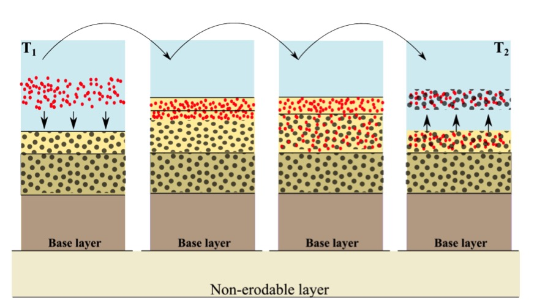

   Visualization of the diffusion that occurs when XBeach
   calculates sediment compositions. After sedimentation of fine sediment
   on top of coarser material it is uniformly mixed over the whole layer.
   Subsequent erosion erodes both the fines as the coarser material. To
   avoid this phenomenon, layers should not be too thick (:cite:`VanDerZwaag2014`).

.. _sec-ship-induced-wave-motions:

Ship-induced wave motions
-------------------------

.. seealso:: Ship-induced wave motions are implemented
             in `mod:ship_module`.
             
A relatively new application field for XBeach is the generation and
propagation of waves induced by sailing vessels. This functionality has
been implemented recently :cite:`Zhou2013`, and has currently been used in
several studies (e.g. :cite:`Zhou2014`, :cite:`DeJong2013`), showing
very good results.

For computing ship-induced waves the non-hydrostatic version of XBeach
is used. A moving ship is represented as a pressure head that moves
along a pre-defined track through the model domain. The ship is defined
on a separate grid, where the ship draft is specified per grid point.
Each computational time step the ship draft is interpolated from the
ship grid to the global grid, where the ship volume is kept constant.
Then the water pressure head in each global grid cell is updated based
on the interpolated ship draft. By moving the pressure fields, the waves
are generated and will propagate further through the global domain.

In :numref:`fig-ship-example` an example XBeach setup for ship waves is shown. The ship
track is user defined and can, for instance, be obtained from the
Automatic Identification System (AIS) for marine traffic. In this
example, the model results were compared with measurements taken at
Bath, The Netherlands. A filtered time series of the measured and
computed water level is shown in :numref:`fig-ship-waves-example`. The time series was
filtered to focus on the computation of the primary ship wave.

.. _fig-ship-example:

   .. image:: images/image20.jpg
      :width: 200px
              
   .. image:: images/image21.jpg
      :width: 200px

   Example XBeach setup (left) and result (right) for a ship
   wave simulation in the Scheldt Estuary (The Netherlands). The ship track
   (red dashed line) is user-defined, and the measurement location is
   indicated (magenta dot).

.. _fig-ship-waves-example:

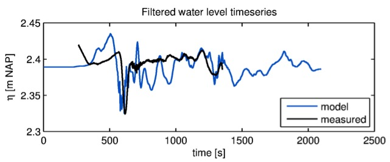

   Example XBeach result for ship-induced waves. Measurements
   are taken at Bath, in the Scheldt Estuary, The Netherlands (:cite:`Schroevers2011`).

In addition to the propagation of ship-induced waves, XBeach computes
the forces and moments acting on the ship body. With this functionality,
passing ship effects can be analyzed (e.g. :cite:`Zhou2013`).

Gravel (XBeach-G)
-------------------------
XBeach-G was a branch of the main XBeach development that has been developed to simulate storm impacts on gravel beaches. The development of XBeach-G have been taking place as a joint collaboration between Plymouth University and Deltares, as part of the EPSRC-funded NUPSIG-project. The relevant XBeach-G formulations have been merged back into to the XBeach trunk for the XBeachX release (fall 2017). XBeach-G formulations can be activated with the keyword :par:`useXBeachGSettings` = *1*). 

XBeach-G uses the one-layer, depth-averaged, non-hydrostatic extension to the XBeach model (nonh=1), which is similar to the SWASH model (:cite:`Zijlema2011a`) to solve wave-by-wave flow and surface elevation variations due to short waves in intermediate and shallow water depths. This is particularly important for application on gravel beaches, where due to steep slopes swash motion is mainly at incident wave frequencies, and infragravity wave motion, which dominates the inner surf and swash zone on sandy beaches during storms, is of secondary importance. To correctly account for upper swash infiltration losses and exfiltration effects on lower swash hydrodynamics on gravel beaches, XBeach-G computes groundwater dynamics and the exchange between groundwater and surface water using the XBeach groundwater model (:par:`gwflow` = *1*). Again, interaction between swash flows and the beach groundwater table are considered particularly important on gravel beaches due to the relatively large hydraulic conductivity of the sediment, while on sandy beaches this process is of significantly less importance. Finally, gravel sediment transport processes (McCall & Van Rijn) have been included in XBeach-G to simulate the morphodynamics of gravel beaches during storms. These transport processes are currently under further development and validation.

For more information on XBeach-G, download the PhD thesis of McCall (2015) on URL: *http://hdl.handle.net/10026.1/3929*.

Boundary conditions
===================

.. _sec-waves:

Waves
-----

.. seealso:: Wave boundary conditions are implemented in `mod:waveparams`. The
             latest functionalities, like spatially varying spectral conditions
             are implemented in `mod:spectral_wave_bc_module`.

XBeach allows users to include two different options for wave boundary
conditions in the model. These wave boundary conditions can be applied
only at the seaward boundary (keyword: :par:`wbctype`). First of all, in
:ref:`sec-spectral-conditions` the method to specify wave spectra is discussed. Secondly, in
:ref:`sec-non-spectral-conditions` the method to apply non-spectra, such as stationary wave
conditions or time-series is elaborated. In :ref:`sec-lateral-boundary-conditions` the lateral boundary
conditions for waves are discussed. There is currently not a possibility
to force waves on the landward boundary of a model.

.. _sec-spectral-conditions:

Spectral conditions
~~~~~~~~~~~~~~~~~~~

The most-used wave boundary condition in XBeach is a spectral type. The
input description of spectral wave boundary conditions can be found in
:ref:`sec-spectral-wbc`. XBeach allows the user to define these with three possibilities:

#. : With this option you define the boundary condition as parametric
   spectral input. The parameters (i.e. the spectral shape, the wave
   period and the directional spreading) can be specified. The option is
   especially handy when there is no nested model or measured spectrum.
   Here are two options:

   #. Specify a single parametric spectrum (keyword :par:`wbctype` = *jons*).

   #. Specify a series of parametric spectra (keyword :par:`wbctype` =
      jons\_table).

#. : In this case the two-dimensional (frequency-direction) output by
   the spectral wave model SWAN (.sp2 files) can be specified. (keyword
   :par:`wbctype` = *swan*). This option is especially convenient when nesting
   XBeach into a SWAN model.

#. : In this case a more general type spectrum can be specified.
   (keyword :par:`wbctype` = *vardens*). This option is often used when a
   measured spectrum is available.

.. _sec-non-spectral-conditions:

Non-spectral conditions
~~~~~~~~~~~~~~~~~~~~~~~

XBeach also allows the user to define non-spectral wave boundary
conditions. This is a variation of both wave conditions without wave
groups and time series. The input description of non-spectral wave
boundary conditions can be found in :ref:`sec-non-spectral-wbc`. XBeach allows the user to
define these with two possibilities:

#. This means that a uniform and constant wave energy is specified,
   based on the given values of :math:`{H}_{rms}`,
   :math:`{T}_{m01}`, direction and power of the directional
   distribution function. The station boundary condition will contain
   wave groups. Here there are two options:

   #. Specify a single sea state (keyword :par:`wbctype` = *stat*)

   #. Specify a series of sea states (keyword :par:`wbctype` = *stat\_table*)

#. . The user can also specify the variation in time of the wave energy.
   There are three options:

   #. First-order time series of waves (keyword :par:`wbctype` = *ts\_1*).
      XBeach will calculate the bound long wave based on the theory of
      :cite:`LonguetHiggins1964`).

   #. Second-order time series of waves (keyword :par:`wbctype` = *ts\_2*). The
      bound long wave is specified by the user via a long wave
      elevation.

   #. It is also possible to specify a variation in time of the
      horizontal velocity, vertical velocity and the free surface
      elevation (keyword: :par:`wbctype` = *ts\_nonh*). Last two terms are
      optional in this boundary conditions type.

Special conditions
~~~~~~~~~~~~~~~~~~

Besides clear spectral or non-spectral wave boundary conditions, there
are also three special boundary condition types implemented in XBeach.

#. (keyword :par:`wbctype` = *bichrom*). In this case, XBeach will be forced
   with regular wave groups as the two short-wave components force one
   difference (infragravity) wave period. The user needs to specify not
   only variables of the stationary situation but also a wave period for
   the long wave. This wave period will be used to calculate the long
   wave based on the theory of :cite:`LonguetHiggins1964`. The
   bichromatic boundary condition is the most simplified form of a wave
   spectrum.

#. (keyword :par:`wbctype` = *off*). This is a simple no wave action boundary
   condition. It still allows for a tidal record to be specified,
   however this trough the zs0file parameter.

#. (keyword: :par:`wbctype` = *reuse*). If the user does not wish to
   recalculate boundary condition files or specifically wants to reuse
   the boundary condition files of another XBeach simulation should be
   used. No further wave boundary condition data need be given.
   Obviously, the calculation grid should remain the same between runs,
   as the angles and number of grid points are embedded in the boundary
   condition files.

.. _sec-lateral-boundary-conditions:

Lateral boundary conditions
~~~~~~~~~~~~~~~~~~~~~~~~~~~

There are two options to set the lateral boundaries for the wave model:

#. Neumann boundaries (keyword: :par:`lateralwave` = *neumann*): here the
   longshore gradient is set to zero.

#. Wave crest boundaries (keyword: :par:`lateralwave` = *wavecrest*). here the
   gradient in the wave energy along the wave crest is set to zero.

For the stationary wave mode (keyword: :par:`wavemodel` = *stationary*) this is
the only option. It allows a correct representation of the wave
propagation near the lateral boundaries, without the usual shadow zones
in e.g. SWAN. By neglecting the longshore gradients, the model
automatically computes a consistent 1D solution.

For the surfbeat mode (keyword: :par:`wavemodel` = *surfbeat*), Neumann leads
to shadow zones, not so much in the wave height, but in the groupiness;
the 'blobs' propagating in the mean wave direction turn into elongated,
longshore uniform patches. To reduce this effect, the gradient along the
wave crests of the wave energy can be set to zero, instead of the
longshore gradient (keyword: :par:`lateralwave` = *wavecrest*). This way the
crests of the wave groups have approximately the right orientation,
though the along-crest groupiness also disappears. In the :par:`wavecrest`
case, the wave refraction may be overestimated leading to somewhat too
large longshore currents. The effects of both boundary conditions are
shown in :numref:`fig-wave-boundary-conditions`.

.. _fig-wave-boundary-conditions:

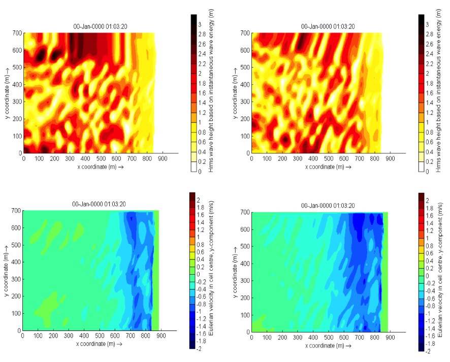

   Effect of the lateral wave boundary conditions on root-mean
   square wave height patterns (top) and longshore velocity (bottom) for
   the Delilah test case. In this figure the left panels are used for
   simulations with Neumann boundaries and the right panel with the
   wavecrest boundary.

.. _sec-shallow-water-equations:   
   
Shallow water equations
-----------------------

Offshore boundary
~~~~~~~~~~~~~~~~~

Typically, an offshore or lateral boundary is an artificial boundary
which has no physical meaning. On the offshore boundary wave and flow
conditions are imposed. In the domain waves and currents will be
generated which need to pass through the offshore boundary to the deep
sea with minimal reflection. One way to do this is to impose a weakly
reflective-type boundary condition (absorbing-generating), but there are
also other possibilities implemented in XBeach (keyword: :par:`front`). This
method can be applied in 1D or 2D, is recommended and therefore the
default value for XBeach.

In XBeach, there are two options with regard to the offshore
absorbing-generating boundary condition. With the parameter setting
:par:`front` = *abs1d* a simple one-dimensional absorbing-generating boundary
condition is activated. This option allows for a time-varying water
level (surge and/or infragravity waves) to be specified at the boundary
while allowing any waves propagating perpendicularly towards the
boundary to be absorbed (i.e., passed through the boundary with a
minimum of reflection. It is therefore only useful for 1D (flume like)
simulations.

With option :par:`front` = *abs2d* (default value) the formulation by :cite:`VanDongeren1997` is activated which in turn is based on
:cite:`Verboom1981` and is based on the ‘Method of Characteristics’.
This boundary condition allows for obliquely-incident and
obliquely-reflected waves to pass through the boundary. It is possible
to account for situations with boundary-perpendicular and
boundary-parallel currents. In order to differentiate between the
particle velocities, the keyword :par:`epsi` must be set. This parameter
control a simple Kalman-update filter which controls which part of the
particle velocity is assumed to be part of the current and which part is
wave-related. By default XBeach computes the value for epsi
automatically using offshore boundary conditions (keyword: :par:`epsi` = *-1*).

There are three other possibilities implemented besides the
absorbing-generating boundary conditions:

#. No flux wall (keyword: :par:`front` = *wall*). This boundary condition type
   is a simple no flux boundary condition.

#. Water level specification (keyword: :par:`front` = *wlevel*). This boundary
   sets the water level at a prescribed value. This can be constant or
   time-varying. With this option the outgoing long waves are not
   absorbed.

#. Boundary condition for the non-hydrostatic option (keyword: :par:`: front` =
   nonh\_1d). This boundary condition is required for non-hydrostatic simulations.

#. Radiation boundary condition (keyword: :par:`front` = *waveflume*). This
   boundary uses a continuity relation at the front boundary. This means
   that no net water can come into the model domain. The wave flume
   boundary condition is especially useful in lab experiments with a
   large set-up (e.g. coral reefs).

Lateral boundaries
~~~~~~~~~~~~~~~~~~

Lateral boundaries are the boundaries perpendicular to the coastline.
Usually these are artificial, because the model domain is limited but
the physical coast will continue. At these boundaries (keywords: :par:`left`
& :par:`right`) we need to prescribe information about the area beyond the
numerical model domain in such a way that the boundary condition does
not influence the results in an adverse way. One way to do this is to
prescribe a so-called 'no-gradient' or Neumann boundaries (XBeach
default), which state that there is locally no change in surface
elevation and velocity, but there are also other possibilities
implemented into XBeach. This method is recommended and is therefore the
default value for XBeach. Each lateral boundary is a separate condition,
so it is possible to mix different type of lateral boundary per side.

Neumann boundary conditions are activated where the longshore water
level gradient is prescribed. The alongshore gradient is prescribed by
the difference in specified water levels at the offshore corner points,
divided by the alongshore length of the domain. This type of Neumann
boundary condition has been shown to work quite well with (quasi-)
stationary situations, where the coast can be assumed to be uniform
alongshore outside the model domain. So far we have found that also in
case of obliquely incident wave groups this kind of boundary conditions
appears to give reasonable results when a shadow zone is taken into
account. This means that regions where the boundary conditions are not
fully enforced the results are not taken into account. Neumann
boundaries can be individually defined (keyword: :par:`left` = *neumann*).

There are three other possibilities implemented besides the
absorbing-generating boundary conditions:

#. Simple no-flux boundary conditions can also be applied (keyword:
   :par:`left` = *wall*). Wall boundary conditions will result in a zero
   velocity at the lateral boundary.

#. Velocity at the boundary will be calculated from NLSWE, but only
   include the advective terms (keywords: :par:`left` = *no\_advec*). The
   effect is that only terms that decrease the velocity will be taken
   into account. The result is an intermediate form between a full
   Neumann boundary and a wall boundary.

#. Velocity at the boundary will simply be copied from the adjacent cell
   in the model domain (keyword: :par:`left` = *neumann\_v*).

Tide and surge
~~~~~~~~~~~~~~

XBeach can take in up to four time-vary tidal signals to be applied to
the four boundaries (offshore-right, offshore-left, backshore-left,
backshore-right). A time-varying water level signal is read into XBeach
by reading the specified file in zs0file. The input signal will be
interpolated to the local time step of the simulation; therefore the
signals only need to be long enough and temporally-fine enough to
resolve the water level phenomenon of interest (i.e. tide variations,
surge event).

There are now four options for handling the tidal and/or surge
contribution to the boundaries:

#. Uniform water level (keyword: :par:`tideloc` = *0*)

#. One time-varying water level signal (keyword: :par:`tideloc` = *1*)

#. Two time-varying water level signals, which requires point of
   application indication. (keyword: :par:`tideloc` = *2*)

#. Four time-varying water level signals (keyword: :par:`tideloc` = *4*)

For the option with a uniform water level the value specified in the
*params.txt* is applied in the complete model domain (keyword: :par:`zs0`). For
the option with one time-varying water level signal the specified water
level is applied (keyword: :par:`zs0file` = *<name\_of\_your\_time\_series\_file>*) to
the offshore boundary and a fixed value is applied at the backshore
boundary (keyword: :par:`zs0`). For the option with two time-varying
water level signals two water level signals are read from the zs0file.
Note: one tidal record is applied to both sea corners and one tidal
record to both land corners. This means there is no alongshore
variation. An alongshore variation can be applied when applying four
time-varying water level signals.

River and point discharge
~~~~~~~~~~~~~~~~~~~~~~~~~

The effect of a river outflow or other discharges can be simulated with
XBeach. Multiple discharge locations can be designated. At a discharge
location the discharge orifice is defined as well as the discharge time
series in :math:`{\rm m}^{3}/{\rm s}`. The discharge orifice always constitutes
an uninterrupted series of full grid abreast cell borders. It is not
possible to define a discharge over half a grid cell nor is it possible
to define a single discharge through grid cell borders that are either
not adjacent or are not abreast.

At each time step the model sets the discharge and velocities at the
grid cell borders that constitute the discharge orifice, which can be
computed given the size of the discharge orifice and discharge time
series. The discharge is positive in positive x or y direction. An
exception is made when discharges are defined at the domain border. In
that case the discharge is positive towards the domain (influx).

When a discharge is defined with a zero size orifice the discharge is
assumed to be in vertical direction where a positive discharge is into
the domain (influx). In these cases the discharge is linked to the
closest grid cell center and at each time step mass according to the
discharge time series is added. No momentum is added in case of a
vertical discharge.

Sediment transport
------------------

The boundary conditions for sediment transport are Neumann boundaries
everywhere, implying that the cross-boundary gradients in the
advection-diffusion equation are set to zero, as well as the gradients
of the bed load transports in that direction. Cross-shore profile
changes due to cross-shore transport gradients are possible, allowing
the boundary to smoothly follow the rest of the model. Still, it is good
modeling practice to have the boundaries away from the area of interest.

Input description
=================

.. _sec-input-general:

General
-------

Upon running the XBeach executable *xbeach.exe*, the file *params.txt*
in the current working directory will be read. The *params.txt* file
contains grid and bathymetry info, wave input, flow input, morphological
input, etc. in the form of keyword/value pairs. Each keyword/value pair
may contain an actual model parameter or refer to another file with
additional information on the model setup. If a *params.txt* file cannot
be found then XBeach will not run.

In the *params.txt* file there can be a single keyword/value pair per
line. The keywords can be specified in any order. A keyword/value pair
is separated by an equal sign (=). Each line containing an equal sign is
interpreted as a keyword/value pair. Reversely, any lines without an
equal sign are ignored and may be used for comments. Only a few keywords
are required for the model to run, others have default values that are
used in case the keyword is not mentioned in the *params.txt* file. The
essential parameters for a simulation with a JONSWAP spectrum are listed
below:

#. A . This can both in XBeach format (separate x and y files; keyword:
   :par:`xfile` and :par:`yfile`) or Delft3D (one single xy file; keyword:
   :par:`xyfile`). On top of that the user needs to specify the width of each
   domain (keyword: :par:`nx` and :par:`ny`)

#. A file (keyword: :par:`depfile`) that matches with the grid you specified
   at 1)

#. A (keyword: :par:`tstop`) in seconds

#. A for short waves and rollers. The grid is determined by a minimum
   and maximum angle and width per bin (keywords: :par:`thetamin`, :par:`thetamax`
   and :par:`dtheta`).

#. A (keyword: :par:`wbctype` = *jons*). With a separate file containing the
   variables of the parametric (keyword: :par:`bcfile`).

It is strongly recommended to specify as few parameters explicitly as
possible and rely on the defaults for the other parameters. When running
XBeach, a file called xbeach.log is created, which lists all the
parameters set through the *params.txt* file but also all parameters not set,
for which the defaults are used. When the user starts the model, it
generates a file named XBlog.txt. In this file all the different keyword
available are determined. When no keyword is defined the default value
will be applied.

This chapter describes the possibilities of the *params.txt* file and
any auxiliary information files that are called from the *params.txt*
file. The tables in this chapter contain a description of the keywords,
the default values, its units and recommended value ranges, while the
formats for additional input files are described in the relevant
sections. Keyword marked with an astrix (\*) are essential for XBeach to
run. Keywords marked with a plus (+) are considered advanced expert
options and should not be used for regular applications of XBeach.

In this chapter, any references to keywords refer to keywords that can
be used in the *params.txt* file. Also any references to time
indications are in seconds unless stated otherwise. A typical
*params.txt* file for a 1D XBeach model is:

**params.txt**

.. code-block:: text
               
   %%%%%%%%%%%%%%%%%%%%%%%%%%%%%%%%%%%%%%%%%%%%%%%%%%%%%%%%%%%%%%%%%%%%%%%%%%%
   %%% XBeach parameter settings input file                                %%%
   %%%                                                                     %%%
   %%% date: 01-Jan-2015 12:00                                             %%%
   %%% function: xb_write_params                                           %%%
   %%%%%%%%%%%%%%%%%%%%%%%%%%%%%%%%%%%%%%%%%%%%%%%%%%%%%%%%%%%%%%%%%%%%%%%%%%%

   %%% Grid parameters %%%%%%%%%%%%%%%%%%%%%%%%%%%%%%%%%%%%%%%%%%%%%%%%%%%%%%%
   
   depfile = bed.dep
   posdwn = 0
   nx = 265
   ny = 0
   alfa = 0
   vardx = 1
   xfile = x.grd
   yfile = y.grd
   thetamin = -90
   thetamax = 90
   dtheta = 15
   thetanaut = 0
   
   %%% Model time %%%%%%%%%%%%%%%%%%%%%%%%%%%%%%%%%%%%%%%%%%%%%%%%%%%%%%%%%%%%
   
   tstop = 3600
   
   %%% Physical constants %%%%%%%%%%%%%%%%%%%%%%%%%%%%%%%%%%%%%%%%%%%%%%%%%%%%
   
   rho = 1025
   
   %%% Tide boundary conditions %%%%%%%%%%%%%%%%%%%%%%%%%%%%%%%%%%%%%%%%%%%%%%
   
   tideloc = 2
   zs0file = tide.txt
   
   %%% Wave boundary condition parameters %%%%%%%%%%%%%%%%%%%%%%%%%%%%%%%%%%%%
   
   wbctype = jons
   bcfile = filelist.txt
   
   %%% Output variables %%%%%%%%%%%%%%%%%%%%%%%%%%%%%%%%%%%%%%%%%%%%%%%%%%%%%%
   
   outputformat = netcdf
   tint = 3600
   tstart = 0
   nglobalvar = 3
   zb
   zs
   H

Physical processes
------------------

XBeach supports a variety of physical processes from generic, like waves
and flow, to very specific, like ship motions and point discharge. Each
process can be switched on or off. The commonly used processes are
turned on by default. The table below lists the keywords used to switch
on or off physical processes in XBeach.

.. include:: tables/partable_physical_processes.tab

.. _sec-grid-bathymetry:

Grid and bathymetry
-------------------

XBeach spatial grid size is defined by the keywords :par:`nx` and :par:`ny`. Here
nx are the number of grid points in the cross-shore direction and ny the
number in the alongshore direction. The size of the computational grid
will be :par:`nx` +1 by :par:`ny` +1 cells large. The initial bathymetry is provided
using a separate file that is referred to by the :par:`depfile` keyword,
which has to have a size of [nx+1, ny+1]. This file contains an initial
bed level for each grid cell where each line corresponds to a transect
in x-direction (cross-shore). The values are positive down by default
(so e.g. a value of '10' is 10 meters depth), but this can be changed
using the :par:`posdwn` keyword.

Three main types of XBeach grids are supported: fast 1D, 1D and 2DH.
Fast 1D grids have a single alongshore grid cell and thus a value :par:`ny` = *0*
and thus a single row (ny+1=1) in the :par:`depfile`. The 1D grids have 3
alongshore grid cells and thus a value :par:`ny` = *2* and three rows in the
:par:`depfile`. The 2DH grids have more than 3 alongshore grid cells, a value
:par:`ny` >\ 2 and as many rows in the :par:`depfile`. In general, the
bathymetry file has the following space-separated format:

**bed.dep**

.. code-block:: text
                
   <z 1,1> <z 2,1> <z 3,1> ... <z nx,1> <z nx+1,1>
   <z 1,2> <z 2,2> <z 3,2> ... <z nx,2> <z nx+1,2>
   <z 1,3> <z 2,3> <z 3,3> ... <z nx,3> <z nx+1,3>
   
   ...
   
   <z 1,ny> <z 2,ny> <z 3,ny> ... <z nx,ny> <z nx+1,ny>
   <z 1,ny+1> <z 2,ny+1> <z 3,ny+1> ... <z nx,ny+1> <z nx+1,ny+1>

XBeach spatial grids can be equidistant or non-equidistant. In the
former case the grid size is defined by the keywords :par:`dx` and
:par:`dy`. In the latter case the keyword :par:`vardx` should be set
to 1 and x- and y-coordinates of the grid cells should be provided
through the files referenced by the :par:`xfile` and :par:`yfile`
keywords. These files take exactly the same format as the
:par:`depfile` file where all coordinates along the x-direction are in
one row and each row represents a cell in y-direction. XBeach grids
are defined in a coordinate system of choice and can be either
rectangular or curvilinear grids as discussed in
:ref:`sec-domain-definitions`.

Delft3D grids created with tools like RFGRID are also supported. To
use Delft3D grids, choose :par:`gridform` = *delft3d* and provide a
grid file via the keyword :par:`xyfile`. The format of Delft3D grids
is not described here, but can be found in the Delft3D manual
(:cite:`Usermanual2011`). Also forced updating of bathymetries is
supported as described in :ref:`sec-bed-update`.

Apart for the spatial grid, XBeach also uses a directional grid for
short waves and rollers. The grid is determined by a minimum and
maximum angle and a directional bin size using the keywords
:par:`thetamin`, :par:`thetamax` and :par:`dtheta` respectively. The
:par:`thetamin` and :par:`thetamax` angles are either defined
according to the Cartesian convention (angle w.r.t. the computational
x-axis) or according to the nautical convention (angle w.r.t. deg. N,
so from W is 270 deg. N). The convention is chosen using the keyword
:par:`thetanaut` (:par:`thetanaut` = *0* for Cartesian and
:par:`thetanaut` = *1* for Nautical)

Examples of typical input for a non-equidistant, fast 1D XBeach model,
together with the *params.txt* example at the start of this chapter,
are:

**depfile = bed.dep**

.. code-block:: text
                
   -20.00 -20.00 -19.90 -19.80 -19.70 ... 14 14 15 15 15

**xfile = x.grd**

.. code-block:: text
                
   0.00 10.00 20.00 30.00 40.00 ... 1992.00 1994.00 1996.00 1998.00 2000.00

**yfile = y.grd**

.. code-block:: text
                
   0.00 0.00 0.00 0.00 0.00 0.00 0.00 ... 0.00 0.00 0.00 0.00 0.00 0.00 0.00

All keywords related to grid and bathymetry input are listed in the
following table:

.. include:: tables/partable_grid_parameters.tab

Waves input
-----------

An XBeach model is generally forced by waves on its offshore boundary.
These waves are described by the wave boundary conditions discussed in
this section. The details of the wave motions within the model are
described by the wave numerics in terms of the wave action balance
(see :ref:`sec-short-wave-action-balance`), wave dissipation model
(see 0) and wave roller model (see :ref:`sec-roller-energy-balance`)

XBeach supports a variety of wave boundary condition types that are
divided in two main groups: stationary and spectral boundary
conditions.  The :par:`wbctype` keyword can be used to select one
particular type of wave boundary conditions. :ref:`sec-waves` gives an
overview of all types of wave boundary conditions available for
XBeach. :numref:`fig-wbc-decision-tree` can be used to help determine
what type of wave boundary conditions is appropriate for your
case. Each wave boundary condition type is explained in the following
subsections. Note that most spectral wave boundary conditions can vary
both in space and time using a *FILELIST* and/or *LOCLIST*
construction as described in :ref:`sec-spatiotemporal-varying-wbc`.

.. include:: tables/partable_wave_boundary_condition_parameters.tab

.. _fig-wbc-decision-tree:

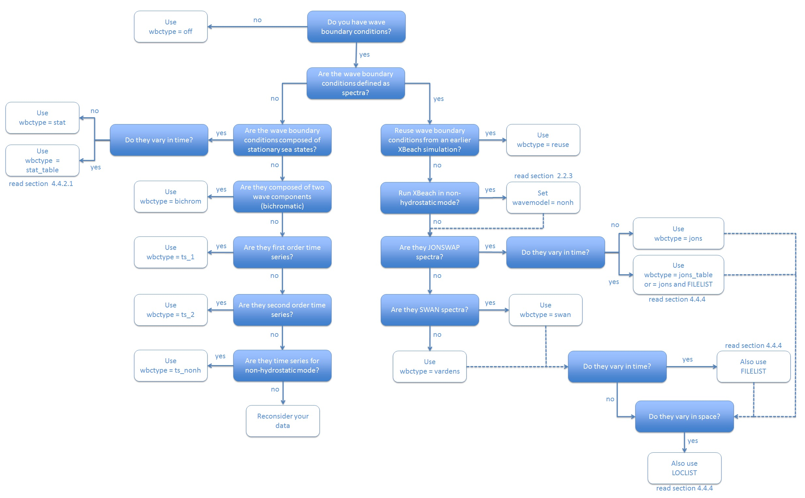

   Decision tree for selecting the appropriate type of wave boundary conditions

.. _sec-spectral-wbc:

Spectral wave boundary conditions
~~~~~~~~~~~~~~~~~~~~~~~~~~~~~~~~~

Spectral wave boundary conditions are enabled using :par:`wbctype`
values *jons*, *swan*, *vardens* or *jons\_table*. The conditions are
defined in separate files referenced from the *params.txt* file using
the :par:`bcfile` keyword. A spectral wave boundary condition
describes a spectrum *shape* that XBeach uses to generate a (random)
wave time series. The length and resolution of the generated time
series is determined by the keywords :par:`rt` and :par:`dtbc`
respectively. XBeach will reuse the generated time series until the
simulation is completed. The resolution of the time series should be
enough to accurately represent the bound long wave, but need not be as
small as the time step used in XBeach.

An overview of all keywords relevant for spectral wave boundary
conditions is given in the table below. The necessary file formats for
each type of spectral wave boundary condition is explained in the
following subsections.

.. include:: tables/partable_wave_spectrum_boundary_condition_parameters.tab

JONSWAP wave spectra
^^^^^^^^^^^^^^^^^^^^

JONSWAP spectrum input is enabled using :par:`wbctype` = *jons*. A
JONSWAP wave spectrum is parametrically defined in a file that is
referenced using the :par:`bcfile` keyword. This file contains a
single parameter per line in arbitrary order. The parameters that can
be defined are listed in :numref:`partable-jonswap`. All variables are
optional. If no value is given, the default value as specified in the
table is used. It is advised not to specify the keyword :par:`dfj` and
allow XBeach to calculate the default value.

A typical JONSWAP definition file looks as follows:

**jonswap.txt**

.. code-block:: text
                
   Hm0 = 0.8
   Tp = 8
   mainang = 285.
   gammajsp = 3.3
   s = 10.
   fnyq = 0.3

For the definitions see the table below.

It is possible to use an alternative file format for time-varying
JONSWAP spectra. To enable this option use the :par:`wbctype` value
*jons\_table*. In this case, each line in the spectrum definition file
contains a parametric definition of a spectrum, like in a regular
JONSWAP definition file, plus the duration for which that spectrum is
used during the simulation. XBeach does not reuse time-varying spectrum
files. Therefore the total duration of all spectra should at least match
the duration of the simulation. The name of the file can be chosen
freely, but the file format is fixed as follows and all parameters
should be present in all lines:

**jonswap.txt**

.. code-block:: text
                
   <Hm0> <Tp> <mainang> <gammajsp> <s> <duration> <dtbc>

Note that we refer to the keywords used in a regular JONSWAP
definition file in this example, with three differences: 1) the peak
period rather than the peak frequency is defined 2) the duration is
added (similar to :par:`rt` in *params.txt*) 3) the time resolution is
added (similar to :par:`dtbc` in *params.txt*). The duration and
boundary condition time step in this file overrules :par:`rt` and
:par:`dtbc` in *params.txt*. This format is also used for time-varying
stationary wave boundary conditions as described in
:ref:`sec-spatiotemporal-varying-wbc`. As an example, the JONSWAP
spectrum definition file presented above would look as follows if the
significant wave height should be increased with 0.2 m every hour:

**jonswap.txt**

.. code-block:: text
                
   0.8 8. 285. 3.3 10. 3600. 1
   1.0 8. 285. 3.3 10. 3600. 1
   1.2 8. 285. 3.3 10. 3600. 1

A more generic way of providing time-varying spectral wave boundary
conditions is using a FILELIST construction as described in
:ref:`sec-spatiotemporal-varying-wbc`. This approach is compatible
with all spectral wave boundary condition types as well as spatially
varying boundary conditions as described in the same section.

The parameter s in the JONSWAP spectrum definition is related to the
directional spreading (in deg.) through the following relation
:math:`\sigma =\sqrt{\frac{2}{s+1} } \, s=\frac{2}{\sigma ^{2} } -1`.
Here :math:`\sigma` is the directional spreading in radians and s the
JONSWAP spreading parameter.

.. _wave_spreading:

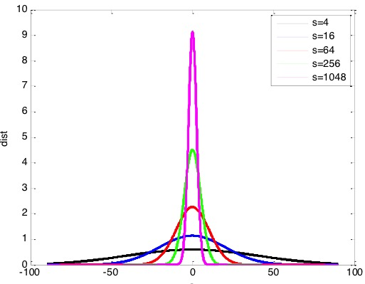

   Effect a variation in s for the direction spreading of wave energy

.. _partable-jonswap:
   
.. partable:: Overview of available keywords in JONSWAP definition file

   Hm0
     :description: Hm0 of the wave spectrum, significant wave height [m]
     :range:       0.0 - 5.0
     :default:     0.0
   fp
     :description: Peak frequency of the wave spectrum [s-1]
     :range:       0.06258 - 0.4
     :default:     0.08
   gammajsp
     :description: Peak enhancement factor in the JONSWAP expression [-]
     :range:       1.0 - 5.0
     :default:     3.3
   s
     :description: Directional spreading coefficient, :math:`{\cos}^{2s}` law [-]
     :range:       1.0 - 1000.0
     :default:     10.0
   mainang
     :description: Main wave angle (nautical convention) [:math:`{}^\circ`]
     :range:       180.0 - 360.0
     :default:     270.0
   fnyq
     :description: Highest frequency used to create JONSWAP spectrum [s-1]
     :range:       0.2 - 1.0
     :default:     0.3
   dfj
     :description: Step size frequency used to create JONSWAP spectrum [s-1]
     :range:       fnyq/1000 - fnyq/20
     :default:     fnyq/200

SWAN wave spectra
^^^^^^^^^^^^^^^^^

XBeach can read standard SWAN 2D variance density or energy density
output files (+.sp2 files) as specified in the SWAN v40.51 manual. This
option is enabled using :par:`wbctype` = *swan* in *params.txt* and a
reference to the spectrum file via the keyword :par:`bcfile`. XBeach assumes
the directional information in the SWAN file is according to the
nautical convention. If the file uses the Cartesian convention for
directions, the user must specify the angle in degrees to rotate the
x-axis in SWAN to the x-axis in XBeach (by the Cartesian convention).
This value is specified in *params.txt* using the keyword :par:`dthetaS_XB`.

Note that time-varying and spatially varying SWAN spectra can be
provided using the FILELIST and LOCLIST constructions as described in
:ref:`sec-spatiotemporal-varying-wbc`.

An example of a 2D SWAN spectrum is given below:

**swan.txt**

.. code-block:: text
                
   SWAN 1 Swan standard spectral file
   $ Data produced by SWAN version 40.51
   $ Project:’projname’ ; run number:’runnum’
   LOCATIONS locations in x-y-space
   1 number of locations
   22222.22 0.00
   RFREQ relative frequencies in Hz
   23 number of frequencies
   0.0545
   0.0622
   0.0710
   0.0810
   0.0924
   0.1055
   0.1204
   0.1375
   0.1569
   0.1791
   0.2045
   0.2334
   0.2664
   0.3040
   0.3470
   0.3961
   0.4522
   0.5161
   0.5891
   0.6724
   0.7675
   0.8761
   1.0000
   CDIR spectral Cartesian directions in degr 12 number of directions
   30.0000
   60.0000
   90.0000
   120.0000
   150.0000
   180.0000
   210.0000
   240.0000
   270.0000
   300.0000
   330.0000
   360.0000
   QUANT 1 number of quantities in table VaDens variance densities in m2/Hz/degr m2/Hz/degr unit
   -0.9900E+02 exception value
   FACTOR
   0.675611E-06
   51 242 574 956 1288 1482 1481 1286 957 579 244 51
   129 610 1443 2402 3238 3725 3724 3234 2406 1454 613 128
   273 1287 3054 5084 6846 7872 7869 6837 5091 3076 1295 271
   665 3152 7463 12402 16712 19229 19221 16690 12419 7518 3172 662
   1302 6159 14608 24275 32688 37618 37603 32644 24309 14716 6198 1296
   2328 10989 26020 43341 58358 67109 67080 58281 43401 26213 11058 2317
   3365 15922 37712 62733 84492 97150 97110 84380 62820 37991 16021 3349
   3426 16230 38440 63939 86109 99010 98969 85995 64027 38724 16331 3410
   2027 9612 22730 37790 50909 58529 58505 50841 37843 22898 9672 2018
   672 3178 7538 12535 16892 19440 19432 16870 12552 7594 3198 669
   101 479 1135 1890 2542 2924 2923 2539 1892 1144 482 101
   2 11 26 43 57 66 66 57 43 26 11 2
   0 0 0 0 0 0 0 0 0 0 0 0
   0 0 0 0 0 0 0 0 0 0 0 0
   0 0 0 0 0 0 0 0 0 0 0 0
   0 0 0 0 0 0 0 0 0 0 0 0
   0 0 0 0 0 0 0 0 0 0 0 0
   0 0 0 0 0 0 0 0 0 0 0 0
   0 0 0 0 0 0 0 0 0 0 0 0
   0 0 0 0 0 0 0 0 0 0 0 0
   0 0 0 0 0 0 0 0 0 0 0 0
   0 0 0 0 0 0 0 0 0 0 0 0
   0 0 0 0 0 0 0 0 0 0 0 0
   0 0 0 0 0 0 0 0 0 0 0 0

Variance density spectra
^^^^^^^^^^^^^^^^^^^^^^^^^

2D spectral information that is not in SWAN format can be provided using
a formatted variance density spectrum file and :par:`wbctype` = *vardens*. The
spectrum file itself is again referenced using the keyword :par:`bcfile`. The
contents of the file must adhere to a specific format:

**vardens.txt**

.. code-block:: text
                
   <number of frequencies (n)>
   <frequency 1>
   <frequency 2>
   <frequency 3>

   ...

   <frequency n-1>
   <frequency n>
   <number of directions (m)>
   <directions 1>
   <directions 2>
   <directions 3>

   ...

   <directions m-1>
   <directions m>
   <variance density 1,1> <variance density 2,1> ... <variance density m,1>
   <variance density 1,2> <variance density 2,2> ... <variance density m,2>
   
   ...
   
   <variance density 1,n> <variance density 2,n> ... <variance density m,n>

Note that the directions must be defined according to the Cartesian
convention and in the coordinate system used by XBeach. In this
coordinate system :math:`{0}^\circ` corresponds to waves travelling in
the direction of the x-axis, while :math:`{90}^\circ` corresponds to
the direction of the y-axis. Also, the directions must be defined in
increasing order. Time-varying and spatially varying variance density
spectra can be provided using the FILELIST and LOCLIST constructions as
described in :ref:`sec-spatiotemporal-varying-wbc`.

An example of a formatted variance density file is given below:

**vardens.txt**

.. code-block:: text
                
   15
   0.0418
   0.0477
   0.0545
   0.0622
   0.0710
   0.0810
   0.0924
   0.1055
   0.1204
   0.1375
   0.1569
   0.1791
   0.2045
   0.2334
   0.2664
   13
   -180.0000
   -150.0000
   -120.0000
   -90.0000
   -60.0000
   -30.0000
   0.0000
   30.0000
   60.0000
   90.0000
   120.0000
   150.0000
   180.0000
   0 0 0 0 0 0 0 0 0 0 0 0
   51 242 574 956 1288 1482 1481 1286 957 579 244 51
   129 610 1443 2402 3238 3725 3724 3234 2406 1454 613 128
   273 1287 3054 5084 6846 7872 7869 6837 5091 3076 1295 271
   665 3152 7463 12402 16712 19229 19221 16690 12419 7518 3172 662
   1302 6159 14608 24275 32688 37618 37603 32644 24309 14716 6198 1296
   2328 10989 26020 43341 58358 67109 67080 58281 43401 26213 11058 2317
   3365 15922 37712 62733 84492 97150 97110 84380 62820 37991 16021 3349
   3426 16230 38440 63939 86109 99010 98969 85995 64027 38724 16331 3410
   2027 9612 22730 37790 50909 58529 58505 50841 37843 22898 9672 2018
   672 3178 7538 12535 16892 19440 19432 16870 12552 7594 3198 669
   101 479 1135 1890 2542 2924 2923 2539 1892 1144 482 101
   2 11 26 43 57 66 66 57 43 26 11 2
   0 0 0 1 1 1 1 1 1 0 0 0
   0 0 0 0 0 0 0 0 0 0 0 0
   0 0 0 0 0 0 0 0 0 0 0 0

Reduction of short-wave group variance to include the effects of directional spreading in a 1-dimensional model
^^^^^^^^^^^^^^^^^^^^^^^^^^^^^^^^^^^^^^^^^^^^^^^^^^^^^^^^^^^^^^^^^^^^^^^^^^^^^^^^^^^^^^^^^^^^^^^^^^^^^^^^^^^^^^^
Infragravity wave growth is affected by the directional spreading of the short-waves. A wave field with directional spreading
result in a lower infragravity wave height than a wave field with no directional spreading. Since directional spreading
can only be modelled in a 2-dimensional model, the infragravity wave is overestimated in a 1-dimensional model.
Even when boundary conditions including directional spreading are applied in a 1-dimensional model,
the internal forcing inside the domain result in a larger infragravity wave compared to a 2-dimensional model with directional spreading. 
Infragravity wave growth in the XBeach model is controlled by wave forcing terms in the non-linear shallow water equations solved in the XBeach flow module. 
As such, there is no simple source or sink infragravity energy balance term available to tune in a modified 1D approach.
Instead, infragravity wave heights can either be modified by dissipating infragravity waves more strongly (i.e., through increased viscosity or bed roughness), 
or by reducing the mechanisms for infragravity wave growth. 
Of these two options, increased dissipation through higher viscosity or bed roughness has the drawback of slowing flow in general, 
leading to increased predictions of wave set-up at the coast. Therefore, a correction factor on the mechanisms of infragravity wave growth is implemented.

To include the effects of directional spreading in a 1-dimensional model, a reduction parameter in the
short-wave group variance is implemented (keyword :par:`wbcevarreduce`). In this way, time- and space-varying radiation stress gradients are reduced, leading to less energy transfer to the infragravity waves, 
and hence smaller, more realistic infragravity waves. 
If the mean wave height remains unchanged, the model will still accurately predict mean circulations and setup. 

The boundary signal of the wave groups is now given by: 

.. math::

   E_{new}(t) = \alpha (E_{old}(t) - \langle E_{old}(t) \rangle) +  \langle E_{old}(t) \rangle

where :math:`E_{old}` is the computed short-wave energy time series at the boundary and :math:`\langle ... \rangle` represent
the averaging operator over the entire time series.

.. _sec-non-spectral-wbc:
   
Non-spectral wave boundary conditions
~~~~~~~~~~~~~~~~~~~~~~~~~~~~~~~~~~~~~~

Stationary wave boundary conditions are enabled using :par:`wbctype` values
*stat*, *ts\_1*, *ts\_2, ts\_nonh* or *stat\_table*. The conditions are
generally defined within the *params.txt* file directly using the
keywords described in the table below. In addition, in case of :par:`wbctype`
values *ts\_1* or *ts\_2* the file *bc/gen.ezs* should be present that
describes the infragravity wave forcing generated outside of XBeach. For
the :par:`wbctype` *ts\_nonh* also a separate file is needed. More
information about these files in :ref:`sec-non-spectral-wbc`.

Stationary wave boundary conditions
^^^^^^^^^^^^^^^^^^^^^^^^^^^^^^^^^^^

Only in case of :par:`wbctype` = *stat\_table* the time-varying stationary wave
boundary conditions are fully described in an external file referenced
by the :par:`bcfile` keyword. The :par:`bcfile` keyword is part of the spectral
wave boundary condition input and also the referenced file is designed
for time-varying spectral input in the form of JONSWAP spectra (see
:ref:`sec-spectral-wbc`). In stationary mode only the relevant data from this file is
used and irrelevant data like :par:`gamma` and :par:`dfj` are discarded.

.. include:: tables/partable_wave_boundary_condition_parameters.tab

Time series
^^^^^^^^^^^

The wave boundary condition types of ts\_1 and ts\_2 need a separate
file containing short wave energy and free surface elevation (including
long wave motions). The format of this file is as follows:

**bc/gen.ezs**

.. code-block:: text
                
   <time 1> <zs 1> <E 1>
   <time 1> <zs 2> <E 2>
   <time 2> <zs 3> <E 3>

   ...

The wave boundary condition type of *ts_nonh* also needs a separate
file in order to run the simulation. This file, however, needs to
contain free surface elevations and velocities (both in u and v).

**Boun_u.bcf**

.. code-block:: text
                
   <scalar/vector>
   <number of variables>
   <variables: t,U,Zs,W>

.. math::
   :label:

   \left. \begin{array}{cccccccccc} {t^{0} } & {U_{1}^{0} } & {\cdots } & {U_{J}^{0} } & {\eta _{1}^{0} } & {\cdots } & {\eta _{J}^{0} } & {W_{1}^{0} } & {\cdots } & {W_{J}^{0} } \\ {\vdots } & {\vdots } & {} & {\vdots } & {\vdots } & {} & {\vdots } & {\vdots } & {} & {\vdots } \\ {t^{n} } & {U_{1}^{N} } & {\cdots } & {U_{J}^{N} } & {\eta _{1}^{N} } & {\cdots } & {\eta _{J}^{N} } & {W_{1}^{N} } & {\cdots } & {W_{J}^{N} } \end{array}\right\}{[Data]}

Special types of wave boundary conditions
~~~~~~~~~~~~~~~~~~~~~~~~~~~~~~~~~~~~~~~~~~

Two special types of wave boundary conditions are available that makes
XBeach skip the generation of new wave time series. The first is
:par:`wbctype` = *off* which simply does not provide any wave forcing on the
model and hence no wave action in the model.

The second is :par:`wbctype` = *reuse* which makes XBeach reuse wave time
series that were generated during a previous simulation. This can be a
simulation using the same or a different model as long as the
computational grids are identical. In order to reuse boundary
conditions, all relevant files should be copied to the current working
directory of the model (where the *params.txt* file is located).
Relevant files are the *ebcflist.bcf* and *qbcflist.bcf* files and all
files referenced therein. Generally, the referenced files have *E\_* and
*q\_* prefixes. No further wave boundary condition data need be given in
*params.txt*.

On top of that bichromatic waves are also supported. Currently the same
input parameters as non-spectral waves (see :ref:`sec-non-spectral-wbc`) are required; however
there are planes to elaborate the input parameters of the bichromatic
wave in order to specify individual frequency.

.. _sec-spatiotemporal-varying-wbc:

Temporally and/or spatially varying wave boundary conditions
~~~~~~~~~~~~~~~~~~~~~~~~~~~~~~~~~~~~~~~~~~~~~~~~~~~~~~~~~~~~

Time-varying spectral wave boundary conditions can be defined by feeding
in multiple spectrum definition files rather than a single definition
file. In addition, the duration for which these spectra should occur
needs to be defined.

To make use of this option, the user must specify a regular :par:`wbctype`
value for spectral wave boundary conditions (*jons*, *swan* or
*vardens*), but instead of referencing a single spectrum definition file
using the :par:`bcfile` keyword, an extra file listing all spectrum
definition files is now referenced.

The first word in this extra file must be the keyword *FILELIST*. In the
following lines, each line contains the duration of this wave spectrum
condition in seconds (similar to :par:`rt` in *params.txt*), the required
time step in this boundary condition file in seconds (similar to :par:`dtbc`
in *params.txt*) and the name of the spectral definition file used to
generate these boundary conditions. The duration and boundary condition
time step in this file overrules :par:`rt` and :par:`dtbc` in *params.txt*. XBeach
does not reuse time-varying spectrum files. Therefore the total duration
of all spectra should at least match the duration of the simulation.

A typical input file contains the following:

**filelist.txt**

.. code-block:: text
                
   FILELIST
   1800 0.2 jonswap1.inp
   1800 0.2 jonswap1.inp
   1350 0.2 jonswap2.inp
   1500 0.2 jonswap3.inp
   1200 0.2 jonswap2.inp
   3600 0.2 jonswap4.inp

Similar to time-varying spectral wave boundary conditions, also
spatially varying wave boundary conditions can be defined using a
similar construction. In order to apply spatially varying spectra on the
offshore boundary, the user must specify set the keywords :par:`wbcversion`
= 3 and :par:`nspectrumloc` = *<ns>* in *params.txt* where *<ns>* is the number of
locations in which a spectrum is defined. By default the number of
defined spectra is one.

Similar to time-varying spectral wave boundary conditions, its spatially
varying sibling uses an extra file listing all relevant spectrum
definition files. The first word in this extra file must be the keyword
*LOCLIST*. This line should be followed by one line per spectrum
definition location containing the world x-coordinate and world
y-coordinate of the location that the input spectrum should apply, and
the name of the file containing spectral wave information.

A typical input file for a run with three JONSWAP spectra contains the
following:

**loclist.txt**

.. code-block:: text
                
   LOCLIST
   0. 0. jonswap1.inp
   0. 100. jonswap2.inp
   0. 200. jonswap3.inp

Note that it is not possible to use a mix of JONSWAP, SWAN and variance
density files in either a *FILELIST* or a *LOCLIST* construction. It is
also not possible to vary :par:`dthetaS_XB` between files in case of
non-nautical SWAN spectra. However, it is possible to combine *FILELIST*
and *LOCLIST* files by referencing *FILELIST* files from the *LOCLIST*
file. In this case all *FILELIST* files should adhere to the same time
discretization, so the duration and time step values should be constant
over al *FILELIST* files as well as the number of wave spectra
definitions.

The user is reminded that along the offshore boundary of the model, the
wave energy, rather than the wave height, is interpolated linearly
between input spectra without consideration of the physical aspects of
the intermediate bathymetry. In cases with large gradients in wave
energy, direction or period, the user should specify sufficient wave
spectra for the model to accurately represent changes in offshore wave
conditions.

Flow, tide and surge input
--------------------------

An XBeach model needs flow boundary conditions on all boundaries of the
model domain. Moreover, on each boundary tidal elevations and/ or surges
may be imposed. The flow boundary conditions and time-varying tide or
surge input are discussed in this section. The details on how the flow
is computed within the model are described in the sections on bed
friction and viscosity parameters (see :ref:`sec-shallow-water-equations`).

Flow boundary conditions
~~~~~~~~~~~~~~~~~~~~~~~~

Flow boundary conditions need to be specified on all sides of the
domain. We will differentiate between the offshore, lateral and
landward boundaries that are set using the keywords :par:`front`,
:par:`back` and :par:`left` / :par:`right`,
respectively. :numref:`tab-flow-bc-1`, :numref:`tab-flow-bc-2` and
:numref:`tab-flow-bc-3` give an overview of the available flow
boundary condition types for each of these boundaries.

The keyword :par:`freewave` can be used to switch from bound to free long
waves, which can be useful when time series of the free long wave
incident on the offshore boundary need to be specified. The file
*bc/gen.ezs* can be used to describe the free long waves at the offshore
boundary as discussed in :ref:`sec-waves`.

.. _tab-flow-bc-1:

.. table:: Overview of available offshore flow boundary condition types

   +--------------+---------------------------------------------------------------------------+
   | :par:`front` | description                                                               |
   +==============+===========================================================================+
   | abs1d        | absorbing-generating (weakly-reflective) boundary in 1D                   |
   +--------------+---------------------------------------------------------------------------+
   | abs2d        | absorbing-generating (weakly-reflective) boundary in 2D                   |
   +--------------+---------------------------------------------------------------------------+
   | wall         | no flux wall                                                              |
   +--------------+---------------------------------------------------------------------------+
   | wlevel       | water level specification (from file)                                     |
   +--------------+---------------------------------------------------------------------------+
   | nonh\_1d     | boundary condition for non-hydrostatic option                             |
   +--------------+---------------------------------------------------------------------------+
   | waveflume    | boundary condition for flume experiments based on a continuity relation   |
   +--------------+---------------------------------------------------------------------------+

|
   
.. _tab-flow-bc-2:

.. table:: Overview of available landward flow boundary condition types
   
   +-------------+-----------------------------------------------------------+
   | :par:`back` | description                                               |
   +=============+===========================================================+
   | wall        | no flux wall                                              |
   +-------------+-----------------------------------------------------------+
   | abs1d       | absorbing-generating (weakly-reflective) boundary in 1D   |
   +-------------+-----------------------------------------------------------+
   | abs2d       | absorbing-generating (weakly-reflective) boundary in 2D   |
   +-------------+-----------------------------------------------------------+
   | wlevel      | water level specification (from file)                     |
   +-------------+-----------------------------------------------------------+

|
   
.. _tab-flow-bc-3:

.. table:: Overview of available lateral flow boundary condition types
   
   +--------------+-------------------------------------------------------------------------------------------------------------------------------+
   | :par:`left`  | description                                                                                                                   |
   | :par:`right` |                                                                                                                               |
   +==============+===============================================================================================================================+
   | wall         | no flux wall                                                                                                                  |
   +--------------+-------------------------------------------------------------------------------------------------------------------------------+
   | neumann      | Neumann boundary condition (constant water level gradient)                                                                    |
   +--------------+-------------------------------------------------------------------------------------------------------------------------------+
   | neumann\_v   | velocity is determined by the adjacent cell                                                                                   |
   +--------------+-------------------------------------------------------------------------------------------------------------------------------+
   | no\_advec    | Neumann boundary condition, but only the advective terms are taken into account. Intermediate form between wall and neumann   |
   +--------------+-------------------------------------------------------------------------------------------------------------------------------+

|
   
.. include:: tables/partable_flow_boundary_condition_parameters.tab

.. _sec-time-varying-surge:

Time-varying tide/surge
~~~~~~~~~~~~~~~~~~~~~~~

Time-varying tidal (or surge) signals can be applied all four boundaries
in a number of ways.

The number of tidal signals is determined by the keyword :par:`tideloc` that
can take the values 0, 1, 2 or 4. Specifying three tidal signals is not
an option. Setting :par:`tideloc` = *0* disables the time-varying tide/surge
option. In this case a constant and uniform water level is used
specified by the keyword :par:`zs0`. With :par:`tideloc` = *1* the specified tidal
record is specified on all four corners of the domain and interpolated
along the boundaries.

Using :par:`tideloc` = *2*, two tidal signals are specified and there are two
options available: 1) the first signal is imposed on the offshore
boundary and the second on the landward boundary or 2) the first signal
is imposed on the left lateral boundary and the second on the right
lateral boundary. The choice between the two options is made using the
keyword :par:`paulrevere` where a value *0* indicates the first option and a
value *1* indicates the second option. Also in the case of two tidal
signals the signals are spatially interpolated along the boundaries.

Using :par:`tideloc` = *4*, four tide/surge signals are to be specified on
each corner of the model domain and spatially interpolated along the
boundaries. The first signal is imposed to the left offshore boundary
seen from sea (x=1,y=1) and the others according to a clockwise
rotation. Therefore the columns in the :par:`zs0file` must follow the order
of: (x=1,y=1), (x=1,y=N), (x=N,y=N), (x=N,y=1).

The length of the tidal signals is determined by the keyword :par:`tidelen`.
This is the number of water levels specified in the file referenced with
the :par:`zs0file` keyword. The tidal signal will be interpolated to the
local time step of the XBeach simulation; therefore the resolution of
the signals only needs to be enough to resolve the water level
phenomenon of interest (i.e. tide variations, surge event). The tidal
signals are not re-used, therefore the signal should be at least as long
as the simulation time.

The :par:`zs0file` file must adhere to the following format where the last
three columns are optional depending on the value of :par:`tideloc` and
:par:`tlen` represents the value of :par:`tidelen`:

**tide.txt**

.. code-block:: text
                
   <time 1> <zs 1,1> [<zs 2,1> [<zs 3,1> <zs 4,1>]]
   <time 2> <zs 1,2> [<zs 2,2> [<zs 3,2> <zs 4,2>]]
   <time 3> <zs 1,3> [<zs 2,3> [<zs 3,3> <zs 4,3>]]
   
   ...
   
   <time tlen> <zs 1,tlen> [<zs 2,tlen> [<zs 3,tlen> <zs 4,tlen>]]

In case of a single tidal signal, the signal is imposed on both offshore
corners of the domain, while a constant water level defined by the
keyword :par:`zs0` is imposed on the landward corners.

The water level variations can be imposed in different ways. These different 
options can be selected with the keyword :par:`tidetype`. When the :par:`tidetype` 
is set to velocity, the water level variations are forced with a time-varying velocity 
at the boundary. With the :par:`tidetype` instant option the water level variations are not forced at the boundary,
but internally generated. In all the wet cells the water level is adjusted to match the forced water level signal.
Note that this option can also be applied in combination with :par:`tideloc` = 2 or 4. 
The :par:`tidetype` hybrid is a combination of both options. The water level variations are both forced
partly at the boundary and partly internally. This option first adjusts the water level inside the model domain
and correct for the water level signal at the boundary with a slowly varying velocity. The advantage of this hybrid option is that
higher :par:`morfac` parameters can be applied since the water level is directly adjusted in the domain. Furthermore,
less artificial (VLF) waves are generated at the boundary.

.. include:: tables/partable_tide_boundary_conditions.tab

Water level (dam break)
-----------------------

Water levels can be imposed on the model boundaries as explained in
:ref:`sec-time-varying-surge` after which the shallow water equations
force the water body in the model domain. Specific applications may
require the initialization of the entire water body in the model domain
at the start of the simulation. For example, an initial significant
gradient in the water level that 'collapses' at the start of the
simulation may simulate a dam break. The initialization of the water
level in the model domain is governed by the keywords listed in the
table below.

The keyword :par:`zsinitfile` references an external file describing
the initial water levels in the entire model domain. The file should
have the same format as the bathymetry input files described in
:ref:`sec-grid-bathymetry`.

.. include:: tables/partable_initial_conditions.tab

Wind input
----------

Spatially-uniform winds can parametrically defined using the keywords
:par:`windv` and :par:`windth` that represent the wind velocity and direction
(nautical convention) respectively. Time-varying winds can be defined in
an external file referenced by the :par:`windfile` keyword. The file should
adhere to the format indicated below. The total length of the time
series is automatically determined and should be at least as long as the
simulation time.

**wind.txt**

.. code-block:: text
                
   <time 1> <windv 1> <windth 1>
   <time 2> <windv 2> <windth 2>
   <time 3> <windv 3> <windth 3>
   
   ...

The table below gives an overview of all keywords related to the wind:

.. include:: tables/partable_wind_parameters.tab

Hotstart (beta)
---------------
In XBeach it is possible to start a simulation based on a hotstart file from a previous simulation. 
In this way it is for instance not needed to simulate the time required for the waves to travel to the coast (spin-up time),
but the model can directly continue based on the output from a previous simulation. Furthermore, when the option to write hotstart files
during a simulation is enabled  (keyword :par:`writehotstart`), it is possible to continue a finished simulation.

To write a hotstart file during a simulation, the keyword :par:`writehotstart` can be used. With the keyword :par:`tinth` the
output interval (in seconds) can be specified with respect to t=0. When :par:`tinth` is not specified, the hotstart is written at the end of the simulation.

To start an XBeach model based on a hotstart file,
the keyword :par:`hotstart` must be set to 1. The :par:`hotstartfileno` keyword can be used to select the hotstart file number 
to initialize the simulation. For example, when 6 hotstart files are generated in a previous simulation, :par:`hotstartfileno`
can be set to 1 to 6. 

This functionality is a beta feature and not fully tested. 

.. include:: tables/partable_hotstart_parameters.tab

Rainfall (beta)
---------------
To include rainfall in the simulation the keyword :par:`rainfall` can be set to 1. 
It is possible to specify a constant and spatially-uniform rainfallrate with the 
keyword :par:`rainfallrate` (in mm/hr). Alternatively, by refering keyword :par:`rainfallratefile` to a file,
a spatially and/or temporally varying rainfall can be applied. The number of rainfall moments in the file is specified with the
keyword :par:`nrainfallrate`. This user-input file with rainfall rates is given by the same format as the
:par:`setbathyfile` (see Section :ref:`sec-bed-update`).

.. include:: tables/partable_rainfall_parameters.tab

Sediment input
--------------

The sediment input determines the (initial) composition of the bed and
the detail in which processes related to sediment sorting are resolved.
This is different from how the sediment transport processes are handled
in the model itself and that are described in :ref:`sec-sediment-transport`
and :ref:`sec-bottom-updating`

The simplest situation is an XBeach simulation with uniform
sediment. In this case it is sufficient to specify the uniform grain
size using the keyword :par:`D50` indicating the median grain
size. The effects of a specific sediment distribution can be
parametrically defined by additionally specifying values for
:par:`D15` and :par:`D90` and optionally the bed composition can be
fine-tuned by specifying the porosity and sediment density using the
keywords :par:`por` and :par:`rhos` respectively. In this case no
sorting of sediment will be simulated.

If the effect of different sediment fractions, sorting and armoring
are of importance, multiple sediment fractions can be defined. The
number of sediment fraction is determined by the keyword
:par:`ngd`. For each sediment fraction a value for :par:`D50`, and
optionally :par:`D15` and :par:`D90`, should be defined separated by a
space. Moreover, when using multiple sediment fractions, multiple bed
layers are needed as well. The number of bed layers can be defined
using the keyword :par:`nd`.

Three types of bed layers are distinguished: 1) the top layer 2) the
variable or 'breathing' layer and 3) the bottom layers. At least one
of each type of bed layer is needed, which makes that at least three
bed layers are required (see :ref:`sec-bed-composition`). Each bed
layer has a thickness.  Choosing bed layer thicknesses that are in
balance with the expected erosion and deposition during the simulation
should keep the numerical mixing to a minimum. A bed layer thickness
that is too large will result in relatively uniform behavior, while a
bed layer thickness that is too small will result in a lot of shifting
and thus numerical mixing. The bed layer thicknesses are determined by
the three keywords :par:`dzg1`, :par:`dzg2` and :par:`dzg3` for the
top, variable and bottom layers respectively.

Apart from the discretization of the grain size distribution and the
vertical structure of the bed, the initial bed composition needs to be
defined. The bed composition is defined using external files that are
not explicitly referenced from *params.txt*, but are assumed to be
located in the working directory of the model (next to *params.txt*).
There is one file for each sediment fraction specified by
:par:`ngd`. The file corresponding to the first sediment fraction is
named *gdist1.inp*, the second *gdist2.inp*, et cetera.

The bed composition files hold information on how much sediment of a
specific fraction is in each grid cell and bed layer at the start of
the simulation. The values are a volumetric fraction that implies that
they should add up to unity over all fractions. For example, if a
specific grid cell is filled with the first sediment fraction only,
the value corresponding to this grid cell will be one in the
*gdist1.inp* file and zero in all others. Alternatively, if we defined
five sediment fractions and a specific grid cell is filled equally
with all fractions, the value corresponding to this grid cell will be
1/5 = 0.2 in all files. The *gidst\ < N >.inp* files are formatted
comparable to the bathymetry files (see :ref:`sec-grid-bathymetry`),
but now holds values over the three dimensions x (nx+1), y (ny+1) and
the bed layers (nd).  The file format is as follows:

**gdist1.inp**

.. code-block:: text
                
   
 
 
 ... 
 

   
 
 
 ... 
 

   
 
 
 ... 
 

   
   ...
   
   
 
 
 ... 
 

   
 
 
 ... 
 

   
   ...
   
   
 
 
 ... 
 

   
 
 
 ... 
 

   
 
 
 ... 
 

   
   ...
   
   
 
 
 ... 
 

   
 
 
 ... 
 

   
   ...
   
   
 
 
 ... 
 

   
 
 
 ... 
 

   
 
 
 ... 
 

   
   ...
   
   
 
 
 ... 
 

   
 
 ... 
 

The table below gives an overview of all keywords related to working
with multiple sediment fractions and bed layers:

.. include:: tables/partable_bed_composition_parameters.tab

Avalanching
-----------

Avalanching can be disabled with the keyword :par:`avalanching`. The critical slope
for both dry and wet cells is given by the keyword :par:`wetslp` and :par:`dryslp` respectively. 

Vegetation input
----------------

Short wave dissipation, long wave dissipation and flow interaction due
to vegetation is supported. The user can define multiple vegetation
species. The number of vegetation species is set by the keyword
:par:`nveg`.  Furthermore, two files should be created and specified
in the params.txt-file: a vegetation characteristics file (keyword:
:par:`veggiefile`) and a vegetation location file (keyword:
:par:`veggiemapfile`).

The veggiefile is a text file listing the names of the vegetation
characteristics files that should be created for every individual
vegetation species that should be accounted for. These property files
contain the vegetation parameters *nsec*, *ah*, *Cd*, *bv* and *N*
that represent the number of vertical sections, height of vegetation
section relative to the bed , the drag coefficient, stem diameter and
vegetation density per vegetation section, respectively. An example of
a set of files describing two different vegetation species is given
below.

**veggiefile.txt**

.. code-block:: text
                
   seagrass.txt
   mangrove.txt

**seagrass.txt**

.. code-block:: text
                
   ah = 0.2
   Cd = 1.0
   bv = 0.02
   N = 1200

**mangrove.txt**

.. code-block:: text
                
   nsec = 3
   ah = 0.5 0.8 1.3
   Cd = 2.0 1.0 2.0
   bv = 0.05 0.15 0.1
   N = 1000 50 500

The *nsec* keyword in the species property file allows the user to
define multiple height segments of the species with different
properties. The height per vegetation section is defined relative to the
bed level. For all properties, the values are given from bottom to top.
A definition sketch is given in :numref:`fig-vegetation`.

.. _fig-vegetation:

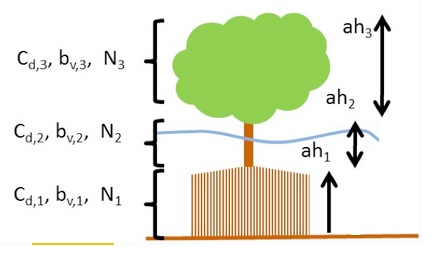

   Definition sketch of vegetation specification in XBeach
   (example for mangrove type vegetation schematized in three vertical
   sections).

Finally, the :par:`veggiemapfile` indicates in what grid cell which
vegetation species can be found. The format of this file is similar to
the bathymetry files described in :ref:`sec-grid-bathymetry`, but the
values are integers referring to a species where 1 refers to the first
listed species, 2 to the second, et cetera. A zero indicates no
vegetation at that particular location. The use of non-integer values
in this file will result in an error.

In summary, the following files should be created when the effect of
vegetation is modeled:

#. 1 x Veggiemapfile: file similar to bathymetry file containing 0, 1
   etc. (up to :par:`nveg`)

#. 1 x Veggiefile: list of file names of vegetation property files per
   species

#. :par:`nveg` x vegetation property file(s): describing vegetation
   properties per species

Below the relevant keywords in the params.txt are given. In addition,
the keyword :par:`vegetation` should be set to 1.

.. include:: tables/partable_vegetation_parameters.tab

Porous in-canopy model input
----------------------------

The porous in-canopy model is aplied when the keyword :par:`porcanflow` is set and the the physical process :par:`vegetation` is included.
A spatial varying canopy property can be used within the in-canopy model. This input is according to the vegetation input.
Thus, the different coral types are described  in the :par:`veggiefile` and the location in the :par:`veggiemapfile`. 
It is not possible to have different vertical sections in the canopy. Only the first vertical section is applied  in the in-canopy model (*nsec=1*).
The property file describes  the canopy parameters  *ah*, *Cd*, *bv* and *N* that represent the canopy height, drag coefficient, friction coefficient and the porosity (in percentage).
The inertia coefficient is set by the keyword :par:`Cm` and the permeability is set by the keyword :par:`Kp`.
An example of a property file is shown below for a coral,

**coral.txt**

.. code-block:: text
                
   nsec = 1
   ah = 0.2
   Cd = 15
   bv = 0.1
   N = 85

   
Discharge input
---------------

Discharge of water at the model boundaries or directly in the model
domain is defined along specific grid sections. The keywords
:par:`ndischarge` and :par:`ntdischarge` define the number of discharge sections
and the length of the discharge time series respectively. The
:par:`disch_loc_file` keyword references a file that defines the discharge
sections. Each line in this file corresponds to a grid section and each
line contains four numbers being the start and end coordinates of the
section. The file is formatted as follows, where *ndisch* refers to the
keyword :par:`ndischarge`:

**disch_loc.txt**

.. code-block:: text
                
   <x_start 1> <y_start 1> <x_end 1> <y_end 1>
   <x_start 2> <y_start 2> <x_end 2> <y_end 2>
   <x_start 3> <y_start 3> <x_end 3> <y_end 3>
   
   ...
   
   <x_start ndisch> <y_start ndisch> <x_end ndisch> <y_end ndisch >

The world coordinates specified in this file must be chosen such that
they are close to the desired grid cell borders, since the grid cell
borders are eventually used as discharge section. Discharge sections can
be located along grid cell borders that are either oriented cross-shore
or alongshore, but not a combination of the two. In a regular grid this
implies that either the start or end x-coordinates are equal, or the
start and end y-coordinates are equal. Alternatively, both are equal. In
this case a vertical discharge from above is assumed, rather than a
horizontal discharge. Vertical discharges only add mass and no momentum
to the water body.

The keyword :par:`disch_timeseries_file` references a file defining the
time series imposed on the discharge locations. The file lists the
timings in the first column and a discharge value in :math:`{\rm m}^{3}/{\rm s}`
for each discharge section as follows, where *ntdisch* refers to the
keyword :par:`ntdischarge`:

**disch_timeseries.txt**

.. code-block:: text
                
   <t 1> <Q 1,1> <Q 2,1> ... <Q ndisch,1>
   <t 2> <Q 1,2> <Q 2,2> ... <Q ndisch,2>
   <t 3> <Q 1,3> <Q 2,3> ... <Q ndisch,3>
   
   ...
   
   <t ntdisch> <Q 1,ntdisch> <Q 2,ntdisch> ... <Q ndisch,ntdisch >

Discharges defined at the domain borders are positive in direction
towards the domain (influx). Discharges defined in the domain itself are
positive in direction of the positive x or y direction. Vertical
discharges are positive into the domain (influx).

.. _discharges:

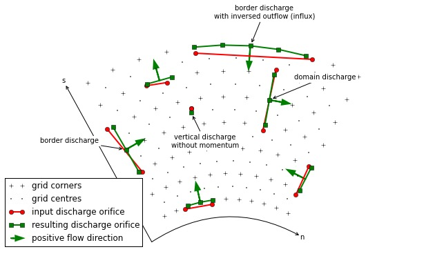

   Possible discharge orifices. A discharge orifice is defined
   as line in between two points (red). The resulting discharge orifice
   constitutes out of full abreast grid cells (green). The discharge
   direction is in positive grid direction (s or n), except at the domain
   border where the discharge is an influx in the domain (green arrows).

The table below gives an overview of all keywords related to discharges:

.. include:: tables/partable_flow_discharge_boundary_conditions.tab

Drifters input
--------------

Drifters can be deployed during the model simulation by specifying the
number of drifters using the keyword :par:`ndrifter` and the location, start
and end time of the drifter deployment in a separate file referenced by
the :par:`drifterfile` keyword. The file format is as follows:

**drifter.txt**

.. code-block:: text
                
   <x 1> <y 1> <t_start 1> <t_end 1>
   <x 2> <y 2> <t_start 2> <t_end 2>
   <x 3> <y 3> <t_start 3> <t_end 3>
   
   ...
   
   <x ndrifter> <y ndrifter> <t_start ndrifter> <t_end ndrifter>

The table below gives an overview of all keywords related to drifters:

.. include:: tables/partable_drifters_parameters.tab

Ship-induced wave motions
-------------------------

Ship waves can be simulated by defining the ships' geometries and
trajectories in a collection of files. The user can define multiple
ships. The number of ships is set by the keyword :par:`nship`. In the file
referenced by the keyword :par:`shipfile` each ship is given a name. The
properties of each ship are summarized in another textfile with the name
of the ship (*shipname.txt*). This properties file defines the
parameters for the discretization of the ships geometry. The ship grid
is determined by the keywords *dx, dy, nx*, and *ny*, and the ship
geometry itself is given in a separate file, referenced bythe keyword
*shipgeom*. This file contains the ship draft per ship grid point, and
should have a size of *nx* + 1 by *ny* + 1. The center of gravity of the
ship is also defined in the ship properties file using the keywords
*xCG, yCG* and *zCG*. The ships trajectory is defined in a file
referenced from the ship properties file by the keyword *shiptrack*.
Each row in this file contains a time, x- and y-coordinate indicating
the ships position as function of time.

To avoid numerical problems, the full ship track should be within the
model domain (i.e. a vessel cannot sail through the model boundary).
Furthermore, it is advised to start the ship track with a very low
velocity and gradually increase the sailing speed. When not taking into
account such spin up period, the impact of the ship on the water level
can be too abrupt, resulting in unrealistic wave patterns. In addition,
it is advised to maintain a relatively deep edge of a few grid cells at
both model boundaries (i.e. front and back side).

Another way to avoid numerical issues at the initialization of a ship
simulation is to use the 'flying' option, which can be specified in the
ship file (*flying* = 1). In case the option *flying* is enabled, also a
z-coordinate is defined in the shiptrack-file indicating the vertical
position of the ship. In this way, the vessel can 'land' on the water
with its correct sailing speed, thereby avoiding unwanted disturbance to
the water level. Also, the ship can 'fly out'f the model domain before
reaching the back boundary. By using this method the spin-up time can be
reduced considerably and both inflow and outflow boundaries are
unaffected by the ship

The two keywords *compute\_force* and *compute\_motion* enable the
computation of forces on the ship and the ships motions due to wave
forcing respectively; the latter has not been implemented yet. Forces on
a ship in motion may be unreliable due to near-field effects; forces on
a ship at rest are much more reliable. An example of ship definition
files is:

**shipfile.txt**

.. code-block:: text
                
   containership.txt
   oiltanker.txt

**containership.txt**

.. code-block:: text
                
   dx = 10
   dy = 10
   nx = 30
   ny = 10
   shipgeom = container_geom.dep
   xCG = 120
   yCG = 50
   zCG = 30
   shiptrack = container_track.txt
   flying = 1
   compute_force = 1
   compute_motion = 1

**pannamax_geom.txt**

.. code-block:: text
                
   <z 0,0> <z 1,0> <z 2,0> <z 3,0> ... <z nx,0> <z nx+1,0>
   <z 0,1> <z 1,1> <z 2,1> <z 3,1> ... <z nx,1> <z nx+1,1>
   
   ...
   
   <z 0,ny> <z 1,ny> <z 2,ny> <z 3,ny> ... <z nx,ny> <z nx+1,ny>
   <z 0,ny+1> <z 1,ny+1> <z 2,ny+1> <z 3,ny+1> ... <z nx,ny+1> <z nx+1,ny+1>

**pannamax_track.txt**

.. code-block:: text

   <t 1> <x 1> <y 1> <z 1>
   <t 2> <x 2> <y 2> <z 2>
   <t 3> <x 3> <y 3> <z 3>
   
   ...

**oiltanker.txt**

.. code-block:: text
                
   dx = 2
   dy = 2
   nx = 20
   ny = 4
   shipgeom = tanker_geom.dep
   xCG = 20
   yCG = 40
   zCG = 1.5
   shiptrack = tanker_track.txt
   flying = 0

**tanker_track.txt**

.. code-block:: text
                
   <t 1> <x 1> <y 1>
   <t 2> <x 2> <y 2>
   <t 3> <x 3> <y 3>
   
   ...

.. include:: tables/partable_ship_parameters.tab

Output selection
----------------

Output selection determines what data computed by XBeach is written to a
file in terms of location and time and in what format. The output types,
output times and output formats supported by XBeach are explained in
more detail in the following subsections. The table below gives an
overview of all keywords related to model output:

.. include:: tables/partable_output_variables.tab

Output types
~~~~~~~~~~~~

XBeach supports four different types of output: 1) instantaneous
spatial output 2) time-averaged spatial output 3) fixed point output
or 4) run-up gauge output. In principle any variable in XBeach can be
outputted as long as it is part of the *spaceparams* structure defined
in *variables.f90* in the XBeach source code. An overview of all
currently supported parameters in this file is presented in
:numref:`tab-output-parameters`.

The amount of output variables used for each type is determined by the
keywords :par:`nglobalvar`, :par:`nmeanvar`, :par:`npoints` and
:par:`nrugauge`. Each of these keywords takes a number indicating the
number of parameters or locations that should be written to file. If
any of the keywords is set to zero, the output type is effectively
disabled. If :par:`nglovalvar` is set to *-1* then a standard set of
output variables is used, being *H, zs, zs0, zb, hh, u, v, ue, ve,
urms, Fc, Fy, ccg, ceqsg, ceqbg, Susg, Svsg, E, R, D* and *DR*. If
:par:`nglobalvar` is not set it defaults to *-1*. The lines in the
*params.txt* file immediately following these keywords determine what
parameters or locations are used, as will be explained in more detail
in the following subsections.

.. _tab-output-parameters:

.. include:: tables/partable_spaceparams.tab
             
Instantaneous spatial output
^^^^^^^^^^^^^^^^^^^^^^^^^^^^

Instantaneous spatial output describes the instantaneous state of
variables across the entire model domain at various points in time. To
make use of this option the user must specify the number of output
variables required using the :par:`nglobalvar` keyword in *params.txt*,
immediately followed by the names of the requested variables on a
separate line each. The output of three instantaneous grids can look as
follows:

**params.txt**

.. code-block:: text
                
   nglobalvar = 3
   zs
   zb
   H

Time-averaged spatial output
^^^^^^^^^^^^^^^^^^^^^^^^^^^^

Time-averaged spatial output describes the time-averaged state of
variables across the entire model domain at various points in time. The
user can define the averaging period in *params.txt*. To make use of
this option the user must specify the number of output variables
required using the :par:`nmeanvar` keyword in *params.txt*, immediately
followed by the names of the requested variables on a separate line
each. The output of two time-averaged grids may look as follows:

**params.txt**

.. code-block:: text
                
   nmeanvar = 2
   u
   v

Fixed point output
^^^^^^^^^^^^^^^^^^

Fixed point output allows the user to select one or more locations for
which a time series of data is stored. This output describes a
time-series of one or more variables at one point in the model domain.
To make use of this option, the user must specify the number of output
locations using the :par:`npoints` keyword in *params.txt*, immediately
followed by one line per output location describing the location
coordinates given as the x-coordinate and y-coordinate and in world
coordinates. XBeach will link the output location to the nearest
computational point.

The user can specify the number and selection of output variables for
all points (and run-up gauges, discussed in the following section) using
the :par:`npointvar` keyword in *params.txt* to specify the number of output
variables, immediately followed by the names of the requested variables
on a separate line each.

Fixed point output significantly reduces the amount of data written to
file in each time step and is therefore particularly suitable for high
temporal resolution output.

An example with two output locations is given below. The first point is
located on the offshore boundary (x = 0.0) and somewhere in the middle
of the model domain in y-direction (y = 800.0). The second point is
located on the lateral boundary (y = 1600.0) and somewhere in the middle
of the domain in x-direction (x = 2000.0). Both locations have four
output variables: *H, zs, zb* and *D*.

**params.txt**

.. code-block:: text
                
   npoints = 2
   0. 800.
   2000. 1600.
   npointvar = 4
   H
   zs
   zb
   D

Run-up gauge output
^^^^^^^^^^^^^^^^^^^

Run-up gauge output describes a time-series of a number of variables at
the (moving) waterline. In this case XBeach scans in an x-directional
transect defined by the user for the location of the waterline. Output
information is recorded for this moving point. This is particularly
useful to keep track of run-up levels in cross-shore transects.

The definition of run-up gauges is similar to the definition of fixed
point output. The user needs to specify the number of run-up gauges
using the :par:`nrugauge` keyword in *params.txt*, immediately followed by
one line per run-up gauge location describing the coordinates of the
initial location of the run-up gauge. XBeach will subsequently link the
initial run-up gauge location to the nearest computational cross-shore
transect rather than just the nearest computational point.

Run-up gauges share their selection of output variables with regular
point output. However, in the case of run-up gauges, XBeach will
automatically also include the variables *xw*, *yw* and *zs* to the
point output variables, if these variables were not specified using the
:par:`npointvar` keyword in *params.txt*. Note that the user should refer to
the *pointvars.idx* output file to check order of output variables for
points and run-up gauges.

An example of a run-up gauge input is given below. The run-up gauge is
initially located on the offshore boundary (x = 0.0) and somewhere in
the middle of the model domain in y-direction (y = 800.0). The run-up
gauge will display standard output variables (*xw*, *yw* and *zs*, as
well as any output variables specified by the :par:`npointvar` keyword).

**params.txt**

.. code-block:: text
                
   nrugauge = 1
   0. 800.

Output times
~~~~~~~~~~~~

The user may determine the output times for regular spatial output
variables, time averaged spatial variables and point location variables
individually. Run-up gauge output and fixed point output are given at
the same moments in time. For all three types of output the user may
choose to either state a fixed interval time at which output is given or
supply an external file containing times at which output should be given
or a combination of both.

Output at fixed intervals
^^^^^^^^^^^^^^^^^^^^^^^^^

The user should define a point in time after the start of the
simulation at which the first output is generated for fixed interval
output. The user can do this by using the :par:`tstart` keyword in
*params.txt*. All output that is being generated at fixed intervals
uses :par:`tstart` as their base. The interval for instantaneous
spatial output is given by the :par:`tintg` keyword. The keywords for
the interval of time-averaged spatial output and point output are
:par:`tintm` and :par:`tintp` respectively, where :par:`tintp` is used
both for fixed point and run-up gauge output. Note that :par:`tintg`,
:par:`tintm` and :par:`tintp` supersede the older :par:`tint`
parameter that is valid for all types of output. The default value of
:par:`tintg` is one second. If :par:`tintp` or :par:`tintm` is not
stated, but output is declared (:par:`npoints`, :par:`nrugauge` or
:par:`nmeanvar` is stated larger than zero), XBeach assumes the same
output interval as :par:`tintg`. An example of the definition of fixed
intervals is given below.

**params.txt**

.. code-block:: text
                
   tstart = 100.
   tintg = 100.
   tintp = 2.
   tintm = 3600.

In the case of instantaneous spatial output and point output, the first
output is given at :par:`tstart`. In the case of time-averaged spatial
variables, the first output is given at :par:`tstart`\ +\ :par:`tintm`. This
output represents the average condition over the interval between
:par:`tstart` and :par:`tstart`\ +\ :par:`tintm`.

Output times defined by external file
^^^^^^^^^^^^^^^^^^^^^^^^^^^^^^^^^^^^^

The user is given the option to have output at a set of points in time
that are not separated by regular intervals. In this case the user
must supply an additional file for each output type. The user
specifies the name of the output time series file for instantaneous
spatial output using the :par:`tsglobal` keyword. The keywords for
time series files for time-averaged spatial output and point output
are :par:`tsmean` and :par:`tspoint` respectively, where
:par:`tspoint` is again used for both fixed point and run-up gauge
output. All time series files must contain on the first line the
number of output times followed by every output time on a new line. An
example of such irregular output time definition is given below.

**params.txt**

.. code-block:: text
                
   tsglobal= time_series1.txt
   tspoints = time_series2.txt
   tsmean= time_series3.txt

**time_series1.txt**

.. code-block:: text

   18
   0.05
   0.15
   0.2
   0.8
   12.0
   12.5
   19.124
   30.
   60.
   90.
   120.
   150.
   160.
   170.
   177.
   178.
   179.
   180.

In the case of instantaneous spatial output and point output, the first
output is given at the first stated point in time. In the case of
time-averaged spatial variables, the first output is given at the second
stated point in time. This output represents the average condition over
the interval between first and second stated point in time. Subsequent
averaging is done over every interval.

Combinations of fixed internal and external files
^^^^^^^^^^^^^^^^^^^^^^^^^^^^^^^^^^^^^^^^^^^^^^^^^

The user is allowed to define certain types of output using fixed
intervals and others using external files. The use of an external file
supersedes the use of fixed intervals. Note that :par:`tstart` will only
apply to output of fixed interval type. An example of mixing fixed and
varying output time intervals is given below.

**param.txt**

.. code-block:: text
                
   tstart = 100.
   tintg = 100.
   tspoints = time_series2.txt
   tintm = 3600.

Output format
~~~~~~~~~~~~~

XBeach supports two types of output: 1) Fortran binary and 2) netCDF.
The output format used is determined by the keyword :par:`outputformat`. The
use of netCDF output is more convenient since all output (and input) is
stored in a single, easy accessible file. Also the netCDF file format is
compatible with many programming languages (e.g. Matlab, Python) as well
as many visualization tools (e.g. QuickPlot, Morphan). It should be
noted that the support for output types in netCDF could be limited for
recent functionalities of the XBeach model.

Fortran binary
^^^^^^^^^^^^^^

Output files in Fortran binary format are bare matrix dumps of XBeach'
computational matrices. At each output time, one such matrix block is
added to the output file. These files can generally be read by binary
read functions, like *fread* in Matlab and the *struct* package in
Python.

Output files written in Fortran binary format are given the name
*< variable >.dat*, for example *zs.dat*, for
instantaneous spatial output. The only exception is that files
containing information about the wave height of the short waves are
called *hrms.dat* instead of *H.dat* to maintain backward compatibility.
Time-averaged spatial output is stored similarly, but the file names
have a suffix indicating the type of averaging
*< variable >\ \_mean.dat*. For time-averaged spatial
output also the variance, minimum and maximum values are stored using
the suffixes \_\ *var*, \_\ *min* and \_\ *max* respectively.

All data corresponding to fixed point locations will be stored in files
called *point\ < NNN >.dat*.
*< NNN >* represents a number between 001 and 999
corresponding to the order in which the points are declared in
*params.txt*. The data files are plain text and contain one row for each
output time step. The first position on each row is the time at which
the output is given. The subsequent positions in the row are the
instantaneous values of the variables at the given point. The order of
the variables is equal to the order in which they are defined for that
point in *params.txt*. Data corresponding to run-up gauge locations are
stored in the same format as fixed point output, but the files are named
*rugau\ < NNN >.dat*.

An extra file called *dims.dat* is always written at the start of the
simulation in Fortran binary output mode. This file contains the
dimensions of the XBeach model. It simply states the following
dimensions in order: *nt* (number of output time steps)\ *, nx* (number
of grid cells in x-direction)\ *, ny* (number of grid cells in
y-direction)\ *, ngd* (number of sediment fractions)\ *, nd* (number of
bed layers)\ *, ntp* (number of point output time steps)\ *, ntm*
(number of time-averaged output time steps). Subsequently, the irregular
time series are stored, if applicable: *tsglobal* (irregular output
times)\ *, tspoints* (irregular point output times) and *tsmean*
(irregular time-averaged output times). Similarly, a file *xy.dat* is
written containing the x- and y- coordinates of the full computational
grid.

netCDF
^^^^^^

All data in netCDF output is stored in a single output file. By default
this file is named *xboutput.nc*, but this name can be chosen freely
using the keyword :par:`ncfilename`. The netCDF file holds all output data,
dimensions and input data in a single file. It should be noted that
netCDF files can hold a multiple time axes. The temporal unit can be
specified in the *params.txt* file using the keyword :par:`tunits`. This unit
does not affect calculations and is only used for output. An example of
the layout of the netcdf file is given below:

**xboutput.nc (structure only, no real contents)**

.. code-block:: text
                
   netcdf xboutput {
      dimensions:
         x = 565 ;
         y = 101 ;
         wave_angle = 9 ;
         bed_layers = 3 ;
         sediment_classes = 1 ;
         inout = 2 ;
         globaltime = 2 ;
         tidetime = 435 ;
         tidecorners = 2 ;
         windtime = 2 ;
      variables:
         double x(x) ;
            x:units = 'm' ;
            x:long_name = 'local x coordinate' ;
         double y(y) ;
            y:units ='m' ;
            y:long_name = 'local y coordinate';
         double globaltime(globaltime) ;
            globaltime:units = 's' ;
         double H(globaltime, y, x) ;
            H:units = 'm' ;
            H:long_name = 'wave height' ;
         double zs(globaltime, y, x) ;
            zs:units = 'm' ;
            zs:long_name = 'water level' ;
         double zb(globaltime, y, x) ;
            zb:units = 'm' ;
            zb:long_name = 'bed level' ;
         double ue(globaltime, y, x) ;
            ue:units = 'm/s' ;
   }

Time parameters
---------------

In all XBeach simulations the hydrodynamic simulation starts at time 0.
Model output can be postponed until the time specified by the keyword
:par:`tstart`.
The simulation stops at the time specified by :par:`tstop`. The
time step used in the hydrodynamic simulation is determined based on a
given maximum Courant number using the keyword :par:`CFL`. The table below
gives an overview of all keywords related to time management:

.. include:: tables/partable_model_time.tab
