Introduction
============

XBeach is an open-source numerical model which is originally developed
to simulate hydrodynamic and morphodynamic processes and impacts on
sandy coasts with a domain size of kilometers and on the time scale of
storms. Since then, the model has been applied to other types of coasts
and purposes.

The model includes the hydrodynamic processes of short wave
transformation (refraction, shoaling and breaking), long wave
(infragravity wave) transformation (generation, propagation and
dissipation), wave-induced setup and unsteady currents, as well as
overwash and inundation. The morphodynamic processes include bed load
and suspended sediment transport, dune face avalanching, bed update and
breaching. Effects of vegetation and of hard structures have been
included. The model has been validated with a series of analytical,
laboratory and field test cases using a standard set of parameter
settings.

XBeach has two modes: a hydrostatic and a non-hydrostatic mode. In the
hydrostatic mode, the short wave amplitude variation is solved
separately from the long waves, currents and morphological change. This
saves considerable computational time, with the expense that the phase
of the short waves is not simulated. A more complete model is the
non-hydrostatic model which solves all processes including short wave
motions, but with more computational demand.

The original application, funded by the U.S. Corps of Engineers in the
framework of the Morphos project and the U.S. Geological Survey, was to
be able to assess hurricane impacts on sandy beaches. Since then with
funding from the Dutch Public Works Department, the model has been
extended, applied and validated for storm impacts on dune and urbanized
coasts for the purpose of dune safety assessments. With support from the
European Commission XBeach has been validated on a number of dissipative
and reflective beaches bordering all regional seas in the EU.

Beyond sandy coasts, the model has been applied to coral fringing and
atoll reefs, in cooperation with and with funding by the University of
Western Australia, the USGS and the Asian Development Bank. The model
now also includes vegetative damping effects, with support of the U.S.
Office of Naval Research.

The non-hydrostatic model has been developed initially by the TU Delft
(as a prototype version of the SWASH model). For the purpose of
simulating the morphodynamic processes on gravel beaches, the model was
extended and validated with support from the University of Plymouth. In
this mode, ship-induced waves can be simulated as well, demonstrating
the flight that the model has taken since its first inception.

This development of XBeach could not have been possible without all of
the above mentioned funding agencies and partners. It would also not
have been possible without the enthusiastic, critical and constructive
approach of all consultants, researchers, M.Sc. and Ph.D. students who
have taken up XBeach, and made it into the tool that it is today.

This manual serves as an introduction to the model and a reference guide
to its many functionalities, options and parameters. We sincerely hope
that this document will help existing and new researchers apply the
model for their purposes and advance our knowledge of coastal hydro- and
morphodynamics.

Processes and model formulation
===============================

Domain and definitions
----------------------

Coordinate system
~~~~~~~~~~~~~~~~~

XBeach uses a coordinate system where the computational x-axis is always
oriented towards the coast, approximately perpendicular to the
coastline, and the y-axis is alongshore, see :numref:`fig-coordsys-rect` and :numref:`fig-coordsys-curvi`.
This coordinate system is defined in world coordinates. The grid size in
x- and y-direction may be variable but the grid must be curvilinear.
Alternatively, in case of a rectangular grid (a special case of a
curvilinear grid) the user can provide coordinates in a local coordinate
system that is oriented with respect to world coordinates (xw, yw)
through an origin (xori, yori) and an orientation (alfa) as depicted in
:numref:`fig-coordsys-rect`. The orientation is defined counter-clockwise w.r.t. the
xw-axis (East).

.. _fig-coordsys-rect:

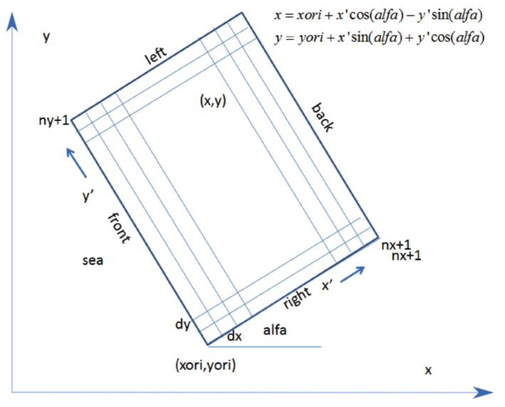

   Rectangular coordinate system of XBeach

Grid set-up
~~~~~~~~~~~

The grid applied is a staggered grid, where the bed levels, water
levels, water depths and concentrations are defined in cell centers, and
velocities and sediment transports are defined in u- and v-points, viz.
at the cell interfaces. In the wave energy balance, the energy, roller
energy and radiation stress are defined at the cell centers, whereas the
radiation stress gradients are defined at u- and v-points.

Velocities at the u- and v-points are denoted by the output variables uu
and vv respectively; velocities u and v at the cell centers are obtained
by interpolation and are for output purpose only. The water level, zs,
and the bed level, zb, are both defined positive upward. uv and vu are
the u-velocity at the v-grid point and the v-velocity at the u-grid
point respectively. These are obtained by interpolation of the values of
the velocities at the four surrounding grid points.

The model solves coupled 2D horizontal equations for wave propagation,
flow, sediment transport and bottom changes, for varying (spectral) wave
and flow boundary conditions.

.. _fig-coordsys-curvi:

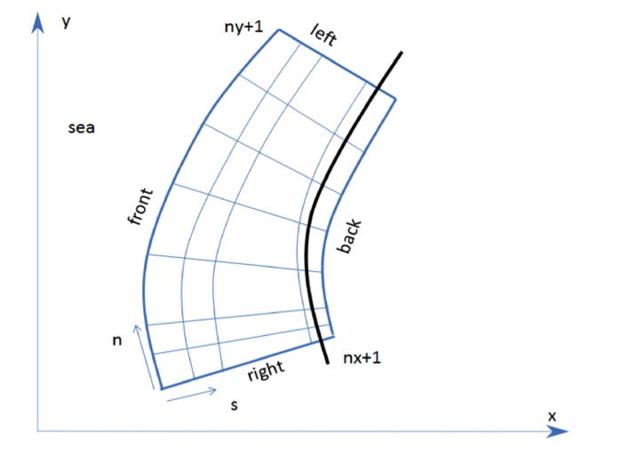

   Curvilinear coordinate system of XBeach

Hydrodynamics options
---------------------

XBeach was originally developed as a short-wave averaged but wave-group
resolving model, allowing resolving the short wave variations on the
wave group scale and the long waves associated with them. Since the
original paper by [Roelvink2009]_ a number of additional model
options have been implemented, thereby allowing users to choose which
time-scales to resolve:

#. Stationary wave model (keyword: *wavemodel = stationary*),
   efficiently solving wave-averaged equations but neglecting
   infragravity waves;

#. Surfbeat mode (instationary) (keyword: *wavemodel = surfbeat*), where
   the short wave variations on the wave group scale (short wave
   envelope) and the long waves associated with them are resolved;

#. Non-hydrostatic mode (wave-resolving) (keyword: *wavemodel = nonh*),
   where a combination of the non-linear shallow water equations with a
   pressure correction term is applied, allowing to model the
   propagation and decay of individual waves.

In the following these options are discussed in more detail. Important
to note that all times in XBeach are prescribed on input in
morphological time. If you apply a morphological acceleration factor
(keyword: :par:`morfac`) all input time series and other time parameters are
divided internally by :par:`morfac`. This way, you can specify the time
series as real times, and vary the :par:`morfac` without changing the rest of
the input files (keyword: :par:`morfacopt` = 1).

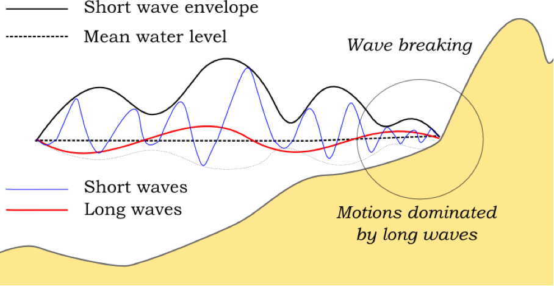

   Principle sketch of the relevant wave processes

Stationary mode
~~~~~~~~~~~~~~~

In stationary mode the wave-group variations and thereby all
infragravity motions are neglected. This is useful for conditions where
the incident waves are relatively small and/or short, and these motions
would be small anyway. The model equations are similar to HISWA
(Holthuijsen et al., 1989) but do not include wave growth or wave period
variations. Processes that are resolved are wave propagation,
directional spreading, shoaling, refraction, bottom dissipation and wave
breaking, and a roller model is included; these processes are usually
dominant in nearshore areas of limited extent. For the breaking
dissipation we use the Baldock et al. (1998) model, which is valid for
wave-averaged modeling. The radiation stress gradients from the wave and
roller model force the shallow water equations, drive currents and lead
to wave setdown and setup. Additionally, wind and tidal forcing can be
applied.

The mean return flow due to mass flux and roller is included in the
model and affects the sediment transport, leading to an offshore
contribution. To balance this, effects of wave asymmetry and skewness
are included as well. Bed slope effects can further modify the
cross-shore behavior. A limited number of model coefficients allow the
user to calibrate the profile shape resulting from these interactions.

A typical application would be to model morphological changes during
moderate wave conditions, often in combination with tides. The wave
boundary conditions can be specified as constant (keyword: *wbctype =
stat*) or as a time-series of wave conditions (keyword: *wbctype =
stat\_table)*. Typical examples of such model applications are given
below for tombolo formation behind an offshore breakwater (left panel)
and development of an ebb delta at a tidal inlet (right panel). A big
advantage of the stationary XBeach wave model over other models is that
the lateral boundaries are entirely without disturbance if the coast is
longshore uniform near these boundaries.

.. figure:: image11.png
.. figure:: image12.png
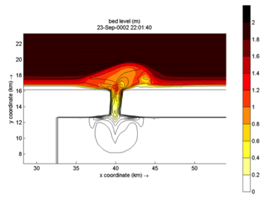
.. figure:: image14.png

*Figure 2.4 Root-mean square wave height (left panels) and final
bathymetry (right panels) for an offshore breakwater case (upper panels)
and a tidal inlet with waves from 330 degrees (lower panels).*

Surf beat mode (instationary)
~~~~~~~~~~~~~~~~~~~~~~~~~~~~~

The short-wave motion is solved using the wave action equation which is
a time-dependent forcing of the HISWA equations (Holthuijsen et al.,
1989). This equation solves the variation of short-waves envelope (wave
height) on the scale of wave groups. It employs a dissipation model for
use with wave groups ([Roelvink1993a]_; [Daly2012]_) and a roller
model (Svendsen, 1984; Nairn et al., 1990; Stive and de Vriend, 1994) to
represent momentum stored at the surface after breaking. These
variations, through radiation stress gradients (Longuet-Higgins and
Stewart, 1962, 1964) exert a force on the water column and drive longer
period waves (infragravity waves) and unsteady currents, which are
solved by the nonlinear shallow water equations (e.g. Phillips, 1977;
Svendsen, 2003). Thus, wave-driven currents (longshore current, rip
currents and undertow), and wind-driven currents (stationary and
uniform) for local wind set-up, long (infragravity) waves, and runup and
rundown of long waves (swash) are included.

Using the surfbeat mode is necessary when the focus is on swash zone
processes rather than time-averaged currents and setup. It is fully
valid on dissipative beaches, where the short waves are mostly
dissipated by the time they are near the shoreline. On intermediate
beaches and during extreme events the swash motions are still
predominantly in the infragravity band and so is the runup.

Under this surfbeat mode, several options are available, depending on
the circumstances:

#. **1D cross-shore;** in this case the longshore gradients are ignored
   and the domain reduces to a single gridline (keyword: *ny = 0).*
   Within this mode the following options are available:

   #. Retaining directional spreading (keyword: *dtheta <
      thetamax – thetamin*); this has a limited effect on the wave
      heights because of refraction, but can also allow obliquely
      incident waves and the resulting longshore currents;

   #. Using a single directional bin (keyword: *dtheta* = *thetamax –
      thetamin*); this leads to perpendicular waves always and ignores
      refraction. If the keyword *snells = 1* is applied, the mean wave
      direction is determined based on Snell’s law. In this case also
      longshore currents are generated.

#. **2DH area;** the model is solved on a curvilinear staggered grid
   (rectilinear is a special case). The incoming short wave energy will
   vary along the seaward boundary and in time, depending on the wave
   boundary conditions. This variation is propagated into the model
   domain. Within this mode the following options are available:

   #. Resolving the wave refraction ’on the fly’ using the
      propagation in wave directional space. For large directional
      spreading or long distances this can lead to some smoothing of
      groupiness since the waves from different directions do not
      interfere but their energy is summed up. This option is possible
      for arbitrary bathymetry and any wave direction. The user must
      specify the width of the directional bins for the surfbeat mode
      (keyword: *dtheta*)

   #. Solving the wave direction at regular intervals using the
      stationary solver, and then propagating the wave energy along the
      mean wave direction. This preserves the groupiness of the waves
      therefore leads to more forcing of the infragravity waves
      (keyword: *single\_dir = 1*). The user must now specify a single
      directional bin for the instationary mode (*dtheta = thetamax -
      thetaminn)* and a smaller bin size for the stationary solver
      (keyword: *dtheta\_s)*.

   #. For schematic, longshore uniform cases the mean wave
      direction can also be computed using Snell’s law (keyword: *snells
      = 1*). This will then give comparable results to the *single\_dir*
      option.

In the figures below some typical applications of 1D and 2D models are
shown; a reproduction of a large-scale flume test, showing the ability
of XBeach to model both short-wave (HF) and long-wave (LF) wave heights
and velocities; and a recent 2DH simulation (Nederhoff et al., 2015) of
the impact of hurricane Sandy on Camp Osborne, Brick, NJ.

.. figure:: image15.png

*Figure 2.5 Computed and observed hydrodynamic parameters for test 2E of
the LIP11D experiment. Top left: bed level and mean water level. Top
right: measured (dots) and computed*

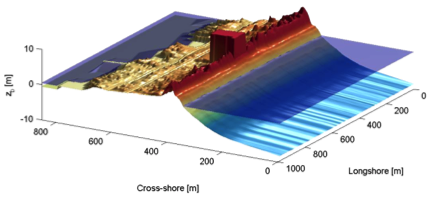
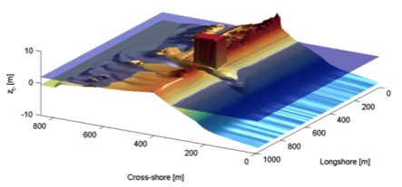

*Figure 2.6 Pre (left) and post-Sandy (right) in a three dimensional
plot with both bed and water levels as simulated by XBeach (Nederhoff et
al. 2015)*

Non-hydrostatic mode (wave resolving) 
~~~~~~~~~~~~~~~~~~~~~~~~~~~~~~~~~~~~~~

For non-hydrostatic XBeach calculations (keyword: *wavemodel = nonh*)
depth-averaged flow due to waves and currents are computed using the
non-linear shallow water equations, including a non-hydrostatic
pressure. The depth-averaged normalized dynamic pressure (*q*) is
derived in a method similar to a one-layer version of the SWASH model
(Zijlema et al. 2011). The depth averaged dynamic pressure is computed
from the mean of the dynamic pressure at the surface and at the bed by
assuming the dynamic pressure at the surface to be zero and a linear
change over depth.

Under these formulations dispersive behavior is added to the long wave
equations and the model can be used as a short-wave resolving model.
Wave breaking is implemented by disabling the non-hydrostatic pressure
term when waves exceed a certain steepness, after which the bore-like
breaking implicit in the momentum-conserving shallow water equations
takes over.

In case the non-hydrostatic mode is used, the short wave action balance
is no longer required. This saves computation time. However, in the
wave-resolving mode we need much higher spatial resolution and
associated smaller time steps, making this mode much more
computationally expensive than the surfbeat mode.

The main advantages of the non-hydrostatic mode are that the
incident-band (short wave) runup and overwashing are included, which is
especially important on steep slopes such as gravel beaches. Another
advantage is that the wave asymmetry and skewness are resolved by the
model and no approximate local model or empirical formulation is
required for these terms. Finally, in cases where diffraction is a
dominant process, wave-resolving modeling is needed as it is neglected
in the short wave averaged mode. The XBeach-G formulations for gravel
beaches (McCall et al, 2014) are based on the non-hydrostatic mode.
Although sandy morphology can be simulated using the wave-resolving
mode, it has not been extensively validated and it is likely that
changes in the sediment transport formulations will be implemented in
the near future.

An interesting recent application that has been validated for a number
of cases concerns the modeling of primary waves generated by large
ships, see Section 2.9.

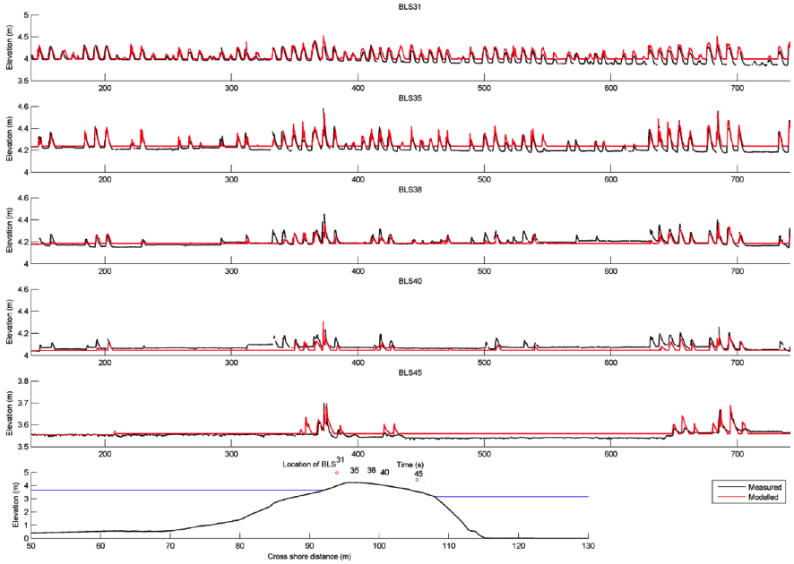

*Figure 2.7 Measured (black) and modeled (red) time series of
overtopping during BARDEX experiment, from McCall et al, 2014.*

Short wave action 
------------------

Short wave action balance
~~~~~~~~~~~~~~~~~~~~~~~~~

The wave forcing in the shallow water momentum equation is obtained from
a time dependent version of the wave action balance equation. Similar to
Delft University’s (stationary) HISWA model (Holthuijsen et al., 1989)
the directional distribution of the action density is taken into
account, whereas the frequency spectrum is represented by a frequency,
best represented by the spectral parameter :math:`{f}_{m-1,0}`. The
wave action balance (keyword: *swave*) is then given by:

.. math::

   \label{ZEqnNum871591} 
   \frac{\partial A}{\partial t} +\frac{\partial c_{x} A}{\partial x} +\frac{\partial c_{y} A}{\partial y} +\frac{\partial c_{\theta } A}{\partial \theta } =-\frac{D_{w} +D_{f} +D_{v} }{\sigma }

In which the wave action *A* is calculated as:

.. math::

   \label{2.2)} 
   A(x,y,t,\theta )=\frac{S_{w} (x,y,t,\theta )}{\sigma (x,y,t)}

where :math:`\theta` represents the angle of incidence with respect
to the x-axis, :math:`{S}_{w}` represents the wave energy density in
each directional bin and :math:`\sigma` the intrinsic wave frequency.
The intrinsic frequency :math:`\sigma` and group velocity
:math:`{c}_{g}` is obtained from the linear dispersion relation. The
intrinsic frequency is for example obtained with:

.. math::

   \label{2.3)} 
   \sigma =\sqrt{gk\tanh kh}

The wave action propagation speeds in *x*, *y* and directional space are
given by:

.. math::

   \label{2.4)} 
   \begin{array}{l} {c_{x} (x,y,t,\theta )=c_{g} \cos (\theta )} \\ {c_{y} (x,y,t,\theta )=c_{g} \sin (\theta )} \\ {c_{\theta } (x,y,t,\theta )=\frac{\sigma }{\sinh 2kh} \left(\frac{\partial h}{\partial x} \sin \theta -\frac{\partial h}{\partial y} \cos \theta \right)} \end{array}

where *h* represents the local water depth and *k* the wave number. The
intrinsic wave frequency :math:`\sigma` is determined without wave
current interaction (keyword: wci=1, see Section 2.3.1.1), which means
it is equal to the absolute radial frequency :math:`\omega`.

Wave current interaction (wci)
^^^^^^^^^^^^^^^^^^^^^^^^^^^^^^

Wave-current interaction is the interaction between waves and the mean
flow. The interaction implies an exchange of energy, so after the start
of the interaction both the waves and the mean flow are affected by each
other. This feature is especially of importance in gullies and
rip-currents (Reniers et al., 2007).

In XBeach this is taken into account by correcting the wave number *k*
with the use of Eikonal equations, which will have impact on the group
and wave propagation speed (x, y, and directional space). The
cross-shore and alongshore wave numbers, :math:`{k}_{x}` and
:math:`{k}_{y}`, are defined according to equation . In these
formulations the subscripts refer to the direction of the wave vector
components.

.. math::

   \label{ZEqnNum901888} 
   \begin{array}{l}
     {k_{x} =k_{x}^{n-1} +k_{x}^{:} } \\
     {k_{y} =k_{y}^{n-1} +k_{y}^{:} } \\
   \end{array}

Where subscript *n-1* refers the wave number of the previous time step,
:math:`k_{x}^{:}` and :math:`k_{y}^{:}` are the wave number
corrections and :math:`{k}_{x}` and :math:`{k}_{y}` are the
corrected wave numbers that take into account the presence of a current.
The correction terms are determined with a second set of equations, the
Eikonal equations:

.. math::

   \label{ZEqnNum227968} 
   \begin{array}{l} {\frac{\partial k_{x} }{\partial t} +\frac{\partial \omega }{\partial x} =0} \\ {\frac{\partial k_{y} }{\partial t} +\frac{\partial \omega }{\partial y} =0} \end{array}

The wave number is then given by:

.. math::

   \label{2.7)} 
   k=\sqrt{k_{x}^{2} +k_{y}^{2} }

The absolute radial frequency :math:`\omega` is calculated with:

.. math::

   \label{2.8)} 
   \omega =\sigma +k_{x} u^{L} +k_{y} v^{L}

*where :math:`{u}^{L}` and :math:`{v}^{L}` are the cross-shore
and alongshore depth-averaged Lagrangian velocities respectively. The
wave action propagation speed (in x and y direction) is given by:

.. math::

   \label{2.9)} 
   \begin{array}{l} {c_{x} (x,y,t,\theta )=c_{g} \cos (\theta )+u^{L} } \\ {c_{y} (x,y,t,\theta )=c_{g} \sin (\theta )+v^{L} } \end{array}

The propagation speed in directional (:math:`\theta`) space, where
bottom refraction (first term) and current refraction (last two terms)
are taken into account, is obtained from:

.. math::

   \label{2.10)} 
   \begin{array}{r} {c_{\theta } (x,y,t,\theta )=\frac{\sigma }{\sinh 2kh} \left(\frac{\partial h}{\partial x} \sin \theta -\frac{\partial h}{\partial y} \cos \theta \right)+\cos \theta \left(\sin \theta \frac{\partial u}{\partial x} -\cos \theta \frac{\partial u}{\partial y} \right)} \\ {+\, \sin \theta \left(\sin \theta \frac{\partial v}{\partial x} -\cos \theta \frac{\partial v}{\partial y} \right)} \end{array}

Dissipation
~~~~~~~~~~~

In XBeach there are three short wave dissipation processes that can be
accounted for: wave breaking (:math:`{D}_{w}`), bottom friction
(:math:`{D}_{f}`) and vegetation (:math:`{D}_{v}`). The three
processes are explained in more detail in the following subsections.

Wave breaking
^^^^^^^^^^^^^

Five different wave breaking formulations are implemented in XBeach. The
formulations can be selected using the keyword *break* (Table 2.1).

*Table 2.1 Different wave breaking formulations implemented*

+-----------------------------+-----------------+------------------+
| Wave breaking formula       | Type of waves   | keyword          |
+=============================+=================+==================+
| Roelvink (1993a)            | Instationary    | roelvink1        |
+-----------------------------+-----------------+------------------+
| Roelvink (1993a) extended   | Instationary    | roelvink2        |
+-----------------------------+-----------------+------------------+
| Daly et al. (2010)          | Instationary    | roelvink_daly    |
+-----------------------------+-----------------+------------------+
| Baldock et al. (1998)       | Stationary      | baldock          |
+-----------------------------+-----------------+------------------+
| Janssen & Battjes (2007)    | Stationary      | janssen          |
+-----------------------------+-----------------+------------------+

For the surf beat approach the total wave energy dissipation, i.e.
directionally integrated, due to wave breaking can be modeled according
to Roelvink (1993a, keyword: *break=roelvink1*). In the formulation of
the dissipation due to wave breaking the idea is to calculate the
dissipation with a fraction of breaking waves (:math:`{Q}_{b}`)
multiplied by the dissipation per breaking event. In this formulation
:math:`\alpha` is applied as wave dissipation coefficient of O
(keyword: *alpha*), :math:`{T}_{rep}` is the representative wave
period and :math:`{E}_{w}` is the energy of the wave. The fraction
of wave breaking is determined with the root-mean-square wave height
(:math:`{H}_{rms}`) and the maximum wave height
(:math:`{H}_{max}`). The maximum wave height is calculated as ratio
of the water depth (*h*) plus a fraction of the wave height
(:math:`\delta H_{rms}`, keyword: *delta*) using a
breaker index :math:`\gamma` (keyword: *gamma*). In the formulation
for :math:`{H}_{rms}` the :math:`\rho` represents the water
density and g the gravitational constant. The total wave energy
:math:`{E}_{w}` is calculated by integrating over the wave
directional bins.

.. math::

   \begin{array}{c} {\bar{D}_{w} =2\frac{\alpha }{T_{rep} } Q_{b} E_{w} {\; }} \\ {Q_{b} {=1-exp}\left(-\left(\frac{H_{rms} }{H_{\max } } \right)^{n} \right),\quad H_{rms} =\sqrt{\frac{8E_{w} }{\rho g} } ,\quad H_{\max } =\gamma \cdot (h+\delta H_{rms} )} \\ {E_{w} (x,y,t)=\int _{0}^{2\pi }S_{w} (x,y,t,\theta )d\theta  } \end{array}

In variation of , one could also use another wave breaking formulation,
presented in . This formulation is somewhat different than the
formulation of Roelvink (1993a) and selected using keyword
*break=roelvink2.* The main difference with the original formulation is
that wave dissipation with *break=roelvink2* is proportional to
:math:`{H}^{3} / h` instead of :math:`{H}^{2}`.

.. math::

   \label{ZEqnNum862942} 
   \bar{D}_{w} =2\frac{\alpha }{T_{rep} } Q_{b} E_{w} \frac{H_{rms} }{h}

Alternatively the formulation of Daly et al. (2010) states that waves
are fully breaking if the wave height exceeds a threshold
(:math:`\gamma`) and stop breaking if the wave height fall below
another threshold (:math:`\gamma_{2}`). This formulation
is selected by *break=roelvink\_daly* and the second threshold,
:math:`\gamma_{2}`, can be set using keyword: *gamma2.*

.. math::

   \label{2.13)} 
   \left\{\begin{array}{l} {Q_{b} =1\quad if\quad H_{rms} >\gamma h} \\ {Q_{b} =0\quad if\quad H_{rms} <\gamma _{2} h} \end{array}\right.

In case of stationary waves Baldock et al. (1998) is applied (keyword:
*break=baldock*), which is presented in . In this breaking formulation
the fraction breaking waves :math:`{Q}_{b}` and breaking wave height
:math:`{H}_{b}` are calculated differently compared to the breaking
formulations used for the non-stationary situation. In :math:`\alpha`
is applied as wave dissipation coefficient, :math:`{f}_{rep}`
represents a representative intrinsic frequency and *y* is a calibration
factor.

.. math::

   \label{ZEqnNum650667} 
   \begin{array}{l} {\bar{D}_{w} =\frac{1}{4} \alpha Q_{b} \rho gf_{rep} \left(H_{b}^{2} +H_{rms}^{2} \right)} \\ {Q_{b} =\exp \left[-\left(\frac{H_{b}^{2} }{H_{rms}^{2} } \right)\right]{\; ,\; \; }H_{b} =\frac{0.88}{k} \tanh \left[\frac{\gamma kh}{0.88} \right]} \end{array}

Finally, it is possible to use the Janssen & Battjes (2007) formulation
for wave breaking of stationary waves (keyword: *break=janssen*). This
formulation is a revision of Baldock’s formulation.

.. math::

   \label{2.15)} 
   \begin{array}{l} {\bar{D}_{w} =\frac{3\sqrt{\pi } \alpha f_{rep} \rho gH_{rms}^{3} }{16} Q_{b} } \\ {Q_{b} =1+\frac{4}{3\sqrt{\pi } } \left(R^{3} +\frac{3}{2} R\right)\exp \left(-R^{2} \right)-erf\left(R\right)} \\ {R=\frac{H_{b} }{H_{rms} } } \end{array}

In both the instationary or stationary case the total wave dissipation
is distributed proportionally over the wave directions with the
formulation in .

.. math::

   \label{ZEqnNum200641} 
   D_{w} (x,y,t,\theta )=\frac{S_{w} (x,y,t,\theta )}{E_{w} (x,y,t)} \bar{D}_{w} (x,y,t)

Bottom friction
^^^^^^^^^^^^^^^

The short wave dissipation by bottom friction is modeled as

.. math::

   \label{ZEqnNum711028} 
   D_{f} =\frac{2}{3\pi } \rho f_{w} \left(\frac{\pi H_{rms} }{T_{m01} \sinh kh} \right)^{3}

In the :math:`{f}_{w}` is the short-wave friction coefficient. This
value only affects the wave action equation and is unrelated to bed
friction in the flow equation. Studies conducted on reefs (e.g. Lowe et
al., 2007) indicate that :math:`{f}_{w}` should be an order of
magnitude (or more) larger than the friction coefficient for flow
(:math:`{c}_{f}`) due to the dependency of wave
frictional dissipation rates on the frequency of the motion.

The derivation of the short wave dissipation term is based time-averaged
instantaneous bottom dissipation using the Johnson friction factor
:math:`{f}_{w}` of the bed shear stress:

.. math::

   \label{ZEqnNum889680} 
   \tilde{D}_{f} =\left|\tau u\right|=\frac{1}{2} \rho f_{w} \left|\tilde{u}\right|^{3}

The evaluation of the term
:math:`\left\langle\left|\tilde{u}\right|^{3}\right\rangle`, the
so-called third even velocity moment, depends on the situation. First we
need expressions for the orbital velocity amplitude, which is expressed
as:

.. math::

   \label{ZEqnNum105456} 
   u_{orb} =\frac{\pi H_{rms} }{T_{p} \sinh (kh)}

In this formulation :math:`{T}_{p}` is the peak wave period,
:math:`{H}_{rms}` is the root-mean-square wave height, *k* is the
wave number and *h* is the local water depth.

If we consider the slowly-varying dissipation in wave groups, we need
only to average over a single wave period and we can use a monochromatic
(regular wave) expression. If we want to have the time-average
dissipation over a full spectrum we get the best approximation from
considering a linear Gaussian distribution. Guza and Thornton (1985)
give pragmatic expressions for both cases.

For the monochromatic case:

.. math::

   \label{2.20)} 
   \left\langle \left|\tilde{u}\right|^{3} \right\rangle =1.20\left\langle \left|\tilde{u}\right|^{2} \right\rangle ^{3/2} =1.20\left(\frac{1}{2} u_{orb}^{2} \right)^{3/2} =0.42u_{orb}^{3}

For the linear Gaussian approximation:

.. math::

   \label{ZEqnNum278204} 
   \left\langle \left|\tilde{u}\right|^{3} \right\rangle =1.60\left\langle \left|\tilde{u}\right|^{2} \right\rangle ^{3/2} =1.60\left(\frac{1}{2} u_{orb}^{2} \right)^{3/2} =0.57u_{orb}^{3}

Combining and we get:

.. math::

   \label{2.22)} 
   \left\langle \tilde{D}_{f} \right\rangle =0.21\rho f_{w} u_{orb}^{3}

In XBeach the orbital velocity amplitude is computed as in end the
dissipation according to which is correct for the case of instationary
simulations on wave-group scale.

For the stationary case formulations and are similarly combined into:

.. math::

   \label{ZEqnNum720951} 
   \left\langle \tilde{D}_{f} \right\rangle =0.28\rho f_{w} u_{orb}^{3}

Vegetation
^^^^^^^^^^

The presence of aquatic vegetation within the area of wave propagation
or wave breaking results in an additional dissipation mechanism for
short waves. This is modeled using the approach of Mendez & Losada
(2004), which was adjusted by Suzuki et al., (2011) to take into account
vertically heterogeneous vegetation, see Van Rooijen et al. (2015). The
short wave dissipation due to vegetation is calculated as function of
the local wave height and several vegetation parameters. The vegetation
can be schematized in a number of vertical elements with each specific
property. In this way the wave damping effect of vegetation such as
mangrove trees, with a relatively dense root system but sparse stem
area, can be modeled. The dissipation term is then computed as the sum
of the dissipation per vegetation layer (Suzuki et al, 2011):

.. math::

   \label{2.24)} 
   D_{v} =\sum _{i=1}^{n_{v} }D_{v,i}

where :math:`{D}_{v,i}` is the dissipation by
vegetation in vegetation layer *i* and :math:`{n}_{v}` is the number
of vegetation layers. The dissipation per layer is given by:

.. math::

   \label{2.25)} 
   \begin{array}{l} {D_{v,i} =A_{v} \cdot \frac{\rho \widetilde{C}_{D,i} b_{v,i} N_{v,i} }{2\sqrt{\pi } } \left(\frac{kg}{2\sigma } \right)^{3} H_{rms} ^{3} ,{\; with}} \\ {A_{v} =\frac{\left(\sinh ^{3} k\alpha _{i} h-\sinh ^{3} k\alpha _{i-1} h\right)+3\left(\sinh k\alpha _{i} h-\sinh k\alpha _{i-1} h\right)}{3k\cosh ^{3} kh} } \end{array}

where :math:`\widetilde{C}_{D,i}` is a (bulk) drag coefficient,
:math:`{b}_{v,i}` is the vegetation stem diameter,
:math:`{N}_{v,i}` is the vegetation density, and
:math:`\alpha_{i}` is the relative vegetation height (=
:math:`{h}_{v} / h`) for layer *i*. In case only
one vegetation layer is specified, the plants are assumed to be
vertically uniform, which would for example typically apply in case of
modeling sea grass.

Radiation stresses
~~~~~~~~~~~~~~~~~~

Given the spatial distribution of the wave action (and therefore wave
energy) the radiation stresses can be evaluated by using linear wave
theory as described by:

.. math::

   \label{2.26)} 
   \begin{array}{l} {S_{xx,r} (x,y,t)=\int \cos ^{2} \theta S_{r} d\theta  } \\ {S_{xy,r} (x,y,t)=S_{yx,r} (x,y,t)=\int \sin \theta \cos \theta S_{r}  d\theta } \\ {S_{yy,r} (x,y,t)=\int \sin ^{2} \theta S_{r} d\theta  } \end{array}

Wave shape
~~~~~~~~~~

The morphodynamic model considered is (short) wave averaged and resolves
hydrodynamics associated with the wave group time scale. As a result the
short wave shape is not solved for. However, as waves propagate from
deep water onto beaches, their surface form and orbital water motion
become increasingly non-linear because of the amplification of the
higher harmonics.

There are two wave forms implemented to take this non-linearity into
account:

#. A formulation of Ruessink et al. (2012) based on a parameterization
   with the Ursell number. (keyword: *waveform = ruessink\_vanrijn*)

#. A formulation of Van Thiel de Vries (2009) based on the parameterized
   wave shape model of Rienecker and Fenton (1981) (keyword: *waveform =
   vanthiel*)

The formulation of Ruessink et al. (2012) relies on parameterizations
for the non-linearity parameter *r* and phase :math:`\Phi`. The
parameterizations are based on a data set of 30.000+ field observations
of the orbital skewness :math:`{S}_{k}` and asymmetry
:math:`{A}_{s}`, collected under non-breaking and breaking wave
conditions. The only variable parameter is the Ursell number, since
according to Ruessink et al. (2012) the Ursell that includes
:math:`{H}_{s}` *T* and *h*, describes the variability in
:math:`{S}_{k}` and :math:`{A}_{s}` well. The Ursell number is
calculated with the equation below.

.. math::

   \label{2.27)} 
   U_{r} =\frac{3}{4} \frac{0.5H_{s} k}{(kh)^{3} }

The value for the skewness and asymmetry is calculated with the use of a
Boltzmann sigmoid. The skewness and asymmetry are a function of
:math:`\Psi`. In the formulation of Ruessink et al. (2012) the
:math:`{p}_{1:6}` are used as parameterized factors on the data set
of field observations.

.. math::

   \label{2.28)} 
   \begin{array}{c} {B=p_{1} +\frac{p_{2} -p_{1} }{1+\exp \frac{p_{3} -\log Ur}{p_{4} } } } \\ {\psi =-90+90\tanh (p_{5} /Ur^{p_{6} } )} \\ {} \\ {S_{k} =B\cos \psi {\; \; \; and\; \; \; }A_{s} =B\sin \psi } \end{array}

Alternatively, Van Thiel de Vries (2009) utilized and extended the wave
shape model of Rienecker and Fenton (1981). In this model the short wave
shape is described by the weighted sum of eight sine and cosine
functions

.. math::

   \label{2.29)} 
   u_{bed} =\sum _{i=1}^{i=8}wA_{i} \cos (i\omega t)+{\; }(1-w) A_{i} \sin (i\omega t)

where :math:`{u}_{bed}` is the near-bed short wave flow velocity, *i*
refers to the *i*\ th harmonic, :math:`\omega` is the angular wave
frequency, :math:`{A}_{i}` is the amplitude of a specific harmonic
and *w* is a weighting function affecting the wave shape. The amplitudes
:math:`{A}_{1:8}` are computed from stream function
theory and vary with the dimensionless wave height and dimensionless
wave period.

The wave skewness of near bed flow velocities is computed according to .
The wave asymmetries (:math:`{A}_{s}`) can be computed with the same
expression replacing :math:`{u}_{bed}` by its Hilbert transform.

.. math::

   \label{ZEqnNum619512} 
   S_{k} =\frac{\overline{u_{bed}^{3} }}{\sigma _{u_{bed} }^{3} }

For *w* equals one a skewed (Stokes) wave is obtained with high peaks
and flat troughs whereas *w* equals zero results in an asymmetric (saw
tooth) wave with steep wave fronts. It is hypothesized that the
weighting *w* can be expressed as a function of wave skewness and
asymmetry. The relation between the phase and the weighting is studied
in more detail by Van Thiel de Vries (2009) by varying *w* between zero
and one in small steps and computing the amplitudes
:math:`{A}_{1:8}` with Rienecker and Fenton for a
range of wave heights, wave periods and water depths. It is found that a
unique relation between *w* and :math:`\Phi` exists for any
combination of wave height, wave period and water depth that is
described by:

.. math::

   \label{2.31)} 
   w=0.2719\ln \left(\left|\frac{\phi -1.8642}{0.2933-\phi } \right|\right)+0.5

As explained in the next section, short-wave turbulence can be computed
averaged over the bore interval (:math:`{T}_{bore}`). The bore interval
is directly related to the wave shape and hence requires the weighting
function *w* is determined. For the formulation of Ruessink et al.
(2012) no exact wave shape is determined and therefore no bore interval
can be calculated. Therefore this approach cannot be combined with bore
averaged short-wave turbulence.

Turbulence
~~~~~~~~~~

Wave breaking induced turbulence at the water surface has to be
transported towards the bed in order to affect the up-stirring of
sediment. Roelvink and Stive (1989) used an exponential decay model with
the mixing length proportional to :math:`{H}_{rms}` to estimate the
time averaged turbulence energy at the bed from turbulence at the water
surface:

.. math::

   \label{2.32)} 
   k_{b} =\frac{k}{\exp (h/H_{rms} )-1}

where :math:`{k}_{b}` is turbulence variance at the bed and *k* is
the time averaged turbulence variance at the water surface.

There are three possibilities for the turbulence variance at the bed
(:math:`{k}_{b}`) implemented into XBeach:

#. Wave averaged near-bed turbulence energy (keyword: *turb =
   wave\_averaged*):

   .. math::

      \label{2.33)} 
      k_{b} =\frac{\overline{k_{s} }}{\exp (h/L_{mix} )-1}

#. Bore-averaged near-bed turbulence energy [#1]_ (keyword: *turb =
   bore\_averaged*)

   .. math::

      \label{2.34)} 
      k_{b} =\frac{\overline{k_{s} }\cdot T_{rep} /T_{bore} }{\exp (h/L_{mix} )-1}

#. Not taking into account the turbulence variance at the bed (keyword:
   *turb = none*)

Both formulations make use of the wave-averaged turbulence energy
(:math:`{k}_{s}`) and a mixing length (:math:`{L}_{mix}`). The
wave averaged turbulence energy at the surface is computed from the
roller energy dissipation and following Battjes (1975) in which
:math:`{D}_{r}` is roller dissipation:

.. math::

   \label{2.35)} 
   \overline{k_{s} }=\left(D_{r} /\rho _{w} \right)^{2/3}

The mixing length (:math:`{L}_{mix}`) is expressed as thickness of
the surface roller near the water surface and depends on the roller
volume :math:`{A}_{r}` (Svendsen, 1984):

.. math::

   \label{2.36)} 
   L_{mix} =\sqrt{A_{r} } =\sqrt{\frac{2E_{r} T_{rep} }{\rho _{w} c_{w} } }

Roller energy balance
~~~~~~~~~~~~~~~~~~~~~

While the short wave action balance adequately describes the propagation
and decay of organized wave energy, it has often been found that there
is a delay between the point where the waves start to break (which is
where you would expect the strongest radiation stress gradients to
occur) and the point where the wave set-up and longshore current start
to build. This transition zone effect is generally attributed to the
temporary storage of shoreward momentum in the surface rollers. Several
authors have analyzed the typical dimensions of such rollers and their
effect on the radiation stress (e.g. Longuet-Higgins and Turner, 1974,
Svendsen, 1984, Roelvink and Stive, 1989, Nairn et al., 1990, Deigaard
1993, Stive and De Vriend, 1994).

The rollers can be represented as a blob of water with cross-sectional
area A that slides down the front slope of a breaking wave. The roller
exerts a shear stress on the water beneath it equal to:

.. math::

   \label{ZEqnNum145546} 
   \tau _{roller} =\frac{\rho gR}{L} \beta _{s}

where :math:`\beta_{s}` is the slope of the breaking wave front, *R*
is the roller area and *L* is the wave length. The roller has a kinetic
energy equal to:

.. math::

   \label{ZEqnNum992472} 
   E_{r} =\frac{1}{2} \frac{\rho R(\overline{u_{roller}^{2} +w_{roller}^{2} })}{L}

and a contribution to the radiation stress equal to:

.. math::

   \label{2.39)} 
   S_{xx} =\frac{\rho R\overline{\left(u_{roller}^{2} -w_{roller}^{2} \right)}}{L}

We can now formulate an energy balance for the roller as follows:

.. math::

   \label{ZEqnNum923440} 
   \frac{dE_{r} }{dt} =\frac{\partial E_{r} }{\partial t} +\frac{\partial E_{r} c\cos \theta }{\partial x} +\frac{\partial E_{r} c\sin \theta }{\partial y} =S-D

where *S* is the loss of organized wave motion due to breaking and *D*
is the dissipation. The latter is equal to the work done by the shear
stress between the roller and the wave:

.. math::

   \label{ZEqnNum821204} 
   D_{r} =\tau _{roller} c_{g}

Given the complex motion in the breaking waves, we can only give
approximate estimates of the order of magnitude of the parameters in the
equations till . Various authors have suggested that the velocity in the
roller can be approximated as purely horizontal and equal to the wave
celerity :math:`{c}_{g}`. In that case we get (for waves travelling
in x-direction):

.. math::

   \label{2.42)} 
   S_{xx,roller} =2E_{r}

However, this must be seen as an (unrealistic) upper limit on the
radiation stress contribution as this can only be valid for
:math:`{w}_{roller}=0`. Nairn et al. (1990) showed that the
conceptual model of Roelvink and Stive (1989) would lead to a factor
0.22 instead of 2. However, a ratio in the order of 1 seems more
realistic. Stive and De Vriend (1994) found a discrepancy between the
roller shear stress derived from an energy balance and that derived from
the momentum balance, in the order of a factor two. They explained this
by a complicated analysis of the effect of water entering and leaving
the roller, which led to a modification of the propagation term in the
roller energy balance by a factor two. As this leads to the unphysical
result that rollers would propagate at twice the wave celerity, we
believe that the discrepancy must be sought in the ratio between roller
energy and radiation stress contribution. Therefore we stick to the
roller energy balance suggested by Nairn et al. (1990) in equation and
the roller contribution to the radiation stress:

.. math::

   \label{ZEqnNum156223} 
   \begin{array}{l} {S_{xx,roller} \approx E_{r} \cos ^{2} \theta } \\ {S_{xy,roller} \approx E_{r} \cos \theta \sin \theta } \\ {S_{yy,roller} \approx E_{r} \sin ^{2} \theta } \end{array}

This leads to an elegant and consistent distribution of the wave-induced
forcing through the surfzone. To close the roller energy balance we need
to express the dissipation of the roller as a function of
:math:`{E}_{r}`. This can be done by introducing:

.. math::

   \label{ZEqnNum157006} 
   \overline{\left(u_{roller}^{2} +w_{roller}^{2} \right)}=\beta _{2} c_{g} ^{2}

Combining this with equations and we then find:

.. math::

   \label{2.45)} 
   D_{r} =2\beta _{s} \beta _{u} \frac{g}{c_{g} } E_{r}

The coefficients :math:`\beta_{s}` and :math:`\beta_{u}` are usually
lumped together into a single coefficient. This coefficient
:math:`\beta` is in the O (keyword: *beta*), which may vary through the
surf zone. The forcing of the longshore current by the radiation stress
gradient can be derived from the wave and roller energy balances and :

.. math::

   \label{2.46)} 
   \begin{array}{l} {F_{y} =-\frac{\partial S_{xy} }{\partial x} =-\frac{\partial }{\partial x} \left[\frac{c_{g} }{c} \left(E\cos \left(\theta \right)\sin \left(\theta \right)\right)+E_{r} \cos \left(\theta \right)\sin \left(\theta \right)\right]} \\ {\, \, \, \, \, \, \, \, \, \, \, =-\frac{\partial }{\partial x} \left[\frac{\sin \left(\theta \right)}{c} \left(Ec_{g} \cos \left(\theta \right)+E_{r} c\cos \left(\theta \right)\right)\right]} \\ {\, \, \, \, \, \, \, \, \, \, \, =-\left(Ec_{g} \cos \left(\theta \right)+E_{r} c\cos \left(\theta \right)\right)\frac{\partial }{\partial x} \left[\frac{\sin \left(\theta \right)}{c} \right]\, \, } \\ {\, \, \, \, \, \, \, \, \, \, \, \, \, \, \, -\frac{\sin \left(\theta \right)}{c} \frac{\partial }{\partial x} \left(Ec_{g} \cos \left(\theta \right)+E_{r} c\cos \left(\theta \right)\right)} \end{array}

In a longshore uniform situation, according to Snell’s law, the first
term on the right-hand side equals zero; the second term exactly equals
the sum of the wave energy dissipation and the roller energy input and
dissipation terms, so the forcing term reduces to:

.. math::

   \label{ZEqnNum515341} 
   F_{y} =\frac{D_{w} +(-D_{w} +D_{r} )}{c} \sin (\alpha )=\frac{D_{r} }{c} \sin (\alpha )

Shallow water equations
-----------------------

.. seealso:: The shallow water equations are implemented in :f:func:`flow_timestep_module/flow`.

For the low-frequency waves and mean flows we use the shallow water
equations. To account for the wave induced mass-flux and the subsequent
(return) flow these are cast into a depth-averaged Generalized
Lagrangian Mean (GLM) formulation (Andrews and McIntyre, 1978, Walstra
et al, 2000). In such a framework, the momentum and continuity equations
are formulated in terms of the Lagrangian velocity :math:`{u}^{L}`
which is defined as the distance a water particle travels in one wave
period, divided by that period. This velocity is related to the Eulerian
velocity (the short-wave-averaged velocity observed at a fixed point)
by:

.. math::

   \label{2.48)} 
   u^{L} =u^{E} +u^{S} \quad and\quad v^{L} =v^{E} +v^{S}

where :math:`{u}^{S}` and :math:`{v}^{S}` represent the Stokes drift
in *x*- and *y*-direction respectively (Phillips, 1977). The Strokes
drift is calculated with in which the wave-group varying short wave
energy :math:`{E}_{w}` and direction are obtained from the
wave-action balance.

.. math::

   \label{ZEqnNum369529} 
   u^{S} =\frac{E_{w} \cos \theta }{\rho hc} \quad and\quad v^{S} =\frac{E_{w} \sin \theta }{\rho hc}

The resulting GLM-momentum equations are given by:

.. math::

   \label{ZEqnNum488519} 
   \begin{array}{c} {\frac{\partial u^{L} }{\partial t} +u^{L} \frac{\partial u^{L} }{\partial x} +v^{L} \frac{\partial u^{L} }{\partial y} -f\, v^{L} \, -\, \nu _{h} \left(\frac{\partial ^{2} u^{L} }{\partial x^{2} } +\frac{\partial ^{2} u^{L} }{\partial y^{2} } \right)=\frac{\tau _{sx} }{\rho h} -\frac{\tau _{bx}^{E} }{\rho h} -g\frac{\partial \eta }{\partial x} +\frac{F_{x} }{\rho h} +\frac{F_{v,x} }{\rho h} } \\ {\frac{\partial v^{L} }{\partial t} +u^{L} \frac{\partial v^{L} }{\partial x} +v^{L} \frac{\partial v^{L} }{\partial y} +f\, u^{L} \, -\, \nu _{h} \left(\frac{\partial ^{2} v^{L} }{\partial x^{2} } +\frac{\partial ^{2} v^{L} }{\partial y^{2} } \right)=\frac{\tau _{sy} }{\rho h} -\frac{\tau _{by}^{E} }{\rho h} -g\frac{\partial \eta }{\partial y} +\frac{F_{y} }{\rho h} +\frac{F_{v,y} }{\rho h} } \\ {\frac{\partial \eta }{\partial t} +\frac{\partial hu^{L} }{\partial x} +\frac{\partial hv^{L} }{\partial y} =0} \end{array}

where :math:`\tau_{sx}` and
:math:`\tau_{sy}` are the wind shear
stresses, :math:`\tau_{bx}` and
:math:`\tau_{by}` are the bed shear
stresses, :math:`\eta` is the water level, :math:`{F}_{x}` and
:math:`{F}_{y}` are the wave-induced stresses,
:math:`{F}_{v,x}`, and :math:`{F}_{v,y}` are the stresses
induced by vegetation, :math:`\nu_{h}` is the horizontal
viscosity and *f* is the Coriolis coefficient. Note that the shear
stress terms are calculated with the Eulerian velocities as experienced
by the bed and not with the GLM velocities, as can be seen in .

Horizontal viscosity 
~~~~~~~~~~~~~~~~~~~~~

.. seealso:: The Smagorinsky model is implemented in :f:func:`flow_timestep_module/visc_smagorinsky`.

The horizontal viscosity (:math:`{v}_{h}`) is by default computed
using the Smagorinsky (1963) model to account for the exchange of
horizontal momentum at spatial scales smaller than the computational
grid size, which is given as:

.. math::

   \label{ZEqnNum525463} 
   v_{h} =c_{S} ^{2} 2^{\frac{1}{2} } \sqrt{\left(\frac{\delta u}{\delta x} \right)^{2} +\left(\frac{\delta v}{\delta y} \right)^{2} +\frac{1}{2} \left(\frac{\delta u}{\delta x} +\frac{\delta v}{\delta y} \right)^{2} } \Delta x\Delta y

In :math:`{c}_{S}` is the Smagorinsky constant (keyword: *nuh*), set
at 0.1 in all model simulations. It is also possible to use a
user-defined value for the horizontal viscosity by turning off the
Smagorinsky model (keyword: *smag = 0*) and specifying the value
directly (also keyword: *nuh*).

Bed shear stress
~~~~~~~~~~~~~~~~

The bed friction associated with mean currents and long waves is
included via the formulation of the bed shear stress
(:math:`\tau_{b}`). Using the approach of Ruessink et al.
(2001) the bed shear stress is calculated with:

.. math::

   \label{2.52)} 
   \begin{array}{l} {\tau _{bx}^{E} =c_{f} \rho u_{E} \sqrt{\left(1.16u_{rms} \right)^{2} +\left(u_{E} +v_{E} \right)^{2} } } \\ {\tau _{by}^{E} =c_{f} \rho v_{E} \sqrt{\left(1.16u_{rms} \right)^{2} +\left(u_{E} +v_{E} \right)^{2} } } \end{array}

There are 5 different formulations in order to determine the
dimensionless bed friction coefficient :math:`{c}_{f}` (keyword:
*bedfriction*) implemented in XBeach (Table 2.2).

*Table 2.2 Different bed friction formulations implemented*

+--------------------------------------+------------------------+-----------------------------+
| Bed friction formulation             | Relevant coefficient   | keyword                     |
+======================================+========================+=============================+
| Dimensionless friction coefficient   | :math:`{c}_{f}`        | cf                          |
+--------------------------------------+------------------------+-----------------------------+
| Chézy                                | C                      | chezy                       |
+--------------------------------------+------------------------+-----------------------------+
| Manning                              | n                      | manning                     |
+--------------------------------------+------------------------+-----------------------------+
| White-Colebrook                      | :math:`{k}_{s}`        | white-colebrook             |
+--------------------------------------+------------------------+-----------------------------+
| White-Colebrook grain size           | D90                    | white-colebrook-grainsize   |
+--------------------------------------+------------------------+-----------------------------+

The dimensionless friction coefficient can be calculated from the Chézy
value with equation . A typical Chézy value is in the order of 55
:math:`{m}^{1/2}/s`.

.. math::

   \label{ZEqnNum120068} 
   c_{f} =\sqrt{\frac{g}{C^{2} } }

In the Manning formulation the Manning coefficient (*n*) must be
specified. The dimensionless friction coefficient is calculated from
equation . Manning can be seen as a depth-dependent Chézy value and a
typical Manning value would be in the order of 0.02
:math:`s/{m}^{1/3}`.

.. math::

   \label{ZEqnNum752543} 
   c_{f} =\sqrt{\frac{gn^{2} }{h^{1/12} } }

In the White-Colebrook formulation the geometrical roughness of
Nikuradse (:math:`{k}_{s}`) must be specified. The dimensionless
friction coefficient is calculated from The White-Colebrook formulation
has al log relation with the water depth and a typical
:math:`{k}_{s}` value would be in the order of 0.01 - 0.15 m.

.. math::

   \label{ZEqnNum849150} 
   c_{f} =\sqrt{\frac{g}{\left(18\log \left(\frac{12h}{k_{s} } \right)\right)^{2} } }

The option of White-Colebrook based on the grain size is somewhat
different than the other four formulations. This formulation is based on
the relation between the :math:`{D}_{90}` of the top bed layer and the
geometrical roughness of Nikuradse according to .The user doesn’t have
to specify a value for the bed friction coefficient.

.. math::

   \label{ZEqnNum532913} 
   c_{f} =\sqrt{\frac{g}{\left(18\log \left(\frac{12h}{3D_{90} } \right)\right)^{2} } }

Values of the drag coefficient for different seabed sediment grain sizes
(flat beds) and similarly for bed form scenarios have been empirically
derived from field and laboratory data in previous studies for different
bed friction coefficients. The value of the friction coefficient (*C*,
:math:`{c}_{f}`, *n* or :math:`{k}_{s}`) can be defined with one
single value (keyword: *bedfriccoef*) or for a separate value per grid
cell (keyword: *bedfricfile*)

Damping by vegetation
~~~~~~~~~~~~~~~~~~~~~

The presence of aquatic vegetation within the area of wave propagation
or wave breaking may not only result in short wave dissipation (section
2.3.2.3), but also in damping of infragravity waves and/or mean flow.
Since both long waves and mean flow are fully resolved with the
nonlinear shallow water equations, the effect of vegetation can be
modeled using a drag force (e.g. Dalrymple et al., 1984), which can be
directly added to the momentum equations (Van Rooijen et al., 2015,
equation ):

.. math::

   \label{2.57)} 
   F_{v} =F_{D} =\frac{1}{2} \rho C_{D} b_{v} Nu\left|u\right|

Where :math:`{C}_{D}` is a drag coefficient, :math:`{b}_{v}` is
the vegetation stem diameter, *N* is the vegetation density and *u* is
the wave or current related velocity. To take into account the velocity
due to mean flow and infragravity waves, we use the Lagrangian velocity
(:math:`{u}^{L}`) here. The vegetation-induced time
varying drag force is then calculated as the sum of the
vegetation-induced drag force per vegetation layer:

.. math::

   \label{2.58)} 
   \begin{array}{l} {F_{v} (t)=\sum _{i=1}^{n_{v} }F_{v,i}  (t)} \\ {F_{v,i} (t)=\frac{1}{2} \rho \widetilde{C}_{D,i} b_{v,i} N_{v,i} h_{v,i} u^{L} (t)\left|u^{L} (t)\right|} \end{array}

where :math:`\widetilde{C}_{D,i}` is a (bulk) drag coefficient,
:math:`{b}_{v,i}` is the vegetation stem diameter,
:math:`{n}_{v,i}` is the vegetation density, and
:math:`{h}_{v,i}` is the vegetation height for layer *i*.

Wind
~~~~

The first term on the right hand side of the momentum equations
represents the forcing due to the wind stress. These forcing terms due
to the wind are formulated as:

.. math::

   \begin{array}{rcl}
     \tau _{sx} &=& \rho _{a} C_{d} W\left|W_{x} \right| \\
     \tau _{sy} &=& \rho _{a} C_{d} W\left|W_{y} \right| \\
   \end{array}

where :math:`\tau_{w}` is wind stress,
:math:`\rho_{a}` is density of air, :math:`{C}_{d}`
is the wind drag the coefficient, *W* is the wind velocity. The wind
stress is turned off by default, and can be turned on specifying a
constant wind velocity (keyword: windv = *value*) or by specifying a
time varying wind file.

Non-hydrostatic pressure correction
-----------------------------------

For non-hydrostatic XBeach calculations (keyword: *waveform =* *nonh*)
depth-averaged flow due to waves and currents are computed using the
non-linear shallow water equations, including a non-hydrostatic
pressure. The non-hydrostatic model accounts for all wave motions
(including short waves) within the shallow water equations, so the wave
action balance should be turned off (keyword: *swave* = *0*). The
depth-averaged normalized dynamic pressure (*q*) is derived in a method
similar to a one-layer version of the SWASH model (Zijlema et al. 2011).
The depth averaged dynamic pressure is computed from the mean of the
dynamic pressure at the surface and at the bed by assuming the dynamic
pressure at the surface to be zero and a linear change over depth. In
order to compute the normalized dynamic pressure at the bed, the
contributions of advective and diffusive terms to the vertical momentum
balance are assumed to be negligible.

.. math::

   \label{ZEqnNum829942} 
   \frac{\delta w}{\delta t} +\frac{\delta q}{\delta z} =0

In *w* is the vertical velocity and *z* is the vertical coordinate. The
vertical velocity at the bed is set by the kinematic boundary condition:

.. math::

   \label{ZEqnNum939704} 
   w_{b} =u\frac{\delta (\eta -h)}{\delta x}

Combining the Keller-box method (Lam and Simpson 1976), as applied by
Stelling and Zijlema (2003) for the description of the pressure gradient
in the vertical, the dynamic pressure at the bed can be described by:

.. math::

   \label{ZEqnNum466261} 
   q_{b} =-\frac{h}{2} \left(\left. \frac{\delta q}{\delta z} \right|_{s} +\left. \frac{\delta q}{\delta z} \right|_{b} \right)

Substituting in allows the vertical momentum balance at the surface to
be described by:

.. math::

   \label{ZEqnNum801359} 
   \frac{\delta w_{s} }{\delta t} =2\frac{q_{b} }{h} -\frac{\delta w_{b} }{\delta t}

In the subscript *s* refers to the location at the surface. The dynamic
pressure at the bed is subsequently solved by combining and the local
continuity equation:

.. math::

   \label{2.64)} 
   \frac{\delta u}{\delta x} +\frac{w_{s} -w_{b} }{h} =0

In order to improve the computed location and magnitude of wave
breaking, the hydrostatic front approximation (HFA) of Smit et al.
(2013) is applied, in which the pressure distribution under breaking
bores is assumed to be hydrostatic. Following the recommendations of
Smit et al. (2013), we consider hydrostatic bores if
:math:`\frac{\delta \eta }{\delta t} >0.6` and reform if
:math:`\frac{\delta \eta }{\delta t} <0.3`. The values can respectively
be changed with the keywords *maxbrsteep* and *secbrsteep*.

Although this method greatly oversimplifies the complex hydrodynamics of
plunging waves, McCall et al. (2014) shows that the application of this
method provides sufficient skill to describe dominant characteristics of
the flow, without requiring computationally expensive high-resolution
discretization of the vertical and surface tracking of overturning
waves.

Groundwater flow
----------------

The groundwater module (keyword: *gwflow = 1*) in XBeach utilizes the
principle of Darcy flow for laminar flow conditions and a
parameterization of the Forchheimer equations for turbulent groundwater
flow. The module includes a vertical interaction flow between the
surface water and groundwater. This flow is assumed to be a magnitude
smaller than the horizontal flow and is not incorporated in the momentum
balance.

Continuity
~~~~~~~~~~

In order to solve mass continuity in the groundwater model, the
groundwater is assumed to be incompressible. Continuity is achieved by
imposing a non-divergent flow field:

.. math::

   \label{ZEqnNum113258} 
   \nabla U=0

where *U* is the total specific discharge velocity vector, with
components in the horizontal (:math:`{u}_{gw}`,
:math:`{v}_{gw}`) and vertical (:math:`{w}_{gw}`) direction:

.. math::

   \label{2.66)} 
   U=\left[\begin{array}{c} {u} \\ {v} \\ {w} \end{array}\right]

Equation of motions
~~~~~~~~~~~~~~~~~~~

Laminar flow of an incompressible fluid through a homogeneous medium can
be described using the well-known Law of Darcy (1856), valid for laminar
flow conditions (keyword: *gwscheme = laminar*)

.. math::

   \label{ZEqnNum953353} 
   \begin{array}{c} {u_{gw} =-K\frac{\partial H}{\partial x} } \\ {v_{gw} =-K\frac{\partial H}{\partial y} } \\ {w_{gw} =-K\frac{\partial H}{\partial z} } \end{array}

in which *K* is the hydraulic conductivity of the medium (keyword: *kx,
ky, kz*, for each horizontal and vertical direction) and *H* is the
hydraulic head.

In situations in which flow is not laminar, turbulent and inertial terms
may become important. In these cases the user can specify XBeach to use
a method (keyword: *gwscheme = turbulent*) that is comparable with the
USGS MODFLOW-2005 groundwater model (Harbaugh 2005), in which the
turbulent hydraulic conductivity is estimated based on the laminar
hydraulic conductivity (:math:`{K}_{lam}`) and the Reynolds number
at the start of turbulence (:math:`{Re}_{crit}`) (Halford 2000):

.. math::

   \label{ZEqnNum218388} 
   \begin{array}{c} {u_{gw} =-K\left(Re\right)\frac{\partial H}{\partial x} {\; \; \; in\; which\; }Re=\frac{\left|U\right|D_{50} }{n_{p} v} } \\ {K\left(Re\right)=\left\{\begin{array}{l} {K_{lam} \sqrt{\frac{Re_{crit} }{Re} } {\; \; \; if\; \; }Re{\; >\; }Re_{crit} {\; }} \\ {K_{lam} {\; \; \; \; \; \; \; \; \; \; \; \; \; \; \; \; if\; \; }Re\le {\; }Re_{crit} {\; }} \end{array}\right. } \end{array}

In the Reynolds number (*Re*) is calculated using the median grain size
(:math:`{D}_{50}`), the kinematic viscosity of water
(:math:`\nu`) and the groundwater velocity in the pores
(:math:`U/n_{p}`), where :math:`{n}_{p}` is the porosity.
Similar expressions exist for the other two components of the
groundwater flow.

The critical Reynolds number for the start of turbulence
(:math:`{Re}_{crit}`) is specified by the user, based on in-situ or
laboratory measurements, or expert judgment (keyword: *gwReturb*). Since
the hydraulic conductivity in the turbulent regime is dependent on the
local velocity, an iterative approach is taken to find the correct
hydraulic conductivity and velocity.

Determination of the groundwater head
^^^^^^^^^^^^^^^^^^^^^^^^^^^^^^^^^^^^^

The XBeach groundwater model allows two methods to determine the
groundwater head: a hydrostatic approach (keyword: *gwnonh = 0*) and a
non-hydrostatic approach (keyword: *gwnonh = 1*).

*Hydrostatic approach*

In the hydrostatic approach, the groundwater head is computed as
follows:

#. In cells where there is no surface water the groundwater head is set
   equal to the groundwater surface level
   :math:`\eta_{gw}`.

#. In cells where there is surface water, but the groundwater surface
   level :math:`\eta_{gw}` is more than
   :math:`{d}_{wetlayer}` (keyword: *dwetlayer*) below the surface
   of the bed, the groundwater head is set equal to the groundwater
   surface level.

#. In cells where there is surface water and the groundwater surface
   level :math:`\eta_{gw}` is equal to the surface of the
   bed, the groundwater head is set equal to the surface water level.

#. In cells where there is surface water and the groundwater surface
   level :math:`\eta_{gw}` is equal to or less than
   :math:`{d}_{wetlayer}` below the surface of the bed, the
   groundwater head is linearly weighted between that of the surface
   water level and the groundwater level, according to the distance from
   the groundwater surface to the surface of the bed.

It should be noted that the numerical parameter
:math:`{d}_{wetlayer}` is required to ensure numerical stability of
the hydrostatic groundwater model. Larger values of
:math:`{d}_{wetlayer}` will increase numerical stability, at the
expense of numerical accuracy.

*Non-hydrostatic approach*

Groundwater flow in the swash and surf zone has been shown to be
non-hydrostatic (e.g., Li and Barry 2000; Lee et al. 2007). In order to
capture this, it may be necessary in certain cases to reject the
Dupuit–Forchheimer assumption of hydrostatic groundwater pressure.

In the non-hydrostatic approach, the groundwater head is not assumed to
be constant in the vertical. Since XBeach is depth-averaged, the model
cannot compute true vertical profiles of the groundwater head and
velocity. In order to estimate of the groundwater head variation over
the vertical, a quasi-3D modeling approach is applied, which is set by
two boundary conditions and one non-hydrostatic shape assumption:

#. There is no exchange of groundwater between the aquifer and the
   impermeable layer below the aquifer.

#. The groundwater head at the upper surface of the groundwater is
   continuous with the head applied at the groundwater surface.

#. The shape of the non-hydrostatic head profile is parabolic (keyword:
   *gwheadmodel = parabolic*), implying that the vertical velocity
   increases or decreases linearly from the bottom of the aquifer to the
   upper surface of the groundwater, or the non-hydrostatic head profile
   is hyperbolic (keyword: *gwheadmodel = exponential*), cf.,
   Raubenheimer et al. (1998).

The vertical groundwater head approximation can be solved for the three
imposed conditions by a vertical head function, shown here for the
parabolic head assumption. The depth-average value of the groundwater
head is used to calculate the horizontal groundwater flux and is found
by integrating the groundwater head approximation over the vertical:

.. math::

   \label{ZEqnNum576254} 
   \overline{H}=\frac{1}{h_{gw} } \int _{0}^{h_{gw} }H(\sigma )d\sigma =H_{bc} -\frac{2}{3} \beta h_{gw}^{1}

In the mean vertical ground water head (*H*) is calculated using the
groundwater head imposed at the groundwater surface
(:math:`{H}_{bc}`), the groundwater head parabolic curvature
coefficient (:math:`\beta`) and the height of the groundwater level
above the bottom of the aquifer (:math:`{h}_{gw}`).

The unknown curvature coefficient (:math:`\beta`) in the vertical
groundwater head approximation is solved using the coupled equations for
continuity and motion , thereby producing the depth-average horizontal
groundwater head gradients and vertical head gradients at the
groundwater surface.

Although the requirement for non-hydrostatic pressure has the benefit of
being a more accurate representation of reality, and does not require
the numerical smoothing parameter :math:`{d}_{wetlayer}`, resolving
the non-hydrostatic pressure field can be computationally expensive,
particularly in 2DH applications.

Exchange with surface water
^^^^^^^^^^^^^^^^^^^^^^^^^^^

In the groundwater model there are three mechanisms for the vertical
exchange of groundwater and surface water: 1) submarine exchange, 2)
infiltration and 3) exfiltration. The rate of exchange between the
groundwater and surface water (*S*) is given in terms of surface water
volume, and is defined positive when water is exchanged from the surface
water to the groundwater.

Infiltration and exfiltration can only occur in locations where the
groundwater and surface water are not connected. Infiltration takes
place when surface water covers an area in which the groundwater level
is lower than the bed level. The flux of surface water into the bed is
related to the pressure gradient across the wetting front.

.. math::

   \label{ZEqnNum418429} 
   \begin{array}{c} {S_{inf} =K\left(\frac{1}{\rho g} \frac{\left. p\right|^{z=\xi } }{\delta _{infill} } 1\right)} \\ {{in\; which\; }\delta _{infill} (t)=\int \frac{S}{n_{p} } dt } \end{array}

In the surface water-groundwater exchange flow of infiltration
(:math:`{S}_{inf}`) is calculated using the effective hydraulic
conductivity (*K*), the surface water pressure at the bed
(:math:`\left. p\right|^{z=\xi }`) and the thickness of the wetting
front (:math:`\delta_{infill}`).

Since the groundwater model is depth-averaged and cannot track multiple
layers of groundwater infiltrating into the bed, the wetting front
thickness is reset to zero when there is no available surface water, the
groundwater exceeds the surface of the bed, or the groundwater and the
surface water become connected. In addition, all infiltrating surface
water is instantaneously added to the groundwater volume, independent of
the distance from the bed to the groundwater table. Since the
groundwater model neglects the time lag between infiltration at the
beach surface and connection with the groundwater table a phase error
may occur in the groundwater response to swash dynamics

Exfiltration (:math:`{S}_{exf}`) occurs where the groundwater and
surface water are not connected and the groundwater level exceeds the
bed level. The rate of exfiltration is related to the rate of the
groundwater level exceeding the bed level.

.. math::

   \label{2.71)} 
   S_{exf} =n_{p} \frac{\delta (z_{b} -\eta _{gw} )}{\delta t}

Submarine exchange (:math:`{S}_{sub}`) represents the high and low
frequency infiltration and exfiltration through the bed due pressure
gradients across the saturated bed. This process only takes place where
the groundwater and surface water are connected. In the case of the
non-hydrostatic groundwater model, the rate of submarine exchange is
determined by the vertical specific discharge velocity at the interface
between the groundwater and surface water. The value of this velocity
can be found using the vertical derivative of the approximated
groundwater head at the groundwater-surface water interface (shown for
the parabolic head approximation).

.. math::

   \label{2.72)} 
   S_{sub} =2\beta h_{gw} K

In the case of the hydrostatic groundwater model, the difference between
the surface water head and the groundwater head is used to drive
submarine discharge when the groundwater level is less than
:math:`{d}_{wetlayer}` from the bed surface.

While most beach systems can acceptably described through vertical
exchange of surface water and groundwater, in cases of very steep
permeable slopes (e.g., porous breakwaters), it is necessary to include
the horizontal exchange of groundwater and surface water between
neighboring cells (keyword: *gwhorinfil = 1*). In this case the
horizontal head gradient between the surface water and groundwater
across vertical interface between the cells is used to determine the
horizontal exchange flux:

.. math::

   \label{2.73)} 
   S_{hor} =-K\frac{\partial H_{s} }{\partial s} A

where :math:`\delta H_{s}` is the head gradient between
the surface water and groundwater in neighboring cell,
:math:`\delta s` is the gradient distance, defined as the numerical
grid size, and *A* is the surface area through which the exchange takes
place, defined as the difference in bed level between the neighboring
cells.

Calculation of groundwater and surface water levels
^^^^^^^^^^^^^^^^^^^^^^^^^^^^^^^^^^^^^^^^^^^^^^^^^^^

Groundwater levels are updated through the continuity relation:

.. math::

   \label{2.74)} 
   n_{p} \frac{\delta \eta _{gw} }{\delta t} =-\frac{\partial h_{gw} u_{gw} }{\partial x} -\frac{\partial h_{gw} v_{gw} }{\partial y} +S_{inf} +S_{exf} +S_{sub} +S_{hor}

In these same areas the surface water level is modified to account for
exchange fluxes:

.. math::

   \label{2.75)} 
   \frac{\delta \eta }{\delta t} =-S_{inf} -S_{exf} -S_{sub} -S_{hor}

Boundary conditions
^^^^^^^^^^^^^^^^^^^

Since the groundwater dynamics are described by a parabolic equation,
the system of equations requires boundary conditions at all horizontal
and vertical boundaries, as well as an initial condition:

#. A zero flux condition is imposed at the horizontal boundaries and
   bottom of the aquifer.

#. The initial condition for the solution is specified by the model user
   in terms of the initial groundwater head (keyword: *gw0*, or
   *gw0file*).

Sediment transport
------------------

Advection-diffusion equation
~~~~~~~~~~~~~~~~~~~~~~~~~~~~

Sediment concentrations in the water column are modeled using a
depth-averaged advection-diffusion scheme with a source-sink term based
on equilibrium sediment concentrations (Galappatti and Vreugdenhil,
1985):

.. math::

   \label{ZEqnNum934820} 
   \frac{\partial hC}{\partial t} +\frac{\partial hCu^{E} }{\partial x} +\frac{\partial hCv^{E} }{\partial y} +\frac{\partial }{\partial x} \left[D_{h} h\frac{\partial C}{\partial x} \right]+\frac{\partial }{\partial y} \left[D_{h} h\frac{\partial C}{\partial y} \right]=\frac{hC_{eq} -hC}{T_{s} }

In *C* represents the depth-averaged sediment concentration which varies
on the wave-group time scale and :math:`{D}_{h}` is the sediment
diffusion coefficient. The entrainment of the sediment is represented by
an adaptation time :math:`{T}_{s}`, given by a simple approximation
based on the local water depth *h* and sediment fall velocity
:math:`{w}_{s}`. A small value of :math:`{T}_{s}` corresponds to
nearly instantaneous sediment response (keyword: *Tsmin*). The factor
:math:`{f}_{Ts}` is a correction and calibration factor to take into
account the fact that :math:`{w}_{s}` is determined on
depth-averaged data (keyword: *tsfac*).

.. math::

   \label{2.77)} 
   T_{s} =\max \left(f_{Ts} \frac{h}{w_{s} } ,T_{s,\min } \right)\;

The entrainment or deposition of sediment is determined by the mismatch
between the actual sediment concentration *C* and the equilibrium
concentration :math:`{C}_{eq}` thus representing the source term in
the sediment transport equation.

General parameters
~~~~~~~~~~~~~~~~~~

In the sediment transport formulations, the equilibrium sediment
concentration :math:`{C}_{eq}` (for both the bed
load and the suspended load) is related to the velocity magnitude
(:math:`{v}_{mg}`), the orbital velocity (:math:`{u}_{rms}`) and
the fall velocity (:math:`{w}_{s}`). This section elaborates how
these are calculated. Important to note: XBeach calculates the
equilibrium concentration for the bed and suspended load *separately.*

First of all the Eulerian , if long wave stirring is turned on (keyword:
*lws = 1*), the velocity magnitude :math:`{v}_{mg}` is equal to the
magnitude of the Eulerian velocity, as can be seen in .

.. math::

   \label{ZEqnNum872304} 
   v_{mg} =\sqrt{\left(u^{E} \right)^{2} +\left(v^{E} \right)^{2} }

If wave stirring is turned off (*keyword: lws = 0*), the velocity
magnitude will be determined by two terms: first of all a factor of the
velocity magnitude of the previous time step
(:math:`{v}_{mg}^{n-1}`) and secondly a current-averaged
part. Averaging will be carried out based on a certain factor
:math:`{f}_{cats}` (keyword: *cats*) of the representative wave
period :math:`{T}_{rep}`.

.. math::

   \label{2.79)} 
   v_{mg} =\left(1-\frac{dt}{f_{cats} T_{rep} } \right)v_{mg}^{n-1} +\frac{dt}{f_{cats} T_{rep} } \sqrt{\left(u^{E} \right)^{2} +\left(v^{E} \right)^{2} }

Secondly, the , the :math:`{u}_{rms}` is obtained from the wave
group varying wave energy using linear wave theory. In this formulation
:math:`{T}_{rep}` is the representative wave period and the
:math:`{H}_{rms}` is the root-mean-square wave height. In this
equation the water depth is enhanced with a certain factor of the wave
height (keyword: *delta*).

.. math::

   \label{2.80)} 
   u_{rms} =\frac{\pi H_{rms} }{T_{rep} \sqrt{2} \sinh (k(h+\delta H_{rms} )}

To account for wave breaking induced turbulence due to short waves, the
orbital velocity is adjusted (van Thiel de Vries, 2009). In this
formulation :math:`{k}_{b}` is the wave breaking induced turbulence
due to short waves. The turbulence is approximated with an empirical
formulation in XBeach.

.. math::

   \label{2.81)} 
   u_{rms,2}^{2} =u_{rms}^{2} +1.45k_{b}

Thirdly, the , the :math:`{w}_{s}` is calculated using the
formulations of Ahrens (2000) which are derived based on a relationship
suggested by Hallermeier (1981):

.. math::

   \label{2.82)} 
   w_{s} =\alpha _{1} \sqrt{\Delta gD_{50} } +\alpha _{2} \frac{\Delta gD_{50}^{2} }{\nu }

.. math::

   \label{2.83)} 
   \alpha _{1} =1.06\tanh \left(0.016A^{0.50} \exp \left(-120/A\right)\right)

.. math::

   \label{2.84)} 
   \alpha _{2} =0.055\tanh \left(12A^{-0.59} \exp \left(-0.0004A\right)\right)

 For high sediment concentrations, the fall velocity is reduced
(keyword: *fallvelred = 1*) using the expression of Richardson and Zaki
(1954):

.. math::

   \label{2.85)} 
   w_{s,reduced} =\left(1-C\right)^{\alpha } w_{s}

The exponent a is estimated using the equation of Rowe (1987), which
depends purely on the Reynolds particle number R:

.. math::

   \label{2.86)} 
   \alpha =2.35\frac{2+0.175{R}^{3/4} }{1+0.175{R}^{3/4} }

.. math::

   \label{2.87)} 
   {R}=\frac{w_{s} D_{50} }{\nu }

Transport formulations
~~~~~~~~~~~~~~~~~~~~~~

In the present version of XBeach, two sediment transport formulations
are available. The formulae of the two formulations are presented in the
following sections. For both methods the total equilibrium sediment
concentration is calculated with . In this equation the minimum value of
the equilibrium sediment concentration (for both bed load en suspended
load) compared to the maximum allowed sediment concentration (keyword:
*cmax*).

.. math::

   \label{ZEqnNum890759} 
   C_{eq} ={max\; }({min\; }(C_{eq,b} ,\frac{1}{2} C_{\max } )+{min\; }(C_{eq,s} ,\frac{1}{2} C_{\max } ),{\; }0)

The transport formulations implemented into XBeach distinguishes bed
load and suspended load transport. It is possible to in- and exclude
these transports components (keywords: *bed* & *sus*, with bed = 1 one
will include bed load transport). There is also a possibility to compute
the total bulk transport rather than bed and suspended load separately
(keyword: *bulk = 1*). The bed load will be calculated if it is
suspended transport. On top of that this switch will have impact on how
the bed slope effect (see Section 2.7.6) will be calculated

Soulsby-Van Rijn
^^^^^^^^^^^^^^^^

The first possible sediment transport formulation are the Soulsby-Van
Rijn equations (keyword: *form = soulsby\_vanrijn*) (Soulsby, 1997; van
Rijn, 1984). The equilibrium sediment concentrations are calculated
according to:

.. math::

   \label{2.89)} 
   \begin{array}{l} {C_{eq,b} =\frac{A_{sb} }{h} \left(\sqrt{v_{mg} ^{2} +0.018\frac{u_{rms,2} ^{2} }{C_{d} } } -U_{cr} \right)^{2.4} } \\ {C_{eq,s} =\frac{A_{ss} }{h} \left(\sqrt{v_{mg} ^{2} +0.018\frac{u_{rms,2} ^{2} }{C_{d} } } -U_{cr} \right)^{2.4} } \end{array}

For which the bed load and suspended load coefficients are calculated
with:

.. math::

   \label{2.90)} 
   A_{sb} =0.005h\left(\frac{D_{50} }{h\Delta gD_{50} } \right)^{1.2} ,{\; }A_{ss} =0.012D_{50} \frac{D_{*}^{-0.6} }{(\Delta gD_{50} )^{1.2} }

In which the dimensionless sediment diameter (D\*) can be calculated
with the following formulation. The *v* is the kinematic viscosity based
on the expression of Van Rijn and is a function of the water
temperature. XBeach assumes a constant temperature of 20 degrees
Celsius, this result in a constant kinematic viscosity of
:math:`{19}^{-6} {\rm m}^{2}/{\rm s}`.

.. math::

   \label{2.91)} 
   D_{*} =\left(\frac{\Delta g}{\nu ^{2} } \right)^{1/3} D_{50}

The critical velocity (:math:`{U}_{cr}`) defines at which depth
averaged velocity sediment motion is initiated:

.. math::

   \label{2.92)} 
   U_{cr} =\left\{\begin{array}{l} {0.19D_{50}^{0.1} \log 10\left(\frac{4h}{D_{90} } \right){\; for\; }D_{50} \le 0.0005} \\ {8.5D_{50}^{0.6} \log 10\left(\frac{4h}{D_{90} } \right){\; for\; }D_{50} >0.05} \end{array}\right.

Finally the drag coefficient (:math:`{C}_{d}`) is calculated with
equation . A drag coefficient is used to determine the equilibrium
sediment concentrations. On top of that Souslby (1997) gives a relation
between the bed shear stress of the depth-averaged current speed.

.. math::

   \label{ZEqnNum280790} 
   C_{d} =\left(\frac{0.40}{\ln \left(\frac{\max (h,10z_{0} )}{z_{0} } \right)-1} \right)^{2}

In this equation z0 is used for the bed roughness length and is used as
zero flow velocity level in the formulation of the sediment
concentration. In XBeach this is a fixed value (keyword: z0), but
Soulsby (1997) argues there is a relation between the Nikuradse and
kinematic viscosity.

Van Thiel-Van Rijn
^^^^^^^^^^^^^^^^^^

The second possible sediment transport formulation are the Van Thiel-Van
Rijn transport equations (keyword: *form = vanthiel\_vanrijn*) (van
Rijn, 2007; van Thiel de Vries, 2009). The major difference between the
Soulsby – Van Rijn equations is twofold. First of all, there is no drag
coefficient calculated anymore and secondly the critical velocity is
determined by calculating separately the critical velocity for currents
(:math:`{U}_{crc}`) according to Shields (1936) and for waves
(:math:`{U}_{crw}`) according to Komen and Miller (1975).

The equilibrium sediment concentrations are calculated according to

.. math::

   \label{2.94)} 
   \begin{array}{l} {C_{eq,b} =\frac{A_{sb} }{h} \left(\sqrt{v_{mg} ^{2} +0.64u_{rms,2}^{2} } -U_{cr} \right)^{1.5} } \\ {C_{eq,s} =\frac{A_{ss} }{h} \left(\sqrt{v_{mg} ^{2} +0.64u_{rms,2}^{2} } -U_{cr} \right)^{2.4} } \end{array}

For which the bed-load and suspended load coefficient are calculated
with:

.. math::

   \label{2.95)} 
   A_{sb} =0.015h\frac{\left(D_{50} /h\right)^{1.2} }{\left(\Delta gD_{50} \right)^{0.75} } ,{\; }A_{ss} =0.012D_{50} \frac{D_{*}^{-0.6} }{(\Delta gD_{50} )^{1.2} }

The critical velocity is computed as weighted summation of the separate
contributions by currents and waves (Van Rijn, 2007):

.. math::

   \label{2.96)} 
   U_{cr} =\beta U_{crc} +(1-\beta )U_{crw} {\; \; in\; which\; \; \; }\beta =\frac{v_{mg} }{v_{mg} +u_{rms} }

The critical velocity for currents is based on Shields (1936):

.. math::

   \label{2.97)} 
   U_{crc} =\left\{\begin{array}{l} {0.19D_{50}^{0.1} \log 10\left(\frac{4h}{D_{90} } \right){\; \; \; \; \; for\; }D_{50} \le 0.0005} \\ {8.5D_{50}^{0.6} \log 10\left(\frac{4h}{D_{90} } \right){\; \; \; \; \; \; \; for\; }D_{50} \le 0.002} \\ {1.3\sqrt{\Delta gD_{50} } \left(\frac{h}{D_{50} } \right)^{1/6} {\; \; \; \; \; \; \; for\; }D_{50} >0.0005} \end{array}\right.

The critical velocity for waves is based on Komer and Miller (1975):

.. math::

   \label{2.98)} 
   U_{crw} =\left\{\begin{array}{l} {0.24(\Delta g)^{2/3} {\; }\left(D_{50} T_{rep} \right)^{1/3} {\; \; \; \; \; \; \; \; for\; \; }D_{50} <=0.0005} \\ {0.95(\Delta g)^{0.57} {\; }\left(D_{50} \right)^{0.43} T_{rep} ^{0.14} {\; \; for\; \; }D_{50} >0.0005} \end{array}\right.

Effects of wave nonlinearity 
~~~~~~~~~~~~~~~~~~~~~~~~~~~~~

Effects of wave skewness and asymmetry are accounted for in the
advection-diffusion equation, repeated here:

.. math::

   \label{2.99)} 
   \begin{array}{c} {\frac{\partial hC}{\partial t} +\frac{\partial hC(u^{E} -u_{a} \sin \theta _{m} )}{\partial x} +\frac{\partial hC(v^{E} -u_{a} \cos \theta _{m} )}{\partial y} } \\ {+\frac{\partial }{\partial x} \left[D_{h} h\frac{\partial C}{\partial x} \right]+\frac{\partial }{\partial y} \left[D_{h} h\frac{\partial C}{\partial y} \right]=\frac{hC_{eq} -hC}{T_{s} } } \end{array}

XBeach considers the wave energy of short waves as averaged over their
length, and hence does not simulate the wave shape. A discretization of
the wave skewness and asymmetry was introduced by Van Thiel de Vries
(2009), to affect the sediment advection velocity. In this equation
:math:`{u}_{a}` is calculated as function of wave skewness
(:math:`{S}_{k}`), wave asymmetry parameter (:math:`{A}_{s}`),
root-mean square velocity :math:`{u}_{rms}` and two calibration
factor :math:`{f}_{Sk}` and :math:`{f}_{As}` (keyword: *facSk &
facAs*), see equation . To set both values one can use the keyword:
*facua*. The method to determine the skewness and asymmetry is described
in section 2.3.4. A higher value for :math:`{u}_{a}` will simulate a
stronger onshore sediment transport component.

.. math::

   \label{ZEqnNum326040} 
   u_{a} =(f_{Sk} S_{k} -f_{As} A_{s} )u_{rms}

Hindered erosion by dilatancy
~~~~~~~~~~~~~~~~~~~~~~~~~~~~~

Under overwash and breaching conditions (high flow velocities and large
bed level variations in time), dilatancy might hinder the erosion rates
(De Vet, 2014). To account for this effect, the theory of Van Rhee
(2010) could be applied (keyword: *dilatancy = 1*), reducing the
critical Shields parameter at high flow velocities:

.. math::

   \label{2.101)} 
   \theta _{cr}^{adjusted} =\theta _{cr} \left(1+\frac{v_{e} }{k_{l} } \frac{n_{l} -n_{0} }{1-n_{l} } \frac{A}{\Delta } \right)

In this equation, :math:`{v}_{e}` refers to the erosion velocity,
:math:`{k}_{l}` is the permeability, *n0* is the porosity prior,
:math:`{n}_{l}` is the porosity in the sheared zone (keyword
*pormax*) and the parameter *A* (keyword *rheeA*) is equal to 3/4 for
single particles and approximately 1.7 for a continuum.

The larger the permeability of the bed, the smaller the dilatancy
effect. Van Rhee (2010) suggests using the equation proposed by Den Adel
(1987):

.. math::

   \label{2.102)} 
   k_{l} =\frac{g}{160\nu } D_{15}^{2} \frac{n_{0}^{3} }{\left(1-n_{0}^{2} \right)}

Finally, the erosion velocity :math:`{v}_{e}`, is the velocity at
which the bottom level decreases:

.. math::

   \label{2.103)} 
   v_{e} =\left\{\begin{array}{l} {-\frac{dz_{b} }{dt} {\; \; \; \; \; \; \; \; \; \; if\; \; \; \; \; \; \; \; \; \; \; }\frac{dz_{b} }{dt} <0} \\ {{\; \; \; \; }0{\; \; \; \; \; \; \; \; \; \; \; else}\; \; \; \; \; \; \; \; \; \; \; } \end{array}\right.

Bed slope effect
~~~~~~~~~~~~~~~~

The bed slope affects the sediment transport in various ways (Walstra,
2007):

#. The bed slope influences the local near-bed flow velocity;

#. The bed slope may change the transport rate once the sediment is in
   motion;

#. The bed slope may change the transport direction once the sediment is
   in motion;

#. The bed slope will change the threshold conditions for initiation of
   motion.

The influence of the bed slope on the local hydrodynamics is not
considered in XBeach.

Two possible expressions are implemented to change the magnitude of the
sediment transport. The first method is the default one in XBeach:

.. math::

   \label{2.104)} 
   \begin{array}{l} {q_{x,slope} =q_{x} -\alpha hC\sqrt{\left(u^{L} \right)^{2} +\left(v^{L} \right)^{2} } \frac{\partial z_{b} }{\partial x} } \\ {q_{y,slope} =q_{y} -\alpha hC\sqrt{\left(u^{L} \right)^{2} +\left(v^{L} \right)^{2} } \frac{\partial z_{b} }{\partial y} \; \; \; \; \; \; \; } \end{array}

This method could be applied on either the total sediment transport
(keyword: *bdslpeffmag = roelvink\_total*) or only on the bed load
transport (keyword: *bdslpeffmag = roelvink\_bed*). The second method is
based on the engineering formula of Soulsby (1997):

.. math::

   \label{2.105)} 
   q_{slope} =q\left(1-\alpha \frac{\partial z_{b} }{\partial s} \right)\;

Also this method could be applied on the total transport (keyword:
*bdslpeffmag = soulsby\_total*) or on the bed load transport only
(keyword: *bdslpeffmag = soulsby\_total).* To change the direction of
the bed load transport, the expressions of Van Bendegom (1947) and
Talmon et al. (1995) could be used (keyword: *bdslpeffdir = talmon):*

.. math::

   \label{2.106)} 
   \tan \left(\alpha _{\psi ,new} \right)=\frac{\sin \left(\alpha _{\psi } \right)-f\left(\theta \right)\frac{dz_{b} }{dy} }{\cos \left(\alpha _{\psi } \right)-f\left(\theta \right)\frac{dz_{b} }{dx} }

.. math::

   \label{2.107)} 
   f\left(\theta \right)=\frac{1}{9\left(D_{50} /h\right)^{0.3} \theta ^{0.5} }

.. math::

   \label{2.108)} 
   \begin{array}{l} {q_{b,x} =\left|q_{b} \right|\cos \left(\alpha _{\psi ,new} \right)} \\ {q_{b,y} =\left|q_{b} \right|\sin \left(\alpha _{\psi ,new} \right)} \end{array}

Finally, it is possible to adjust the initiation of motion criteria for
the total transport (keyword *bdslpeffini = total*) or the bed load
transport only (keyword *bdslpeffini = bed*) through (Soulsby, 1997):

.. math::

   \label{2.109)} 
   \theta _{cr}^{adjusted} =\theta _{cr} \frac{\cos \left(\psi \right)\sin \left(\beta \right)+\sqrt{\cos ^{2} \left(\beta \right)\tan ^{2} \left(\phi _{i} \right)-\sin ^{2} \left(\psi \right)\sin ^{2} \left(\beta \right)} }{\tan \left(\phi _{i} \right)}

In this equation is :math:`\psi` the difference in angle between the
flow direction and the on-slope directed vector, :math:`\beta` the
bed slope and :math:`{\phi}_{i}` the angle of repose.

De Vet (2014) provides a detailed overview on how the bed slope and flow
direction are calculated and how the bed slope effect is combined with
the dilatancy concept if the adjustment to the initiation of motion is
considered.

Bottom updating
---------------

Due to sediment fluxes
~~~~~~~~~~~~~~~~~~~~~~

Based on the gradients in the sediment transport the bed level changes
according to:

.. math::

   \label{ZEqnNum202334} 
   \frac{\partial z_{b} }{\partial t} +\frac{f_{mor} }{\left(1-p\right)} \left(\frac{\partial q_{x} }{\partial x} +\frac{\partial q_{y} }{\partial y} \right)=0

In :math:`\rho` is the porosity, :math:`{f}_{mor}` (keyword:
*morfac*) is a morphological acceleration factor of O(1-10) (Reniers et
al., 2004) and :math:`{q}_{x}` and :math:`{q}_{y}` represent the
sediment transport rates in x- and y-direction respectively. Sediment
transport can be activated with the keyword: *sedtrans*.

The morphological acceleration factor speeds up the morphological time
scale relative to the hydrodynamic timescale. It means that if you have
a simulation of 10 minutes with a *morfac* of 6 you effectively simulate
the morphological evolution over one hour. There are now two ways in
which you can input the time-varying parameters in combination with
*morfac*:

#. All times are prescribed on input in morphological time. If you apply
   a *morfac* all input time series and other time parameters are
   divided internally by *morfac*. This is determined with keyword
   *morfacopt = 1*. If you now specify a *morfac* of 6, the model just
   runs for 10 (hydrodynamic) minutes each hour, during which the bottom
   changes per step are multiplied by a factor 6. This of course saves a
   factor of 6 in computation time.

This method is appropriate for short-term simulations with extreme
events. This approach is only valid as long as the water level changes
that are now accelerated by *morfac* do not modify the hydrodynamics too
much. This is the case if the tide is perpendicular to the coast and the
vertical variations do not lead to significant currents. If you have an
alongshore tidal current, as is the case in shallow seas, you cannot
apply this method because you would affect the inertia terms and thus
modify the tidal currents.

#. Alternatively you run the model over, say, over a tidal cycle, and
   apply the *morfac* without modifying the time parameters. This means
   you leave all the hydrodynamic parameters unchanged and just
   exaggerate what happens within a tidal cycle. As long as the
   evolution over a single tidal cycle is limited, the mean evolution
   over a tidal cycle using a morfac is very similar to running *morfac*
   tidal cycles without *morfac*. See Roelvink (2006) for a more
   detailed description of this approach. This option is enabled with
   keyword: *morfacopt = 0*.

This method is more appropriate for longer-term simulations with not too
extreme events.

Avalanching
~~~~~~~~~~~

To account for the slumping of sandy material from the dune face to the
foreshore during storm-induced dune erosion avalanching (keyword:
*avalanching*) is introduced to update the bed evolution. Avalanching is
introduced via the use of a critical bed slope for both the dry and wet
area (keyword: *wetslp* and *dryslp*). It is considered that inundated
areas are much more prone to slumping and therefore two separate
critical slopes for dry and wet points are used. The default values are
1 and 0.3 respectively. When this critical slope is exceeded, material
is exchanged between the adjacent cells to the amount needed to bring
the slope back to the critical slope.

.. math::

   \label{2.110)} 
   \left|\frac{\partial z_{b} }{\partial x} \right|>m_{cr}

To prevent the generation of large shockwaves due to sudden changes of
the bottom level, bottom updating due to avalanching has been limited to
a maximum speed of :math:`{v}_{av,max}` (keyword:
*dzmax*). Equation shows the resulting bed level change within one time
step.

.. math::

   \label{ZEqnNum441314} 
   \begin{array}{l} {\Delta z_{b} =\min \left(\, \, \, \, \left(\left|\frac{\partial z_{b} }{\partial x} \right|-m_{cr} \right)\Delta x,\, \, \, \, v_{av,\max } \Delta t\right)\quad ,\frac{\partial z_{b} }{\partial x} >0} \\ {\Delta z_{b} =\max \left(-\left(\left|\frac{\partial z_{b} }{\partial x} \right|-m_{cr} \right)\Delta x,-v_{av,\max } \Delta t\right)\quad ,\frac{\partial z_{b} }{\partial x} <0} \end{array}

Bed composition
~~~~~~~~~~~~~~~

If the effect of different sediment fractions, sorting and armoring are
of importance, a bed composition constituting multiple sediment
fractions can be defined. Each sediment fraction is characterized by a
median grain size (:math:`{D}_{50}`) and possible a
:math:`{D}_{15}` and :math:`{D}_{90}` as well. When using
multiple sediment fractions, multiple bed layers are needed as well to
describe the vertical distribution of the sediment fractions in the bed.

By specifying multiple bed layers, XBeach can keep track of the
different sediment fractions both in the horizontal and in the vertical.
Coarse sediments may be deposited on top of fine sediment after which
erosion of the coarse sediment is needed to expose the fine sediment
again, effectively armoring the bed. Three types of bed layers are
distinguished: 1) the top layers 2) the variable or “breathing” layer
and 3) the bottom layers. The top layer is the only layer that interacts
with the water column and can be eroded, but preserves its thickness.
The bottom layers are layers of constant thickness that move with the
top layer. A single variable or “breathing” layer is defined that adapts
its thickness to the erosion and sedimentation of the bed. For example:
if a grid cell is eroded, particular fractions of sediment are removed
from the top layer, but the top layer preserves its thickness and thus
it takes the same volume of sediment, likely of different composition
than the eroded sediment, from the layer below. If this layer is a top
layer as well, the thickness is preserved and again the same volume of
sediment is taken form a lower bed layer. This continues until the
variable or “breathing” layer is reached. This layer adapts its
thickness to the amount of erosion. If the thickness of the layer
becomes too small, the variable layer is merged with an adjacent bottom
layer and a new bottom layer is defined underneath the existing ones to
ensure a constant number of bed layers. Reversely, if a grid cell is
accreting, the thickness of the variable layer will be increased and
with sufficient increase the variable layer will be split in two
effectively creating a new bottom layer. The lowest existing bottom
layer is then discarded to ensure a constant number of bed layers. The
“breathing” layer can be the upper or bottom layer in which case the top
layer or bottom layer class does not exist. The thickness of the
different layer classes can be set separately (keyword: *dzg1, dzg2* and
*dzg3*) or at once (keyword: *dzg*).

Each grid cell in XBeach holds its own sediment distribution and the
sediment transport formulations are used differentiate between
fractions. Therefore the distribution of sediment may change over time
and processes like armoring and sorting can be simulated. Due to the
shifting of sediment between bed layers numerical mixing of sediment
occurs. Choosing bed layer thicknesses that are in balance with the
expected erosion and deposition during the simulation should keep the
numerical mixing to a minimum. A bed layer thickness that is too large
will result in relatively uniform behavior, while a bed layer thickness
that is too small will result in a lot of shifting and thus numerical
mixing (Figure 2.8).

.. figure:: image19.png

*Figure 2.8 Visualization of the diffusion that occurs when XBeach
calculates sediment compositions. After sedimentation of fine sediment
on top of coarser material it is uniformly mixed over the whole layer.
Subsequent erosion erodes both the fines as the coarser material. To
avoid this phenomenon, layers should not be too thick (van der Zwaag,
2014).*

Ship-induced wave motions
-------------------------

A relatively new application field for XBeach is the generation and
propagation of waves induced by sailing vessels. This functionality has
been implemented recently (Zhou, 2013), and has currently been used in
several studies (e.g. Zhou et al., 2014, De Jong et al., 2013), showing
very good results.

For computing ship-induced waves the non-hydrostatic version of XBeach
is used. A moving ship is represented as a pressure head that moves
along a pre-defined track through the model domain. The ship is defined
on a separate grid, where the ship draft is specified per grid point.
Each computational time step the ship draft is interpolated from the
ship grid to the global grid, where the ship volume is kept constant.
Then the water pressure head in each global grid cell is updated based
on the interpolated ship draft. By moving the pressure fields, the waves
are generated and will propagate further through the global domain.

In Figure 2.9 an example XBeach setup for ship waves is shown. The ship
track is user defined and can, for instance, be obtained from the
Automatic Identification System (AIS) for marine traffic. In this
example, the model results were compared with measurements taken at
Bath, The Netherlands. A filtered time series of the measured and
computed water level is shown in Figure 2.10. The time series was
filtered to focus on the computation of the primary ship wave.

.. figure:: image20.png
.. figure:: image21.png

*Figure 2.9 Example XBeach setup (left) and result (right) for a ship
wave simulation in the Scheldt Estuary (The Netherlands). The ship track
(red dashed line) is user-defined, and the measurement location is
indicated (magenta dot).*

.. figure:: image22.png

*Figure 2.10 Example XBeach result for ship-induced waves. Measurements
are taken at Bath, in the Scheldt Estuary, The Netherlands (Schroevers
et al., 2011).*

In addition to the propagation of ship-induced waves, XBeach computes
the forces and moments acting on the ship body. With this functionality,
passing ship effects can be analyzed (e.g. Zhou, 2013).

Boundary conditions
===================

Waves
-----

XBeach allows users to include two different options for wave boundary
conditions in the model. These wave boundary conditions can be applied
only at the seaward boundary (keyword: *wbctype*). First of all, in
3.1.1 the method to specify wave spectra is discussed. Secondly, in
3.1.2 the method to apply non-spectra, such as stationary wave
conditions or time-series is elaborated. In 3.1.4 the lateral boundary
conditions for waves are discussed. There is currently not a possibility
to force waves on the landward boundary of a model.

Spectral conditions
~~~~~~~~~~~~~~~~~~~

The most-used wave boundary condition in XBeach is a spectral type. The
input description of spectral wave boundary conditions can be found in
4.4.1. XBeach allows the user to define these with three possibilities:

#. : With this option you define the boundary condition as parametric
   spectral input. The parameters (i.e. the spectral shape, the wave
   period and the directional spreading) can be specified. The option is
   especially handy when there is no nested model or measured spectrum.
   Here are two options:

   #. Specify a single parametric spectrum (keyword *wbctype = jons*).

   #. Specify a series of parametric spectra (keyword *wbctype =
      jons\_table*).

#. : In this case the two-dimensional (frequency-direction) output by
   the spectral wave model SWAN (.sp2 files) can be specified. (keyword
   *wbctype = swan*). This option is especially convenient when nesting
   XBeach into a SWAN model.

#. : In this case a more general type spectrum can be specified.
   (keyword *wbctype =vardens*). This option is often used when a
   measured spectrum is available.

Non-spectral conditions
~~~~~~~~~~~~~~~~~~~~~~~

XBeach also allows the user to define non-spectral wave boundary
conditions. This is a variation of both wave conditions without wave
groups and time series. The input description of non-spectral wave
boundary conditions can be found in 4.4.2. XBeach allows the user to
define these with two possibilities:

#. This means that a uniform and constant wave energy is specified,
   based on the given values of :math:`{H}_{rms}`,
   :math:`{T}_{m01}`, direction and power of the directional
   distribution function. The station boundary condition will contain
   wave groups. Here there are two options:

   #. Specify a single sea state (keyword *wbctype = stat*)

   #. Specify a series of sea states (keyword *wbctype = stat\_table*)

#. . The user can also specify the variation in time of the wave energy.
   There are three options:

   #. First-order time series of waves (keyword *wbctype = ts\_1*).
      XBeach will calculate the bound long wave based on the theory of
      Longuet-Higgins and Stewart (1964).

   #. Second-order time series of waves (keyword *wbctype = ts\_2*). The
      bound long wave is specified by the user via a long wave
      elevation.

   #. It is also possible to specify a variation in time of the
      horizontal velocity, vertical velocity and the free surface
      elevation (keyword: *wbctype = ts\_nonh*). Last two terms are
      optional in this boundary conditions type.

Special conditions
~~~~~~~~~~~~~~~~~~

Besides clear spectral or non-spectral wave boundary conditions, there
are also three special boundary condition types implemented in XBeach.

#. (keyword *wbctype = bichrom*). In this case, XBeach will be forced
   with regular wave groups as the two short-wave components force one
   difference (infragravity) wave period. The user needs to specify not
   only variables of the stationary situation but also a wave period for
   the long wave. This wave period will be used to calculate the long
   wave based on the theory of Longuet-Higgins and Stewart (1964). The
   bichromatic boundary condition is the most simplified form of a wave
   spectrum.

#. (keyword *wbctype = off*). This is a simple no wave action boundary
   condition. It still allows for a tidal record to be specified,
   however this trough the zs0file parameter.

#. (keyword: *wbctype = reuse*). If the user does not wish to
   recalculate boundary condition files or specifically wants to reuse
   the boundary condition files of another XBeach simulation should be
   used. No further wave boundary condition data need be given.
   Obviously, the calculation grid should remain the same between runs,
   as the angles and number of grid points are embedded in the boundary
   condition files.

Lateral boundary conditions
~~~~~~~~~~~~~~~~~~~~~~~~~~~

There are two options to set the lateral boundaries for the wave model:

#. Neumann boundaries (keyword: *lateralwave = neumann)*: here the
   longshore gradient is set to zero.

#. Wave crest boundaries (keyword: *lateralwave = wavecrest)*. here the
   gradient in the wave energy along the wave crest is set to zero.

For the stationary wave mode (keyword: *wavemodel = stationary)* this is
the only option. It allows a correct representation of the wave
propagation near the lateral boundaries, without the usual shadow zones
in e.g. SWAN. By neglecting the longshore gradients, the model
automatically computes a consistent 1D solution.

For the surfbeat mode (keyword: *wavemodel = surfbeat*), Neumann leads
to shadow zones, not so much in the wave height, but in the groupiness;
the ’blobs’ propagating in the mean wave direction turn into elongated,
longshore uniform patches. To reduce this effect, the gradient along the
wave crests of the wave energy can be set to zero, instead of the
longshore gradient (keyword: *lateralwave = wavecrest)*. This way the
crests of the wave groups have approximately the right orientation,
though the along-crest groupiness also disappears. In the *wavecrest*
case, the wave refraction may be overestimated leading to somewhat too
large longshore currents. The effects of both boundary conditions are
shown in Figure 3.1.

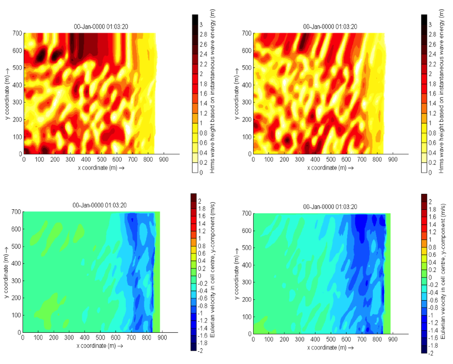

*Figure 3.1 Effect of the lateral wave boundary conditions on root-mean
square wave height patterns (top) and longshore velocity (bottom) for
the Delilah test case. In this figure the left panels are used for
simulations with Neumann boundaries and the right panel with the
wavecrest boundary.*

Shallow water equations
-----------------------

Offshore boundary
~~~~~~~~~~~~~~~~~

Typically, an offshore or lateral boundary is an artificial boundary
which has no physical meaning. On the offshore boundary wave and flow
conditions are imposed. In the domain waves and currents will be
generated which need to pass through the offshore boundary to the deep
sea with minimal reflection. One way to do this is to impose a weakly
reflective-type boundary condition (absorbing-generating), but there are
also other possibilities implemented in XBeach (keyword: *front*). This
method can be applied in 1D or 2D, is recommended and therefore the
default value for XBeach.

In XBeach, there are two options with regard to the offshore
absorbing-generating boundary condition. With the parameter setting
*front = abs1d* a simple one-dimensional absorbing-generating boundary
condition is activated. This option allows for a time-varying water
level (surge and/or infragravity waves) to be specified at the boundary
while allowing any waves propagating perpendicularly towards the
boundary to be absorbed (i.e., passed through the boundary with a
minimum of reflection. It is therefore only useful for 1D (flume like)
simulations.

With option *front = abs2d* (default value) the formulation by Van
Dongeren and Svendsen (1997) is activated which in turn is based on
Verboom et al. (1981) and is based on the ‘Method of Characteristics’.
This boundary condition allows for obliquely-incident and
obliquely-reflected waves to pass through the boundary. It is possible
to account for situations with boundary-perpendicular and
boundary-parallel currents. In order to differentiate between the
particle velocities, the keyword *epsi* must be set. This parameter
control a simple Kalman-update filter which controls which part of the
particle velocity is assumed to be part of the current and which part is
wave-related. By default XBeach computes the value for epsi
automatically using offshore boundary conditions (keyword: *epsi = -1*).

There are three other possibilities implemented besides the
absorbing-generating boundary conditions:

#. No flux wall (keyword: *front = wall*). This boundary condition type
   is a simple no flux boundary condition.

#. Water level specification (keyword: *front = wlevel*). This boundary
   sets the water level at a prescribed value. This can be constant or
   time-varying. With this option the outgoing long waves are not
   absorbed.

#. Boundary condition for the non-hydrostatic option (keyword*: front =
   nonh\_1d*). The user needs to provide a file containing time series
   for the velocity at the boundary.

#. Radiation boundary condition (keyword: *front = waveflume*). This
   boundary uses a continuity relation at the front boundary. This means
   that no net water can come into the model domain. The wave flume
   boundary condition is especially useful in lab experiments with a
   large set-up (e.g. coral reefs).

Lateral boundaries
~~~~~~~~~~~~~~~~~~

Lateral boundaries are the boundaries perpendicular to the coastline.
Usually these are artificial, because the model domain is limited but
the physical coast will continue. At these boundaries (keywords: *left*
& *right*) we need to prescribe information about the area beyond the
numerical model domain in such a way that the boundary condition does
not influence the results in an adverse way. One way to do this is to
prescribe a so-called “no-gradient” or Neumann boundaries (XBeach
default), which state that there is locally no change in surface
elevation and velocity, but there are also other possibilities
implemented into XBeach. This method is recommended and is therefore the
default value for XBeach. Each lateral boundary is a separate condition,
so it is possible to mix different type of lateral boundary per side.

Neumann boundary conditions are activated where the longshore water
level gradient is prescribed. The alongshore gradient is prescribed by
the difference in specified water levels at the offshore corner points,
divided by the alongshore length of the domain. This type of Neumann
boundary condition has been shown to work quite well with (quasi-)
stationary situations, where the coast can be assumed to be uniform
alongshore outside the model domain. So far we have found that also in
case of obliquely incident wave groups this kind of boundary conditions
appears to give reasonable results when a shadow zone is taken into
account. This means that regions where the boundary conditions are not
fully enforced the results are not taken into account. Neumann
boundaries can be individually defined (keyword: *left = neumann).*

There are three other possibilities implemented besides the
absorbing-generating boundary conditions:

#. Simple no-flux boundary conditions can also be applied (keyword:
   *left = wall*). Wall boundary conditions will result in a zero
   velocity at the lateral boundary.

#. Velocity at the boundary will be calculated from NLSWE, but only
   include the advective terms (keywords: *left = no\_advec*). The
   effect is that only terms that decrease the velocity will be taken
   into account. The result is an intermediate form between a full
   Neumann boundary and a wall boundary.

#. Velocity at the boundary will simply be copied from the adjacent cell
   in the model domain (keyword: *left = neumann\_v*).

Tide and surge
~~~~~~~~~~~~~~

XBeach can take in up to four time-vary tidal signals to be applied to
the four boundaries (offshore-left, backshore-left, backshore-right,
offshore-right). A time-varying water level signal is read into XBeach
by reading the specified file in zs0file. The input signal will be
interpolated to the local time step of the simulation; therefore the
signals only need to be long enough and temporally-fine enough to
resolve the water level phenomenon of interest (i.e. tide variations,
surge event).

There are now four options for handling the tidal and/or surge
contribution to the boundaries:

#. Uniform water level (keyword: *tideloc = 0*)

#. One time-varying water level signal (keyword: *tideloc = 1*)

#. Two time-varying water level signals, which requires point of
   application indication. (keyword: *tideloc = 2*)

#. Four time-varying water level signals (keyword: *tideloc = 4*)

For the option with a uniform water level the value specified in the
params.txt is applied in the complete model domain (keyword: *zs0*). For
the option with one time-varying water level signal the specified water
level is applied (keyword: *zs0file = name\_of\_your\_time\_serie*) to
the offshore boundary and a fixed value is applied at the backshore
boundary (keyword: *zs0=value*). For the option with two time-varying
water level signals two water level signals are read from the zs0file.
Note: one tidal record is applied to both sea corners and one tidal
record to both land corners. This means there is no alongshore
variation. An alongshore variation can be applied when applying four
time-varying water level signals.

River and point discharge
~~~~~~~~~~~~~~~~~~~~~~~~~

The effect of a river outflow or other discharges can be simulated with
XBeach. Multiple discharge locations can be designated. At a discharge
location the discharge orifice is defined as well as the discharge time
series in :math:`{\rm m}^{3}/{\rm s}`. The discharge orifice always constitutes
an uninterrupted series of full grid abreast cell borders. It is not
possible to define a discharge over half a grid cell nor is it possible
to define a single discharge through grid cell borders that are either
not adjacent or are not abreast.

At each time step the model sets the discharge and velocities at the
grid cell borders that constitute the discharge orifice, which can be
computed given the size of the discharge orifice and discharge time
series. The discharge is positive in positive x or y direction. An
exception is made when discharges are defined at the domain border. In
that case the discharge is positive towards the domain (influx).

When a discharge is defined with a zero size orifice the discharge is
assumed to be in vertical direction where a positive discharge is into
the domain (influx). In these cases the discharge is linked to the
closest grid cell center and at each time step mass according to the
discharge time series is added. No momentum is added in case of a
vertical discharge.

Sediment transport
------------------

The boundary conditions for sediment transport are Neumann boundaries
everywhere, implying that the cross-boundary gradients in the
advection-diffusion equation are set to zero, as well as the gradients
of the bed load transports in that direction. Cross-shore profile
changes due to cross-shore transport gradients are possible, allowing
the boundary to smoothly follow the rest of the model. Still, it is good
modeling practice to have the boundaries away from the area of interest.

Input description
=================

General
-------

Upon running the XBeach executable *xbeach.exe*, the file *params.txt*
in the current working directory will be read. The *params.txt* file
contains grid and bathymetry info, wave input, flow input, morphological
input, etc. in the form of keyword/value pairs. Each keyword/value pair
may contain an actual model parameter or refer to another file with
additional information on the model setup. If a *params.txt* file cannot
be found then XBeach will not run.

In the *params.txt* file there can be a single keyword/value pair per
line. The keywords can be specified in any order. A keyword/value pair
is separated by an equal sign (=). Each line containing an equal sign is
interpreted as a keyword/value pair. Reversely, any lines without an
equal sign are ignored and may be used for comments. Only a few keywords
are required for the model to run, others have default values that are
used in case the keyword is not mentioned in the *params.txt* file. The
essential parameters for a simulation with a JONSWAP spectrum are listed
below:

#. A . This can both in XBeach format (separate x and y files; keyword:
   *xfile* and *yfile*) or Delft3D (one single xy file; keyword:
   *xyfile*). On top of that the user needs to specify the width of each
   domain (keyword: *nx* and *ny*)

#. A file (keyword: *depfile*) that matches with the grid you specified
   at 1)

#. A (keyword: *tstop*) in seconds

#. A for short waves and rollers. The grid is determined by a minimum
   and maximum angle and width per bin (keywords: *thetamin*, *thetamax*
   and *dtheta*).

#. A (keyword: *wbctype = jons*). With a separate file containing the
   variables of the parametric (keyword: *bcfile*).

It is strongly recommended to specify as few parameters explicitly as
possible and rely on the defaults for the other parameters. When running
XBeach, a file called xbeach.log is created, which lists all the
parameters set through the params.txt but also all parameters not set,
for which the defaults are used. When the user starts the model, it
generates a file named XBlog.txt. In this file all the different keyword
available are determined. When no keyword is defined the default value
will be applied.

This chapter describes the possibilities of the *params.*\ txt file and
any auxiliary information files that are called from the *params.txt*
file. The tables in this chapter contain a description of the keywords,
the default values, its units and recommended value ranges, while the
formats for additional input files are described in the relevant
sections. Keyword marked with an astrix (\*) are essential for XBeach to
run. Keywords marked with a plus (+) are considered advanced expert
options and should not be used for regular applications of XBeach.

In this chapter, any references to keywords refer to keywords that can
be used in the *params.txt* file. Also any references to time
indications are in seconds unless stated otherwise. A typical
*params.txt* file for a 1D XBeach model is:

**params.txt**

.. code-block:: text
               
   %%%%%%%%%%%%%%%%%%%%%%%%%%%%%%%%%%%%%%%%%%%%%%%%%%%%%%%%%%%%%%%%%%%%%%%%%%%
   %%% XBeach parameter settings input file                                %%%
   %%%                                                                     %%%
   %%% date: 01-Jan-2015 12:00                                             %%%
   %%% function: xb_write_params                                           %%%
   %%%%%%%%%%%%%%%%%%%%%%%%%%%%%%%%%%%%%%%%%%%%%%%%%%%%%%%%%%%%%%%%%%%%%%%%%%%

   %%% Grid parameters %%%%%%%%%%%%%%%%%%%%%%%%%%%%%%%%%%%%%%%%%%%%%%%%%%%%%%%
   
   depfile = bed.dep
   posdwn = 0
   nx = 265
   ny = 0
   alfa = 0
   vardx = 1
   xfile = x.grd
   yfile = y.grd
   thetamin = -90
   thetamax = 90
   dtheta = 15
   thetanaut = 0
   
   %%% Model time %%%%%%%%%%%%%%%%%%%%%%%%%%%%%%%%%%%%%%%%%%%%%%%%%%%%%%%%%%%%
   
   tstop = 3600
   
   %%% Physical constants %%%%%%%%%%%%%%%%%%%%%%%%%%%%%%%%%%%%%%%%%%%%%%%%%%%%
   
   rho = 1025
   
   %%% Tide boundary conditions %%%%%%%%%%%%%%%%%%%%%%%%%%%%%%%%%%%%%%%%%%%%%%
   
   tideloc = 2
   zs0file = tide.txt
   
   %%% Wave boundary condition parameters %%%%%%%%%%%%%%%%%%%%%%%%%%%%%%%%%%%%
   
   wbctype = jons
   bcfile = filelist.txt
   
   %%% Output variables %%%%%%%%%%%%%%%%%%%%%%%%%%%%%%%%%%%%%%%%%%%%%%%%%%%%%%
   
   outputformat = netcdf
   tint = 3600
   tstart = 0
   nglobalvar = 3
   zb
   zs
   H

Physical processes
------------------

XBeach supports a variety of physical processes from generic, like waves
and flow, to very specific, like ship motions and point discharge. Each
process can be switched on or off. The commonly used processes are
turned on by default. The table below lists the keywords used to switch
on or off physical processes in XBeach.

*Table 4.1 Input parameters for physical processes supported by XBeach*

+----------------+------------------------------------------------------------------------------------------------------------------------+-----------+---------+---------+----------+
| keyword        | description                                                                                                            | default   | range   | units   | remark   |
+================+========================================================================================================================+===========+=========+=========+==========+
| avalanching    | Turn on avalanching                                                                                                    | 1         | 0 - 1   | -       |          |
+----------------+------------------------------------------------------------------------------------------------------------------------+-----------+---------+---------+----------+
| flow           | Turn on flow calculation                                                                                               | 1         | 0 - 1   | -       |          |
+----------------+------------------------------------------------------------------------------------------------------------------------+-----------+---------+---------+----------+
| gwflow+        | Turn on groundwater flow                                                                                               | 0         | 0 - 1   | -       |          |
+----------------+------------------------------------------------------------------------------------------------------------------------+-----------+---------+---------+----------+
| lwave          | Turn on short wave forcing on NLSW equations and boundary conditions                                                   | 1         | 0 - 1   | -       |          |
+----------------+------------------------------------------------------------------------------------------------------------------------+-----------+---------+---------+----------+
| morphology     | Turn on morphology                                                                                                     | 1         | 0 - 1   | -       |          |
+----------------+------------------------------------------------------------------------------------------------------------------------+-----------+---------+---------+----------+
| nonh+          | Turn on non-hydrostatic pressure: 0 = NSWE, 1 = NSW + non-hydrostatic pressure compensation Stelling & Zijlema, 2003   | 0         | 0 - 1   | -       |          |
+----------------+------------------------------------------------------------------------------------------------------------------------+-----------+---------+---------+----------+
| sedtrans       | Turn on sediment transport                                                                                             | 1         | 0 - 1   | -       |          |
+----------------+------------------------------------------------------------------------------------------------------------------------+-----------+---------+---------+----------+
| setbathy       | Turn on time series of prescribed bathy input                                                                          | 0         | 0 - 1   | -       |          |
+----------------+------------------------------------------------------------------------------------------------------------------------+-----------+---------+---------+----------+
| ships+         | Turn on ship waves                                                                                                     | 0         | 0 - 1   | -       |          |
+----------------+------------------------------------------------------------------------------------------------------------------------+-----------+---------+---------+----------+
| single\_dir+   | Turn on stationary model for refraction, surfbeat based on mean direction                                              | 0         | 0 - 1   | -       |          |
+----------------+------------------------------------------------------------------------------------------------------------------------+-----------+---------+---------+----------+
| snells+        | Turn on Snell’s law for wave refraction                                                                                | 0         | 0 - 1   | -       |          |
+----------------+------------------------------------------------------------------------------------------------------------------------+-----------+---------+---------+----------+
| swave          | Turn on short waves                                                                                                    | 1         | 0 - 1   | -       |          |
+----------------+------------------------------------------------------------------------------------------------------------------------+-----------+---------+---------+----------+
| swrunup+       | Turn on short wave runup                                                                                               | 0         | 0 - 1   | -       |          |
+----------------+------------------------------------------------------------------------------------------------------------------------+-----------+---------+---------+----------+
| vegetation+    | Turn on interaction of waves and flow with vegetation                                                                  | 0         | 0 - 1   | -       |          |
+----------------+------------------------------------------------------------------------------------------------------------------------+-----------+---------+---------+----------+

Grid and bathymetry
-------------------

XBeach’ spatial grid size is defined by the keywords *nx* and *ny*. Here
nx are the number of grid points in the cross-shore direction and ny the
number in the alongshore direction. The size of the computational grid
will be *nx+1* by *ny+1* cells large. The initial bathymetry is provided
using a separate file that is referred to by the *depfile* keyword,
which has to have a size of [nx+1, ny+1]. This file contains an initial
bed level for each grid cell where each line corresponds to a transect
in x-direction (cross-shore). The values are positive down by default
(so e.g. a value of ‘10’ is 10 meters depth), but this can be changed
using the *posdwn* keyword.

Three main types of XBeach grids are supported: fast 1D, 1D and 2DH.
Fast 1D grids have a single alongshore grid cell and thus a value *ny=0*
and thus a single row (ny+1=1) in the *depfile*. The 1D grids have 3
alongshore grid cells and thus a value *ny=2* and three rows in the
*depfile*. The 2DH grids have more than 3 alongshore grid cells, a value
*ny >\ 2* and as many rows in the *depfile*. In general, the
bathymetry file has the following space-separated format:

**bed.dep**

.. code-block:: text
                
   <z 1,1> <z 2,1> <z 3,1> ... <z nx,1> <z nx+1,1>
   <z 1,2> <z 2,2> <z 3,2> ... <z nx,2> <z nx+1,2>
   <z 1,3> <z 2,3> <z 3,3> ... <z nx,3> <z nx+1,3>
   
   ...
   
   <z 1,ny> <z 2,ny> <z 3,ny> ... <z nx,ny> <z nx+1,ny>
   <z 1,ny+1> <z 2,ny+1> <z 3,ny+1> ... <z nx,ny+1> <z nx+1,ny+1>

XBeach spatial grids can be equidistant or non-equidistant. In the
former case the grid size is defined by the keywords *dx* and *dy*. In
the latter case the keyword *vardx* should be set to *1* and x- and
y-coordinates of the grid cells should be provided through the files
referenced by the *xfile* and *yfile* keywords. These files take exactly
the same format as the *depfile* file where all coordinates along the
x-direction are in one row and each row represents a cell in
y-direction. XBeach grids are defined in a coordinate system of choice
and can be either rectangular or curvilinear grids. This section can be
found in 2.1.

Delft3D grids created with tools like RFGRID are also supported. To use
Delft3D grids, choose *gridform=delft3d* and provide a grid file via the
keyword *xyfile*. The format of Delft3D grids is not described here, but
can be found in the Delft3D manual (Deltares, 2011). Also forced
updating of bathymetries is supported as described in Section 6.2.11.

Apart for the spatial grid, XBeach also uses a directional grid for
short waves and rollers. The grid is determined by a minimum and maximum
angle and a directional bin size using the keywords *thetamin*,
*thetamax* and *dtheta* respectively. The *thetamin* and *thetamax*
angles are either defined according to the Cartesian convention (angle
w.r.t. the computational x-axis) or according to the nautical convention
(angle w.r.t. deg. N, so from W is 270 deg. N). The convention is chosen
using the keyword *thetanaut* (thetanaut=0 for Cartesian and thetanaut=1
for Nautical)

Examples of typical input for a non-equidistant, fast 1D XBeach model,
together with the *params.txt* example at the start of this chapter,
are:

**depfile = bed.dep**

.. code-block:: text
                
   -20.00 -20.00 -19.90 -19.80 -19.70 ... 14 14 15 15 15

**xfile = x.grd**

.. code-block:: text
                
   0.00 10.00 20.00 30.00 40.00 ... 1992.00 1994.00 1996.00 1998.00 2000.00

**yfile = y.grd**

.. code-block:: text
                
   0.00 0.00 0.00 0.00 0.00 0.00 0.00 ... 0.00 0.00 0.00 0.00 0.00 0.00 0.00

All keywords related to grid and bathymetry input are listed in the
following table:

*Table 4.2 Input parameters for grid and bathymetry supported by XBeach*

+-------------+------------------------------------------------------------------------------+-----------+--------------------------------+------------------------------+----------+
| keyword     | description                                                                  | default   | range                          | units                        | remark   |
+=============+==============================================================================+===========+================================+==============================+==========+
| alfa        | Angle of computational x-axis relative to “East”                             | 0.0       | 0.0 - 360.0                    | deg                          |          |
+-------------+------------------------------------------------------------------------------+-----------+--------------------------------+------------------------------+----------+
| depfile     | Name of the input bathymetry file                                            |           |                                | <file>                       |          |
+-------------+------------------------------------------------------------------------------+-----------+--------------------------------+------------------------------+----------+
| dtheta      | Directional resolution                                                       | 10.0      | 0.1 - 20.0                     | deg                          |          |
+-------------+------------------------------------------------------------------------------+-----------+--------------------------------+------------------------------+----------+
| dtheta_s    | Directional resolution in case of stationary refraction                      | 10.0      | 0.1 - 20.0                     | deg                          |          |
+-------------+------------------------------------------------------------------------------+-----------+--------------------------------+------------------------------+----------+
| dx          | Regular grid spacing in x-direction                                          | -1.0      | 0.0 - 1000000000.0             | m                            |          |
+-------------+------------------------------------------------------------------------------+-----------+--------------------------------+------------------------------+----------+
| dy          | Regular grid spacing in y-direction                                          | -1.0      | 0.0 - 1000000000.0             | m                            |          |
+-------------+------------------------------------------------------------------------------+-----------+--------------------------------+------------------------------+----------+
| gridform    | Grid definition format                                                       | xbeach    | xbeach, delft3d                |                              |          |
+-------------+------------------------------------------------------------------------------+-----------+--------------------------------+------------------------------+----------+
| nx          | Number of computational cell corners in x-direction                          | 50        | 2 - 10000                      | -                            |          |
+-------------+------------------------------------------------------------------------------+-----------+--------------------------------+------------------------------+----------+
| ny          | Number of computational cell corners in y-direction                          | 2         | 0 - 10000                      | -                            |          |
+-------------+------------------------------------------------------------------------------+-----------+--------------------------------+------------------------------+----------+
| posdwn      | Bathymetry is specified positive down or positive up (-1)                    | 1.0       | -1.0 - 1.0                     | -                            |          |
+-------------+------------------------------------------------------------------------------+-----------+--------------------------------+------------------------------+----------+
| thetamax    | Higher directional limit (angle w.r.t computational x-axis)                  | 90.0      | -180.0 - 180.0                 | deg                          |          |
+-------------+------------------------------------------------------------------------------+-----------+--------------------------------+------------------------------+----------+
| thetamin    | Lower directional limit (angle w.r.t computational x-axis)                   | -90.0     | -180.0 - 180.0                 | deg                          |          |
+-------------+------------------------------------------------------------------------------+-----------+--------------------------------+------------------------------+----------+
| thetanaut   | specify thetamin and thetamax in cartesian (0) or nautical convention        | 0         | 0 - 1                          | -                            |          |
+-------------+------------------------------------------------------------------------------+-----------+--------------------------------+------------------------------+----------+
| vardx       | Switch for variable grid spacing                                             | 0         | 0 - 1                          | -                            |          |
+-------------+------------------------------------------------------------------------------+-----------+--------------------------------+------------------------------+----------+
| xfile       | Name of the file containing x-coordinates of the calculation grid            |           |                                | <file>                       |          |
+-------------+------------------------------------------------------------------------------+-----------+--------------------------------+------------------------------+----------+
| xori        | X-coordinate of origin of axis                                               | 0.0       | -100000000.0 - 1000000000.0    | m                            |          |
+-------------+------------------------------------------------------------------------------+-----------+--------------------------------+------------------------------+----------+
| xyfile      | Name of the file containing Delft3D xy-coordinates of the calculation grid   |           |                                | <file>                       |          |
+-------------+------------------------------------------------------------------------------+-----------+--------------------------------+------------------------------+----------+
| yfile\*     | Name of the file containing y-coordinates of the calculation grid            |           |                                | <file>                       |          |
+-------------+------------------------------------------------------------------------------+-----------+--------------------------------+------------------------------+----------+
| yori        | Y-coordinate of origin of axis                                               | 0.0       | -1000000000.0 - 1000000000.0   | m                            |          |
+-------------+------------------------------------------------------------------------------+-----------+--------------------------------+------------------------------+----------+

Waves input
-----------

An XBeach model is generally forced by waves on its offshore boundary.
These waves are described by the wave boundary conditions discussed in
this section. The details of the wave motions within the model are
described by the wave numerics in terms of the wave action balance (see
2.3.1), wave dissipation model (see 0) and wave roller model (see 2.3.6)

XBeach supports a variety of wave boundary condition types that are
divided in two main groups: stationary and spectral boundary conditions.
The *wbctype* keyword can be used to select one particular type of wave
boundary conditions. 3.1 gives an overview of all types of wave boundary
conditions available for XBeach. Figure 4.1 can be used to help
determine what type of wave boundary conditions is appropriate for your
case. Each wave boundary condition type is explained in the following
subsections. Note that most spectral wave boundary conditions can vary
both in space and time using a *FILELIST* and/or *LOCLIST* construction
as described in 4.4.4.

*Table 4.3 Overview of wave boundary conditions supported by XBeach*

+---------------+----------------+------------------------------------------------------------------------------------------------------------------------------------+
| wbctype       | Type           | description                                                                                                                        |
+===============+================+====================================================================================================================================+
| off           | Special        | no wave boundary condition                                                                                                         |
+---------------+----------------+------------------------------------------------------------------------------------------------------------------------------------+
| stat          | Non-spectral   | stationary wave boundary condition (sea state)                                                                                     |
+---------------+----------------+------------------------------------------------------------------------------------------------------------------------------------+
| bichrom       | Special        | bichromatic (two wave component) waves                                                                                             |
+---------------+----------------+------------------------------------------------------------------------------------------------------------------------------------+
| ts\_1         | Non-spectral   | first-order time series of waves (generated outside XBeach), this option specifies free surface elevation and short wave energy    |
+---------------+----------------+------------------------------------------------------------------------------------------------------------------------------------+
| ts\_2         | Non-spectral   | second-order time series of waves (generated outside XBeach), this option specifies free surface elevation and short wave energy   |
+---------------+----------------+------------------------------------------------------------------------------------------------------------------------------------+
| jons          | Spectral       | wave groups generated using a parametric (JONSWAP) spectrum                                                                        |
+---------------+----------------+------------------------------------------------------------------------------------------------------------------------------------+
| swan          | Spectral       | wave groups generated using a SWAN 2D output file                                                                                  |
+---------------+----------------+------------------------------------------------------------------------------------------------------------------------------------+
| vardens       | Spectral       | wave groups generated using a formatted file                                                                                       |
+---------------+----------------+------------------------------------------------------------------------------------------------------------------------------------+
| ts\_nonh      | Non-spectral   | boundary conditions initially meant for the non-hydrostatic wave type, this option specifies free surface elevation and velocity   |
+---------------+----------------+------------------------------------------------------------------------------------------------------------------------------------+
| reuse         | Special        | reuse of wave conditions                                                                                                           |
+---------------+----------------+------------------------------------------------------------------------------------------------------------------------------------+
| stat\_table   | Non-spectral   | a sequence of stationary conditions (sea states)                                                                                   |
+---------------+----------------+------------------------------------------------------------------------------------------------------------------------------------+
| jons\_table   | Spectral       | a sequence of time-varying wave groups                                                                                             |
+---------------+----------------+------------------------------------------------------------------------------------------------------------------------------------+

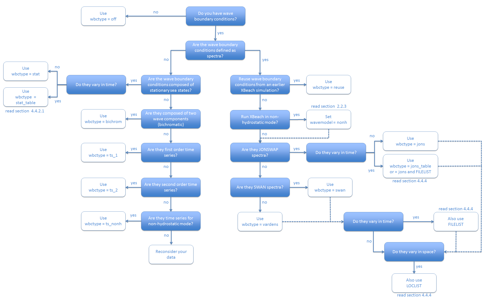

*Figure 4.1 Decision tree for selecting the appropriate type of wave
boundary conditions*

Spectral wave boundary conditions
~~~~~~~~~~~~~~~~~~~~~~~~~~~~~~~~~

Spectral wave boundary conditions are enabled using *wbctype* values
*jons*, *swan*, *vardens* or *jons\_table*. The conditions are defined
in separate files referenced from the *params.txt* file using the
*bcfile* keyword. A spectral wave boundary condition describes a
spectrum *shape* that XBeach uses to generate a (random) wave time
series. The length and resolution of the generated time series is
determined by the keywords *rt* and *dtbc* respectively. XBeach will
reuse the generated time series until the simulation is completed. The
resolution of the time series should be enough to accurately represent
the bound long wave, but need not be as small as the time step used in
XBeach.

An overview of all keywords relevant for spectral wave boundary
conditions is given in the table below. The necessary file formats for
each type of spectral wave boundary condition is explained in the
following subsections.

*Table 4.4 Input parameters for spectral wave boundary conditions
supported by XBeach*

+-----------------+--------------------------------------------------------------------------------------------------------------------------+-----------+----------------------------------------------------------------------------------------------------+------------------------------+----------+
| keyword         | description                                                                                                              | default   | range                                                                                              | units                        | remark   |
+=================+==========================================================================================================================+===========+====================================================================================================+==============================+==========+
| Tm01switch+     | Switch to enable Tm01 rather than Tm-10                                                                                  | 0         | 0 - 1                                                                                              | -                            |          |
+-----------------+--------------------------------------------------------------------------------------------------------------------------+-----------+----------------------------------------------------------------------------------------------------+------------------------------+----------+
| bcfile          | Name of spectrum file                                                                                                    |           |                                                                                                    | <file>                       |          |
+-----------------+--------------------------------------------------------------------------------------------------------------------------+-----------+----------------------------------------------------------------------------------------------------+------------------------------+----------+
| correctHm0+     | Switch to enable Hm0 correction                                                                                          | 1         | 0 - 1                                                                                              | -                            |          |
+-----------------+--------------------------------------------------------------------------------------------------------------------------+-----------+----------------------------------------------------------------------------------------------------+------------------------------+----------+
| dtbc+           | Time step used to describe time series of wave energy and long wave flux at offshore boundary (not affected by morfac)   | 1.0       | 0.1 - 2.0                                                                                          | s                            |          |
+-----------------+--------------------------------------------------------------------------------------------------------------------------+-----------+----------------------------------------------------------------------------------------------------+------------------------------+----------+
| dthetaS\_XB+    | The (counter-clockwise) angle in the degrees needed to rotate from the x-axis in SWAN to the x-axis pointing East        | 0.0       | -360.0 - 360.0                                                                                     | deg                          |          |
+-----------------+--------------------------------------------------------------------------------------------------------------------------+-----------+----------------------------------------------------------------------------------------------------+------------------------------+----------+
| fcutoff+        | Low-freq cutoff frequency for wbctype = jons, swan or vardens boundary conditions                                        | 0.0       | 0.0 - 40.0                                                                                         | Hz                           |          |
+-----------------+--------------------------------------------------------------------------------------------------------------------------+-----------+----------------------------------------------------------------------------------------------------+------------------------------+----------+
| wbctype         | Wave boundary condition type                                                                                             | bichrom   | stat, bichrom, ts\_1, ts\_2, jons, swan, vardens, reuse, ts\_nonh, off, stat\_table, jons\_table   |                              |          |
+-----------------+--------------------------------------------------------------------------------------------------------------------------+-----------+----------------------------------------------------------------------------------------------------+------------------------------+----------+
| nonhspectrum+   | Spectrum format for wave action balance of non-hydrostatic waves                                                         | 0         | 0 - 1                                                                                              | -                            |          |
+-----------------+--------------------------------------------------------------------------------------------------------------------------+-----------+----------------------------------------------------------------------------------------------------+------------------------------+----------+
| nspectrumloc+   | Number of input spectrum locations                                                                                       | 1         | 1 – ny+1                                                                                           | -                            |          |
+-----------------+--------------------------------------------------------------------------------------------------------------------------+-----------+----------------------------------------------------------------------------------------------------+------------------------------+----------+
| nspr+           | Switch to enable long wave direction forced into centers of short wave bins                                              | 0         | 0 - 1                                                                                              | -                            |          |
+-----------------+--------------------------------------------------------------------------------------------------------------------------+-----------+----------------------------------------------------------------------------------------------------+------------------------------+----------+
| oldnyq+         | Switch to enable old nyquist switch                                                                                      | 0         | 0 - 1                                                                                              | -                            |          |
+-----------------+--------------------------------------------------------------------------------------------------------------------------+-----------+----------------------------------------------------------------------------------------------------+------------------------------+----------+
| random+         | Switch to enable random seed for wbctype = jons, swan or vardens boundary conditions                                     | 1         | 0 - 1                                                                                              | -                            |          |
+-----------------+--------------------------------------------------------------------------------------------------------------------------+-----------+----------------------------------------------------------------------------------------------------+------------------------------+----------+
| rt              | Duration of wave spectrum at offshore boundary, in morphological time                                                    | 3600      | 1200-7200                                                                                          | s                            |          |
+-----------------+--------------------------------------------------------------------------------------------------------------------------+-----------+----------------------------------------------------------------------------------------------------+------------------------------+----------+
| sprdthr+        | Threshold ratio to maximum value of S above which spectrum densities are read in                                         | 0.08      | 0.0 - 1.0                                                                                          | -                            |          |
+-----------------+--------------------------------------------------------------------------------------------------------------------------+-----------+----------------------------------------------------------------------------------------------------+------------------------------+----------+
| trepfac+        | Compute mean wave period over energy band: for wbctype jons, swan or vardens; converges to Tm01 for trepfac = 0.0 and    | 0.01      | 0.0 - 1.0                                                                                          | -                            |          |
+-----------------+--------------------------------------------------------------------------------------------------------------------------+-----------+----------------------------------------------------------------------------------------------------+------------------------------+----------+
| wbcversion+     | Version of wave boundary conditions                                                                                      | 3         | 1 - 3                                                                                              | -                            |          |
+-----------------+--------------------------------------------------------------------------------------------------------------------------+-----------+----------------------------------------------------------------------------------------------------+------------------------------+----------+

JONSWAP wave spectra
^^^^^^^^^^^^^^^^^^^^

JONSWAP spectrum input is enabled using *wbctype* *= jons*. A JONSWAP
wave spectrum is parametrically defined in a file that is referenced
using the *bcfile* keyword. This file contains a single parameter per
line in arbitrary order. The parameters that can be defined are listed
in Table 4.5. All variables are optional. If no value is given, the
default value as specified in the table is used. It is advised not to
specify the keyword *dfj* and allow XBeach to calculate the default
value.

A typical JONSWAP definition file looks as follows:

**jonswap.txt**

.. code-block:: text
                
   Hm0 = 0.8
   Tp = 8
   mainang = 285.
   gammajsp = 3.3
   s = 10.
   fnyq = 0.3

For the definitions see the table below.

It is possible to use an alternative file format for time-varying
JONSWAP spectra. To enable this option use the *wbctype* value
*jons\_table*. In this case, each line in the spectrum definition file
contains a parametric definition of a spectrum, like in a regular
JONSWAP definition file, plus the duration for which that spectrum is
used during the simulation. XBeach does not reuse time-varying spectrum
files. Therefore the total duration of all spectra should at least match
the duration of the simulation. The name of the file can be chosen
freely, but the file format is fixed as follows and all parameters
should be present in all lines:

**jonswap.txt**

.. code-block:: text
                
   <Hm0> <Tp> <mainang> <gammajsp> <s> <duration> <dtbc>

Note that we refer to the keywords used in a regular JONSWAP definition
file in this example, with three differences: 1) the peak period rather
than the peak frequency is defined 2) the duration is added (similar to
*rt* in *params.txt*) 3) the time resolution is added (similar to *dtbc*
in *params.txt*). The duration and boundary condition time step in this
file overrules *rt* and *dtbf* in *params.txt*. This format is also used
for time-varying stationary wave boundary conditions as described in

. As an example, the JONSWAP spectrum definition file presented above
would look as follows if the significant wave height should be increased
with 0.2 m every hour:

**jonswap.txt**

.. code-block:: text
                
   0.8 8. 285. 3.3 10. 0.3 3600. 1
   1.0 8. 285. 3.3 10. 0.3 3600. 1
   1.2 8. 285. 3.3 10. 0.3 3600. 1

A more generic way of providing time-varying spectral wave boundary
conditions is using a FILELIST construction as described in 4.4.4
Temporally and/or spatially varying wave boundary conditions. This
approach is compatible with all spectral wave boundary condition types
as well as spatially varying boundary conditions as described in the
same section.

The parameter s in the JONSWAP spectrum definition is related to the
directional spreading (in deg.) through the following relation
:math:`\sigma =\sqrt{\frac{2}{s+1} } \, s=\frac{2}{\sigma ^{2} } -1`.
Here :math:`\sigma` is the directional spreading in radians and s the
JONSWAP spreading parameter.

.. figure:: image25.png

*Figure 4.2 Effect a variation in s for the direction spreading of wave
energy*

*Table 4.5 Overview of available keywords in JONSWAP definition file*

+------------+-------------------------------------------------------------------+------------+-------------+-----------+
| keyword    | description                                                       | default    | minimum     | maximum   |
+============+===================================================================+============+=============+===========+
| Hm0        | Hm0 of the wave spectrum, significant wave height [m]             | 0.0        | 0.0         | 5.0       |
+------------+-------------------------------------------------------------------+------------+-------------+-----------+
| fp         | Peak frequency of the wave spectrum [s-1]                         | 0.08       | 0.0625      | 0.4       |
+------------+-------------------------------------------------------------------+------------+-------------+-----------+
| gammajsp   | Peak enhancement factor in the JONSWAP expression [-]             | 3.3        | 1.0         | 5.0       |
+------------+-------------------------------------------------------------------+------------+-------------+-----------+
| s          | Directional spreading coefficient, :math:`{\cos}^{2s}` law [-]    | 10.        | 1.0         | 1000.     |
+------------+-------------------------------------------------------------------+------------+-------------+-----------+
| mainang    | Main wave angle (nautical convention) [:math:`{}^\circ`]          | 270.       | 180.        | 360.      |
+------------+-------------------------------------------------------------------+------------+-------------+-----------+
| fnyq       | Highest frequency used to create JONSWAP spectrum [s-1]           | 0.3        | 0.2         | 1.0       |
+------------+-------------------------------------------------------------------+------------+-------------+-----------+
| dfj        | Step size frequency used to create JONSWAP spectrum [s-1]         | fnyq/200   | fnyq/1000   | fnyq/20   |
+------------+-------------------------------------------------------------------+------------+-------------+-----------+

SWAN wave spectra
^^^^^^^^^^^^^^^^^

XBeach can read standard SWAN 2D variance density or energy density
output files (+.sp2 files) as specified in the SWAN v40.51 manual. This
option is enabled using *wbctype* *= swan* in *params.txt* and a
reference to the spectrum file via the keyword *bcfile*. XBeach assumes
the directional information in the SWAN file is according to the
nautical convention. If the file uses the Cartesian convention for
directions, the user must specify the angle in degrees to rotate the
x-axis in SWAN to the x-axis in XBeach (by the Cartesian convention).
This value is specified in *params.txt* using the keyword *dthetaS\_XB*.

Note that time-varying and spatially varying SWAN spectra can be
provided using the FILELIST and LOCLIST constructions as described in
4.4.4.

An example of a 2D SWAN spectrum is given below:

**swan.txt**

.. code-block:: text
                
   SWAN 1 Swan standard spectral file
   $ Data produced by SWAN version 40.51
   $ Project:’projname’ ; run number:’runnum’
   LOCATIONS locations in x-y-space
   1 number of locations
   22222.22 0.00
   RFREQ relative frequencies in Hz
   23 number of frequencies
   0.0545
   0.0622
   0.0710
   0.0810
   0.0924
   0.1055
   0.1204
   0.1375
   0.1569
   0.1791
   0.2045
   0.2334
   0.2664
   0.3040
   0.3470
   0.3961
   0.4522
   0.5161
   0.5891
   0.6724
   0.7675
   0.8761
   1.0000
   CDIR spectral Cartesian directions in degr 12 number of directions
   30.0000
   60.0000
   90.0000
   120.0000
   150.0000
   180.0000
   210.0000
   240.0000
   270.0000
   300.0000
   330.0000
   360.0000
   QUANT 1 number of quantities in table VaDens variance densities in m2/Hz/degr m2/Hz/degr unit
   -0.9900E+02 exception value
   FACTOR
   0.675611E-06
   51 242 574 956 1288 1482 1481 1286 957 579 244 51
   129 610 1443 2402 3238 3725 3724 3234 2406 1454 613 128
   273 1287 3054 5084 6846 7872 7869 6837 5091 3076 1295 271
   665 3152 7463 12402 16712 19229 19221 16690 12419 7518 3172 662
   1302 6159 14608 24275 32688 37618 37603 32644 24309 14716 6198 1296
   2328 10989 26020 43341 58358 67109 67080 58281 43401 26213 11058 2317
   3365 15922 37712 62733 84492 97150 97110 84380 62820 37991 16021 3349
   3426 16230 38440 63939 86109 99010 98969 85995 64027 38724 16331 3410
   2027 9612 22730 37790 50909 58529 58505 50841 37843 22898 9672 2018
   672 3178 7538 12535 16892 19440 19432 16870 12552 7594 3198 669
   101 479 1135 1890 2542 2924 2923 2539 1892 1144 482 101
   2 11 26 43 57 66 66 57 43 26 11 2
   0 0 0 0 0 0 0 0 0 0 0 0
   0 0 0 0 0 0 0 0 0 0 0 0
   0 0 0 0 0 0 0 0 0 0 0 0
   0 0 0 0 0 0 0 0 0 0 0 0
   0 0 0 0 0 0 0 0 0 0 0 0
   0 0 0 0 0 0 0 0 0 0 0 0
   0 0 0 0 0 0 0 0 0 0 0 0
   0 0 0 0 0 0 0 0 0 0 0 0
   0 0 0 0 0 0 0 0 0 0 0 0
   0 0 0 0 0 0 0 0 0 0 0 0
   0 0 0 0 0 0 0 0 0 0 0 0
   0 0 0 0 0 0 0 0 0 0 0 0

Variance density spectra
^^^^^^^^^^^^^^^^^^^^^^^^^

2D spectral information that is not in SWAN format can be provided using
a formatted variance density spectrum file and *wbctype = vardens*. The
spectrum file itself is again referenced using the keyword *bcfile*. The
contents of the file must adhere to a specific format:

**vardens.txt**

.. code-block:: text
                
   <number of frequencies (n)>
   <frequency 1>
   <frequency 2>
   <frequency 3>

   ...

   <frequency n-1>
   <frequency n>
   <number of directions (m)>
   <directions 1>
   <directions 2>
   <directions 3>

   ...

   <directions m-1>
   <directions m>
   <variance density 1,1> <variance density 2,1> ... <variance density m,1>
   <variance density 1,2> <variance density 2,2> ... <variance density m,2>
   
   ...
   
   <variance density 1,n> <variance density 2,n> ... <variance density m,n>

Note that the directions must be defined according to the Cartesian
convention and in the coordinate system used by XBeach. In this
coordinate system :math:`{0}^\circ` corresponds to waves travelling in
the direction of the x-axis, while :math:`{90}^\circ` corresponds to
the direction of the y-axis. Also, the directions must be defined in
increasing order. Time-varying and spatially varying variance density
spectra can be provided using the FILELIST and LOCLIST constructions as
described in 4.4.4 Temporally and/or spatially varying wave boundary
conditions.

An example of a formatted variance density file is given below:

**vardens.txt**

.. code-block:: text
                
   15
   0.0418
   0.0477
   0.0545
   0.0622
   0.0710
   0.0810
   0.0924
   0.1055
   0.1204
   0.1375
   0.1569
   0.1791
   0.2045
   0.2334
   0.2664
   13
   -180.0000
   -150.0000
   -120.0000
   -90.0000
   -60.0000
   -30.0000
   0.0000
   30.0000
   60.0000
   90.0000
   120.0000
   150.0000
   180.0000
   0 0 0 0 0 0 0 0 0 0 0 0
   51 242 574 956 1288 1482 1481 1286 957 579 244 51
   129 610 1443 2402 3238 3725 3724 3234 2406 1454 613 128
   273 1287 3054 5084 6846 7872 7869 6837 5091 3076 1295 271
   665 3152 7463 12402 16712 19229 19221 16690 12419 7518 3172 662
   1302 6159 14608 24275 32688 37618 37603 32644 24309 14716 6198 1296
   2328 10989 26020 43341 58358 67109 67080 58281 43401 26213 11058 2317
   3365 15922 37712 62733 84492 97150 97110 84380 62820 37991 16021 3349
   3426 16230 38440 63939 86109 99010 98969 85995 64027 38724 16331 3410
   2027 9612 22730 37790 50909 58529 58505 50841 37843 22898 9672 2018
   672 3178 7538 12535 16892 19440 19432 16870 12552 7594 3198 669
   101 479 1135 1890 2542 2924 2923 2539 1892 1144 482 101
   2 11 26 43 57 66 66 57 43 26 11 2
   0 0 0 1 1 1 1 1 1 0 0 0
   0 0 0 0 0 0 0 0 0 0 0 0
   0 0 0 0 0 0 0 0 0 0 0 0

Non-spectral wave boundary conditions
~~~~~~~~~~~~~~~~~~~~~~~~~~~~~~~~~~~~~~

Stationary wave boundary conditions are enabled using *wbctype* values
*stat*, *ts\_1*, *ts\_2, ts\_nonh* or *stat\_table*. The conditions are
generally defined within the *params.txt* file directly using the
keywords described in the table below. In addition, in case of *wbctype*
values *ts\_1* or *ts\_2* the file *bc/gen.ezs* should be present that
describes the infragravity wave forcing generated outside of XBeach. For
the *wbctype* *ts\_nonh* also a separate file is needed. More
information about these files in 4.4.2.2.

Stationary wave boundary conditions
^^^^^^^^^^^^^^^^^^^^^^^^^^^^^^^^^^^

Only in case of *wbctype = stat\_table* the time-varying stationary wave
boundary conditions are fully described in an external file referenced
by the *bcfile* keyword. The *bcfile* keyword is part of the spectral
wave boundary condition input and also the referenced file is designed
for time-varying spectral input in the form of JONSWAP spectra (see
4.4.1.1). In stationary mode only the relevant data from this file is
used and irrelevant data like *gamma* and *dfj* are discarded.

*Table 4.6 Overview of available keywords for stationary boundary
conditions*

+---------------+-----------------------------------------------------------------------------------------+-----------+----------------------------------------------------------------------------------------------------+---------+----------+
| keyword       | description                                                                             | default   | range                                                                                              | units   | remark   |
+===============+=========================================================================================+===========+====================================================================================================+=========+==========+
| Hrms          | Hrms wave height for wbctype = stat, bichrom, ts\_1 or ts\_2                            | 1.0       | 0.0 - 10.0                                                                                         | m       |          |
+---------------+-----------------------------------------------------------------------------------------+-----------+----------------------------------------------------------------------------------------------------+---------+----------+
| Tlong         | Wave group period for case wbctype = bichrom                                            | 80.0      | 20.0 - 300.0                                                                                       | s       |          |
+---------------+-----------------------------------------------------------------------------------------+-----------+----------------------------------------------------------------------------------------------------+---------+----------+
| Trep          | Representative wave period for wbctype = stat, bichrom, ts\_1 or ts\_2                  | 10.0      | 1.0 - 20.0                                                                                         | s       |          |
+---------------+-----------------------------------------------------------------------------------------+-----------+----------------------------------------------------------------------------------------------------+---------+----------+
| dir0          | Mean wave direction for wbctype = stat, bichrom, ts\_1 or ts\_2 (nautical convention)   | 270.0     | 180.0 - 360.0                                                                                      | deg     |          |
+---------------+-----------------------------------------------------------------------------------------+-----------+----------------------------------------------------------------------------------------------------+---------+----------+
| wbctype       | Wave boundary condition type                                                            | bichrom   | stat, bichrom, ts\_1, ts\_2, jons, swan, vardens, reuse, ts\_nonh, off, stat\_table, jons\_table   |         |          |
+---------------+-----------------------------------------------------------------------------------------+-----------+----------------------------------------------------------------------------------------------------+---------+----------+
| lateralwave   | Switch for lateral boundary at left                                                     | neumann   | neumann, wavecrest, cyclic                                                                         |         |          |
+---------------+-----------------------------------------------------------------------------------------+-----------+----------------------------------------------------------------------------------------------------+---------+----------+
| m             | Power in cos^m directional distribution for wbctype = stat, bichrom, ts\_1 or ts\_2     | 10        | 2 - 128                                                                                            | -       |          |
+---------------+-----------------------------------------------------------------------------------------+-----------+----------------------------------------------------------------------------------------------------+---------+----------+
| nmax+         | Maximum ratio of cg/c for computing long wave boundary conditions                       | 0.8       | 0.5 - 1.0                                                                                          | -       |          |
+---------------+-----------------------------------------------------------------------------------------+-----------+----------------------------------------------------------------------------------------------------+---------+----------+
| taper         | Spin-up time of wave boundary conditions, in morphological time                         | 100.0     | 0.0 - 1000.0                                                                                       | s       |          |
+---------------+-----------------------------------------------------------------------------------------+-----------+----------------------------------------------------------------------------------------------------+---------+----------+

Time series
^^^^^^^^^^^

The wave boundary condition types of ts\_1 and ts\_2 need a separate
file containing short wave energy and free surface elevation (including
long wave motions). The format of this file is as follows:

**bc/gen.ezs**

.. code-block:: text
                
   <time 1> <zs 1> <E 1>
   <time 1> <zs 2> <E 2>
   <time 2> <zs 3> <E 3>

   ...

The wave boundary condition type of *ts_nonh* also needs a separate
file in order to run the simulation. This file, however, needs to
contain free surface elevations and velocities (both in u and v).

**Boun_u.bcf**

.. code-block:: text
                
   <scalar/vector>
   <number of variables>
   <variables: t,U,Zs,W>

.. math::

   \left. \begin{array}{cccccccccc} {t^{0} } & {U_{1}^{0} } & {\cdots } & {U_{J}^{0} } & {\eta _{1}^{0} } & {\cdots } & {\eta _{J}^{0} } & {W_{1}^{0} } & {\cdots } & {W_{J}^{0} } \\ {\vdots } & {\vdots } & {} & {\vdots } & {\vdots } & {} & {\vdots } & {\vdots } & {} & {\vdots } \\ {t^{n} } & {U_{1}^{N} } & {\cdots } & {U_{J}^{N} } & {\eta _{1}^{N} } & {\cdots } & {\eta _{J}^{N} } & {W_{1}^{N} } & {\cdots } & {W_{J}^{N} } \end{array}\right\}{[Data]}

Special types of wave boundary conditions
~~~~~~~~~~~~~~~~~~~~~~~~~~~~~~~~~~~~~~~~~~

Two special types of wave boundary conditions are available that makes
XBeach skip the generation of new wave time series. The first is
*wbctype* *= off* which simply does not provide any wave forcing on the
model and hence no wave action in the model.

The second is *wbctype* *= reuse* which makes XBeach reuse wave time
series that were generated during a previous simulation. This can be a
simulation using the same or a different model as long as the
computational grids are identical. In order to reuse boundary
conditions, all relevant files should be copied to the current working
directory of the model (where the *params.txt* file is located).
Relevant files are the *ebcflist.bcf* and *qbcflist.bcf* files and all
files referenced therein. Generally, the referenced files have *E\_* and
*q\_* prefixes. No further wave boundary condition data need be given in
*params.txt*.

On top of that bichromatic waves are also supported. Currently the same
input parameters as non-spectral waves (see 4.4.2) are required; however
there are planes to elaborate the input parameters of the bichromatic
wave in order to specify individual frequency.

Temporally and/or spatially varying wave boundary conditions
~~~~~~~~~~~~~~~~~~~~~~~~~~~~~~~~~~~~~~~~~~~~~~~~~~~~~~~~~~~~

Time-varying spectral wave boundary conditions can be defined by feeding
in multiple spectrum definition files rather than a single definition
file. In addition, the duration for which these spectra should occur
needs to be defined.

To make use of this option, the user must specify a regular *wbctype*
value for spectral wave boundary conditions (*jons*, *swan* or
*vardens*), but instead of referencing a single spectrum definition file
using the *bcfile* keyword, an extra file listing all spectrum
definition files is now referenced.

The first word in this extra file must be the keyword *FILELIST*. In the
following lines, each line contains the duration of this wave spectrum
condition in seconds (similar to *rt* in *params.txt*), the required
time step in this boundary condition file in seconds (similar to *dtbf*
in *params.txt*) and the name of the spectral definition file used to
generate these boundary conditions. The duration and boundary condition
time step in this file overrules *rt* and *dtbf* in *params.txt*. XBeach
does not reuse time-varying spectrum files. Therefore the total duration
of all spectra should at least match the duration of the simulation.

A typical input file contains the following:

**filelist.txt**

.. code-block:: text
                
   FILELIST
   1800 0.2 jonswap1.inp
   1800 0.2 jonswap1.inp
   1350 0.2 jonswap2.inp
   1500 0.2 jonswap3.inp
   1200 0.2 jonswap2.inp
   3600 0.2 jonswap4.inp

Similar to time-varying spectral wave boundary conditions, also
spatially varying wave boundary conditions can be defined using a
similar construction. In order to apply spatially varying spectra on the
offshore boundary, the user must specify set the keywords *wbcversion
=3* and *nspectrumloc=ns* in *params.txt* where *ns* is the number of
locations in which a spectrum is defined. By default the number of
defined spectra is one.

Similar to time-varying spectral wave boundary conditions, its spatially
varying sibling uses an extra file listing all relevant spectrum
definition files. The first word in this extra file must be the keyword
*LOCLIST*. This line should be followed by one line per spectrum
definition location containing the world x-coordinate and world
y-coordinate of the location that the input spectrum should apply, and
the name of the file containing spectral wave information.

A typical input file for a run with three JONSWAP spectra contains the
following:

**loclist.txt**

.. code-block:: text
                
   LOCLIST
   0. 0. jonswap1.inp
   0. 100. jonswap2.inp
   0. 200. jonswap3.inp

Note that it is not possible to use a mix of JONSWAP, SWAN and variance
density files in either a *FILELIST* or a *LOCLIST* construction. It is
also not possible to vary *dthetaS\_XB* between files in case of
non-nautical SWAN spectra. However, it is possible to combine *FILELIST*
and *LOCLIST* files by referencing *FILELIST* files from the *LOCLIST*
file. In this case all *FILELIST* files should adhere to the same time
discretization, so the duration and time step values should be constant
over al *FILELIST* files as well as the number of wave spectra
definitions.

The user is reminded that along the offshore boundary of the model, the
wave energy, rather than the wave height, is interpolated linearly
between input spectra without consideration of the physical aspects of
the intermediate bathymetry. In cases with large gradients in wave
energy, direction or period, the user should specify sufficient wave
spectra for the model to accurately represent changes in offshore wave
conditions.

Flow, tide and surge input
--------------------------

An XBeach model needs flow boundary conditions on all boundaries of the
model domain. Moreover, on each boundary tidal elevations and/ or surges
may be imposed. The flow boundary conditions and time-varying tide or
surge input are discussed in this section. The details on how the flow
is computed within the model are described in the sections on bed
friction and viscosity parameters (see 2.4).

Flow boundary conditions
~~~~~~~~~~~~~~~~~~~~~~~~

Flow boundary conditions need to be specified on all sides of the
domain. We will differentiate between the offshore, lateral and landward
boundaries that are set using the keywords *front*, *back* and
*left*/*right,* respectively. Table 4.7 to Table 4.10 give an overview
of the available flow boundary condition types for each of these
boundaries.

The keyword *freewave* can be used to switch from bound to free long
waves, which can be useful when time series of the free long wave
incident on the offshore boundary need to be specified. The file
*bc/gen.ezs* can be used to describe the free long waves at the offshore
boundary as discussed in 3.1.

*Table 4.7 Overview of available offshore flow boundary condition types*

+-------------+---------------------------------------------------------------------------+
| *front*     | description                                                               |
+=============+===========================================================================+
| abs1d       | absorbing-generating (weakly-reflective) boundary in 1D                   |
+-------------+---------------------------------------------------------------------------+
| abs2d       | absorbing-generating (weakly-reflective) boundary in 2D                   |
+-------------+---------------------------------------------------------------------------+
| wall        | no flux wall                                                              |
+-------------+---------------------------------------------------------------------------+
| wlevel      | water level specification (from file)                                     |
+-------------+---------------------------------------------------------------------------+
| nonh\_1d    | boundary condition for non-hydrostatic option                             |
+-------------+---------------------------------------------------------------------------+
| waveflume   | boundary condition for flume experiments based on a continuity relation   |
+-------------+---------------------------------------------------------------------------+

*Table 4.8 Overview of available landward flow boundary condition types*

+----------+-----------------------------------------------------------+
| *back*   | description                                               |
+==========+===========================================================+
| wall     | no flux wall                                              |
+----------+-----------------------------------------------------------+
| abs1d    | absorbing-generating (weakly-reflective) boundary in 1D   |
+----------+-----------------------------------------------------------+
| abs2d    | absorbing-generating (weakly-reflective) boundary in 2D   |
+----------+-----------------------------------------------------------+
| wlevel   | water level specification (from file)                     |
+----------+-----------------------------------------------------------+

*Table 4.9 Overview of available lateral flow boundary condition types*

+--------------+-------------------------------------------------------------------------------------------------------------------------------+
| *back*       | description                                                                                                                   |
+==============+===============================================================================================================================+
| wall         | no flux wall                                                                                                                  |
+--------------+-------------------------------------------------------------------------------------------------------------------------------+
| neumann      | Neumann boundary condition (constant water level gradient)                                                                    |
+--------------+-------------------------------------------------------------------------------------------------------------------------------+
| neumann\_v   | velocity is determined by the adjacent cell                                                                                   |
+--------------+-------------------------------------------------------------------------------------------------------------------------------+
| no\_advec    | Neumann boundary condition, but only the advective terms are taken into account. Intermediate form between wall and neumann   |
+--------------+-------------------------------------------------------------------------------------------------------------------------------+

*Table 4.10 Preview of all keywords related to the flow boundary
conditions*

+-------------+--------------------------------------------------------------------------------------------------------------------------------------------------------------------------------------------+------------+-------------------------------------------------------+---------+----------+
| keyword     | description                                                                                                                                                                                | default    | range                                                 | units   | remark   |
+=============+============================================================================================================================================================================================+============+=======================================================+=========+==========+
| ARC+        | Switch for active reflection compensation at seaward boundary                                                                                                                              | 1          | 0 - 1                                                 | -       |          |
+-------------+--------------------------------------------------------------------------------------------------------------------------------------------------------------------------------------------+------------+-------------------------------------------------------+---------+----------+
| back        | Switch for boundary at bay side                                                                                                                                                            | abs\_2d    | wall, abs\_1d, abs\_2d, wlevel                        |         |          |
+-------------+--------------------------------------------------------------------------------------------------------------------------------------------------------------------------------------------+------------+-------------------------------------------------------+---------+----------+
| epsi+       | Ratio of mean current to time varying current through offshore boundary                                                                                                                    | -1.0       | -1.0 - 0.2                                            | -       |          |
+-------------+--------------------------------------------------------------------------------------------------------------------------------------------------------------------------------------------+------------+-------------------------------------------------------+---------+----------+
| freewave+   | Switch for free wave propagation 0 = use cg (default); 1 = use sqrt(gh) in wbctype = ts\_2                                                                                                 | 0          | 0 - 1                                                 | -       |          |
+-------------+--------------------------------------------------------------------------------------------------------------------------------------------------------------------------------------------+------------+-------------------------------------------------------+---------+----------+
| front       | Switch for seaward flow boundary                                                                                                                                                           | abs\_2d    | abs\_1d, abs\_2d, wall, wlevel, nonh\_1d, waveflume   |         |          |
+-------------+--------------------------------------------------------------------------------------------------------------------------------------------------------------------------------------------+------------+-------------------------------------------------------+---------+----------+
| left        | Switch for lateral boundary at ny+1                                                                                                                                                        | neumann    | neumann, wall, no\_advec, neumann\_v                  |         |          |
+-------------+--------------------------------------------------------------------------------------------------------------------------------------------------------------------------------------------+------------+-------------------------------------------------------+---------+----------+
| nc+         | Smoothing distance for estimating umean (defined as nr of cells)                                                                                                                           | ny+1       | 1 - ny+1                                              | -       |          |
+-------------+--------------------------------------------------------------------------------------------------------------------------------------------------------------------------------------------+------------+-------------------------------------------------------+---------+----------+
| order+      | Switch for order of wave steering, 1 = first order wave steering (short wave energy only), 2 = second order wave steering (bound long wave corresponding to short wave forcing is added)   | 2.0        | 1.0 - 2.0                                             | -       |          |
+-------------+--------------------------------------------------------------------------------------------------------------------------------------------------------------------------------------------+------------+-------------------------------------------------------+---------+----------+
| right       | Switch for lateral boundary at 0                                                                                                                                                           | neumann    | neumann, wall, no\_advec, neumann\_v                  |         |          |
+-------------+--------------------------------------------------------------------------------------------------------------------------------------------------------------------------------------------+------------+-------------------------------------------------------+---------+----------+
| tidetype+   | Switch for offshore boundary, velocity boundary or instant water level boundary                                                                                                            | velocity   | instant, velocity                                     |         |          |
+-------------+--------------------------------------------------------------------------------------------------------------------------------------------------------------------------------------------+------------+-------------------------------------------------------+---------+----------+

Time-varying tide/surge
~~~~~~~~~~~~~~~~~~~~~~~

Time-varying tidal (or surge) signals can be applied all four boundaries
in a number of ways.

The number of tidal signals is determined by the keyword *tideloc* that
can take the values 0, 1, 2 or 4. Specifying three tidal signals is not
an option. Setting *tideloc=0* disables the time-varying tide/surge
option. In this case a constant and uniform water level is used
specified by the keyword *zs0*. With *tideloc =1* the specified tidal
record is specified on all four corners of the domain and interpolated
along the boundaries.

Using *tideloc = 2*, two tidal signals are specified and there are two
options available: 1) the first signal is imposed on the offshore
boundary and the second on the landward boundary or 2) the first signal
is imposed on the left lateral boundary and the second on the right
lateral boundary. The choice between the two options is made using the
keyword *paulrevere* where a value *0* indicates the first option and a
value *1* indicates the second option. Also in the case of two tidal
signals the signals are spatially interpolated along the boundaries.

Using *tideloc=4,* four tide/surge signals are to be specified on
each corner of the model domain and spatially interpolated along the
boundaries. The first signal is imposed to the left offshore boundary
seen from sea (x=1,y=1) and the others according to a clockwise
rotation. Therefore the columns in the *zs0file* must follow the order
of: (x=1,y=1), (x=1,y=N), (x=N,y=N), (x=N,y=1).

The length of the tidal signals is determined by the keyword *tidelen*.
This is the number of water levels specified in the file referenced with
the *zs0file* keyword. The tidal signal will be interpolated to the
local time step of the XBeach simulation; therefore the resolution of
the signals only needs to be enough to resolve the water level
phenomenon of interest (i.e. tide variations, surge event). The tidal
signals are not re-used, therefore the signal should be at least as long
as the simulation time.

The *zs0file* file must adhere to the following format where the last
three columns are optional depending on the value of *tideloc* and
*tlen* represents the value of *tidelen*:

**tide.txt**

.. code-block:: text
                
   <time 1> <zs 1,1> [<zs 2,1> [<zs 3,1> <zs 4,1>]]
   <time 2> <zs 1,2> [<zs 2,2> [<zs 3,2> <zs 4,2>]]
   <time 3> <zs 1,3> [<zs 2,3> [<zs 3,3> <zs 4,3>]]
   
   ...
   
   <time tlen> <zs 1,tlen> [<zs 2,tlen> [<zs 3,tlen> <zs 4,tlen>]]

In case of a single tidal signal, the signal is imposed on both offshore
corners of the domain, while a constant water level defined by the
keyword *zs0* is imposed on the landward corners.

*Table 4.11 Overview of all keywords related to the tide boundary
conditions*

+--------------+--------------------------------------------------------------------+-----------+--------------+------------------------------+----------+
| keyword      | description                                                        | default   | range        | units                        | remark   |
+==============+====================================================================+===========+==============+==============================+==========+
| paulrevere   | Specifies tide on sea and land or two sea points if tideloc = 2    | land      | land, sea    |                              |          |
+--------------+--------------------------------------------------------------------+-----------+--------------+------------------------------+----------+
| tideloc      | Number of corner points on which a tide time series is specified   | 0         | 0 - 4        | -                            |          |
+--------------+--------------------------------------------------------------------+-----------+--------------+------------------------------+----------+
| zs0          | Initial water level                                                | 0.0       | -5.0 - 5.0   | m                            |          |
+--------------+--------------------------------------------------------------------+-----------+--------------+------------------------------+----------+
| zs0file      | Name of tide boundary condition series                             |           |              | <file>                       |          |
+--------------+--------------------------------------------------------------------+-----------+--------------+------------------------------+----------+

Water level (dam break)
-----------------------

Water levels can be imposed on the model boundaries as explained in
4.5.2 Time-varying tide/surge after which the shallow water equations
force the water body in the model domain. Specific applications may
require the initialization of the entire water body in the model domain
at the start of the simulation. For example, an initial significant
gradient in the water level that “collapses” at the start of the
simulation may simulate a dam break. The initialization of the water
level in the model domain is governed by the keywords listed in the
table below.

The keyword *zsinitfile* references an external file describing the
initial water levels in the entire model domain. The file should have
the same format as the bathymetry input files described in 4.3 (Grid and
bathymetry).

*Table 4.12 Overview of all keywords related to the water levels*

+-----------------+----------------------------------------------------------------------------------------------+-----------+--------------+------------------------------+----------+
| keyword         | description                                                                                  | default   | range        | units                        | remark   |
+=================+==============================================================================================+===========+==============+==============================+==========+
| hotstartflow+   | Switch for hotstart flow conditions with pressure gradient balanced by wind and bed stress   | 0         | 0 - 1        | -                            |          |
+-----------------+----------------------------------------------------------------------------------------------+-----------+--------------+------------------------------+----------+
| zs0             | Initial water level                                                                          | 0.0       | -5.0 - 5.0   | m                            |          |
+-----------------+----------------------------------------------------------------------------------------------+-----------+--------------+------------------------------+----------+
| zsinitfile      | Name of initial water level file                                                             |           |              | <file>                       |          |
+-----------------+----------------------------------------------------------------------------------------------+-----------+--------------+------------------------------+----------+

Wind input
----------

Spatially-uniform winds can parametrically defined using the keywords
*windv* and *width* that represent the wind velocity and direction
(nautical convention) respectively. Time-varying winds can be defined in
an external file referenced by the *windfile* keyword. The file should
adhere to the format indicated below. The total length of the time
series is automatically determined and should be at least as long as the
simulation time.

**wind.txt**

.. code-block:: text
                
   <time 1> <windv 1> <windth 1>
   <time 2> <windv 2> <windth 2>
   <time 3> <windv 3> <windth 3>
   
   ...

The table below gives an overview of all keywords related to the wind:

*Table 4.13 Overview of all keywords related to the wind input*

+------------+-------------------------------------------------------+-----------+------------------+------------------------------+----------+
| keyword    | description                                           | default   | range            | units                        | remark   |
+============+=======================================================+===========+==================+==============================+==========+
| Cd+        | Wind drag coefficient                                 | 0.002     | 0.0001 - 0.01    | -                            |          |
+------------+-------------------------------------------------------+-----------+------------------+------------------------------+----------+
| rhoa+      | Air density                                           | 1.25      | 1.0 - 2.0        | kgm^-3                       |          |
+------------+-------------------------------------------------------+-----------+------------------+------------------------------+----------+
| windfile   | Name of file with non-stationary wind data            |           |                  | <file>                       |          |
+------------+-------------------------------------------------------+-----------+------------------+------------------------------+----------+
| windth     | Nautical wind direction, in case of stationary wind   | 270.0     | -360.0 - 360.0   | deg                          |          |
+------------+-------------------------------------------------------+-----------+------------------+------------------------------+----------+
| windv      | Wind velocity, in case of stationary wind             | 0.0       | 0.0 - 200.0      | ms^-1                        |          |
+------------+-------------------------------------------------------+-----------+------------------+------------------------------+----------+

Sediment input
--------------

The sediment input determines the (initial) composition of the bed and
the detail in which processes related to sediment sorting are resolved.
This is different from how the sediment transport processes are handled
in the model itself and that are described in 2.7 and 2.8

The simplest situation is an XBeach simulation with uniform sediment. In
this case it is sufficient to specify the uniform grain size using the
keyword *D50* indicating the median grain size. The effects of a
specific sediment distribution can be parametrically defined by
additionally specifying values for *D15* and *D90* and optionally the
bed composition can be fine-tuned by specifying the porosity and
sediment density using the keywords *por* and *rhos* respectively. In
this case no sorting of sediment will be simulated.

If the effect of different sediment fractions, sorting and armoring are
of importance, multiple sediment fractions can be defined. The number of
sediment fraction is determined by the keyword *ngd*. For each sediment
fraction a value for *D50,* and optionally *D15* and *D90*, should be
defined separated by a space. Moreover, when using multiple sediment
fractions, multiple bed layers are needed as well. The number of bed
layers can be defined using the keyword *nd*.

Three types of bed layers are distinguished: 1) the top layer 2) the
variable or “breathing” layer and 3) the bottom layers. At least one of
each type of bed layer is needed, which makes that at least three bed
layers are required (see 2.8.3). Each bed layer has a thickness.
Choosing bed layer thicknesses that are in balance with the expected
erosion and deposition during the simulation should keep the numerical
mixing to a minimum. A bed layer thickness that is too large will result
in relatively uniform behavior, while a bed layer thickness that is too
small will result in a lot of shifting and thus numerical mixing. The
bed layer thicknesses are determined by the three keywords *dzg1*,
*dzg2* and *dzg3* for the top, variable and bottom layers respectively.

Apart from the discretization of the grain size distribution and the
vertical structure of the bed, the initial bed composition needs to be
defined. The bed composition is defined using external files that are
not explicitly referenced from *params.txt*, but are assumed to be
located in the working directory of the model (next to *params.txt*).
There is one file for each sediment fraction specified by *ngd*. The
file corresponding to the first sediment fraction is named *gdist1.inp*,
the second *gdist2*.inp, et cetera.

The bed composition files hold information on how much sediment of a
specific fraction is in each grid cell and bed layer at the start of the
simulation. The values are a volumetric fraction that implies that they
should add up to unity over all fractions. For example, if a specific
grid cell is filled with the first sediment fraction only, the value
corresponding to this grid cell will be one in the *gdist1.inp* file and
zero in all others. Alternatively, if we defined five sediment fractions
and a specific grid cell is filled equally with all fractions, the value
corresponding to this grid cell will be 1/5 = 0.2 in all files. The
*gidst\ < N >.inp* files are formatted comparable to
the bathymetry files (see 4.3 Grid and bathymetry), but now holds values
over the three dimensions x (nx+1), y (ny+1) and the bed layers (nd).
The file format is as follows:

**gdist1.inp**

.. code-block:: text
                
   
 
 
 ... 
 

   
 
 
 ... 
 

   
 
 
 ... 
 

   
   ...
   
   
 
 
 ... 
 

   
 
 
 ... 
 

   
   ...
   
   
 
 
 ... 
 

   
 
 
 ... 
 

   
 
 
 ... 
 

   
   ...
   
   
 
 
 ... 
 

   
 
 
 ... 
 

   
   ...
   
   
 
 
 ... 
 

   
 
 
 ... 
 

   
 
 
 ... 
 

   
   ...
   
   
 
 
 ... 
 

   
 
 ... 
 

The table below gives an overview of all keywords related to working
with multiple sediment fractions and bed layers:

*Table 4.14 Overview of all keywords related to the sediment input*

+-----------+-------------------------------------------------------------+-----------+-------------------+----------+----------+
| keyword   | description                                                 | default   | range             | units    | remark   |
+===========+=============================================================+===========+===================+==========+==========+
| D15       | D15 grain size per grain type                               | 0.00015   | 0.0001-0.0008     | m        |          |
+-----------+-------------------------------------------------------------+-----------+-------------------+----------+----------+
| D50       | D50 grain size per grain type                               | 0.0002    | 0.0001-0.0008     | m        |          |
+-----------+-------------------------------------------------------------+-----------+-------------------+----------+----------+
| D90       | D90 grain size per grain type                               | 0.0003    | 0.0001-0.0015     | m        |          |
+-----------+-------------------------------------------------------------+-----------+-------------------+----------+----------+
| dzg+      | Thickness of top sediment class layers                      | 0.1       | 0.01 - 1.0        | m        |          |
+-----------+-------------------------------------------------------------+-----------+-------------------+----------+----------+
| dzg2+     | Nominal thickness of variable sediment class layer          | 0.1       | 0.01 - 1.0        | m        |          |
+-----------+-------------------------------------------------------------+-----------+-------------------+----------+----------+
| dzg3+     | Thickness of bottom sediment class layers                   | 0.1       | 0.01 - 1.0        | m        |          |
+-----------+-------------------------------------------------------------+-----------+-------------------+----------+----------+
| nd+       | Number of computational layers in the bed                   | 3         | 3 - 1000          | -        |          |
+-----------+-------------------------------------------------------------+-----------+-------------------+----------+----------+
| ngd       | Number of sediment classes                                  | 1         | 1 - 20            | -        |          |
+-----------+-------------------------------------------------------------+-----------+-------------------+----------+----------+
| por       | Porosity                                                    | 0.4       | 0.3 - 0.5         | -        |          |
+-----------+-------------------------------------------------------------+-----------+-------------------+----------+----------+
| rhos      | Solid sediment density (no pores)                           | 2650.0    | 2400.0 - 2800.0   | kgm^-3   |          |
+-----------+-------------------------------------------------------------+-----------+-------------------+----------+----------+
| sedcal+   | Sediment transport calibration coefficient per grain type   | 1         | None              | -        |          |
+-----------+-------------------------------------------------------------+-----------+-------------------+----------+----------+
| ucrcal+   | Critical velocity calibration coefficient per grain type    | 1         | None              | -        |          |
+-----------+-------------------------------------------------------------+-----------+-------------------+----------+----------+

Vegetation input
----------------

Short wave dissipation, long wave dissipation and flow interaction due
to vegetation is supported. The user can define multiple vegetation
species. The number of vegetation species is set by the keyword *nveg*.
Furthermore, two files should be created and specified in the
params.txt-file: a vegetation characteristics file (keyword
*veggiefile*) and a vegetation location file (keyword *veggiemapfile*).

The veggiefile is a text file listing the names of the vegetation
characteristics files that should be created for every individual
vegetation species that should be accounted for. These property files
contain the vegetation parameters *nsec*, *ah*, :math:`{C}_{d}`,
:math:`{b}_{v}` and *N* that represent the number of vertical
sections, height of vegetation section relative to the bed , the drag
coefficient, stem diameter and vegetation density per vegetation
section, respectively. An example of a set of files describing two
different vegetation species is given below.

**veggiefile.txt**

.. code-block:: text
                
   seagrass.txt
   mangrove.txt

**seagrass.txt**

.. code-block:: text
                
   ah = 0.2
   Cd = 1.0
   bv = 0.02
   N = 1200

**mangrove.txt**

.. code-block:: text
                
   nsec = 3
   ah = 0.5 0.8 1.3
   Cd = 2.0 1.0 2.0
   bv = 0.05 0.15 0.1
   N = 1000 50 500

The *nsec* keyword in the species property file allows the user to
define multiple height segments of the species with different
properties. The height per vegetation section is defined relative to the
bed level. For all properties, the values are given from bottom to top.
A definition sketch is given in Figure XX.

.. figure:: image26.png

*Figure 4.3 Definition sketch of vegetation specification in XBeach
(example for mangrove type vegetation schematized in three vertical
sections).*

Finally, the *veggiemapfile* indicates in what grid cell which
vegetation species can be found. The format of this file is similar to
the bathymetry files described in 4.3 Grid and bathymetry, but the
values are integers referring to a species where 1 refers to the first
listed species, 2 to the second, et cetera. A zero indicates no
vegetation at that particular location.

In summary, the following files should be created when the effect of
vegetation is modeled:

#. 1 x Veggiemapfile: file similar to bathymetry file containing 0, 1
   etc. (up to *nveg*)

#. 1 x Veggiefile: list of file names of vegetation property files per
   species

#. *Nveg* x vegetation property file(s): describing vegetation
   properties per species

Below the relevant keywords in the params.txt are given. In addition,
the keyword *vegetation* should be set to 1.

*Table 4.15 Overview of all keywords related to the vegetation module*

+-----------------+----------------------------------------+-----------+---------+------------------------------+----------+
| keyword         | description                            | default   | range   | units                        | remark   |
+=================+========================================+===========+=========+==============================+==========+
| nveg            | Number of vegetation species           | -123      |         | -                            |          |
+-----------------+----------------------------------------+-----------+---------+------------------------------+----------+
| veggiefile      | Name of vegetation species list file   |           |         | <file>                       |          |
+-----------------+----------------------------------------+-----------+---------+------------------------------+----------+
| veggiemapfile   | Name of vegetation species map file    |           |         | <file>                       |          |
+-----------------+----------------------------------------+-----------+---------+------------------------------+----------+

Discharge input
---------------

Discharge of water at the model boundaries or directly in the model
domain is defined along specific grid sections. The keywords
*ndischarge* and *ntdischarge* define the number of discharge sections
and the length of the discharge time series respectively. The
*disch\_loc\_file* keyword references a file that defines the discharge
sections. Each line in this file corresponds to a grid section and each
line contains four numbers being the start and end coordinates of the
section. The file is formatted as follows, where *ndisch* refers to the
keyword *ndischarge*:

**disch_loc.txt**

.. code-block:: text
                
   <x_start 1> <y_start 1> <x_end 1> <y_end 1>
   <x_start 2> <y_start 2> <x_end 2> <y_end 2>
   <x_start 3> <y_start 3> <x_end 3> <y_end 3>
   
   ...
   
   <x_start ndisch> <y_start ndisch> <x_end ndisch> <y_end ndisch >

The world coordinates specified in this file must be chosen such that
they are close to the desired grid cell borders, since the grid cell
borders are eventually used as discharge section. Discharge sections can
be located along grid cell borders that are either oriented cross-shore
or alongshore, but not a combination of the two. In a regular grid this
implies that either the start or end x-coordinates are equal, or the
start and end y-coordinates are equal. Alternatively, both are equal. In
this case a vertical discharge from above is assumed, rather than a
horizontal discharge. Vertical discharges only add mass and no momentum
to the water body.

The keyword *disch\_time series\_file* references a file defining the
time series imposed on the discharge locations. The file lists the
timings in the first column and a discharge value in :math:`{\rm m}^{3}/{\rm s}`
for each discharge section as follows, where *ntdisch* refers to the
keyword *ntdischarge*:

**disch_timeseries.txt**

.. code-block:: text
                
   <t 1> <Q 1,1> <Q 2,1> ... <Q ndisch,1>
   <t 2> <Q 1,2> <Q 2,2> ... <Q ndisch,2>
   <t 3> <Q 1,3> <Q 2,3> ... <Q ndisch,3>
   
   ...
   
   <t ntdisch> <Q 1,ntdisch> <Q 2,ntdisch> ... <Q ndisch,ntdisch >

Discharges defined at the domain borders are positive in direction
towards the domain (influx). Discharges defined in the domain itself are
positive in direction of the positive x or y direction. Vertical
discharges are positive into the domain (influx).

.. figure:: image27.png

*Figure 4.4 Possible discharge orifices. A discharge orifice is defined
as line in between two points (red). The resulting discharge orifice
constitutes out of full abreast grid cells (green). The discharge
direction is in positive grid direction (s or n), except at the domain
border where the discharge is an influx in the domain (green arrows).*

The table below gives an overview of all keywords related to discharges:

*Table 4.16 Overview of all keywords related to the discharge input*

+-----------------------------+--------------------------------------+-----------+-----------+------------------------------+----------+
| keyword                     | description                          | default   | range     | units                        | remark   |
+=============================+======================================+===========+===========+==============================+==========+
| disch\_loc\_file+           | Name of discharge locations file     |           |           | <file>                       |          |
+-----------------------------+--------------------------------------+-----------+-----------+------------------------------+----------+
| disch\_time series\_file+   | Name of discharge time series file   |           |           | <file>                       |          |
+-----------------------------+--------------------------------------+-----------+-----------+------------------------------+----------+
| ndischarge+                 | Number of discharge locations        |           | 0 - 100   | -                            |          |
+-----------------------------+--------------------------------------+-----------+-----------+------------------------------+----------+
| ntdischarge+                | Length of discharge time series      |           | 0 - 100   | -                            |          |
+-----------------------------+--------------------------------------+-----------+-----------+------------------------------+----------+

Drifters input
--------------

Drifters can be deployed during the model simulation by specifying the
number of drifters using the keyword *ndrifter* and the location, start
and end time of the drifter deployment in a separate file referenced by
the *drifterfile* keyword. The file format is as follows:

**drifter.txt**

.. code-block:: text
                
   <x 1> <y 1> <t_start 1> <t_end 1>
   <x 2> <y 2> <t_start 2> <t_end 2>
   <x 3> <y 3> <t_start 3> <t_end 3>
   
   ...
   
   <x ndrifter> <y ndrifter> <t_start ndrifter> <t_end ndrifter>

The table below gives an overview of all keywords related to drifters:

*Table 4.17 Overview of all keywords related to drifters*

+---------------+-----------------------------+------------+----------+------------------------------+----------+
| keyword       | description                 | default    | range    | units                        | remark   |
+===============+=============================+============+==========+==============================+==========+
| drifterfile   | Name of drifter data file   |            |          | <file>                       |          |
+---------------+-----------------------------+------------+----------+------------------------------+----------+
| ndrifter      | Number of drifters          | ndrifter   | 0 - 50   | -                            |          |
+---------------+-----------------------------+------------+----------+------------------------------+----------+

Ship-induced wave motions
-------------------------

Ship waves can be simulated by defining the ships’ geometries and
trajectories in a collection of files. The user can define multiple
ships. The number of ships is set by the keyword *nship*. In the file
referenced by the keyword *shipfile* each ship is given a name. The
properties of each ship are summarized in another textfile with the name
of the ship (*shipname.txt*). This properties file defines the
parameters for the discretization of the ships geometry. The ship grid
is determined by the keywords *dx, dy, nx*, and *ny*, and the ship
geometry itself is given in a separate file, referenced bythe keyword
*shipgeom*. This file contains the ship draft per ship grid point, and
should have a size of *nx*\ +1 by *ny*\ +1. The center of gravity of the
ship is also defined in the ship properties file using the keywords
*xCG, yCG* and *zCG*. The ships trajectory is defined in a file
referenced from the ship properties file by the keyword *shiptrack*.
Each row in this file contains a time, x- and y-coordinate indicating
the ships position as function of time.

To avoid numerical problems, the full ship track should be within the
model domain (i.e. a vessel cannot sail through the model boundary).
Furthermore, it is advised to start the ship track with a very low
velocity and gradually increase the sailing speed. When not taking into
account such spin up period, the impact of the ship on the water level
can be too abrupt, resulting in unrealistic wave patterns. In addition,
it is advised to maintain a relatively deep edge of a few grid cells at
both model boundaries (i.e. front and back side).

Another way to avoid numerical issues at the initialization of a ship
simulation is to use the ’flying’ option, which can be specified in the
ship file (*flying* = 1). In case the option *flying* is enabled, also a
z-coordinate is defined in the shiptrack-file indicating the vertical
position of the ship. In this way, the vessel can ‘land’ on the water
with its correct sailing speed, thereby avoiding unwanted disturbance to
the water level. Also, the ship can ‘fly out’ of the model domain before
reaching the back boundary. By using this method the spin-up time can be
reduced considerably and both inflow and outflow boundaries are
unaffected by the ship

The two keywords *compute\_force* and *compute\_motion* enable the
computation of forces on the ship and the ships motions due to wave
forcing respectively; the latter has not been implemented yet. Forces on
a ship in motion may be unreliable due to near-field effects; forces on
a ship at rest are much more reliable. An example of ship definition
files is:

**shipfile.txt**

.. code-block:: text
                
   containership.txt
   oiltanker.txt

**containership.txt**

.. code-block:: text
                
   dx = 10
   dy = 10
   nx = 30
   ny = 10
   shipgeom = container_geom.dep
   xCG = 120
   yCG = 50
   zCG = 30
   shiptrack = container_track.txt
   flying = 1
   compute\_force = 1
   compute\_motion = 1

**pannamax_geom.txt**

.. code-block:: text
                
   <z 0,0> <z 1,0> <z 2,0> <z 3,0> ... <z nx,0> <z nx+1,0>
   <z 0,1> <z 1,1> <z 2,1> <z 3,1> ... <z nx,1> <z nx+1,1>
   
   ...
   
   <z 0,ny> <z 1,ny> <z 2,ny> <z 3,ny> ... <z nx,ny> <z nx+1,ny>
   <z 0,ny+1> <z 1,ny+1> <z 2,ny+1> <z 3,ny+1> ... <z nx,ny+1> <z nx+1,ny+1>

**pannamax_track.txt**

.. code-block:: text

   <t 1> <x 1> <y 1> <z 1>
   <t 2> <x 2> <y 2> <z 2>
   <t 3> <x 3> <y 3> <z 3>
   
   ...

**oiltanker.txt**

.. code-block:: text
                
   dx = 2
   dy = 2
   nx = 20
   ny = 4
   shipgeom = tanker_geom.dep
   xCG = 20
   yCG = 40
   zCG = 1.5
   shiptrack = tanker_track.txt
   flying = 0

**tanker_track.txt**

.. code-block:: text
                
   <t 1> <x 1> <y 1>
   <t 2> <x 2> <y 2>
   <t 3> <x 3> <y 3>
   
   ...

*Table 4.18 Overview of all keywords related to the ship module*

+------------+--------------------------+-----------+---------+------------------------------+----------+
| Keyword    | description              | default   | range   | units                        | remark   |
+============+==========================+===========+=========+==============================+==========+
| nship\*    | Number of ships          | -123      |         | -                            |          |
+------------+--------------------------+-----------+---------+------------------------------+----------+
| shipfile   | Name of ship data file   |           |         | <file>                       |          |
+------------+--------------------------+-----------+---------+------------------------------+----------+

Output selection
----------------

Output selection determines what data computed by XBeach is written to a
file in terms of location and time and in what format. The output types,
output times and output formats supported by XBeach are explained in
more detail in the following subsections. The table below gives an
overview of all keywords related to model output:

*Table 4.19 Overview of all keywords related to the output definitions*

+-----------------+----------------------------------------------------------------------------------------------------------+--------------------+--------------------------+------------------------------+----------+
| keyword         | description                                                                                              | default            | range                    | units                        | remark   |
+=================+==========================================================================================================+====================+==========================+==============================+==========+
| globalvars+     | Mnems of global output variables, not per se the same size as nglobalvar (invalid variables, defaults)   | ’abc’              |                          | -                            |          |
+-----------------+----------------------------------------------------------------------------------------------------------+--------------------+--------------------------+------------------------------+----------+
| meanvars+       | Mnems of mean output variables (by variables)                                                            | ’abc’              |                          | -                            |          |
+-----------------+----------------------------------------------------------------------------------------------------------+--------------------+--------------------------+------------------------------+----------+
| ncfilename+     | Xbeach netcdf output file name                                                                           |                    |                          | <file>                       |          |
+-----------------+----------------------------------------------------------------------------------------------------------+--------------------+--------------------------+------------------------------+----------+
| ncross+         | Number of output cross sections                                                                          | 0                  | 0 - 50                   | -                            |          |
+-----------------+----------------------------------------------------------------------------------------------------------+--------------------+--------------------------+------------------------------+----------+
| nglobalvar      | Number of global output variables (as specified by user)                                                 | -1                 | -1 - 20                  | -                            |          |
+-----------------+----------------------------------------------------------------------------------------------------------+--------------------+--------------------------+------------------------------+----------+
| nmeanvar        | Number of mean, min, max, var output variables                                                           | 0                  | 0 - 15                   | -                            |          |
+-----------------+----------------------------------------------------------------------------------------------------------+--------------------+--------------------------+------------------------------+----------+
| npoints         | Number of output point locations                                                                         | 0                  | 0 - 50                   | -                            |          |
+-----------------+----------------------------------------------------------------------------------------------------------+--------------------+--------------------------+------------------------------+----------+
| npointvar       | Number of point output variables                                                                         | 0                  | 0 - 50                   | -                            |          |
+-----------------+----------------------------------------------------------------------------------------------------------+--------------------+--------------------------+------------------------------+----------+
| nrugauge        | Number of output runup gauge locations                                                                   | 0                  | 0 - 50                   | -                            |          |
+-----------------+----------------------------------------------------------------------------------------------------------+--------------------+--------------------------+------------------------------+----------+
| nrugdepth+      | Number of depths to compute runup in runup gauge                                                         | 1                  | 1 - 10                   | -                            |          |
+-----------------+----------------------------------------------------------------------------------------------------------+--------------------+--------------------------+------------------------------+----------+
| outputformat+   | Output file format                                                                                       | fortran            | fortran, netcdf, debug   |                              |          |
+-----------------+----------------------------------------------------------------------------------------------------------+--------------------+--------------------------+------------------------------+----------+
| pointtypes+     | Point types (0 = point, 1 = rugauge)                                                                     | 0                  |                          | -                            |          |
+-----------------+----------------------------------------------------------------------------------------------------------+--------------------+--------------------------+------------------------------+----------+
| pointvars+      | Mnems of point output variables (by variables)                                                           | ’abc’              |                          | -                            |          |
+-----------------+----------------------------------------------------------------------------------------------------------+--------------------+--------------------------+------------------------------+----------+
| rugdepth+       | Minimum depth for determination of last wet point in runup gauge                                         | 0                  | 0.0.1                    | m                            |          |
+-----------------+----------------------------------------------------------------------------------------------------------+--------------------+--------------------------+------------------------------+----------+
| timings+        | Switch enable progress output to screen                                                                  | 1                  | 0 - 1                    | -                            |          |
+-----------------+----------------------------------------------------------------------------------------------------------+--------------------+--------------------------+------------------------------+----------+
| tintc+          | Interval time of cross section output                                                                    | 1.0                | 0.01 - 100000.0          | s                            |          |
+-----------------+----------------------------------------------------------------------------------------------------------+--------------------+--------------------------+------------------------------+----------+
| tintg           | Interval time of global output                                                                           | 1.0                | 0.01 - 100000.0          | s                            |          |
+-----------------+----------------------------------------------------------------------------------------------------------+--------------------+--------------------------+------------------------------+----------+
| tintm           | Interval time of mean, var, max, min output                                                              | tstop- tstart      | 1 – [tstop – start]      | s                            |          |
+-----------------+----------------------------------------------------------------------------------------------------------+--------------------+--------------------------+------------------------------+----------+
| tintp           | Interval time of point and runup gauge output                                                            | 1.0                | 0.01 - 100000.0          | s                            |          |
+-----------------+----------------------------------------------------------------------------------------------------------+--------------------+--------------------------+------------------------------+----------+
| tscross+        | Name of file containing timings of cross section output                                                  | None               | None - None              | -                            |          |
+-----------------+----------------------------------------------------------------------------------------------------------+--------------------+--------------------------+------------------------------+----------+
| tsglobal+       | Name of file containing timings of global output                                                         | None               | None - None              | -                            |          |
+-----------------+----------------------------------------------------------------------------------------------------------+--------------------+--------------------------+------------------------------+----------+
| tsmean+         | Name of file containing timings of mean, max, min and var output                                         | None               | None - None              | -                            |          |
+-----------------+----------------------------------------------------------------------------------------------------------+--------------------+--------------------------+------------------------------+----------+
| tspoints+       | Name of file containing timings of point output                                                          | None               | None - None              | -                            |          |
+-----------------+----------------------------------------------------------------------------------------------------------+--------------------+--------------------------+------------------------------+----------+
| tstart          | Start time of output, in morphological time                                                              | 1.0                | 0.0 - 1000000.0          | s                            |          |
+-----------------+----------------------------------------------------------------------------------------------------------+--------------------+--------------------------+------------------------------+----------+

Output types
~~~~~~~~~~~~

XBeach supports four different types of output: 1) instantaneous spatial
output 2) time-averaged spatial output 3) fixed point output or 4)
run-up gauge output. In principle any variable in XBeach can be
outputted as long as it is part of the *spaceparams* structure defined
in *spaceparams.tmpl* in the XBeach source code. An overview of all
currently supported parameters in this file is presented in Table 4.20.

The amount of output variables used for each type is determined by the
keywords *nglobalvar*, *nmeanvar*, *npoints* and *nrugauge*. Each of
these keywords takes a number indicating the number of parameters or
locations that should be written to file. If any of the keywords is set
to zero, the output type is effectively disabled. If *nglovalvar* is set
to *-1* then a standard set of output variables is used, being *H, zs,
zs0, zb, hh, u, v, ue, ve, urms, Fc, Fy, ccg, ceqsg, ceqbg, Susg, Svsg,
E, R, D* and *DR*. If *nglobalvar* is not set it defaults to *-1*. The
lines in the *params.txt* file immediately following these keywords
determine what parameters or locations are used, as will be explained in
more detail in the following subsections.

*Table 4.20 Possible output parameters*

+---------------+-------------------------------------------------------------------------------------------------------+------------------+
| Name          | Explanation                                                                                           | Unit             |
+===============+=======================================================================================================+==================+
| As            | asymmetry of short waves                                                                              | [-]              |
+---------------+-------------------------------------------------------------------------------------------------------+------------------+
| bi            | incoming bound long wave                                                                              | [m]              |
+---------------+-------------------------------------------------------------------------------------------------------+------------------+
| BR            | maximum wave surface slope used in roller dissipation formulation                                     | [-]              |
+---------------+-------------------------------------------------------------------------------------------------------+------------------+
| c             | wave celerity                                                                                         | [m/s]            |
+---------------+-------------------------------------------------------------------------------------------------------+------------------+
| ccbg          | depth-averaged bed concentration for each sediment fraction                                           | [m3/m3]          |
+---------------+-------------------------------------------------------------------------------------------------------+------------------+
| ccg           | depth-averaged suspended concentration for each sediment fraction                                     | [m3/m3]          |
+---------------+-------------------------------------------------------------------------------------------------------+------------------+
| cctot         | Sediment concentration integrated over bed load and suspended and for all sediment grains             | [m3/m3]          |
+---------------+-------------------------------------------------------------------------------------------------------+------------------+
| ceqbg         | depth-averaged bed equilibrium concentration for each sediment class                                  | [m3/m3]          |
+---------------+-------------------------------------------------------------------------------------------------------+------------------+
| ceqsg         | depth-averaged suspended equilibrium concentration for each sediment class                            | [m3/m3]          |
+---------------+-------------------------------------------------------------------------------------------------------+------------------+
| cf            | Friction coefficient flow                                                                             | [-]              |
+---------------+-------------------------------------------------------------------------------------------------------+------------------+
| cg            | group velocity                                                                                        | [m/s]            |
+---------------+-------------------------------------------------------------------------------------------------------+------------------+
| cgx           | group velocity, x-component                                                                           | [m/s]            |
+---------------+-------------------------------------------------------------------------------------------------------+------------------+
| cgy           | group velocity, y-component                                                                           | [m/s]            |
+---------------+-------------------------------------------------------------------------------------------------------+------------------+
| costh         | cos of wave angles relative to grid direction                                                         | [-]              |
+---------------+-------------------------------------------------------------------------------------------------------+------------------+
| ctheta        | wave celerity theta-direction (refraction)                                                            | [rad/s]          |
+---------------+-------------------------------------------------------------------------------------------------------+------------------+
| cx            | wave celerity, x-component                                                                            | [m/s]            |
+---------------+-------------------------------------------------------------------------------------------------------+------------------+
| cy            | wave celerity, y-component                                                                            | [m/s]            |
+---------------+-------------------------------------------------------------------------------------------------------+------------------+
| D             | dissipation                                                                                           | [W/m2]           |
+---------------+-------------------------------------------------------------------------------------------------------+------------------+
| D50           | D50 grain diameters for all sediment classes                                                          | [m]              |
+---------------+-------------------------------------------------------------------------------------------------------+------------------+
| D50top        | Friction coefficient flow                                                                             | [-]              |
+---------------+-------------------------------------------------------------------------------------------------------+------------------+
| D90           | D90 grain diameters for all sediment classes                                                          | [m]              |
+---------------+-------------------------------------------------------------------------------------------------------+------------------+
| D90top        | Friction coefficient flow                                                                             | [-]              |
+---------------+-------------------------------------------------------------------------------------------------------+------------------+
| Dc            | diffusion coefficient                                                                                 | [m2/s]           |
+---------------+-------------------------------------------------------------------------------------------------------+------------------+
| dcbdx         | bed concentration gradient x-dir.                                                                     | [kg/m3/m]        |
+---------------+-------------------------------------------------------------------------------------------------------+------------------+
| dcbdy         | bed concentration gradient y-dir.                                                                     | [kg/m3/m]        |
+---------------+-------------------------------------------------------------------------------------------------------+------------------+
| dcsdx         | suspended concentration gradient x-dir.                                                               | [kg/m3/m]        |
+---------------+-------------------------------------------------------------------------------------------------------+------------------+
| dcsdy         | suspended concentration gradient y-dir.                                                               | [kg/m3/m]        |
+---------------+-------------------------------------------------------------------------------------------------------+------------------+
| depo\_ex      | explicit bed deposition rate per fraction                                                             | [m/s]            |
+---------------+-------------------------------------------------------------------------------------------------------+------------------+
| depo\_im      | implicit bed deposition rate per fraction                                                             | [m/s]            |
+---------------+-------------------------------------------------------------------------------------------------------+------------------+
| Df            | dissipation rate due to bed friction                                                                  | [W/m^2]          |
+---------------+-------------------------------------------------------------------------------------------------------+------------------+
| dinfil        | Infiltration layer depth used in quasi-vertical flow model for groundwater                            | [m]              |
+---------------+-------------------------------------------------------------------------------------------------------+------------------+
| dnc           | grid distance in n-direction, centered around c-point                                                 | [m]              |
+---------------+-------------------------------------------------------------------------------------------------------+------------------+
| dnu           | grid distance in n-direction, centered around u-point                                                 | [m]              |
+---------------+-------------------------------------------------------------------------------------------------------+------------------+
| dnv           | grid distance in n-direction, centered around v-point                                                 | [m]              |
+---------------+-------------------------------------------------------------------------------------------------------+------------------+
| dnz           | grid distance in n-direction, centered around z-point (=eta-point)                                    | [m]              |
+---------------+-------------------------------------------------------------------------------------------------------+------------------+
| Dp            | dissipation rate in the swash due to transformation of kinetic wave energy to potential wave energy   | [W/m^2]          |
+---------------+-------------------------------------------------------------------------------------------------------+------------------+
| DR            | roller energy dissipation                                                                             | [W/m2]           |
+---------------+-------------------------------------------------------------------------------------------------------+------------------+
| dsc           | grid distance in s-direction, centered around c-point                                                 | [m]              |
+---------------+-------------------------------------------------------------------------------------------------------+------------------+
| dsdnui        | inverse of grid cell surface, centered around u-point                                                 | [1/m2]           |
+---------------+-------------------------------------------------------------------------------------------------------+------------------+
| dsdnvi        | inverse of grid cell surface, centered around v-point                                                 | [1/m2]           |
+---------------+-------------------------------------------------------------------------------------------------------+------------------+
| dsdnzi        | inverse of grid cell surface, centered around z-point                                                 | [1/m2]           |
+---------------+-------------------------------------------------------------------------------------------------------+------------------+
| dsu           | grid distance in s-direction, centered around u-point                                                 | [m]              |
+---------------+-------------------------------------------------------------------------------------------------------+------------------+
| dsv           | grid distance in s-direction, centered around v-point                                                 | [m]              |
+---------------+-------------------------------------------------------------------------------------------------------+------------------+
| dsz           | grid distance in s-direction, centered around z-point (=eta-point)                                    | [m]              |
+---------------+-------------------------------------------------------------------------------------------------------+------------------+
| dzav          | total bed level change due to avalanching                                                             | [m]              |
+---------------+-------------------------------------------------------------------------------------------------------+------------------+
| dzbdt         | rate of change bed level                                                                              | [m/s]            |
+---------------+-------------------------------------------------------------------------------------------------------+------------------+
| dzbdx         | bed level gradient in x-direction                                                                     | [-]              |
+---------------+-------------------------------------------------------------------------------------------------------+------------------+
| dzbdy         | bed level gradient in y-direction                                                                     | [-]              |
+---------------+-------------------------------------------------------------------------------------------------------+------------------+
| dzbed         | bed level gradient                                                                                    | [-]              |
+---------------+-------------------------------------------------------------------------------------------------------+------------------+
| dzsdt         | rate of change water level                                                                            | [m/s]            |
+---------------+-------------------------------------------------------------------------------------------------------+------------------+
| dzsdx         | water surface gradient in x-direction                                                                 | [m/s]            |
+---------------+-------------------------------------------------------------------------------------------------------+------------------+
| dzsdy         | water surface gradient in y-direction                                                                 | [m/s]            |
+---------------+-------------------------------------------------------------------------------------------------------+------------------+
| E             | wave energy                                                                                           | [Nm/m2]          |
+---------------+-------------------------------------------------------------------------------------------------------+------------------+
| ee            | directionally distributed wave energy                                                                 | [J/m2/rad]       |
+---------------+-------------------------------------------------------------------------------------------------------+------------------+
| ero           | bed erosion rate per fraction                                                                         | [m/s]            |
+---------------+-------------------------------------------------------------------------------------------------------+------------------+
| Fx            | wave force, x-component                                                                               | [N/m2]           |
+---------------+-------------------------------------------------------------------------------------------------------+------------------+
| Fy            | wave force, y-component                                                                               | [N/m2]           |
+---------------+-------------------------------------------------------------------------------------------------------+------------------+
| gw0back       | boundary condition back boundary for groundwater head                                                 | [m]              |
+---------------+-------------------------------------------------------------------------------------------------------+------------------+
| gwbottom      | level of the bottom of the aquifer                                                                    | [m]              |
+---------------+-------------------------------------------------------------------------------------------------------+------------------+
| gwhead        | groundwater head (differs from gwlevel)                                                               | [m]              |
+---------------+-------------------------------------------------------------------------------------------------------+------------------+
| gwheight      | vertical size of aquifer through which groundwater can flow                                           | [m]              |
+---------------+-------------------------------------------------------------------------------------------------------+------------------+
| gwlevel       | groundwater table                                                                                     | [m]              |
+---------------+-------------------------------------------------------------------------------------------------------+------------------+
| gwu           | groundwater flow in x-direction                                                                       | [m/s]            |
+---------------+-------------------------------------------------------------------------------------------------------+------------------+
| gwv           | groundwater flow in y-direction                                                                       | [m/s]            |
+---------------+-------------------------------------------------------------------------------------------------------+------------------+
| gww           | groundwater flow in z-direction (interaction between surface and ground water)                        | [m/s]            |
+---------------+-------------------------------------------------------------------------------------------------------+------------------+
| H             | Hrms wave height based on instantaneous wave energy                                                   | [m]              |
+---------------+-------------------------------------------------------------------------------------------------------+------------------+
| hh            | water depth                                                                                           | [m]              |
+---------------+-------------------------------------------------------------------------------------------------------+------------------+
| hold          | water depth previous time step                                                                        | [m]              |
+---------------+-------------------------------------------------------------------------------------------------------+------------------+
| hu            | water depth in u-points                                                                               | [m]              |
+---------------+-------------------------------------------------------------------------------------------------------+------------------+
| hum           | water depth in u-points                                                                               | [m]              |
+---------------+-------------------------------------------------------------------------------------------------------+------------------+
| hv            | water depth in v-points                                                                               | [m]              |
+---------------+-------------------------------------------------------------------------------------------------------+------------------+
| hvm           | water depth in v-points                                                                               | [m]              |
+---------------+-------------------------------------------------------------------------------------------------------+------------------+
| idrift        | Drifter x-coordinate in grid space                                                                    | [-]              |
+---------------+-------------------------------------------------------------------------------------------------------+------------------+
| jdrift        | Drifter y-coordinate in grid space                                                                    | [-]              |
+---------------+-------------------------------------------------------------------------------------------------------+------------------+
| k             | wave number                                                                                           | [rad/m]          |
+---------------+-------------------------------------------------------------------------------------------------------+------------------+
| kb            | near bed turbulence intensity due to depth induces breaking                                           | [m^2/s^2]        |
+---------------+-------------------------------------------------------------------------------------------------------+------------------+
| kturb         | depth averaged turbulence intensity due to long wave breaking                                         | [m^2/s^2]        |
+---------------+-------------------------------------------------------------------------------------------------------+------------------+
| L1            | wave length (used in dispersion relation)                                                             | [m]              |
+---------------+-------------------------------------------------------------------------------------------------------+------------------+
| maxzs         | maximum elevation in simulation                                                                       | [m]              |
+---------------+-------------------------------------------------------------------------------------------------------+------------------+
| minzs         | minimum elevation in simulation                                                                       | [m]              |
+---------------+-------------------------------------------------------------------------------------------------------+------------------+
| n             | ratio group velocity/wave celerity                                                                    | [-]              |
+---------------+-------------------------------------------------------------------------------------------------------+------------------+
| nd            | number of bed layers (can be different for each computational cell)                                   | [-]              |
+---------------+-------------------------------------------------------------------------------------------------------+------------------+
| ndist         | cum. distance from right boundary along n-direction                                                   | [m]              |
+---------------+-------------------------------------------------------------------------------------------------------+------------------+
| nuh           | horizontal viscosity coefficient                                                                      | [m2/s]           |
+---------------+-------------------------------------------------------------------------------------------------------+------------------+
| pdisch        | Discharge locations                                                                                   | [-]              |
+---------------+-------------------------------------------------------------------------------------------------------+------------------+
| ph            | pressure head due to ship                                                                             | [m]              |
+---------------+-------------------------------------------------------------------------------------------------------+------------------+
| pntdisch      | Point discharge locations (no momentum)                                                               | [-]              |
+---------------+-------------------------------------------------------------------------------------------------------+------------------+
| pres          | normalized dynamic pressure                                                                           | [m^2/s^2]        |
+---------------+-------------------------------------------------------------------------------------------------------+------------------+
| Qb            | fraction breaking waves                                                                               | [-]              |
+---------------+-------------------------------------------------------------------------------------------------------+------------------+
| qdisch        | Discharges                                                                                            | [m^2/s]          |
+---------------+-------------------------------------------------------------------------------------------------------+------------------+
| qx            | discharge in u-points, x-component                                                                    | [m2/s]           |
+---------------+-------------------------------------------------------------------------------------------------------+------------------+
| qy            | discharge in u-points, y-component                                                                    | [m2/s]           |
+---------------+-------------------------------------------------------------------------------------------------------+------------------+
| R             | roller energy                                                                                         | [Nm/m2]          |
+---------------+-------------------------------------------------------------------------------------------------------+------------------+
| rolthick      | long wave roller thickness                                                                            | [m]              |
+---------------+-------------------------------------------------------------------------------------------------------+------------------+
| rr            | directionally distributed roller energy                                                               | [J/m2/rad]       |
+---------------+-------------------------------------------------------------------------------------------------------+------------------+
| sdist         | cum. distance from offshore boundary along s-direction                                                | [m]              |
+---------------+-------------------------------------------------------------------------------------------------------+------------------+
| sedero        | cum. sedimentation/erosion                                                                            | [m]              |
+---------------+-------------------------------------------------------------------------------------------------------+------------------+
| sigm          | mean frequency                                                                                        | [rad/s]          |
+---------------+-------------------------------------------------------------------------------------------------------+------------------+
| sigt          | relative frequency                                                                                    | [rad/s]          |
+---------------+-------------------------------------------------------------------------------------------------------+------------------+
| sinth         | sin of wave angles relative to grid direction                                                         | [-]              |
+---------------+-------------------------------------------------------------------------------------------------------+------------------+
| Sk            | skewness of short waves                                                                               | [-]              |
+---------------+-------------------------------------------------------------------------------------------------------+------------------+
| structdepth   | Depth of structure in relation to instantaneous bed level                                             | [m]              |
+---------------+-------------------------------------------------------------------------------------------------------+------------------+
| Subg          | bed sediment transport for each sediment class (excluding pores), x-component                         | [m2/s]           |
+---------------+-------------------------------------------------------------------------------------------------------+------------------+
| Susg          | suspended sediment transport for each sediment class (excluding pores), x-component                   | [m2/s]           |
+---------------+-------------------------------------------------------------------------------------------------------+------------------+
| Sutot         | Sediment transport integrated over bed load and suspended and for all sediment grains, x-component    | [m2/s]           |
+---------------+-------------------------------------------------------------------------------------------------------+------------------+
| Svbg          | bed sediment transport for each sediment class (excluding pores), y-component                         | [m2/s]           |
+---------------+-------------------------------------------------------------------------------------------------------+------------------+
| Svsg          | suspended sediment transport for each sediment class (excluding pores), y-component                   | [m2/s]           |
+---------------+-------------------------------------------------------------------------------------------------------+------------------+
| Svtot         | Sediment transport integrated over bed load and suspended and for all sediment grains, y-component    | [m2/s]           |
+---------------+-------------------------------------------------------------------------------------------------------+------------------+
| Sxx           | radiation stress, x-component                                                                         | [N/m]            |
+---------------+-------------------------------------------------------------------------------------------------------+------------------+
| Sxy           | radiation stress, y-component                                                                         | [N/m]            |
+---------------+-------------------------------------------------------------------------------------------------------+------------------+
| Syy           | radiation stress, y-component                                                                         | [N/m]            |
+---------------+-------------------------------------------------------------------------------------------------------+------------------+
| taubx         | bed shear stress, x-component                                                                         | [N/m^2]          |
+---------------+-------------------------------------------------------------------------------------------------------+------------------+
| tauby         | bed shear stress, y-component                                                                         | [N/m^2]          |
+---------------+-------------------------------------------------------------------------------------------------------+------------------+
| Tbore         | wave period interval associated with breaking induced turbulence                                      | [s]              |
+---------------+-------------------------------------------------------------------------------------------------------+------------------+
| tdisch        | Discharge time series                                                                                 | [-]              |
+---------------+-------------------------------------------------------------------------------------------------------+------------------+
| tdrifter      | Drifter retrieval time                                                                                | [s]              |
+---------------+-------------------------------------------------------------------------------------------------------+------------------+
| theta         | wave angles                                                                                           | [rad]            |
+---------------+-------------------------------------------------------------------------------------------------------+------------------+
| theta         | wave angles directional distribution w.r.t. comp. x-axis                                              | [rad]            |
+---------------+-------------------------------------------------------------------------------------------------------+------------------+
| theta0        | mean incident wave angle                                                                              | [rad]            |
+---------------+-------------------------------------------------------------------------------------------------------+------------------+
| thetamax      | minimum angle of computational wave grid (cart. in rad)                                               | [rad]            |
+---------------+-------------------------------------------------------------------------------------------------------+------------------+
| thetamean     | mean wave angle                                                                                       | [rad]            |
+---------------+-------------------------------------------------------------------------------------------------------+------------------+
| thetamin      | minimum angle of computational wave grid (cart. in rad)                                               | [rad]            |
+---------------+-------------------------------------------------------------------------------------------------------+------------------+
| tideinpt      | input time of input tidal signal                                                                      | [s]              |
+---------------+-------------------------------------------------------------------------------------------------------+------------------+
| tideinpz      | input tidal signal                                                                                    | [m]              |
+---------------+-------------------------------------------------------------------------------------------------------+------------------+
| tidelen       | length of tide time series                                                                            | [-]              |
+---------------+-------------------------------------------------------------------------------------------------------+------------------+
| tm            | mean wave direction                                                                                   | [rad]            |
+---------------+-------------------------------------------------------------------------------------------------------+------------------+
| Tsg           | sediment response time for each sediment class                                                        | [s]              |
+---------------+-------------------------------------------------------------------------------------------------------+------------------+
| u             | GLM velocity in cell center, x-component                                                              | [m/s]            |
+---------------+-------------------------------------------------------------------------------------------------------+------------------+
| ua            | time averaged flow velocity due to wave asymmetry                                                     | [m/s]            |
+---------------+-------------------------------------------------------------------------------------------------------+------------------+
| ucrcal        | calibration factor for u critical for each sediment class                                             | [-]              |
+---------------+-------------------------------------------------------------------------------------------------------+------------------+
| ue            | Eulerian velocity in cell center, x-component                                                         | [m/s]            |
+---------------+-------------------------------------------------------------------------------------------------------+------------------+
| ueu           | Eulerian velocity in u-points, x-component                                                            | [m/s]            |
+---------------+-------------------------------------------------------------------------------------------------------+------------------+
| ui            | incident bound wave velocity in, x-component                                                          | [m/s]            |
+---------------+-------------------------------------------------------------------------------------------------------+------------------+
| umean         | long-term mean velocity at bnds in u-points, x-component                                              | [m/s]            |
+---------------+-------------------------------------------------------------------------------------------------------+------------------+
| umwci         | velocity (time-averaged) for wci, x-component                                                         | [m/s]            |
+---------------+-------------------------------------------------------------------------------------------------------+------------------+
| ur            | reflected velocity at bnds in u-points                                                                | [m/s]            |
+---------------+-------------------------------------------------------------------------------------------------------+------------------+
| urepb         | representative flow velocity for sediment advection and diffusion, x-component                        | [m/s]            |
+---------------+-------------------------------------------------------------------------------------------------------+------------------+
| ureps         | representative flow velocity for sediment advection and diffusion, x-component                        | [m/s]            |
+---------------+-------------------------------------------------------------------------------------------------------+------------------+
| urms          | orbital velocity                                                                                      | [m/s]            |
+---------------+-------------------------------------------------------------------------------------------------------+------------------+
| usd           | return flow due to roller after breaker delay                                                         | [m/s]            |
+---------------+-------------------------------------------------------------------------------------------------------+------------------+
| ust           | Stokes drift                                                                                          | [m/s]            |
+---------------+-------------------------------------------------------------------------------------------------------+------------------+
| ustr          | return flow due to roller                                                                             | [m/s]            |
+---------------+-------------------------------------------------------------------------------------------------------+------------------+
| uu            | GLM velocity in u-points, x-component                                                                 | [m/s]            |
+---------------+-------------------------------------------------------------------------------------------------------+------------------+
| uv            | GLM velocity in v-points, x-component                                                                 | [m/s]            |
+---------------+-------------------------------------------------------------------------------------------------------+------------------+
| uwf           | Stokes drift, x-component                                                                             | [m/s]            |
+---------------+-------------------------------------------------------------------------------------------------------+------------------+
| v             | GLM velocity in cell center, y-component                                                              | [m/s]            |
+---------------+-------------------------------------------------------------------------------------------------------+------------------+
| vardx         | 0 = uniform grid size, 1 = variable grid size                                                         | [-]              |
+---------------+-------------------------------------------------------------------------------------------------------+------------------+
| ve            | Eulerian velocity in cell center, y-component                                                         | [m/s]            |
+---------------+-------------------------------------------------------------------------------------------------------+------------------+
| vev           | Eulerian velocity in u-points, y-component                                                            | [m/s]            |
+---------------+-------------------------------------------------------------------------------------------------------+------------------+
| vi            | incident bound wave velocity in, y-component                                                          | [m/s]            |
+---------------+-------------------------------------------------------------------------------------------------------+------------------+
| vmag          | velocity magnitude in cell center                                                                     | [m/s]            |
+---------------+-------------------------------------------------------------------------------------------------------+------------------+
| vmageu        | Eulerian velocity magnitude u-points                                                                  | [m/s]            |
+---------------+-------------------------------------------------------------------------------------------------------+------------------+
| vmagev        | Eulerian velocity magnitude v-points                                                                  | [m/s]            |
+---------------+-------------------------------------------------------------------------------------------------------+------------------+
| vmagu         | GLM velocity magnitude u-points                                                                       | [m/s]            |
+---------------+-------------------------------------------------------------------------------------------------------+------------------+
| vmagv         | GLM velocity magnitude v-points                                                                       | [m/s]            |
+---------------+-------------------------------------------------------------------------------------------------------+------------------+
| vmean         | long-term mean velocity at bnds in u-points, y-component                                              | [m/s]            |
+---------------+-------------------------------------------------------------------------------------------------------+------------------+
| vmwci         | velocity (time-averaged) for wci, y-component                                                         | [m/s]            |
+---------------+-------------------------------------------------------------------------------------------------------+------------------+
| vrepb         | representative flow velocity for sediment advection and diffusion, y-component                        | [m/s]            |
+---------------+-------------------------------------------------------------------------------------------------------+------------------+
| vreps         | representative flow velocity for sediment advection and diffusion, y-component                        | [m/s]            |
+---------------+-------------------------------------------------------------------------------------------------------+------------------+
| vu            | GLM velocity in u-points, y-component                                                                 | [m/s]            |
+---------------+-------------------------------------------------------------------------------------------------------+------------------+
| vv            | GLM velocity in v-points, y-component                                                                 | [m/s]            |
+---------------+-------------------------------------------------------------------------------------------------------+------------------+
| vwf           | Stokes drift, y-component                                                                             | [m/s]            |
+---------------+-------------------------------------------------------------------------------------------------------+------------------+
| wb            | vertical velocity at the bottom                                                                       | [m/s]            |
+---------------+-------------------------------------------------------------------------------------------------------+------------------+
| wetu          | mask wet/dry u-points                                                                                 | [-]              |
+---------------+-------------------------------------------------------------------------------------------------------+------------------+
| wetv          | mask wet/dry v-points                                                                                 | [-]              |
+---------------+-------------------------------------------------------------------------------------------------------+------------------+
| wetz          | mask wet/dry eta-points                                                                               | [-]              |
+---------------+-------------------------------------------------------------------------------------------------------+------------------+
| wi            | Vertical velocity at boundary due to (short) waves                                                    | [m/s]            |
+---------------+-------------------------------------------------------------------------------------------------------+------------------+
| winddirts     | input wind direction                                                                                  | [deg nautical]   |
+---------------+-------------------------------------------------------------------------------------------------------+------------------+
| windinpt      | input time of input wind signal                                                                       | [s]              |
+---------------+-------------------------------------------------------------------------------------------------------+------------------+
| windlen       | length of tide time series                                                                            | [-]              |
+---------------+-------------------------------------------------------------------------------------------------------+------------------+
| windnv        | wind velocity in N direction in v point at current time step                                          | [m/s]            |
+---------------+-------------------------------------------------------------------------------------------------------+------------------+
| windsu        | wind velocity in S direction in u point at current time step                                          | [m/s]            |
+---------------+-------------------------------------------------------------------------------------------------------+------------------+
| windvelts     | input wind velocity                                                                                   | [m/s]            |
+---------------+-------------------------------------------------------------------------------------------------------+------------------+
| windxts       | time series of input wind velocity (not S direction), x-component                                     | [m/s]            |
+---------------+-------------------------------------------------------------------------------------------------------+------------------+
| windyts       | time series of input wind velocity (not N direction), y-component                                     | [m/s]            |
+---------------+-------------------------------------------------------------------------------------------------------+------------------+
| wm            | mean abs frequency                                                                                    | [rad/s]          |
+---------------+-------------------------------------------------------------------------------------------------------+------------------+
| ws            | vertical velocity at the free surface                                                                 | [m/s]            |
+---------------+-------------------------------------------------------------------------------------------------------+------------------+
| zb            | bed level                                                                                             | [m]              |
+---------------+-------------------------------------------------------------------------------------------------------+------------------+
| zb0           | initial bed level                                                                                     | [m]              |
+---------------+-------------------------------------------------------------------------------------------------------+------------------+
| zi            | Surface elevation at boundary due to (short) waves                                                    | [m]              |
+---------------+-------------------------------------------------------------------------------------------------------+------------------+
| zs            | water level                                                                                           | [m]              |
+---------------+-------------------------------------------------------------------------------------------------------+------------------+
| zswci         | water level (time-averaged) for wci                                                                   | [m]              |
+---------------+-------------------------------------------------------------------------------------------------------+------------------+

Instantaneous spatial output
^^^^^^^^^^^^^^^^^^^^^^^^^^^^

Instantaneous spatial output describes the instantaneous state of
variables across the entire model domain at various points in time. To
make use of this option the user must specify the number of output
variables required using the *nglobalvar* keyword in *params.txt*,
immediately followed by the names of the requested variables on a
separate line each. The output of three instantaneous grids can look as
follows:

**params.txt**

.. code-block:: text
                
   nglobalvar = 3
   zs
   zb
   H

Time-averaged spatial output
^^^^^^^^^^^^^^^^^^^^^^^^^^^^

Time-averaged spatial output describes the time-averaged state of
variables across the entire model domain at various points in time. The
user can define the averaging period in *params.txt*. To make use of
this option the user must specify the number of output variables
required using the *nmeanvar* keyword in *params.txt*, immediately
followed by the names of the requested variables on a separate line
each. The output of two time-averaged grids may look as follows:

**params.txt**

.. code-block:: text
                
   nmeanvar = 2
   u
   v

Fixed point output
^^^^^^^^^^^^^^^^^^

Fixed point output allows the user to select one or more locations for
which a time series of data is stored. This output describes a
time-series of one or more variables at one point in the model domain.
To make use of this option, the user must specify the number of output
locations using the *npoints* keyword in *params.txt*, immediately
followed by one line per output location describing the location
coordinates given as the x-coordinate and y-coordinate and in world
coordinates. XBeach will link the output location to the nearest
computational point.

The user can specify the number and selection of output variables for
all points (and run-up gauges, discussed in the following section) using
the *npointvar* keyword in *params.txt* to specify the number of output
variables, immediately followed by the names of the requested variables
on a separate line each.

Fixed point output significantly reduces the amount of data written to
file in each time step and is therefore particularly suitable for high
temporal resolution output.

An example with two output locations is given below. The first point is
located on the offshore boundary (x = 0.0) and somewhere in the middle
of the model domain in y-direction (y = 800.0). The second point is
located on the lateral boundary (y = 1600.0) and somewhere in the middle
of the domain in x-direction (x = 2000.0). Both locations have four
output variables: *H, zs, zb* and *D*.

**params.txt**

.. code-block:: text
                
   npoints = 2
   0. 800.
   2000. 1600.
   npointvar = 4
   H
   zs
   zb
   D

Run-up gauge output
^^^^^^^^^^^^^^^^^^^

Run-up gauge output describes a time-series of a number of variables at
the (moving) waterline. In this case XBeach scans in an x-directional
transect defined by the user for the location of the waterline. Output
information is recorded for this moving point. This is particularly
useful to keep track of run-up levels in cross-shore transects.

The definition of run-up gauges is similar to the definition of fixed
point output. The user needs to specify the number of run-up gauges
using the *nrugauge* keyword in *params.txt*, immediately followed by
one line per run-up gauge location describing the coordinates of the
initial location of the run-up gauge. XBeach will subsequently link the
initial run-up gauge location to the nearest computational cross-shore
transect rather than just the nearest computational point.

Run-up gauges share their selection of output variables with regular
point output. However, in the case of run-up gauges, XBeach will
automatically also include the variables *xw*, *yw* and *zs* to the
point output variables, if these variables were not specified using the
*npointvar* keyword in *params.txt*. Note that the user should refer to
the *pointvars.idx* output file to check order of output variables for
points and run-up gauges.

An example of a run-up gauge input is given below. The run-up gauge is
initially located on the offshore boundary (x = 0.0) and somewhere in
the middle of the model domain in y-direction (y = 800.0). The run-up
gauge will display standard output variables (*xw*, *yw* and *zs*, as
well as any output variables specified by the *npointvar* keyword).

**params.txt**

.. code-block:: text
                
   nrugauge = 1
   0. 800.

Output times
~~~~~~~~~~~~

The user may determine the output times for regular spatial output
variables, time averaged spatial variables and point location variables
individually. Run-up gauge output and fixed point output are given at
the same moments in time. For all three types of output the user may
choose to either state a fixed interval time at which output is given or
supply an external file containing times at which output should be given
or a combination of both.

Output at fixed intervals
^^^^^^^^^^^^^^^^^^^^^^^^^

The user should define a point in time after the start of the simulation
at which the first output is generated for fixed interval output. The
user can do this by using the *tstart* keyword in *params.txt*. All
output that is being generated at fixed intervals uses *tstart* as their
base. The interval for instantaneous spatial output is given by the
*tintg* keyword. The keywords for the interval of time-averaged spatial
output and point output are *tintm* and *tintp* respectively, where
*tintp* is used both for fixed point and run-up gauge output. Note that
*tintg*, *tintm* and *tintp* supersede the older *tint* parameter that
is valid for all types of output. The default value of *tintg* is one
second. If *tintp* or *tintm* is not stated, but output is declared
(*npoints*, *nrugauge* or *nmeanvar* is stated larger than zero), XBeach
assumes the same output interval as *tintg*. An example of the
definition of fixed intervals is given below.

**params.txt**

.. code-block:: text
                
   tstart = 100.
   tintg = 100.
   tintp = 2.
   tintm = 3600.

In the case of instantaneous spatial output and point output, the first
output is given at *tstart*. In the case of time-averaged spatial
variables, the first output is given at *tstart*\ +\ *tintm*. This
output represents the average condition over the interval between
*tstart* and *tstart*\ +\ *tintm*.

Output times defined by external file
^^^^^^^^^^^^^^^^^^^^^^^^^^^^^^^^^^^^^

The user is given the option to have output at a set of points in time
that are not separated by regular intervals. In this case the user must
supply an additional file for each output type. The user specifies the
name of the output time series file for instantaneous spatial output
using the *tsglobal* keyword. The keywords for time series files for
time-averaged spatial output and point output are *tsmean* and *tspoint*
respectively, where *tspoint* is again used for both fixed point and
run-up gauge output. All time series files must contain on the first
line the number of output times followed by every output time on a new
line. An example of such irregular output time definition is given
below.

**params.txt**

.. code-block:: text
                
   tsglobal= time series1.txt
   tspoints = time series2.txt
   tsmean= time series3.txt

**time series1.txt**

.. code-block:: text

   18
   0.05
   0.15
   0.2
   0.8
   12.0
   12.5
   19.124
   30.
   60.
   90.
   120.
   150.
   160.
   170.
   177.
   178.
   179.
   180.

In the case of instantaneous spatial output and point output, the first
output is given at the first stated point in time. In the case of
time-averaged spatial variables, the first output is given at the second
stated point in time. This output represents the average condition over
the interval between first and second stated point in time. Subsequent
averaging is done over every interval.

Combinations of fixed internal and external files
^^^^^^^^^^^^^^^^^^^^^^^^^^^^^^^^^^^^^^^^^^^^^^^^^

The user is allowed to define certain types of output using fixed
intervals and others using external files. The use of an external file
supersedes the use of fixed intervals. Note that *tstart* will only
apply to output of fixed interval type. An example of mixing fixed and
varying output time intervals is given below.

**param.txt**

.. code-block:: text
                
   tstart = 100.
   tintg = 100.
   tspoints = time series2.txt
   tintm = 3600.

Output format
~~~~~~~~~~~~~

XBeach supports two types of output: 1) Fortran binary and 2) netCDF.
The output format used is determined by the keyword *outputformat*. The
use of netCDF output is more convenient since all output (and input) is
stored in a single, easy accessible file. Also the netCDF file format is
compatible with many programming languages (e.g. Matlab, Python) as well
as many visualization tools (e.g. QuickPlot, Morphan). It should be
noted that the support for output types in netCDF could be limited for
recent functionalities of the XBeach model.

Fortran binary
^^^^^^^^^^^^^^

Output files in Fortran binary format are bare matrix dumps of XBeach’
computational matrices. At each output time, one such matrix block is
added to the output file. These files can generally be read by binary
read functions, like *fread* in Matlab and the *struct* package in
Python.

Output files written in Fortran binary format are given the name
*< variable >.dat*, for example *zs.dat*, for
instantaneous spatial output. The only exception is that files
containing information about the wave height of the short waves are
called *hrms.dat* instead of *H.dat* to maintain backward compatibility.
Time-averaged spatial output is stored similarly, but the file names
have a suffix indicating the type of averaging
*< variable >\ \_mean.dat*. For time-averaged spatial
output also the variance, minimum and maximum values are stored using
the suffixes \_\ *var*, \_\ *min* and \_\ *max* respectively.

All data corresponding to fixed point locations will be stored in files
called *point\ < NNN >.dat*.
*< NNN >* represents a number between 001 and 999
corresponding to the order in which the points are declared in
*params.txt*. The data files are plain text and contain one row for each
output time step. The first position on each row is the time at which
the output is given. The subsequent positions in the row are the
instantaneous values of the variables at the given point. The order of
the variables is equal to the order in which they are defined for that
point in *params.txt*. Data corresponding to run-up gauge locations are
stored in the same format as fixed point output, but the files are named
*rugau\ < NNN >.dat*.

An extra file called *dims.dat* is always written at the start of the
simulation in Fortran binary output mode. This file contains the
dimensions of the XBeach model. It simply states the following
dimensions in order: *nt* (number of output time steps)\ *, nx* (number
of grid cells in x-direction)\ *, ny* (number of grid cells in
y-direction)\ *, ngd* (number of sediment fractions)\ *, nd* (number of
bed layers)\ *, ntp* (number of point output time steps)\ *, ntm*
(number of time-averaged output time steps). Subsequently, the irregular
time series are stored, if applicable: *tsglobal* (irregular output
times)\ *, tspoints* (irregular point output times) and *tsmean*
(irregular time-averaged output times). Similarly, a file *xy.dat* is
written containing the x- and y- coordinates of the full computational
grid.

netCDF
^^^^^^

All data in netCDF output is stored in a single output file. By default
this file is named *xboutput.nc*, but this name can be chosen freely
using the keyword *ncfilename*. The netCDF file holds all output data,
dimensions and input data in a single file. It should be noted that
netCDF files can hold a multiple time axes. The temporal unit can be
specified in the *params.txt* file using the keyword *tunits*. This unit
does not affect calculations and is only used for output. An example of
the layout of the netcdf file is given below:

**xboutput.nc (structure only, no real contents)**

.. code-block:: text
                
   netcdf xboutput {
   dimensions:
   x = 565 ;
   y = 101 ;
   wave\_angle = 9 ;
   bed\_layers = 3 ;
   sediment\_classes = 1 ;
   inout = 2 ;
   globaltime = 2 ;
   tidetime = 435 ;
   tidecorners = 2 ;
   windtime = 2 ;
   variables:
   double x(x) ;
   x:units = “m” ;
   x:long\_name = “local x coordinate” ;
   double y(y) ;
   y:units = “m” ;
   y:long\_name = “local y coordinate” ;
   double globaltime(globaltime) ;
   globaltime:units = “s” ;
   double H(globaltime, y, x) ;
   H:units = “m” ;
   H:long\_name = “wave height” ;
   double zs(globaltime, y, x) ;
   zs:units = “m” ;
   zs:long\_name = “water level” ;
   double zb(globaltime, y, x) ;
   zb:units = “m” ;
   zb:long\_name = “bed level” ;
   double ue(globaltime, y, x) ;
   ue:units = “m/s” ;

Time parameters
---------------

In all XBeach simulations the hydrodynamic simulation starts at time 0.
Model output can be postponed until the time specified by the keyword
*tstart* (see 0 Table 4.18 Overview of all keywords related to the ship
moduleKeyworddescriptiondefaultrangeunitsremarkW1520W3775W5042W6491W7464W8822nship\*Number
of ships-123-W1520W3775W5042W6491W7464W8822shipfileName of ship data
file\ < file >\ W1520W3775W5042W6491W7464W8822Output
selection). The simulation stops at the time specified by *tstop*. The
time step used in the hydrodynamic simulation is determined based on a
given maximum Courant number using the keyword *CFL*. The table below
gives an overview of all keywords related to time management:

*Table 4.21 Overview of all keywords related to time management*

+-----------+-----------------------------------------------------------------------------+-----------+-------------------+---------+----------+
| keyword   | description                                                                 | default   | range             | units   | remark   |
+===========+=============================================================================+===========+===================+=========+==========+
| CFL       | Maximum Courant-Friedrichs-Lewy number                                      | 0.7       | 0.1 - 0.9         | -       |          |
+-----------+-----------------------------------------------------------------------------+-----------+-------------------+---------+----------+
| tstop     | Stop time of simulation, in morphological time                              | 2000.0    | 1.0 - 1000000.0   | s       |          |
+-----------+-----------------------------------------------------------------------------+-----------+-------------------+---------+----------+
| tunits+   | Time units in udunits format (seconds since 1970-01-01 00:00:00.00 +1:00)   | ’s’       |                   | -       |          |
+-----------+-----------------------------------------------------------------------------+-----------+-------------------+---------+----------+

Appendices
==========

Hands on exercises (based on basic XBeach of the Delft Software Days 2014)
--------------------------------------------------------------------------

The hands-on exercises can be downloaded via subversion. Subversion is a
well-known version management system that allows you to always have the
most recent source code at hand. It also allows developers to commit
changes to the source code, without interfering with other developers.
In order to use Subversion, you will need a Subversion client. A
well-known client for Windows is Tortoise. If you have registered, you
can download the source code via the following URL:
*https://svn.oss.deltares.nl/repos/xbeach/Courses/DSD\_2014/Examples –
Basic*. For the tools like Quickplot and Quickin the Delft3D environment
is needed.

Dune erosion at Delfland, Netherlands (1D)
~~~~~~~~~~~~~~~~~~~~~~~~~~~~~~~~~~~~~~~~~~

The first case we will run is a relative simple 1D case. It concerns a
profile along the Dutch coast and the hydraulic boundary conditions are
based on the 1953 storm surge that caused substantial flooding in the
Netherlands.

You can work on the following assignments:

#. Go to the folder “Examples\\DelflandStorm” and double click the file
   “run\_model.bat”. The simulation will start. The model will run for a
   few minutes, but in the meantime you can already work on question 2
   to 5.

#. Open params.txt in which you specify the model input files and
   settings. Check the number of grid-points in x-direction (keyword:
   *nx*) and y-direction (keyword: *ny*). Check the filenames in which
   you specify the wave conditions (keyword: *bcfile*) and the storm
   surge level (SSL) (keyword: *zs0file*).

#. Do the wave conditions change during the simulation? What is/are the
   wave height(s) and wave period(s) applied in the simulation?

#. Does the storm surge level change during the simulation? What is the
   maximum surge height in the simulation. Surge height is defined with
   respect to the mean sea level (MSL)?

#. What is the simulation time (keyword: *tstop*)? Do we apply a
   morphological acceleration factor (keyword: *morfac*)? What variables
   are stored as output and with what time interval? How much
   hydrodynamic time is simulated?

#. Probably the simulation has finished. When you start the model, it
   generates a file named XBlog.txt. Open this file and check what is
   stored in the file. What was the total simulation time?

#. To check out the simulation results we make use of the Quickplot tool
   (A brief tutorial is attached to this document). You can start
   Quickplot via the Delft3D environment we installed (Start Programs
   Deltares Delft3D Delft3D). In the Delft 3D menu choose Utilities
   Quickplot. Choose Files of type “NetCDF files and GRIB files” and
   open “xboutput.nc” in the simulation folder.

#. Use the Quickplot tutorial and try to make an animation in which you
   plot short wave height (H), water level (including long wave
   variations, zs) and bed level (zb) as function of time.

#. Plot the offshore water level as function of time. Also open the file
   “tide.tek” (Tekal data files format), which contains the imposed
   surge level. Did the model correctly simulate the imposed surge
   level?

#. Copy all model files to a new folder named “superfast”. Edit
   params.txt and set ny=0 (instead of ny=2), and run the model. What is
   the simulation time compare to the original simulation?

#. Compare simulation results for the “superfast” and “default”
   simulation. Are these the same? What option will you use in the
   future?

Nourishment scenarios near Kijkduin, Holland (1D) 
~~~~~~~~~~~~~~~~~~~~~~~~~~~~~~~~~~~~~~~~~~~~~~~~~~

This case concerns the exploration of a nourishment strategy near
Kijkduin along the Holland coast in the Netherlands. At this location a
mega nourishment of 21 :math:`{\rm Mm}^{3}` named the Sand Engine was
constructed. In this case we will explore to what extent nourishments
can reduce the (dune and beach) erosion during a storm event.

You can work on the following assignments:

#. Go to the folder “Examples\\Nourishment case” and double click on the
   file “runall.bat”. This batch file will run three simulations
   sequentially in which the profile configuration varies and
   corresponds with the undisturbed profile (folder reference), a
   shoreface nourishment (folder shoreface) and a beach nourishment
   (folder beach) respectively. Each model will run for a few minutes.
   While running you can already answer question 2 to 6.

#. For the reference case open the params.txt in which you specify model
   input files and settings. Check the number of grid-points in
   x-direction (keyword: *nx*) and y-direction (keyword: *ny*). How many
   directional wave bins are defined and what is their width (keywords:
   *thetamin*, *thetamax*, *dtheta*).

#. Do the wave conditions change during the simulation? What is/are the
   wave height(s) and wave period(s) applied in the simulation?

#. Does the storm surge level change during the simulation? What is the
   maximum surge height in the simulation. Surge height is defined with
   respect to the mean sea level (MSL)?

#. What is the simulation time (keyword: *tstop*)? Do we apply a
   morphological acceleration factor (keyword: *morfac*)? What variables
   are stored as output and with what time interval? How much
   hydrodynamic time is simulated?

#. Probably the simulation has finished. When you start the model, it
   generates a file named XBlog.txt. Open this file and check what is
   stored in the file. What was the total simulation time?

#. Inspect the initial bathymetries of each simulation with QUICKPLOT.
   Choose Files of type “NetCDF files and GRIB files” and open
   “xboutput.nc” in the simulation folder).

   #. At what cross-shore position were the shoreface nourishment and
      beach nourishment placed?

   #. What is the (average) thickness of the nourishments?

   #. Is the volume of the nourishments comparable?

   #. Plot the reference profile with markers; does the grid resolution
      vary in cross-shore direction?

#. Use the Quickplot tutorial and try to make an animation in which you
   plot short wave height (H), water level (including long wave
   variations, zs) and bed level (zb) as function of time.

#. Plot the offshore water level as function of time. Also open the file
   “tide.tek” (Tekal data files format), which contains the imposed
   surge level. Did the model correctly simulate the imposed surge
   level?

#. Inspect the final bathymetries of each simulation.

   #. What is the dune face retreat in the three simulations you have
      carried out?

   #. Where does the eroded sediment form the dunes deposit?

   #. What nourishment type is most effective in reducing the impact of
      a storm and do you have an explanation for this?

#. In the folder “banquette” you find a final simulation in which a
   special beach nourishment type is evaluated named a banquette. This
   beach nourishment has a highly elevated flat area that connects to
   the dune foot on which beach restaurants can be build.

   #. Run the model and compare in Quickplot the banquette design with
      the beach nourishment design we have evaluated before. Do you
      expect more or less erosion?

   #. Check your hypothesis by comparing the final profile of the
      banquette simulation to the other simulations.

   #. What would be your approach to further reduce beach and dune
      erosion?

Overwash at Santa Rosa Island , USA (2DH) 
~~~~~~~~~~~~~~~~~~~~~~~~~~~~~~~~~~~~~~~~~~

This case concerns overwash at Santa Rosa island in the Gulf of Mexico
during hurricane Ivan in 2004.

You can work on the following assignments.

#. For the reference case open the params.txt in which you specify
   model input files and settings. Check the number of grid-points in
   x-direction (keyword: *nx*) and y-direction (keyword: *ny*). How many
   directional wave bins are defined and what is their width (keywords:
   *thetamin*, *thetamax*, *dtheta*).

#. In this simulation the grid is specified in Delft3D format. Open
   Quickin in the Delft 3D menu (Grid Quickin) and use the brief
   tutorial to read in the grid and bathymetry. Does the grid resolution
   vary in cross-shore direction? And in longshore direction? What are
   the minimum dx and dy? Why can the grid be coarse offshore?

#. How many wave conditions do we apply in this simulation? What is the
   offshore mean wave direction? Does the surge level change in the
   simulation?

#. What is the simulation time (hydrodynamic and morphologic)?

#. Inspect the model results and make an animation of the short wave
   height (H) and the water levels (including long wave, zs). Describe
   what is happening.

#. For the water levels set the color limits manual between -0.5 and
   3.5.

#. Make an animation of cumulative sedimentation/erosion. Describe what
   is happening.

#. For the sedimentation/erosion set the color limits manual between -3
   and 3

#. Look at the mean flow field. Plot the flow field in colored vectors.
   Where are the flow velocities highest and what is the direction of
   the flow (cross-shore or longshore)? Is there (also) a longshore
   current present and what is its intensity?

If you have time left feel free to:

#. Narrow or broaden the imposed spectrum by changing the parameter
   directional spreading (*s*) in ‘jonswap.inp’ (you could for example
   set s = 100 and s = 2 respectively). Make animations of the
   instantaneous short wave height to see what is happening to the size
   of the wave groups.

#. Design a nourishment in Quickin to reduce the impact of the storm on
   Santa Rosa Island. Change the depth file in params.txt to make a
   simulation with the updated bathymetry.

Yanchep perched beach and natural breakwater (2DH) 
~~~~~~~~~~~~~~~~~~~~~~~~~~~~~~~~~~~~~~~~~~~~~~~~~~~

This case is an example of a beach 60km north of Perth most commonly
known as Yanchep lagoon. Many beaches in WA like Yanchep are fronted by
shallow reef and here we are investigating the effects of the reef on
the morphodynamics.

You can work on the following assignments:

#. Go to the folder “Examples\\YanchepBeach” and double click the
   file “run\_model.bat”. The simulation will start (and will run about
   15 minutes).

#. Meanwhile, inspect the bathymetry file and the structure file (using
   Quickin). What is the depth in the lagoon? Is the reef enclosing the
   lagoon below or above the model initial water level? What is the wave
   height at the boundary condition?

#. Use Quickplot and try to make an animation in which you plot short
   wave height (H), water level (including long wave variations) (zs)
   and Eulerian velocities (ue and ve) as function of time. What happens
   in the lagoon?

#. Use Quickplot and try to make an animation of cumulative
   sedimentation/erosion. What happens in the lagoon?

#. How is the lagoon affected by the mean water level? Increase or
   decrease the mean water level condition (‘tide.tx’), run the model
   again (maybe for a shorter time by reducing keyword: *tstop*). How
   are the circulation and sediment transport affected?

#. What would happen if the lagoon was open at the southern end? Open
   the structure file (keyword: ne\_layer=’reef.dep’) with the Quickin
   tool and modify it to allow the southern end of the lagoon to be
   eroded. Modify the param.txt file to use this new structure file and
   run the model. Alternatively, remove the reef from the bathymetry and
   rerun the model without the structure file, by setting the keyword
   *struct=0*.

If you still have time;

#. Reefs are very rough what happens in the model when the friction is
   increased? Reduce the Chezy roughness and increase the value of
   :math:`{f}_{w}`. Rerun the model what do you observe?

#. Is wave/current interaction (keyword: *wci=1*) switched on? Rerun the
   model with the wave/current switch on/off. Compare the output with
   model you ran previously. How much effect do you see on the
   morphology?

Advanced model coefficients
---------------------------

In 4.1 the main input parameters and files required by XBeach to start a
simulation are explained. It explained how the user can switch on and
off specific processes and how the user can define the model initial and
boundary conditions. XBeach offers, however, many more parameters to
fine-tune the simulation of different processes. These parameters are
listed in the following subsections grouped by process. Most parameters
are not relevant for the average XBeach user. Parameters marked with a
plus (+) are considered advanced options that are recommended to stay
untouched unless you know what you are doing.

Wave numerics
~~~~~~~~~~~~~

The parameters listed in the table below involve the numerical aspects
of the wave action balance that solves the wave propagation in the
model. The keyword *scheme* can be used to set the numerical scheme. By
default a higher-order upwind scheme is used to minimize numerical
dissipation.

*Table 6.1 Overview of available keyword related to wave numerics*

+-------------+---------------------------------------------------------------------+-------------+---------------------------------------+---------+----------+
| keyword     | description                                                         | default     | range                                 | units   | remark   |
+=============+=====================================================================+=============+=======================================+=========+==========+
| maxerror+   | Maximum wave height error in wave stationary iteration              | 5e-05       | 1e-05 - 0.001                         | m       |          |
+-------------+---------------------------------------------------------------------+-------------+---------------------------------------+---------+----------+
| maxiter+    | Maximum number of iterations in wave stationary                     | 500         | 2 - 1000                              | -       |          |
+-------------+---------------------------------------------------------------------+-------------+---------------------------------------+---------+----------+
| scheme+     | Numerical scheme for wave propagation                               | upwind\_2   | upwind\_1, lax\_wendroff, upwind\_2   |         |          |
+-------------+---------------------------------------------------------------------+-------------+---------------------------------------+---------+----------+
| wavint      | Interval between wave module calls (only in stationary wave mode)   | 60.0        | 1.0 - 3600.0                          | s       |          |
+-------------+---------------------------------------------------------------------+-------------+---------------------------------------+---------+----------+

Wave dissipation
~~~~~~~~~~~~~~~~

The parameters listed in the table below involve the wave dissipation
process. For instationary model runs use either *break=roelvink1*,
*roelvink2* or *roelvink\_daly.* Note that the standard value
*gamma=0.55* and *n=10* was calibrated for option *break=roelvink1*. For
*break=roelvink2* the wave dissipation is proportional to
:math:`{H}^{3}/h` instead of :math:`{H}^{2}`; this affects the
calibration. For stationary runs the *break=baldock* option is suitable.
The *break=roelvink\_daly* option is a model in which waves start and
stop breaking. Reducing *gammax* will reduce wave heights in very
shallow water, probably 2 is a reasonable value.

*Table 6.2 Overview of available keyword related to the wave dissipation
model*

+-----------------+---------------------------------------------------------------------+-------------+----------------------------------------------------------+---------+----------+
| keyword         | description                                                         | default     | range                                                    | units   | remark   |
+=================+=====================================================================+=============+==========================================================+=========+==========+
| alpha+          | Wave dissipation coefficient in Roelvink formulation                | 1.0         | 0.5 - 2.0                                                | -       |          |
+-----------------+---------------------------------------------------------------------+-------------+----------------------------------------------------------+---------+----------+
| break           | Type of breaker formulation                                         | roelvink2   | roelvink1, baldock, roelvink2, roelvink\_daly, janssen   |         |          |
+-----------------+---------------------------------------------------------------------+-------------+----------------------------------------------------------+---------+----------+
| breakerdelay+   | Switch to enable breaker delay model                                | 1           | 0 - 1                                                    | -       |          |
+-----------------+---------------------------------------------------------------------+-------------+----------------------------------------------------------+---------+----------+
| delta+          | Fraction of wave height to add to water depth                       | 0.0         | 0.0 - 1.0                                                | -       |          |
+-----------------+---------------------------------------------------------------------+-------------+----------------------------------------------------------+---------+----------+
| facrun+         | Calibration coefficient for short wave runup                        | 1.0         | 0.0 - 2.0                                                | -       |          |
+-----------------+---------------------------------------------------------------------+-------------+----------------------------------------------------------+---------+----------+
| facsd+          | Fraction of the local wave length to use for shoaling delay depth   | 1.0         | 0.0 - 2.0                                                | -       |          |
+-----------------+---------------------------------------------------------------------+-------------+----------------------------------------------------------+---------+----------+
| fw+             | Bed friction factor                                                 | 0.0         | 0.0 - 1.0                                                | -       |          |
+-----------------+---------------------------------------------------------------------+-------------+----------------------------------------------------------+---------+----------+
| fwcutoff        | Depth greater than which the bed friction factor is not applied     | 1000.0      | 0.0 - 1000.0                                             | -       |          |
+-----------------+---------------------------------------------------------------------+-------------+----------------------------------------------------------+---------+----------+
| gamma           | Breaker parameter in Baldock or Roelvink formulation                | 0.55        | 0.4 - 0.9                                                | -       |          |
+-----------------+---------------------------------------------------------------------+-------------+----------------------------------------------------------+---------+----------+
| gamma2          | End of breaking parameter in Roelvink Daly formulation              | 0.3         | 0.0 - 0.5                                                | -       |          |
+-----------------+---------------------------------------------------------------------+-------------+----------------------------------------------------------+---------+----------+
| gammax+         | Maximum ratio wave height to water depth                            | 2.0         | 0.4 - 5.0                                                | -       |          |
+-----------------+---------------------------------------------------------------------+-------------+----------------------------------------------------------+---------+----------+
| n+              | Power in Roelvink dissipation model                                 | 10.0        | 5.0 - 20.0                                               | -       |          |
+-----------------+---------------------------------------------------------------------+-------------+----------------------------------------------------------+---------+----------+
| shoaldelay+     | Switch to enable shoaling delay                                     | 0           | 0 - 1                                                    | -       |          |
+-----------------+---------------------------------------------------------------------+-------------+----------------------------------------------------------+---------+----------+

Rollers
~~~~~~~

The parameters listed in the table below involve the wave roller model.
Using the roller model will give a shoreward shift in wave-induced
setup, return flow and alongshore current. This shift becomes greater
for lower *beta* values.

*Table 6.3 Overview of available keyword related to the roller model*

+-----------+------------------------------------------------------------------------------------------------+-----------+--------------+---------+----------+
| keyword   | description                                                                                    | default   | range        | units   | remark   |
+===========+================================================================================================+===========+==============+=========+==========+
| beta+     | Breaker slope coefficient in roller model                                                      | 0.1       | 0.05 - 0.3   | -       |          |
+-----------+------------------------------------------------------------------------------------------------+-----------+--------------+---------+----------+
| rfb+      | Switch to feedback maximum wave surface slope in roller energy balance, otherwise rfb = Beta   | 0         | 0 - 1        | -       |          |
+-----------+------------------------------------------------------------------------------------------------+-----------+--------------+---------+----------+
| roller+   | Switch to enable roller model                                                                  | 1         | 0 - 1        | -       |          |
+-----------+------------------------------------------------------------------------------------------------+-----------+--------------+---------+----------+

Wave-current interaction
~~~~~~~~~~~~~~~~~~~~~~~~

The parameters listed in the table below involve the process of
wave-current interaction. With the switch *wci* one can turn off or on
the wave-current interaction, the wave current interaction will result
in a feedback of currents on the wave propagation. On top of that,
*hwci* limits the computation of wave-current interaction in very
shallow water where the procedure may not converge.

*Table 6.4 Overview of available keyword related to the wave-current
interaction (wci)*

+-----------+-----------------------------------------------------------------------+-----------+---------------+---------+----------+
| keyword   | description                                                           | default   | range         | units   | remark   |
+===========+=======================================================================+===========+===============+=========+==========+
| cats+     | Current averaging time scale for wci, in terms of mean wave periods   | 4.0       | 1.0 - 50.0    | Trep    |          |
+-----------+-----------------------------------------------------------------------+-----------+---------------+---------+----------+
| hwci+     | Minimum depth until which wave-current interaction is used            | 0.1       | 0.001 - 1.0   | m       |          |
+-----------+-----------------------------------------------------------------------+-----------+---------------+---------+----------+
| wci       | Turns on wave-current interaction                                     | 0         | 0 - 1         | -       |          |
+-----------+-----------------------------------------------------------------------+-----------+---------------+---------+----------+

Bed friction and viscosity
~~~~~~~~~~~~~~~~~~~~~~~~~~

The parameters listed in the table below involve the settings for bed
friction and viscosity influencing the flow in XBeach. The bed friction
is influenced by the dimensionless friction coefficient *cf* or other
formulation like the dimensional Chézy or Manning. The bed friction
formulation applied needs to be determined with the keyword
*bedfriction*. It is possible both to define one value (keyword:
*bedfriccoef*) or to apply, spatially varying values for the bed
friction. A spatial varying friction can be provided through an external
file referenced via the keyword *bedfricfile*. The file has the same
format as the bathymetry file explained in 4.3 (Grid and bathymetry).

The horizontal viscosity is composed of an overall background viscosity
*nuh* and a viscosity depending on the roller dissipation tuned by
*nuhfac*. In the alongshore direction the viscosity may be multiplied by
a factor *nuhv* to account for additional advective mixing. It is also
possible to use a user-defined value for the horizontal viscosity
(keyword *smag = 0*)

*Table 6.5 Overview of available keyword related to the bed friction and
viscosity*

+---------------+----------------------------------------------------------------------+-----------+------------------------------------------------------------------+------------------------------+----------+
| keyword       | description                                                          | default   | range                                                            | units                        | remark   |
+===============+======================================================================+===========+==================================================================+==============================+==========+
| bedfriccoef   | Bed friction coefficient                                             | 0.01      | 3.5e-05 - 0.9                                                    | -                            |          |
+---------------+----------------------------------------------------------------------+-----------+------------------------------------------------------------------+------------------------------+----------+
| bedfricfile   | Bed friction file                                                    |           |                                                                  | <file>                       |          |
+---------------+----------------------------------------------------------------------+-----------+------------------------------------------------------------------+------------------------------+----------+
| bedfriction   | Bed friction formulation                                             | chezy     | chezy, cf, white-colebrook, manning, white-colebrook-grainsize   |                              |          |
+---------------+----------------------------------------------------------------------+-----------+------------------------------------------------------------------+------------------------------+----------+
| nuh           | Horizontal background viscosity                                      | 0.1       | 0.0 - 1.0                                                        | m^2s^-1                      |          |
+---------------+----------------------------------------------------------------------+-----------+------------------------------------------------------------------+------------------------------+----------+
| nuhfac+       | Viscosity switch for roller induced turbulent horizontal viscosity   | 1.0       | 0.0 - 1.0                                                        | -                            |          |
+---------------+----------------------------------------------------------------------+-----------+------------------------------------------------------------------+------------------------------+----------+
| nuhv+         | Longshore viscosity enhancement factor, following Svendsen           | 1.0       | 1.0 - 20.0                                                       | -                            |          |
+---------------+----------------------------------------------------------------------+-----------+------------------------------------------------------------------+------------------------------+----------+
| smag+         | Switch for smagorinsky sub grid model for viscosity                  | 1         | 0 - 1                                                            | -                            |          |
+---------------+----------------------------------------------------------------------+-----------+------------------------------------------------------------------+------------------------------+----------+

Flow numerics
~~~~~~~~~~~~~

The parameters listed in the table below involve the numerical aspects
of the shallow water equations that solve the water motions in the
model. Especially in very shallow water some processes need to be
limited to avoid unrealistic behavior. For example *hmin* prevents very
strong return flows or high concentrations and the *eps* determines
whether points are dry or wet and can be taken quite small.

*Table 6.6 Overview of available keyword related to flow numerics*

+-------------+--------------------------------------------------------------------------------------------------------+-----------+---------------+---------+----------+
| keyword     | description                                                                                            | default   | range         | units   | remark   |
+=============+========================================================================================================+===========+===============+=========+==========+
| eps         | Threshold water depth above which cells are considered wet                                             | 0.005     | 0.001 - 0.1   | m       |          |
+-------------+--------------------------------------------------------------------------------------------------------+-----------+---------------+---------+----------+
| eps\_sd     | Threshold velocity difference to determine conservation of energy head versus momentum                 | 0.5       | 0.0 - 1.0     | m/s     |          |
+-------------+--------------------------------------------------------------------------------------------------------+-----------+---------------+---------+----------+
| hmin        | Threshold water depth above which Stokes drift is included                                             | 0.2       | 0.001 - 1.0   | m       |          |
+-------------+--------------------------------------------------------------------------------------------------------+-----------+---------------+---------+----------+
| oldhu+      | Switch to enable old hu calculation                                                                    | 0         | 0 - 1         | -       |          |
+-------------+--------------------------------------------------------------------------------------------------------+-----------+---------------+---------+----------+
| secorder+   | Use second order corrections to advection/non-linear terms based on MacCormack scheme                  | 0         | 0 - 1         | -       |          |
+-------------+--------------------------------------------------------------------------------------------------------+-----------+---------------+---------+----------+
| umin        | Threshold velocity for upwind velocity detection and for vmag2 in equilibrium sediment concentration   | 0.0       | 0.0 - 0.2     | m/s     |          |
+-------------+--------------------------------------------------------------------------------------------------------+-----------+---------------+---------+----------+

Sediment transport
~~~~~~~~~~~~~~~~~~

The parameters listed in the table below involve the process of sediment
transport. The keywords *facAs* and *facSk* determine the effect of the
wave form on the sediment transport, this is especially important in the
nearshore. The *facua* is an alias setting in which both parameters can
be varied at once. The wave form model itself is selected using the
keyword *waveform*. Processes like short- and long-wave stirring and
turbulence can be switched on or off using the keywords *sws, lws* and
*lwt*. Several options for calibrating the sediment transport
formulations are available as well as keywords to incorporate the bed
slope effect.

*Table 6.7 Overview of available keyword related to the sediment
transport model*

+------------------+---------------------------------------------------------------------------------------+---------------------+----------------------------------------------------------------------+---------+----------+
| keyword          | description                                                                           | default             | range                                                                | units   | remark   |
+==================+=======================================================================================+=====================+======================================================================+=========+==========+
| BRfac+           | Calibration factor surface slope                                                      | 1.0                 | 0.0 - 1.0                                                            | -       |          |
+------------------+---------------------------------------------------------------------------------------+---------------------+----------------------------------------------------------------------+---------+----------+
| Tbfac+           | Calibration factor for bore interval Tbore: Tbore = Tbfac+Tbore                       | 1.0                 | 0.0 - 1.0                                                            | -       |          |
+------------------+---------------------------------------------------------------------------------------+---------------------+----------------------------------------------------------------------+---------+----------+
| Tsmin+           | Minimum adaptation time scale in advection diffusion equation sediment                | 0.5                 | 0.01 - 10.0                                                          | s       |          |
+------------------+---------------------------------------------------------------------------------------+---------------------+----------------------------------------------------------------------+---------+----------+
| bdslpeffdir      | Modify the direction of the sediment transport based on the bed slope                 | none                | none, talmon                                                         |         |          |
+------------------+---------------------------------------------------------------------------------------+---------------------+----------------------------------------------------------------------+---------+----------+
| bdslpeffdirfac   | Calibration factor in the modification of the direction                               | 1.0                 | 0.0 - 2.0                                                            | -       |          |
+------------------+---------------------------------------------------------------------------------------+---------------------+----------------------------------------------------------------------+---------+----------+
| bdslpeffini      | Modify the critical shields parameter based on the bed slope                          | none                | none, total, bed                                                     |         |          |
+------------------+---------------------------------------------------------------------------------------+---------------------+----------------------------------------------------------------------+---------+----------+
| bdslpeffmag      | Modify the magnitude of the sediment transport based on the bed slope, uses facsl     | roelvink\_total     | none, roelvink\_total, roelvink\_bed, soulsby\_total, soulsby\_bed   |         |          |
+------------------+---------------------------------------------------------------------------------------+---------------------+----------------------------------------------------------------------+---------+----------+
| bed+             | Calibration factor for bed transports                                                 | 1                   | 0 - 1                                                                | -       |          |
+------------------+---------------------------------------------------------------------------------------+---------------------+----------------------------------------------------------------------+---------+----------+
| betad+           | Dissipation parameter long wave breaking turbulence                                   | 1.0                 | 0.0 - 10.0                                                           | -       |          |
+------------------+---------------------------------------------------------------------------------------+---------------------+----------------------------------------------------------------------+---------+----------+
| bulk+            | Switch to compute bulk transport rather than bed and suspended load separately        | 0                   | 0 - 1                                                                | -       |          |
+------------------+---------------------------------------------------------------------------------------+---------------------+----------------------------------------------------------------------+---------+----------+
| dilatancy        | Switch to reduce critical shields number due dilatancy                                | 0                   | 0 - 1                                                                | -       |          |
+------------------+---------------------------------------------------------------------------------------+---------------------+----------------------------------------------------------------------+---------+----------+
| facAs+           | Calibration factor time averaged flows due to wave asymmetry                          | 0.1                 | 0.0 - 1.0                                                            | -       |          |
+------------------+---------------------------------------------------------------------------------------+---------------------+----------------------------------------------------------------------+---------+----------+
| facDc+           | Option to control sediment diffusion coefficient                                      | 1.0                 | 0.0 - 1.0                                                            | -       |          |
+------------------+---------------------------------------------------------------------------------------+---------------------+----------------------------------------------------------------------+---------+----------+
| facSk+           | Calibration factor time averaged flows due to wave skewness                           | 0.1                 | 0.0 - 1.0                                                            | -       |          |
+------------------+---------------------------------------------------------------------------------------+---------------------+----------------------------------------------------------------------+---------+----------+
| facsl+           | Factor bedslope effect                                                                | 1.6                 | 0.0 - 1.6                                                            | -       |          |
+------------------+---------------------------------------------------------------------------------------+---------------------+----------------------------------------------------------------------+---------+----------+
| facua+           | Calibration factor time averaged flows due to wave skewness and asymmetry             | 0.1                 | 0.0 - 1.0                                                            | -       |          |
+------------------+---------------------------------------------------------------------------------------+---------------------+----------------------------------------------------------------------+---------+----------+
| fallvelred       | Switch to reduce fall velocity for high concentrations                                | 0                   | 0 - 1                                                                | -       |          |
+------------------+---------------------------------------------------------------------------------------+---------------------+----------------------------------------------------------------------+---------+----------+
| form             | Equilibrium sediment concentration formulation                                        | vanthiel\_vanrijn   | soulsby\_vanrijn, vanthiel\_vanrijn                                  |         |          |
+------------------+---------------------------------------------------------------------------------------+---------------------+----------------------------------------------------------------------+---------+----------+
| jetfac+          | Option to mimic turbulence production near revetments                                 | 0.0                 | 0.0 - 1.0                                                            | -       |          |
+------------------+---------------------------------------------------------------------------------------+---------------------+----------------------------------------------------------------------+---------+----------+
| lws+             | Switch to enable long wave stirring                                                   | 1                   | 0 - 1                                                                | -       |          |
+------------------+---------------------------------------------------------------------------------------+---------------------+----------------------------------------------------------------------+---------+----------+
| lwt+             | Switch to enable long wave turbulence                                                 | 0                   | 0 - 1                                                                | -       |          |
+------------------+---------------------------------------------------------------------------------------+---------------------+----------------------------------------------------------------------+---------+----------+
| pormax           | Max porosity used in the expression of Van Rhee                                       | 0.5                 | 0.3 - 0.6                                                            | -       |          |
+------------------+---------------------------------------------------------------------------------------+---------------------+----------------------------------------------------------------------+---------+----------+
| reposeangle      | Angle of internal friction                                                            | 30.0                | 0.0 - 45.0                                                           | deg     |          |
+------------------+---------------------------------------------------------------------------------------+---------------------+----------------------------------------------------------------------+---------+----------+
| rheeA            | A parameter in the Van Rhee expression                                                | 0.75                | 0.75 - 2.0                                                           | -       |          |
+------------------+---------------------------------------------------------------------------------------+---------------------+----------------------------------------------------------------------+---------+----------+
| smax+            | Maximum Shields parameter for equilibrium sediment concentration acc. Diane Foster    | -1.0                | -1.0 - 3.0                                                           | -       |          |
+------------------+---------------------------------------------------------------------------------------+---------------------+----------------------------------------------------------------------+---------+----------+
| sus+             | Calibration factor for suspensions transports                                         | 1                   | 0 - 1                                                                | -       |          |
+------------------+---------------------------------------------------------------------------------------+---------------------+----------------------------------------------------------------------+---------+----------+
| sws+             | Switch to enable short wave and roller stirring and undertow                          | 1                   | 0 - 1                                                                | -       |          |
+------------------+---------------------------------------------------------------------------------------+---------------------+----------------------------------------------------------------------+---------+----------+
| tsfac+           | Coefficient determining Ts = tsfac + h/ws in sediment source term                     | 0.1                 | 0.01 - 1.0                                                           | -       |          |
+------------------+---------------------------------------------------------------------------------------+---------------------+----------------------------------------------------------------------+---------+----------+
| turb+            | Switch to include short wave turbulence                                               | bore\_averaged      | none, wave\_averaged, bore\_averaged                                 |         |          |
+------------------+---------------------------------------------------------------------------------------+---------------------+----------------------------------------------------------------------+---------+----------+
| turbadv+         | Switch to activate turbulence advection model for short and or long wave turbulence   | none                | none, lagrangian, eulerian                                           |         |          |
+------------------+---------------------------------------------------------------------------------------+---------------------+----------------------------------------------------------------------+---------+----------+
| waveform         | Wave shape model                                                                      | vanthiel            | ruessink\_vanrijn, vanthiel                                          |         |          |
+------------------+---------------------------------------------------------------------------------------+---------------------+----------------------------------------------------------------------+---------+----------+
| z0+              | Zero flow velocity level in Soulsby and van Rijn (1997) sediment concentration        | 0.006               | 0.0001 - 0.05                                                        | m       |          |
+------------------+---------------------------------------------------------------------------------------+---------------------+----------------------------------------------------------------------+---------+----------+

Sediment transport numerics
~~~~~~~~~~~~~~~~~~~~~~~~~~~

The parameters listed in the table below involve the numerical aspects
of sediment transport that are all considered advanced options. For
example the maximum allowed sediment concentration can be varied with
the keyword *cmax*. It is however not recommended varying these
settings.

*Table 6.8 Overview of available keyword related to sediment transport
numerics*

+---------------+--------------------------------------------------------------------------------------------------------------+-----------+-------------+---------+----------+
| keyword       | description                                                                                                  | default   | range       | units   | remark   |
+===============+==============================================================================================================+===========+=============+=========+==========+
| cmax+         | Maximum allowed sediment concentration                                                                       | 0.1       | 0.0 - 1.0   | -       |          |
+---------------+--------------------------------------------------------------------------------------------------------------+-----------+-------------+---------+----------+
| sourcesink+   | Switch to enable source-sink terms to calculate bed level change rather than suspended transport gradients   | 0         | 0 - 1       | -       |          |
+---------------+--------------------------------------------------------------------------------------------------------------+-----------+-------------+---------+----------+
| thetanum+     | Coefficient determining whether upwind or central scheme is used.                                            | 1.0       | 0.5 - 1.0   | -       |          |
+---------------+--------------------------------------------------------------------------------------------------------------+-----------+-------------+---------+----------+

Quasi-3D sediment transport
~~~~~~~~~~~~~~~~~~~~~~~~~~~

The parameters listed in the table below involve the tuning of quasi-3D
sediment transport, if enabled. The most important setting is the *kmax*
in which the user specifies the number of layers used in the quasi 3D
sediment model.

*Table 6.9 Overview of available keyword related to the quasi 3D
sediment transport*

+-----------+------------------------------------------------------------------------------------------------------------+-----------+---------------+---------+----------+
| keyword   | description                                                                                                | default   | range         | units   | remark   |
+===========+============================================================================================================+===========+===============+=========+==========+
| kmax+     | Number of sigma layers in Quasi-3D model; kmax = 1 is without vertical structure of flow and suspensions   | 1         | 1 - 1000      | -       |          |
+-----------+------------------------------------------------------------------------------------------------------------+-----------+---------------+---------+----------+
| sigfac+   | Dsig scales with log(sigfac)                                                                               | 1.3       | 0.0 - 10.0    | -       |          |
+-----------+------------------------------------------------------------------------------------------------------------+-----------+---------------+---------+----------+
| vicmol+   | Molecular viscosity                                                                                        | 1e-06     | 0.0 - 0.001   | -       |          |
+-----------+------------------------------------------------------------------------------------------------------------+-----------+---------------+---------+----------+
| vonkar+   | Von Karman constant                                                                                        | 0.4       | 0.01 - 1.0    | -       |          |
+-----------+------------------------------------------------------------------------------------------------------------+-----------+---------------+---------+----------+

Morphology
~~~~~~~~~~

The parameters listed in the table below involve the morphological
processes. The *dryslp* and *wetslp* keyword define the critical
avalanching slope above and below water respectively. If the bed exceeds
the relevant critical slope it collapses and slides downward
(avalanching). To reduce the impact of these landslides the maximum bed
level change due to avalanching is limited by the *dzmax* value. Which
of the two slopes is applied to a grid cell is determined by the
*hswitch* keyword.

The keyword *morfac* enables the user to decouple the hydrodynamical and
the morphological time. This is suitable for situations where the
morphological process is much slower than the hydrodynamic process. The
factor defined by the *morfac* keyword is applied to all morphological
change. A *morfac=10* therefore results in 10 times more erosion and
deposition in a given time step than usual. The simulation time is
however then shortened with the same factor to obtain an approximate
result more quickly. The user can prevent the simulation time to be
adapted to the *morfac* value by setting *morfacopt* to zero. The
keywords *morstart* and *morstop* let the user enable the morphological
processes in XBeach only for a particular period during the
(hydrodynamic) simulation. These options can be useful if a spin-up time
is needed for the hydrodynamics.

The *struct* and *ne\_layer* keywords enable the user to specify
non-erodible structures in the model. To switch on non-erodible
structures use *struct=1*. The location of the structures is specified
in an external file referenced by the *ne\_layer* keyword. The file has
the same format as the bathymetry file explained in 4.3 (Grid and
bathymetry). The values of the file define the thickness of the erodible
layer on top of the non-erodible layer. A *ne\_layer* file with only
zeros therefore defines a fully non-erodible bathymetry and a file with
only tens means a erodible layer of 10 meters. Only at the grid cells
where the value in the *ne\_layer* file is larger than zero erosion can
occur. Non-erodible layers are infinitely deep and thus no erosion
underneath these layers can occur.

.. include:: partable_morphology

Bed update
~~~~~~~~~~

The parameters listed in the table below involve the settings for the
bed update process especially in the case multiple sediment fractions
and bed layers are involved. The *frac\_dz, split* and *merge* keywords
determine the fraction of the variable bed layer thickness at which the
layer is split or merged respectively with the surrounding bottom
layers. The variable layer is chosen using the *nd\_var* keyword.

Pre-defined bed evolution can be used with the keywords *setbathy* that
is used to turn user-imposed bed level change on, *nsetbathy* that
determines the number of imposed bed level conditions and *setbathyfile*
that references a file that specifies the time series of imposed bed
levels. If the *setbathy* option is used, XBeach will automatically
interpolate the bed level at each computational time step from the
imposed bed level time series.

The *setbathyfile* file must contain a time series (of length
*nsetbathy*) of the bed level at every grid point in the XBeach model.
The format of the *setbathyfile* file is such that each imposed bed
level starts with the time at which the bed level should be applied (in
seconds relative to the start of the simulation), followed on a new line
by the bed level in each grid cell in an identical manner to the normal
initial bathymetry file (e.g., one line per transect in the
x-direction). The following imposed bed level condition starts on a new
line with the time at which the condition is imposed and the bed levels
at that time, etc. An example of a *setbathyfile* is given below.

**setbathyfile.dep (generalized)**

.. code-block:: text
                
   <t 0>   
   <z 1,1> <z 2,1> <z 3,1> ... <z nx,1> <z nx+1,1>   
   <z 1,2> <z 2,2> <z 3,2> ... <z nx,2> <z nx+1,2>   
   <z 1,3> <z 2,3> <z 3,3> ... <z nx,3> <z nx+1,3>
   
   ...
   
   <z 1,ny> <z 2,ny> <z 3,ny> ... <z nx,ny> <z nx+1,ny>   
   <z 1,ny+1> <z 2,ny+1> <z 3,ny+1> ... <z nx,ny+1> <z nx+1,ny+1>   
   <t 1>  
   <z 1,1> <z 2,1> <z 3,1> ... <z nx,1> <z nx+1,1>   
   <z 1,2> <z 2,2> <z 3,2> ... <z nx,2> <z nx+1,2>  
   <z 1,3> <z 2,3> <z 3,3> ... <z nx,3> <z nx+1,3>
   
   ...
   
   <z 1,ny> <z 2,ny> <z 3,ny> ... <z nx,ny> <z nx+1,ny>   
   <z 1,ny+1> <z 2,ny+1> <z 3,ny+1> ... <z nx,ny+1> <z nx+1,ny+1>
   
   ...
   
   ...
   
   <t nsetbathy>   
   <z 1,1> <z 2,1> <z 3,1> ... <z nx,1> <z nx+1,1>   
   <z 1,2> <z 2,2> <z 3,2> ... <z nx,2> <z nx+1,2>   
   <z 1,3> <z 2,3> <z 3,3> ... <z nx,3> <z nx+1,3>
   
   ...
   
   <z 1,ny> <z 2,ny> <z 3,ny> ... <z nx,ny> <z nx+1,ny>   
   <z 1,ny+1> <z 2,ny+1> <z 3,ny+1> ... <z nx,ny+1> <z nx+1,ny+1>

**setbathyfile.dep (short 1D example, nx = 20, ny = 0, nsetbathy = 4)**

.. code-block:: text
                
   0    -20 -18 -16 -14 -12 -10 -8 -6 -5 -4 -3   -2   -1    -0.5  0    0.5 1   2   3   4   5
   1200 -20 -18 -16 -14 -12 -10 -8 -6 -5 -4 -3   -1.8 -0.75 -0.25 0    0.2 0.7 2   3   4   5
   2400 -20 -18 -16 -14 -12 -10 -8 -6 -5 -4 -2.5 -1.6 -0.5  -0.3  0    0.1 0.6 1.5 3   4   5
   3600 -20 -18 -16 -14 -12 -10 -8 -6 -5 -4 -2   -1.4 -0.3   0    0.05 0.1 0.6 1   2.2 3.5 5

Note that if the *setbathy* option is used, the initial bed level is
derived from an interpolation of the *setbathyfile* file time series,
not from the *depfile* file. It is strongly advised to turn of the
computation of morphological updating (keyword: *morphology* = *0*) if
the *setbathy* option is used, as the computed morphological change will
be overridden by the imposed morphological change.

*Table 6.11 Overview of available keyword related to the bed update
module*

+------------------+----------------------------------------------------------------------------+-----------+---------------+------------------------------+----------+
| keyword          | description                                                                | default   | range         | units                        | remark   |
+==================+============================================================================+===========+===============+==============================+==========+
| frac\_dz\*       | Relative thickness to split time step for bed updating                     | 0.7       | 0.5 - 0.98    | -                            |          |
+------------------+----------------------------------------------------------------------------+-----------+---------------+------------------------------+----------+
| merge\*          | Merge threshold for variable sediment layer (ratio to nominal thickness)   | 0.01      | 0.005 - 0.1   | -                            |          |
+------------------+----------------------------------------------------------------------------+-----------+---------------+------------------------------+----------+
| nd\_var\*        | Index of layer with variable thickness                                     | 2         | 2 - nd        | -                            |          |
+------------------+----------------------------------------------------------------------------+-----------+---------------+------------------------------+----------+
| nsetbathy\*      | Number of prescribed bed updates                                           | 1         | 1 - 1000      | -                            |          |
+------------------+----------------------------------------------------------------------------+-----------+---------------+------------------------------+----------+
| setbathyfile\*   | Name of prescribed bed update file                                         |           |               | <file>                       |          |
+------------------+----------------------------------------------------------------------------+-----------+---------------+------------------------------+----------+
| split\*          | Split threshold for variable sediment layer (ratio to nominal thickness)   | 1.01      | 1.005 - 1.1   | -                            |          |
+------------------+----------------------------------------------------------------------------+-----------+---------------+------------------------------+----------+

Groundwater flow
~~~~~~~~~~~~~~~~

The parameters listed in the table below involve the process of
groundwater flow. The vertical permeability coefficient in the vertical
can be set differently than that of the horizontal using the keywords
*kz* and *kz* respectively. The initial bed level of the aquifer is read
from an external file referenced by the *aquiferbotfile* keyword and the
initial groundwater head can be set to either a uniform value using the
*gw0* keyword or to spatially varying values using an external file
referenced by the *gw0file* keyword. Both files have the same format as
the bathymetry file explained in 4.3 (Grid and bathymetry).

*Table 6.12 Overview of available keyword related to the groundwater
module*

+-------------------+------------------------------------------------------------------------------------+-------------+--------------------------+------------------------------+----------+
| keyword           | description                                                                        | default     | range                    | units                        | remark   |
+===================+====================================================================================+=============+==========================+==============================+==========+
| aquiferbot+       | Level of uniform aquifer bottom                                                    | -10.0       | -100.0 - 100.0           | m                            |          |
+-------------------+------------------------------------------------------------------------------------+-------------+--------------------------+------------------------------+----------+
| aquiferbotfile+   | Name of the aquifer bottom file                                                    |             |                          | <file>                       |          |
+-------------------+------------------------------------------------------------------------------------+-------------+--------------------------+------------------------------+----------+
| dwetlayer+        | Thickness of the top soil layer interacting more freely with the surface water     | 0.1         | 0.01 - 1.0               | m                            |          |
+-------------------+------------------------------------------------------------------------------------+-------------+--------------------------+------------------------------+----------+
| gw0+              | Level initial groundwater level                                                    | 0.0         | -5.0 - 5.0               | m                            |          |
+-------------------+------------------------------------------------------------------------------------+-------------+--------------------------+------------------------------+----------+
| gw0file+          | Name of initial groundwater level file                                             |             |                          | <file>                       |          |
+-------------------+------------------------------------------------------------------------------------+-------------+--------------------------+------------------------------+----------+
| gwReturb+         | Reynolds number for start of turbulent flow in case of gwscheme = turbulent        | 100.0       | 1.0 - 600.0              | -                            |          |
+-------------------+------------------------------------------------------------------------------------+-------------+--------------------------+------------------------------+----------+
| gwfastsolve+      | Reduce full 2D non-hydrostatic solution to quasi-explicit in longshore direction   | 0           | 0 - 1                    | -                            |          |
+-------------------+------------------------------------------------------------------------------------+-------------+--------------------------+------------------------------+----------+
| gwheadmodel+      | Model to use for vertical groundwater head                                         | parabolic   | parabolic, exponential   |                              |          |
+-------------------+------------------------------------------------------------------------------------+-------------+--------------------------+------------------------------+----------+
| gwhorinfil+       | Switch to include horizontal infiltration from surface water to groundwater        | 0           | 0 - 1                    | -                            |          |
+-------------------+------------------------------------------------------------------------------------+-------------+--------------------------+------------------------------+----------+
| gwnonh+           | Switch to turn on or off non-hydrostatic pressure for groundwater                  | 0           | 0 - 1                    | -                            |          |
+-------------------+------------------------------------------------------------------------------------+-------------+--------------------------+------------------------------+----------+
| gwscheme+         | Scheme for momentum equation                                                       | laminar     | laminar, turbulent       |                              |          |
+-------------------+------------------------------------------------------------------------------------+-------------+--------------------------+------------------------------+----------+
| kx+               | Darcy-flow permeability coefficient in x-direction                                 | 0.0001      | 1e-05 - 0.1              | ms^-1                        |          |
+-------------------+------------------------------------------------------------------------------------+-------------+--------------------------+------------------------------+----------+
| ky+               | Darcy-flow permeability coefficient in y-direction                                 | 0.0001      | 1e-05 - 0.1              | ms^-1                        |          |
+-------------------+------------------------------------------------------------------------------------+-------------+--------------------------+------------------------------+----------+
| kz+               | Darcy-flow permeability coefficient in z-direction                                 | 0.0001      | 1e-05 - 0.1              | ms^-1                        |          |
+-------------------+------------------------------------------------------------------------------------+-------------+--------------------------+------------------------------+----------+

Non-hydrostatic correction
~~~~~~~~~~~~~~~~~~~~~~~~~~

The parameters listed in the table below involve the settings for the
non-hydrostatic option (keyword: *wavemodel = nonh*). These are all
considered advanced options and it is thus recommended not to change
these

*Table 6.13 Overview of available keyword related to the non-hydrostatic
module*

+-------------------+------------------------------------------------------------------------------------------------------------------+---------------------+--------------------------+---------+----------+
| keyword           | description                                                                                                      | default             | range                    | units   | remark   |
+===================+==================================================================================================================+=====================+==========================+=========+==========+
| Topt+             | Absolute period to optimize coefficient                                                                          | 10.0                | 1.0 - 20.0               | s       |          |
+-------------------+------------------------------------------------------------------------------------------------------------------+---------------------+--------------------------+---------+----------+
| breakviscfac+     | Factor to increase viscosity during breaking                                                                     | 1.5                 | 1.0 - 3.0                | -       |          |
+-------------------+------------------------------------------------------------------------------------------------------------------+---------------------+--------------------------+---------+----------+
| breakvisclen+     | Ratio between local depth and length scale in extra breaking viscosity                                           | 1.0                 | 0.75 - 3.0               | -       |          |
+-------------------+------------------------------------------------------------------------------------------------------------------+---------------------+--------------------------+---------+----------+
| dispc+            | Coefficient in front of the vertical pressure gradient                                                           | 1.0                 | 0.1 - 2.0                | ?       |          |
+-------------------+------------------------------------------------------------------------------------------------------------------+---------------------+--------------------------+---------+----------+
| kdmin+            | Minimum value of kd (pi/dx > min(kd))                                                                            | 0.0                 | 0.0 - 0.05               | -       |          |
+-------------------+------------------------------------------------------------------------------------------------------------------+---------------------+--------------------------+---------+----------+
| maxbrsteep+       | Maximum wave steepness criterium                                                                                 | 0.6                 | 0.3 - 0.8                | -       |          |
+-------------------+------------------------------------------------------------------------------------------------------------------+---------------------+--------------------------+---------+----------+
| nhbreaker+        | Non-hydrostatic breaker model                                                                                    | 2                   | 0 - 3                    | -       |          |
+-------------------+------------------------------------------------------------------------------------------------------------------+---------------------+--------------------------+---------+----------+
| reformsteep+      | Wave steepness criterium to reform after breaking                                                                | 0.25 + maxbrsteep   | 0.0 - 0.95+ maxbrsteep   | -       |          |
+-------------------+------------------------------------------------------------------------------------------------------------------+---------------------+--------------------------+---------+----------+
| secbrsteep+       | Secondary maximum wave steepness criterium                                                                       | 0.5 + maxbrsteep    | 0.0 - 0.95+ maxbrsteep   | -       |          |
+-------------------+------------------------------------------------------------------------------------------------------------------+---------------------+--------------------------+---------+----------+
| solver+           | Solver used to solve the linear system                                                                           | tridiag             | sip, tridiag             |         |          |
+-------------------+------------------------------------------------------------------------------------------------------------------+---------------------+--------------------------+---------+----------+
| solver\_acc+      | Accuracy with respect to the right-hand side used in the following termination criterion: b-Ax < acc+b           | 0.005               | 1e-05 - 0.1              | -       |          |
+-------------------+------------------------------------------------------------------------------------------------------------------+---------------------+--------------------------+---------+----------+
| solver\_maxit+    | Maximum number of iterations in the linear sip solver                                                            | 30                  | 1 - 1000                 | -       |          |
+-------------------+------------------------------------------------------------------------------------------------------------------+---------------------+--------------------------+---------+----------+
| solver\_urelax+   | Under relaxation parameter                                                                                       | 0.92                | 0.5 - 0.99               | -       |          |
+-------------------+------------------------------------------------------------------------------------------------------------------+---------------------+--------------------------+---------+----------+

Physical constants
~~~~~~~~~~~~~~~~~~

The parameters listed in the table below involve physical constants used
by XBeach. The gravitational acceleration and density of water are
universally used coefficient. The *depthscale* is a factor in order to
set different cut-off values like *eps* and *hswitch*. A value of the
*depthscale* lower than one means the cut-off values will increase.

*Table 6.14 Overview of available keyword related to physics*

+---------------+---------------------------------------------------------------------------+-----------+-------------------+----------+----------+
| keyword       | description                                                               | default   | range             | units    | remark   |
+===============+===========================================================================+===========+===================+==========+==========+
| depthscale+   | Depthscale of (lab)test simulated, affects eps, hmin, hswitch and dzmax   | 1.0       | 0.1 - 200.0       | -        |          |
+---------------+---------------------------------------------------------------------------+-----------+-------------------+----------+----------+
| g             | Gravitational acceleration                                                | 9.81      | 9.7 - 9.9         | ms^-2    |          |
+---------------+---------------------------------------------------------------------------+-----------+-------------------+----------+----------+
| rho           | Density of water                                                          | 1025.0    | 1000.0 - 1040.0   | kgm^-3   |          |
+---------------+---------------------------------------------------------------------------+-----------+-------------------+----------+----------+

Coriolis force
~~~~~~~~~~~~~~

The parameters listed in the table below involve the settings for
incorporating the effect of Coriolis on the shallow water equations. The
keywords are universally used coefficients.

*Table 6.15 Overview of available keyword related to the Coriolis force*

+-----------+------------------------------------------------------------------------+-----------+----------------+-----------+----------+
| keyword   | description                                                            | default   | range          | units     | remark   |
+===========+========================================================================+===========+================+===========+==========+
| lat+      | Latitude at model location for computing Coriolis                      | 0.0       | -90.0 - 90.0   | deg       |          |
+-----------+------------------------------------------------------------------------+-----------+----------------+-----------+----------+
| wearth+   | Angular velocity of earth calculated as: 1/rotation\_time (in hours)   | 0.0417    | 0.0 - 1.0      | hour^-1   |          |
+-----------+------------------------------------------------------------------------+-----------+----------------+-----------+----------+

MPI
~~~

The parameters listed in the table below involve the settings for
parallelization of XBeach. When running XBeach in parallel mode, the
model domain is subdivided in sub models and each sub model is then
computed on a separate core. This will increase the computational speed
of the model. The sub models only exchange information over their
boundaries when necessary. The MPI parameters determine how the model
domain is subdivided. The keyword *mpiboundary* can be set to *auto, x,
y* or *man*. In *auto* mode the model domain is subdivided such that the
internal boundary is smallest. In *x* or *y* mode the model domain is
subdivided in sub models extending to either the full alongshore or the
full cross-shore extent of the model domain. In *man* mode the model
domain is manually subdivided using the values specified with the *mmpi*
and *nmpi* keywords. The number of sub models is not determined by
XBeach itself, but by the MPI wrapper (e.g. MPICH2 or OpenMPI). It is
important to note that information about slopes isn’t exchanged over the
boundaries. Therefore the avalanching algorithm will not function over
MPI boundaries.

*Table 6.16 Overview of available keyword related to MPI*

+----------------+-----------------------------------------------------------------------------------------------------------------+-----------+-------------------+---------+----------+
| keyword        | description                                                                                                     | default   | range             | units   | remark   |
+================+=================================================================================================================+===========+===================+=========+==========+
| mmpi+          | Number of domains in cross-shore direction when manually specifying mpi domains                                 | 2         | 1 - 100           | -       |          |
+----------------+-----------------------------------------------------------------------------------------------------------------+-----------+-------------------+---------+----------+
| mpiboundary+   | Fix mpi boundaries along y-lines, x-lines, use manual defined domains or find shortest boundary automatically   | auto      | auto, x, y, man   |         |          |
+----------------+-----------------------------------------------------------------------------------------------------------------+-----------+-------------------+---------+----------+
| nmpi+          | Number of domains in alongshore direction when manually specifying mpi domains                                  | 4         | 1 - 100           | -       |          |
+----------------+-----------------------------------------------------------------------------------------------------------------+-----------+-------------------+---------+----------+

Output projection
~~~~~~~~~~~~~~~~~

The parameters listed in the table below involve the projection of the
model output. These settings do not influence the model results in
anyway. The *rotate* keyword can be used to rotate the model output with
an angle specified by the keyword *alfa*. The *projection* string can
hold a string specifying the coordinate reference system used and is
stored in the netCDF output file as metadata.

*Table 6.17 Overview of available keyword related to the output
projection*

+---------------+-----------------------------------------------------+-----------+---------+---------+----------+
| keyword       | description                                         | default   | range   | units   | remark   |
+===============+=====================================================+===========+=========+=========+==========+
| projection+   | Projection string                                   | ’ ’       |         | -       |          |
+---------------+-----------------------------------------------------+-----------+---------+---------+----------+
| rotate        | Rotate output as post processing with given angle   | 1         | 0 - 1   | -       |          |
+---------------+-----------------------------------------------------+-----------+---------+---------+----------+

Numerical implementation 
-------------------------

Grid set-up
~~~~~~~~~~~

The new implementation utilizes a curvilinear, staggered grid where
depths, water levels, wave action and sediment concentrations are given
in the cell centers (denoted by subscript z) and velocities and sediment
fluxes at the cell interfaces (denoted by subscript u or v). In Figure
6.1 the z, u, v and c (corner) points with the same numbering are shown.
The grid directions are named s and n; grid distances are denoted by
:math:`\Delta s`\ and :math:`\Delta n`, with subscripts referring to the
point where they are defined. A finite-volume approach is utilized where
mass, momentum and wave action are strictly conserved. In the middle
panel of Figure 6.1, the control volume for the mass balance is shown
with the corresponding grid distances around the *u-* and *v-*\ points.
The right panel explains the numbering of the fluxes *Q* and the volume
*V*.

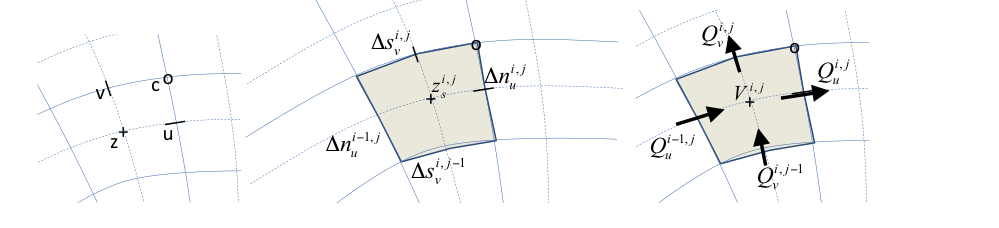

*Figure 6.1 Location of staggered grid points (left panel); definition
of grid distances (middle) and terms in volume balance (right)*

Wave action balance
~~~~~~~~~~~~~~~~~~~

Surfbeat solver
^^^^^^^^^^^^^^^

The time-varying wave action balance solved in XBeach is as follows:

.. math::

   \label{6.1)} 
   \frac{\partial E}{\partial t} +\frac{\partial EC_{g,u} }{\partial s} +\frac{\partial EC_{g,v} }{\partial n} +\frac{\partial EC_{\vartheta } }{\partial \vartheta } =-Sink

Where *E* is the wave energy or wave action, :math:`C_g` is the group velocity,
:math:`C_{\vartheta}`\ the refraction speed in theta-space and *Sink*
refers to effects of wave breaking and bottom friction.

Again, the advection terms are the only ones affected by the curvilinear
scheme so we will discuss their treatment in detail. The control volume
is the same as for the mass balance. In equation the procedure to
compute the wave energy fluxes across the cell boundaries is outlined.
All variables should also have an index *itheta* referring to the
directional grid, but for brevity these are omitted here.

The component of the group velocity normal to the cell boundary, at the
cell boundary, is interpolated from the two adjacent cell center points.
Depending on the direction of this component, the wave energy at the
cell boundary is computed using linear extrapolation based on the two
upwind points, taking into account their grid distances. This second
order upwind discretization preserves the propagation of wave groups
with little numerical diffusion.

.. math::

   \label{ZEqnNum633932} 
   \begin{array}{l} {Cg_{u,u}^{i,j} =\frac{1}{2} (Cg_{u}^{i,j} +Cg_{u}^{i+1,j} )} \\ {E_{u}^{i,j} =E^{i,j} +\frac{1}{2} \Delta s_{u}^{i,j} \frac{E^{i,j} -E^{i-1,j} }{\Delta s_{u}^{i-1,j} } =} \\ {=\left(\left(\Delta s_{u}^{i-1,j} +\frac{1}{2} \Delta s_{u}^{i,j} \right)E^{i,j} -\frac{1}{2} \Delta s_{u}^{i,j} E^{i-1,j} \right)/\Delta s_{u}^{i-1,j} \, \, \, \, \, ,Cg_{u,u}^{i,j} >0} \\ {E_{u}^{i,j} =E^{i+1,j} -\frac{1}{2} \Delta s_{u}^{i,j} \frac{E^{i+2,j} -E^{i+1,j} }{\Delta s_{u}^{i+1,j} } =} \\ {=\left(\left(\Delta s_{u}^{i+1,j} +\frac{1}{2} \Delta s_{u}^{i,j} \right)E^{i+1,j} -\frac{1}{2} \Delta s_{u}^{i,j} E^{i+2,j} \right)/\Delta s_{u}^{i+1,j} \, \, \, \, \, ,Cg_{u,u}^{i,j} <0} \\ {} \\ {Flux_{u}^{i,j} =Cg_{u,u}^{i,j} E_{u}^{i,j} \Delta n_{u}^{i,j} } \end{array}

The other three fluxes are computed in a similar way; for brevity we
will not present all formulations.

The time integration is explicit and the same as in the original
implementation. The advection in u- and v-direction is computed simply
by adding the four fluxes and dividing by the cell area. This procedure
guarantees conservation of wave energy.

.. math:: \frac{E^{i,j,n+1} -E^{i,j,n} }{\Delta t} +\frac{Flux_{u}^{i,j,n} -Flux_{u}^{i-1,j,n} +Flux_{v}^{i,j,n} -Flux_{v}^{i,j-1,n} }{A_{z}^{i,j} } +\left(\frac{\partial EC_{\vartheta } }{\partial \vartheta } \right)^{i,j,n} =-Sink^{i,j,n}

[ZEqnNum723168]

The procedure for the roller energy balance is identical to that for the
wave energy balance and will not be repeated here.

Stationary solver
^^^^^^^^^^^^^^^^^

In the stationary solver the wave energy and roller energy balances are
solved line by line, from the seaward boundary landward. For each line
the automatic timestep is computed and the quasi-time-dependent balance
according to equation is solved until convergence or the maximum number
of iterations is reached, after which the solver moves to the next line.

The iteration is controlled by the parameters *maxiter* and *maxerror.*

Shallow water equations
~~~~~~~~~~~~~~~~~~~~~~~

Mass balance equation
^^^^^^^^^^^^^^^^^^^^^

The mass balance reads as follows:

.. math::

   \label{6.4)} 
   \frac{\partial V}{\partial t} =Q_{u}^{i,j} -Q_{u}^{i-1,j} +Q_{v}^{i,j} -Q_{v}^{i,j-1}

This is discretized according to:

.. math::

   \label{6.5)} 
   \begin{array}{l} {A_{z}^{i,j} \frac{z_{s}^{i,j,n+1} -z_{s}^{i,j,n} }{\Delta t} =u_{u}^{i,j,n+1/2} h_{u}^{i,j,n} \Delta n_{u}^{i,j} -u_{u}^{i-1,j,n+1/2} h_{u}^{i-1,j,n} \Delta n_{u}^{i-1,j} } \\ {\, \, \, \, \, \, \, \, \, \, \, \, \, \, \, \, \, \, \, \, \, \, \, \, \, \, \, \, \, \, \, \, \, \, \, \, \, \, +v_{v}^{i,j,n+1/2} h_{v}^{i,j,n} \Delta s_{v}^{i,j} -v_{v}^{i,j-1,n+1/2} h_{v}^{i,j-1,n} \Delta s_{v}^{i,j-1} } \end{array}

Here, :math:`{A}_{z}` is the area of the cell around the cell
centre, :math:`{z}_{s}` is the surface elevation,
:math:`{u}_{u}` is the u-velocity in the u-point,
:math:`{h}_{u}` the water depth in the u-point and
:math:`{v}_{v}` the v-velocity in the v-point. The indices *i,j*
refer to the grid number in u resp. v direction; the index *n* refers to
the time step.

Momentum balance equation
^^^^^^^^^^^^^^^^^^^^^^^^^

Second, we will outline the derivation of the u-momentum balance. The
control volume is given in Figure 6.2. It is centeredaround the u-point.
We now consider the rate of change of the momentum in the local
u-direction as follows:

.. math::

   \label{6.6)} 
   \frac{d\left(Vu\right)}{dt} -\sum Q_{in} u_{in}  +\sum Q_{out} u +Vg\frac{\partial z_{s} }{\partial s} +A\frac{\tau _{b,u} }{\rho } =A\frac{\tau _{s,u} }{\rho } +A\frac{F_{u} }{\rho }

where V is the cell volume, u the velocity in local grid direction, Q
the fluxes,\ :math:`\rho` the density, g acceleration of gravity,
:math:`\tau_{b,u}, \tau_{b,u}, F_{u}` the bed shear stress, wind
shear stress and wave force in u-direction. We consider that the
outgoing fluxes carry the velocity inside the cell, *u* and that
:math:`{u}_{in}` is determined at each inflow boundary by
interpolation, reconstructing the component in the same direction as
*u*.

The volume balance for the same volume reads:

.. math::

   \label{6.7)} 
   \frac{dV}{dt} -\sum Q_{in} + \sum Q_{out} =0

By multiplying the volume balance by *u*, subtracting it from the
momentum balance and dividing the result by *V* we arrive at the
following equation:

.. math::

   \label{6.8)} 
   \frac{du}{dt} +\frac{\sum Q_{in} \left(u-u_{in} \right) }{Ah_{um} } +g\frac{\partial z_{s} }{\partial s} +\frac{\tau _{b,s} }{\rho h_{um} } =\frac{\tau _{s,u} }{\rho h_{um} } +\frac{F_{u} }{\rho h_{um} }

where *A* is the cell area and :math:`{h}_{um}` is the average depth
of the cell around the *u*-point. The procedure for the second term (the
others are straightforward) now boils down to integrating (only) the
incoming fluxes over the interfaces and multiplying them with the
difference between *u* in the cell and the component of velocity in the
same direction at the upwind cell.

.. figure:: image29.png

*Figure 6.2 Control volume u-momentum balance and
definition of fluxes*

In equations and and the procedure for computing the u-momentum balance
is outlined. The discharges in the u-points are computed by multiplying
the velocity in the u- or v-point by the water depth at that point.
These discharges are then interpolated to the borders of the control
volume around the u-point. The difference :math:`\Delta \alpha`\ in
grid orientation between the incoming cell and the u-point is computed
and used to compute the component of the incoming velocity in the local
u-direction, from the left and right side of the control volume.

.. math::

   \begin{array}{rclcrcl}
     q_u^{i,j} &=& u_u^{i,j,n-1/2} h_u^{i,j,n}  &~& ~ &~& ~ \\
     q_{in}^{left} &=& \frac{1}{2} \left( q_u^{i,j} + q_u^{i-1,j} \right )
       &,& q_{in}^{right} &=& -\frac{1}{2} \left( q_u^{i+1,j} + q_u^{i,j} \right ) \\
     \Delta \alpha^{left} &=& \alpha_u^{i,j} - \alpha_u^{i-1,j}
       &,& \Delta \alpha^{right} &=& \alpha_u^{i+1,j} - \alpha_u^{i,j} \\
     u_{in}^{left} &=& u_u^{i-1,j} \cos \left( \Delta \alpha \right ) - v_u^{i-1,j} \sin \left( \Delta \alpha \right )
       &,& u_{in}^{right} &=& u_u^{i+1,j} \cos \left( \Delta \alpha \right ) - v_u^{i+1,j} \sin \left( \Delta \alpha \right ) \\
   \end{array}

The same is done for the top and bottom of the control volume, based on
the discharges in v-direction:

.. math::

   \begin{array}{rclcrcl}
     q_v^{i,j}       &=& v_v^{i,j,n-1/2} h_v^{i,j,n} &~& ~ &~& \\
     q_{in}^{bottom} &=& \frac{1}{2} \left( q_v^{i,j-1} + q_v^{i+1,j-1} \right )
       &,& q_{in}^{top} &=& -\frac{1}{2} \left( q_v^{i,j} + q_v^{i+1,j} \right ) \\
     \Delta \alpha ^{bottom} &=& \alpha_u^{i,j} - \alpha_u^{i,j-1}
       &,& \Delta \alpha ^{top} &=& \alpha_u^{i,j+1} - \alpha_u^{i,j} \\
     u_{in}^{bottom} &=& u_u^{i,j-1} \cos \left( \Delta \alpha \right ) - v_u^{i,j-1} \sin \left( \Delta \alpha \right )
       &,& u_{in}^{top} &=& u_u^{i,j+1} \cos \left( \Delta \alpha \right ) - v_u^{i,j+1} \sin \left( \Delta \alpha \right ) \\
   \end{array}

Finally, the advective term in the momentum balance is given in equation

.. math::

   \label{ZEqnNum473828} 
   \begin{array}{l} {\left(\frac{\sum Q_{in} \left(u-u_{in} \right) }{Ah_{um} } \right)^{i,j} =\, {max(q}_{in}^{left} ,0){(}u_{u}^{i,j} {-}u_{in}^{left} {)}\frac{\Delta n_{z}^{i,j} }{h_{um}^{i,j} A_{u}^{i,j} } \, \, \, } \\ {\, \, \, \, \, \, \, \, \, \, \, \, \, \, \, \, \, \, \, \, \, \, \, \, \, \, \, \, \, \, \, \, \, \, \, \, \, \, \, \, +\, \, {max(q}_{in}^{right} ,0){(}u_{u}^{i,j} {-}u_{in}^{right} {)}\frac{\Delta n_{z}^{i+1,j} }{h_{um}^{i,j} A_{u}^{i,j} } \, } \\ {\, \, \, \, \, \, \, \, \, \, \, \, \, \, \, \, \, \, \, \, \, \, \, \, \, \, \, \, \, \, \, \, \, \, \, \, \, \, \, \, \, +\, {max(q}_{in}^{bottom} ,0){(}u_{u}^{i,j} {-}u_{in}^{bottom} {)}\frac{\Delta s_{c}^{i,j-1} }{h_{um}^{i,j} A_{u}^{i,j} } } \\ {\, \, \, \, \, \, \, \, \, \, \, \, \, \, \, \, \, \, \, \, \, \, \, \, \, \, \, \, \, \, \, \, \, \, \, \, \, \, \, \, +\, \, {max(q}_{in}^{top} ,0){(}u_{u}^{i,j} {-}u_{in}^{top} {)}\frac{\Delta s_{c}^{i,j} }{h_{um}^{i,j} A_{u}^{i,j} } \, } \end{array}

 Time integration scheme
^^^^^^^^^^^^^^^^^^^^^^^^

The time integration of the mass and momentum balance equations is
combined in an explicit leap-frog scheme, as depicted in Figure 6.3. The
velocities (in the ’-’ points) are updated using the momentum balance,
the water levels are updated using the mass balance. The water level
gradients influence the momentum balance and the velocities and derived
discharges affect the mass balance. Because of the leap-frog scheme
these influences are always computed at the half time step level, which
makes the scheme second order accurate.

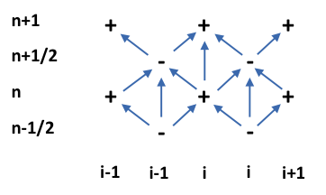

*Figure 6.3 Leap-frog time integration scheme*

Using this straightforward finite volume approach, complicated
transformations of the equations are avoided and the solution scheme
remains transparent. It is also completely compatible with the original
rectilinear implementation and is even slightly more efficient.

Groundwater flow
~~~~~~~~~~~~~~~~

In order to solve the equations in xx, the spatial and temporal domain
of the groundwater system is split into the same spatial grid and time
steps as the XBeach surface water model it is coupled to. At each time
step in the numerical model, the depth average groundwater head is
calculated in the center of the groundwater cells, and the fluxes
(specific discharge, submarine exchange, infiltration and exfiltration)
are calculated on the cell interfaces

At the start of the time step, every cell is evaluated whether the
groundwater and surface water are connected:

.. math::

   \label{ZEqnNum222755} 
   \kappa _{i,j} =\eta _{gw,i,j} \ge z_{b,i,j} -\varepsilon \wedge \eta _{i,j} \ge z_{b,i,j} +\varepsilon

In :math:`\varepsilon` is a numerical smoothing constant used to deal
with numerical round off errors near the bed (equal to the parameter
*dwetlayer* in the case of hydrostatic groundwater flow, and to the
parameter *eps* in the case of non-hydrostatic groundwater flow), and
*i* and *j* represent cross-shore and longshore coordinates in the
numerical solution grid, respectively. Infiltration is calculated in
cells where the groundwater and surface water are not connected and
there exists surface water. As shown in the infiltration rate is a
function of the thickness of the wetting front, which is zero at the
start of infiltration, and increases as a function of the infiltration
rate. The equations for the infiltration rate and the thickness of the
wetting front are approximated by first-order schemes, in which the
wetting front is updated using a backward-Euler scheme, which ensures
numerical stability:

.. math::

   \label{ZEqnNum753693} 
   \begin{array}{c} {S_{inf,i,j}^{n} =K_{i,j} \left(\frac{1}{\rho g} \frac{\left. p_{lpf,i,j} \right|^{z=z_{b} } }{\delta _{infill,i,j}^{n} } 1\right)} \\ {{\; }\delta _{infill,i,j}^{n} =\delta _{infill,i,j}^{n-1} +S_{inf,i,j}^{n} \frac{\Delta t}{n_{p} } } \end{array}

In the pressure term :math:`{p}_{lpf}` is the surface water pressure
at the bed, which in the case of non-hydrostatic surface water flow is
high-pass filtered at :math:`4/{T}_{rep}`, the superscript *n*
corresponds to the time step number and :math:`\Delta t` is the size
of the time step. The infiltration rate in the coupled relationship can
be solved through substitution:

.. math::

   \label{ZEqnNum918911} 
   S_{inf,i,j}^{n} =\frac{-\delta _{infill,i,j}^{n-1} +\frac{\Delta t}{n_{p} K_{i,j} } +\sqrt{\left(\delta _{infill,i,j}^{n-1} \right)^{2} +\frac{2}{n_{p} } \frac{\Delta t}{\delta _{infill,i,j}^{n-1} K_{i,j} } +\frac{4\rho g}{n_{p} } \frac{\Delta t}{p_{i,j} \left|^{z=\xi } \right. K_{i,j} } +\frac{\Delta t^{2} }{K_{_{i,j} }^{2} } } }{\frac{2\Delta t}{n_{p} } }

At the end of infiltration, i.e. when the groundwater and surface water
become connected or there is no surface water left, the wetting front
thickness is reset to zero. If the infiltration rate exceeds the
Reynolds number for the start of turbulence, the local hydraulic
conductivity is updated using the local Reynolds number:

.. math::

   \label{ZEqnNum940656} 
   K_{i,j} =K_{lam} \sqrt{\frac{Re_{crit} }{\max (Re_{i,j} ,Re_{crit} )} }

XBeach iterates until a minimum threshold difference between iterations
is found for and . Infiltration in one time step is limited to the
amount of surface water available in the cell and to the amount of water
required to raise the groundwater level to the level of the bed:

.. math::

   \label{6.11)} 
   S_{inf,i,j}^{n} =\min \left(S_{inf,i,j}^{n} ,\frac{\eta _{i,j-} z_{b,i,j} }{\Delta t} ,\frac{z_{b,i,j} -\eta _{gw,i,j-} }{n_{p} \Delta t} \right)

If during infiltration the groundwater level reaches the bed level, the
fraction of the time step required to do so is estimated (x) and the
remaining fraction is used in the submarine exchange.

.. math::

   \label{6.11)} 
   \begin{array}{c} {\Lambda _{t,i,j} =\frac{n_{p} \left(z_{b,i,j} -\eta _{gw,i,j} \right)}{K_{i,j} \left(\frac{1}{\rho g} \frac{\left. p_{i,j} \right|^{z=\xi } }{z_{b,i,j} -\eta _{gw,i,j} } +1\right)} \frac{1}{\Delta t} } \\ {} \\ {0\le \Lambda _{t,i,j} \le 1} \end{array}

Exfiltration is calculated in cells where the groundwater and surface
water are not connected and the groundwater level exceeds the bed level:

.. math::

   \label{6.11)} 
   S_{exf,i,j} =n_{p} \frac{z_{b,i,j} -\eta _{gw,i,j} }{\Delta t}

Horizontal infiltration and exfiltration (keyword: *gwhorinfil = 1*) is
computed across the numerical vertical interface between the groundwater
domain and the surface water domain in adjoining cells. The direction of
exchange is determined by the head gradient, and the bed level slope
direction:

.. math::

   \label{6.11)} 
   \begin{array}{l} {S_{i,j,hor}^{u} =\left\{\begin{array}{cc} {K_{_{i,j} }^{u} \left(\frac{\eta _{i,j} +\frac{q_{i,j} }{g} -H_{gw,i+1,j} }{\Delta x} \right)\left(z_{b,i+1,j} -z_{b,i,j} \right)} & {z_{b,i+1,j} >z_{b,i,j} \wedge \eta _{i,j} >eps} \\ {K_{_{i,j} }^{u} \left(\frac{\eta _{i+1,j} +\frac{q_{i+1,j} }{g} -H_{gw,i,j} }{\Delta x} \right)\left(z_{b,i,j} -z_{b,i+1,j} \right)} & {z_{b,i+1,j} <z_{b,i,j} \wedge \eta _{i+1,j} >eps} \end{array}\right. } \\ {S_{i,j,hor}^{v} =\left\{\begin{array}{cc} {K_{_{i,j} }^{v} \left(\frac{\eta _{i,j} +\frac{q_{i,j} }{g} -H_{gw,i,j+1} }{\Delta y} \right)\left(z_{b,i,j+1} -z_{b,i,j} \right)} & {z_{b,i,j+1} >z_{b,i,j} \wedge \eta _{i,j} >eps} \\ {K_{_{i,j} }^{v} \left(\frac{\eta _{i,j+1} +\frac{q_{i,j+1} }{g} -H_{gw,i,j} }{\Delta y} \right)\left(z_{b,i,j} -z_{b,i,j+1} \right)} & {z_{b,i,j+1} <z_{b,i,j} \wedge \eta _{i,j+1} >eps} \end{array}\right. } \end{array}

After infiltration and exfiltration have been calculated, the
groundwater level and surface water level are updated:

.. math::

   \label{6.11)} 
   \begin{array}{l} {\eta _{gw,i,j}^{n+\frac{1}{2} } =\eta _{gw,i,j}^{n} +\frac{\Delta t}{n_{p} } \left(S_{\inf } +S_{exf} +S_{hor} \right)} \\ {\eta _{i,j}^{n+\frac{1}{2} } =\eta _{i,j}^{n} +\Delta t\left(-S_{\inf } -S_{exf} -S_{hor} \right)} \end{array}

All updated cells are subsequently re-evaluated on whether the surface
water and groundwater are connected or unconnected

The cell height at the center of the groundwater cells
(:math:`\Delta z_{H,i,j}`) is calculated from the
groundwater level and the bottom of the aquifer in the center of the
cell, whereas the cell heights at the horizontal cell interfaces are
calculated using an upwind procedure:

.. math::

   \label{ZEqnNum516818} 
   \begin{array}{c} {\Delta z_{H,i,j} =\eta _{gw,i,j} -z_{aquifier,i,j} =h_{gw,i,j} } \\ {} \\ {\Delta z_{u,i,j} =\left\{\begin{array}{l} {\Delta z_{H,i+1,j} {\; \; if\; }q_{qw,i,j}^{x} <0} \\ {\Delta z_{H,i,j} {\; \; \; \; if\; }q_{qw,i,j}^{x} \ge 0} \end{array}\right. } \\ {\Delta z_{v,i,j} =\left\{\begin{array}{l} {\Delta z_{H,i+1,j} {\; \; if\; }q_{qw,i,j}^{y} <0} \\ {\Delta z_{H,i,j} {\; \; \; \; if\; }q_{qw,i,j}^{y} \ge 0} \end{array}\right. } \end{array}

In :math:`{z}_{aquifer}` is the level of the bottom of the aquifer.
As described in Section 3.3.6, the head applied on the top boundary of
the groundwater domain (:math:`{H}_{bc}`) depends on whether the
groundwater and surface water are connected or unconnected:

.. math::

   \label{ZEqnNum702689} 
   \begin{array}{l} {H_{bc,i,j} =\left(1-\kappa _{r,i,j} \right)\eta _{gw,i,j} +\kappa _{r,i,j} \left(z_{b,i,j} {+}\frac{\left. p_{i,j} \right|^{z=z_{b} } }{\rho g} \right)} \\ {\begin{array}{ccc} {\kappa _{r,i,j} =1-\frac{z_{b,i,j} -\eta _{gw,i,j} }{\varepsilon } } & {} & {0\le \kappa _{r,i,j} \le 1} \end{array}} \end{array}

In the parameter :math:`\kappa_{r}` is the relative
numerical ‘connectedness’ of the groundwater and surface water head,
determined by linear interpolation across the numerical smoothing
constant :math:`\varepsilon`.

In the case of hydrostatic groundwater flow, the groundwater head in
each cell is set equal to the head applied on the top boundary of the
groundwater domain (:math:`{H}_{bc}`) and the horizontal groundwater
flux is computed from the groundwater head gradient:

.. math::

   \label{ZEqnNum473196} 
   \begin{array}{l} {q_{gw,i,j}^{x} =-K_{u,i,j} \Delta z_{u,i} \frac{H_{i+1,j} -H_{i,j} }{\Delta x_{u,i,j} } =-K_{u,i,j} \Delta z_{u,i} \frac{H_{bc,i+1,j} -H_{bc,i,j} }{\Delta x_{u,i,j} } } \\ {q_{gw,i,j}^{y} =-K_{v,i,j} \Delta z_{v,i} \frac{H_{i+1,j} -H_{i,j} }{\Delta y_{v,i,j} } =-K_{v,i,j} \Delta z_{v,i} \frac{H_{bc,i+1,j} -H_{bc,i,j} }{\Delta y_{v,i,j} } } \end{array}

In the superscripts *x* and *y* refer to the components of the variable
in the cross-shore and longshore direction, respectively, and the
subscripts *u* and *v* refer to variables approximated at the horizontal
cell interfaces in the cross-shore and longshore direction,
respectively.

In the case of non-hydrostatic groundwater flow, the horizontal specific
discharge on each cell interface can be found through an approximation
of the non-hydrostatic groundwater head gradient:

.. math::

   \label{ZEqnNum628356} 
   \begin{array}{l} {q_{gw,i,j}^{x} =-K_{u,i,j} \Delta z_{u,i} \frac{H_{i+1,j} -H_{i,j} }{\Delta x_{u,i,j} } =-K_{u,i,j} \Delta z_{u,i} \frac{H_{bc,i+1,j} -\frac{2}{3} \beta _{i+1,j} \Delta z_{H,i+1,j}^{2} -H_{bc,i,j} +\frac{2}{3} \beta _{i,j} \Delta z_{H,i,j}^{2} }{\Delta x_{u,i,j} } } \\ {q_{gw,i,j}^{y} =-K_{v,i,j} \Delta z_{v,i} \frac{H_{i+1,j} -H_{i,j} }{\Delta y_{v,i,j} } =-K_{v,i,j} \Delta z_{v,i} \frac{H_{bc,i+1,j} -\frac{2}{3} \beta _{i+1,j} \Delta z_{H,i+1,j}^{2} -H_{bc,i,j} +\frac{2}{3} \beta _{i,j} \Delta z_{H,i,j}^{2} }{\Delta y_{v,i,j} } } \end{array}

In the subscript *H* refers to variables approximated at the cell
centers. The hydraulic conductivity may be different at each cell
interface and is therefore computed at every interface where every K is
calculated separately.

Continuity in the groundwater cell is found following:

.. math::

   \label{ZEqnNum299822} 
   q_{gw,i-1,j}^{x} -q_{gw,i,j}^{x} +q_{gw,i,j-1}^{y} -q_{gw,i,j}^{y} -q_{gw,i,j}^{z} =0

In the variable :math:`{q}^{z}` refers to the vertical groundwater
discharge (e.g., submarine exchange if connected to the surface water,
or groundwater level fluctuations if the groundwater is not connected to
the surface water).

In the case of hydrostatic groundwater flow, the variable
:math:`{q}^{z}` can be solved through the known variables
:math:`{q}^{x}` and :math:`{q}^{y}`. However, in the case of
non-hydrostatic groundwater flow, all variables in contain an unknown
value for the groundwater pressure head, described in terms of a known
head at the surface of the groundwater (:math:`{H}_{bc}`) and the
unknown curvature of the vertical groundwater head function
(:math:`\beta`). Since water is incompressible, the groundwater
pressure must be solved for all cells simultaneously using matrix
algebra:

.. math::

   \label{ZEqnNum734155} 
   Ax+b=0

In A is a matrix containing coefficients for the horizontal and vertical
specific discharge, x is a vector containing the unknown groundwater
head curvature, and b contains the known forcing terms. For a one
dimensional cross-shore case, A is reduced to a tridiagonal matrix. The
vector of known forcing consists of the numerical gradients in the
contribution of the head applied on the top boundary of the groundwater
domain to the horizontal specific discharge.

In the one dimensional case, the solution to the tridiagonal matrix A
can be computed using the efficient Thomas algorithm (Thomas 1949). In
the two dimensional case, matrix A contains two additional diagonals
that are not placed along the main diagonal, and vector b contains
additional forcing terms from the alongshore contribution. The solution
to the two dimensional case requires a more complex and less
computationally efficient matrix solver. In this case the Strongly
Implicit Procedure (Stone 1968) is used in a manner similar to Zijlema
et al. (2011). The horizontal and vertical groundwater fluxes are
calculated using the solution of *x* plus and .

Since in both hydrostatic and non-hydrostatic groundwater flow some
local velocities may exceed the critical Reynolds number for the start
of turbulence (:math:`{Re}_{crit}`), the turbulent hydraulic
conductivity (*K*) is updated using the local Reynolds number. The
solution to and the update of the turbulent hydraulic conductivity are
iterated until a minimum threshold difference between iterations is
found. Note that this approach is only used is the turbulent groundwater
model is selected (keyword: *gwscheme* = *turbulent*).

The (iterated) solution for the specific vertical discharge is used to
update the groundwater level and surface water level:

.. math::

   \label{6.11)} 
   \begin{array}{rcl} {\eta _{_{gw,i,j} }^{n+1} } & {=} & {\left\{\begin{array}{l} {\eta _{_{gw,i,j} }^{n+\frac{1}{2} } {\; \; \; \; \; \; \; \; \; \; \; \; \; \; \; \; \; \; \; \; \; \; \; \; \; }C_{i,j} } \\ {\eta _{_{gw,i,j} }^{n+\frac{1}{2} } +\frac{\Delta t}{n_{p} } \frac{q_{i,j}^{z} }{\Delta x_{H,i,j} } {\; \; \; }\neg C_{i,j} {\; \; \; }} \end{array}\right. } \\ {\eta _{_{i,j} }^{n+1} } & {=} & {\left\{\begin{array}{l} {\eta _{_{i,j} }^{n+\frac{1}{2} } +\Delta t\frac{q_{i,j}^{z} }{\Delta x_{H,i,j} } {\; \; \; \; \; }C_{i,j} } \\ {\eta _{_{i,j} }^{n+\frac{1}{2} } {\; \; \; \; \; \; \; \; \; \; \; \; \; \; \; \; \; \; \; \; \; \; \; }\neg C_{i,j} } \end{array}\right. } \end{array}

If the groundwater and surface water are connected, and the submarine
exchange from the surface water to the groundwater estimated in is
greater than the amount of surface water available in the cell,
continuity is enforced by lowering the groundwater level to compensate
for the lack of permeating water:

.. math::

   \label{6.11)} 
   \eta _{_{gw,i,j} }^{n+1} =\eta _{_{gw,i,j} }^{n+1} +\frac{1}{n_{p} } \left(\eta _{_{i,j} }^{n+\frac{1}{2} } -z_{b,i,j} -\Delta t\frac{q_{i,j}^{z} }{\Delta x_{H,i,j} } \right){\; if\; \; }\kappa _{i,j} \wedge \eta _{i,j}^{n+\frac{1}{2} } -z_{b,i,j} <\Delta t\frac{q_{i,j}^{z} }{\Delta x_{H,i,j} }

Sediment transport
~~~~~~~~~~~~~~~~~~

The advection-diffusion equation for suspended sediment is the basis for
the sediment transport computations in XBeach. The partial differential
equation to solve is:

.. math::

   \label{6.12)} 
   \frac{\partial hc}{\partial t} +\nabla \vec{S}_{s} =\frac{hc_{eq} -hc}{T_{s} } =-\frac{hc}{T_{s} } +Ero

Here *c* is the depth-averaged concentration, :math:`{c}_{eq}` the
equilibrium concentration, *Ts* a typical timescale proportional to
water depth divided by fall velocity. As is often done to increase
robustness, we treat the erosion term explicitly but take an implicit
scheme for the sedimentation term:

.. math::

   \label{6.13)} 
   \frac{{c}_{{z}}^{{i,j,n+1}} h_{h}^{i,j,n+1} -h_{h}^{i,j,n} {c}_{z}^{{i,j,n}} }{\Delta {t}} {\; =\; }-\frac{h_{h}^{i,j,n+1} {c}_{z}^{{i,j,n+1}} }{{T}_{{s}}^{{i,j}} } -\left(\nabla \vec{S}_{s} \right)^{i,j,n} {+\; \; }Ero^{i,j,n}

This can be rewritten as:

.. math::

   \label{6.14)} 
   {c}_{{c}}^{{i,j,n+1}} {\; =\; }\frac{{T}_{{s}}^{{i,j}} \Delta {t}}{h_{h}^{i,j,n+1} \left({T}_{{s}}^{{i,j}} +\Delta {t}\right)} \left(\frac{h_{h}^{i,j,n} {c}_{{c}}^{{i,j,n}} }{\Delta t} -\left(\nabla \vec{S}_{s} \right)^{i,j,n} {+}Ero^{i,j,n} \right)

The sediment transport gradient is discretized in a similar way as the
mass balance:

.. math::

   \label{6.15)} 
   \left(\nabla \vec{S}_{s} \right)^{i,j} =\frac{\left(S_{u,s}^{i,j} \Delta n_{u}^{i,j} -S_{u,s}^{i-1,j} \Delta n_{u}^{i-1,j} +S_{v,s}^{i,j} \Delta s_{v}^{i,j} -S_{v,s}^{i,j-1} \Delta s_{v}^{i,j-1} \right)}{A_{z}^{i,j} }

The sediment transports in the u- points contain an advective term, a
diffusive term and a bed slope term:

.. math::

   \label{6.16)} 
   {S}_{{u,s}} {=c}_{u} {u}_{{rep,s}} {h}_{{u}} {-D}_{{c}} {h}_{{u}} \frac{\partial c}{\partial s} {-f}_{slope} {c}_{{u}} \left|v\right|_{u} {h}_{{u}} \frac{\partial z_{b} }{\partial s} {)}

Here :math:`{u}_{rep,s}` is a representative velocity for suspended
transport, which contains contributions due to return flow, wave
skewness and wave asymmetry; :math:`{D}_{c}` is a horizontal
diffusion coefficient and :math:`{f}_{slope}` a coefficient. In
discretized form the expression for the suspended transport in the
u-point is:

.. math::

   S_{u,s}^{i,j} = c_u^{i,j} u_{rep,s}^{i,j} h_u^{i,j} -D_c^{i,j} h_u^{i,j} \frac{c_c^{i+1,j} -c_c^{i,j} }{\Delta s_u^{i,j} } -f_{slope} c_u^{i,j} \left|v\right|_u^{i,j} h_u^{i,j} \frac{z_b^{i+1,j} -z_b^{i,j} }{\Delta s_u^{i,j} } )

The concentrations in the u-points are computed with a
:math:`\theta` -method, where :math:`\theta=1` means a fully upwind
approximation, and :math:`\theta=0.5` a central scheme. In practice, we
mostly use the upwind approximation for its robustness.

.. math::

   \label{6.18)} 
   \begin{array}{l} {c_{u}^{i,j} =\theta c_{z}^{i,j} +\left(1-\theta \right)c_{z}^{i+1,j} \, \, \, \, \, \, \, ,u_{rep,s}^{i,j} >0} \\ {c_{u}^{i,j} =\left(1-\theta \right)c_{z}^{i,j} +\theta c_{z}^{i+1,j} \, \, \, \, \, \, \, ,u_{rep,s}^{i,j} <0} \end{array}

The erosion and deposition terms, which may also be used in the bed
updating, are finally computed from:

.. math::

   \label{6.19)} 
   \begin{array}{l} {Ero^{i,j,n} {=\; h}_{{h}}^{i,j,n} {c}_{{eq}}^{{i,j,n}} {/T}_{{s}}^{{i,j}} } \\ {Depo^{i,j} ={h}_{{h}}^{i,j,n+1} {c}_{z}^{{i,j,n+1}} {/T}_{{s}}^{{i,j}} } \end{array}

The evaluation of the bedload transport takes place in the same way as
in the previous versions of XBeach, except for the fact that the
directions are taken in local grid direction, and will not be repeated
here.

Bottom updating schemes
~~~~~~~~~~~~~~~~~~~~~~~

Two alternative formulations are available for the bed updating: one
where the bottom changes are computed based on the gradients of
suspended and bed load transport, equation , and one where the changes
due to suspended transport are accounted for through the erosion and
deposition terms, equation .

.. math::

   \label{ZEqnNum990933} 
   \left(1-n_{p} \right)\frac{\partial z_{b} }{\partial t} +MF\left(\nabla \overrightarrow{S}_{s} +\nabla \overrightarrow{S}_{b} \right)=0

.. math::

   \label{ZEqnNum346072} 
   \left(1-n_{p} \right)\frac{\partial z_{b} }{\partial t} +MF\left(Ero-Depo+\nabla \overrightarrow{S}_{b} \right)=0

In both cases *MF* is the morphological factor used to accelerate
morphological changes. In the first case, the sediment in the bottom is
conserved in all cases, but changes in the amount of sediment in the
water are not considered; one can also say that the sediment in
suspension is added to the bottom sediment. In the second case, the
storage of sediment in the water is accounted for, but will be distorted
in cases of high *MF*. Since under most circumstances the real effect of
the storage in the water phase is small we prefer the first formulation
which guarantees mass conservation in the bottom. Both formulations are
calculated using an explicit scheme, see also equations and .

.. math::

   \label{ZEqnNum578684} 
   \Delta z_{b} ^{i,j,n+1} =\Delta t\frac{MF}{\left(1-n_{p} \right)} \left(\left(\nabla \overrightarrow{S}_{s} \right)^{i,j,n} +\left(\nabla \overrightarrow{S}_{b} \right)^{i,j,n} \right)

.. math::

   \label{ZEqnNum428827} 
   \Delta z_{b} ^{i,j,n+1} =\Delta t\frac{MF}{(1-n_{p} )} \left(Ero^{i,j,n} -Depo^{i,j,n} +\left(\nabla \overrightarrow{S}_{b} \right)^{i,j,n} \right)

Avalanching
^^^^^^^^^^^

XBeach implements avalanching as described in section 2.8.2. It first
calculates bed level change due to avalanching in the cross-shore
dimension. It then calculates the slopes in alongshore direction and
bottom change due to avalanching in this direction. To avoid disrupted
sediment balance XBeach does not calculate bottom change due to
avalanching at the boundary grid cells. Consequently XBeach cannot
calculate avalanching at the boundary between two MPI domains.

Bed composition
^^^^^^^^^^^^^^^

The bed is discretized into layers with mass *M(i,j)* in which *i*
refers to the layer number and *j* to the sediment class. The mass
fraction per sediment class *p*, layer thickness :math:`\Delta` and
bed level :math:`{z}_{b}` are defined by:

.. math::

   \label{6.20)} 
   \begin{array}{l} {p(i,j)=\frac{M(i,j)}{\sum _{j=1}^{J}M(i,j) } } \\ {\Delta (i)=\frac{1}{\left(1-n_{p} \right)\rho _{s} } \sum _{j=1}^{J}M(i,j) } \\ {z_{b} =z_{0} +\sum _{i=1}^{I}\Delta (i) } \end{array}

with porosity :math:`{n}_{p}` and sediment density :math:`\rho`.
The level :math:`{z}_{0}` is the lowest point of the array of bed
layers.

Due to bed load transport, sediment is exchanged between the top layer
and the four horizontally neighboring top layers. Exchange with the
water column and the top layer is due to erosion rate *E* and deposition
rate *D*. A mixed Eulerian/Lagrangian framework is proposed. Within the
set of layers, one layer is defined as the variable layer. This is the
only layer that has a variable total mass. All other layers have a
constant total mass, which implies for a constant porosity a constant
thickness. Above the variable layer, the layers move with the bed level
(Lagrangian): upwards in case of aggradation and downwards in case of
degradation. This vertical movement gives an advective flux with
advection velocity equal to the bed level change *A=dz/dt*. The variable
layer is the transition to the lower layers, which are passive. The
number of layers below the variable layer has thus no influence on the
computation time. Note that diffusive processes within the bed are not
considered yet. These could lead to fluxes between the layers below the
variable layer.

The mass balance for the top layer can now be defined by:

.. math::

   \label{6.21)} 
   \begin{array}{l} {\frac{\partial M(1,j)}{\partial t} =dy\left\{p(1,j)S_{b} (j)\right\}_{W} -dy\left\{p(1,j)S_{b} (j)\right\}_{E} } \\ {\quad \quad \quad \quad dx\left\{p(1,j)S_{b} (j)\right\}_{S} -dx\left\{p(1,j)S_{b} (j)\right\}_{N} } \\ {\quad \quad \quad \quad -dxdyp(1,j)E(j)+dxdyD(j)+dxdy\delta Ap_{bot} (1,j)} \\ {} \\ {A=\sum _{j=1}^{J}\left\{\begin{array}{l} {dy\left\{p(1,j)S_{b} (j)\right\}_{W} -dy\left\{p(1,j)S_{b} (j)\right\}_{E} } \\ {\quad \quad dx\left\{p(1,j)S_{b} (j)\right\}_{S} -dx\left\{p(1,j)S_{b} (j)\right\}_{N} } \\ {\quad \quad -dxdyp(1,j)E(j)+dxdyD(j)} \end{array}\right\} } \end{array}

in which :math:`{S}_{b}` is the bed-load transport (e.g.
Meyer-Peter-Muller), based on the sediment properties of the specific
class. The dimensions of the grid cell are defined by *dx* and *dy*. The
subscripts W, E, S and N refer to West, East, South and North indicating
the four vertical faces of the bed cell. The horizontal faces are
indicated with bot for the bottom of the cell and ceil for the ceiling
of the cell. As the fraction p is not defined at the faces but in the
cell centers, the upstream fraction is required. For the bed load
fluxes, the velocity direction used. For the vertical advection term,
the upstream value is based on the bed level variation: in case of
aggradation the value in the top layer is used and in case of
degradation the value of the second layer is used. If the top layer is
the variable layer, there is no advective flux: :math:`\delta=0`
otherwise :math:`\delta=1`.

The mass balance for the layers in between the top layer and the
variable layer is:

.. math::

   \label{6.22)} 
   \frac{\partial M(i,j)}{\partial t} =dxdyA\left(p_{bot} (i,j)-p_{ceil} (i,j)\right)

and for the variable layer, it reads:

.. math::

   \label{6.23)} 
   \frac{\partial M(i,j)}{\partial t} =Ap_{ceil} (i,j)

In order to avoid too thin a or too thick a variable layer, the variable
layer is merged or split. If the thickness is smaller than the critical
value :math:`\Delta_{merge}`, the variable layer is
merged with the lower layer. To keep the same number of cells, a cell is
added at the bottom of the array, implying that :math:`{z}_{0} = z_{0} - \Delta`.
Similarly, the variable is split into two layers if the critical value
:math:`\Delta_{split}` is exceeded. Then, the array is
shifted upwards: :math:`{z}_{0} = z_{0} + \Delta`.

As the bed level update is explicit, the timestep is limited. A
conservative estimate can be made by assuming that no more mass can be
eroded than available in the top layer:

.. math::

   \label{6.24)} 
   \begin{array}{l} {dy\left\{p(1,j)S_{b} (j)\right\}_{W/E} +dx\left\{p(1,j)S_{b} (j)\right\}_{S/N} +dxdyp(1,j)E(j)<\frac{M(1,j)}{dt} } \\ {dt<\frac{dxdy\left(1-n_{p} \right)\rho _{s} \Delta (1)}{dyS_{b,W/E} (1)+dyS_{b,N/S} (1)+dxdyE(1)} } \end{array}

The transport rate depends on the direction of the transport. The
transport rates and erosion rates should be based on the formulation for
the smallest fraction: *j=1*. Note that the fraction p falls out. This
time step restriction is less severe than the one for shallow water
flow. Only in case of very top layers and/or the use of a morphological
factor, this time step restriction might be relevant.

Boundary conditions
~~~~~~~~~~~~~~~~~~~

At the start of the XBeach simulation, XBeach checks whether
non-stationary varying wave boundary conditions are to be used. If this
is the case, it next checks whether the wave spectrum of the wave
boundary conditions is to change over time, or remain constant. If the
wave spectrum is to remain constant, XBeach will only read from one
input file to generate wave boundary conditions. If the wave spectrum is
to vary in time, XBeach reads from multiple files.

Whether or not the wave spectrum of the boundary conditions changes over
time, the XBeach module requires a record length during which the
current wave spectral parameters are applied. For the duration of the
record length, boundary conditions are calculated at every boundary
condition file time step. These time steps are not required to be the
same as the time steps in the XBeach main program; XBeach will
interpolate where necessary. The boundary condition time steps should
therefore only be small enough to accurately describe the incoming bound
long waves. The statistical data for the generation of the wave boundary
conditions is read from user-specified files. The XBeach module tapers
the beginning and end of the boundary condition file. This is done to
ensure smooth transitions from one boundary condition file to the next.

The combination of a large record length and a small time step lead to
large demands on the system memory. If the memory requirement is too
large XBeach will shut down. The user must choose to either enlarge the
boundary condition time step, or to reduce the record length. In case of
the latter, several boundary condition files can be generated and read
sequentially. It is unwise however to reduce the record length too much,
as then the transitions between the boundary condition files may affect
the model results.

Every time the XBeach wave boundary condition module is run, it outputs
data to the local directory. Metadata about the wave boundary conditions
are stored in list files: *ebcflist.bcf* and *qbcflist.bcf*. The main
XBeach program uses the list files to know how and when to read and
generate boundary condition files. The actual incoming short-wave energy
and long-wave mass flux data is stored in other files. These files have
*E\_* and *q\_* prefixes. The main XBeach program uses these files for
the actual forcing along the offshore edge.

Non-hydrostatic
~~~~~~~~~~~~~~~

Global continuity equation
^^^^^^^^^^^^^^^^^^^^^^^^^^

As was outlined in the previous chapter the global continuity equation,
which describes the relation between the free surface and the depth
averaged discharge, is given by

.. math::

   \label{ZEqnNum983791} 
   \frac{\partial \eta }{\partial t} +\frac{\partial }{\partial x} \left(UH\right)+\frac{\partial }{\partial x} \left(VH\right)=0

A simple semi-discretisation of using central differences for the space
derivative and using the Hansen scheme for the coupling between velocity
and free surface results in

.. math::

   \label{ZEqnNum570839} 
   \frac{\eta_{i,j}^{\*} - \eta_{i,j}^{n}}{\Delta t} +
     \frac{{}^{x} q_{i+{\tfrac{1}{2}},j}^{\*} - {}^{x} q_{i-{\tfrac{1}{2}},j}^{\*}}{\Delta x} +
     \frac{{}^{y} q_{i,j+{\tfrac{1}{2}}}^{\*} - {}^{y} q_{i,j-{\tfrac{1}{2}}}^{\*}}{\Delta y} = 0

With
:math:`{}^{x} q_{i+{\tfrac{1}{2}} ,j}^{\*} = H_{i+{\tfrac{1}{2}} ,j}^{n} U_{i+{\tfrac{1}{2}} ,j}^{n+{\tfrac{1}{2}} }`,\ :math:`{}^{y} q_{i,j+{\tfrac{1}{2}} }^{\*} =H_{i,j+{\tfrac{1}{2}} }^{n} V_{i,j+{\tfrac{1}{2}} }^{n+{\tfrac{1}{2}} }`
and the water depth is defined by a first order accurate upwind
interpolation

.. math::

   \label{ZEqnNum559032} 
   H_{i+{\tfrac{1}{2}} ,j}^{n} =\left\{\begin{array}{c} {\zeta _{i,j}^{n} +d_{i,j} {\; \; \; \; \; \; \; \; \; \; \; \; \; \; \; \; \; \; \; \; \; \; \; \; \; \; \; \; \; \; \; \; \; }if{\; }U_{i+{\tfrac{1}{2}} ,j}^{n+{\tfrac{1}{2}} } >0} \\ {\zeta _{i+1,j}^{n} +d_{i+1,j} {\; \; \; \; \; \; \; \; \; \; \; \; \; \; \; \; \; \; \; \; \; \; \; \; \; \; \; \; \; }if{\; }U_{i+{\tfrac{1}{2}} ,j}^{n+{\tfrac{1}{2}} } <0} \\ {\max \left(\zeta _{i,j}^{n} ,\zeta _{i+1,j}^{n} \right)+\min \left(d_{i} ,d_{i+1,j} \right){\; }if{\; }U_{i+{\tfrac{1}{2}} ,j}^{n+{\tfrac{1}{2}} } =0} \end{array}\right. {\; }

The resulting scheme is only first order accurate by virtue of the
upwind interpolations and mass conservative. When first order
computations are considered accurate enough :math:`\eta_{i,j}^{n+1}`
is set to :math:`\eta_{i,j}^{n\*}`. For higher order accuracy the first
order prediction is corrected using a limited version of the McCormack
scheme. The corrector step reads

.. math::

   \label{ZEqnNum452818} 
   \frac{\eta _{i,j}^{n+1} -\eta _{i,j}^{*} }{\Delta t} +\frac{{}^{x} \Delta q_{i+{\tfrac{1}{2}} ,j}^{*} -{}^{x} \Delta q_{i-{\tfrac{1}{2}} ,j}^{*} }{\Delta x} +\frac{{}^{y} \Delta q_{i,j+{\tfrac{1}{2}} }^{*} -{}^{y} \Delta q_{i,j-{\tfrac{1}{2}} }^{*} }{\Delta y} =0

With
:math:`{}^{x} \Delta q_{i+{\tfrac{1}{2}} ,j}^{n\*} = U_{i+{\tfrac{1}{2}} ,j}^{n+{\tfrac{1}{2}} } \Delta H_{i+{\tfrac{1}{2}} ,j}`
and :math:`\Delta H_{i+{\tfrac{1}{2}} ,j}` is given for positive
flow as

.. math::

   \label{ZEqnNum654284} 
   \Delta H_{i+{\tfrac{1}{2}} ,j}^{n\*} ={\tfrac{1}{2}} \psi \left(^{\zeta } r_{i+{\tfrac{1}{2}} } \right)\left(\zeta _{i+1,j}^{n\*} -\zeta _{i,j}^{n} \right){\; \; \; \; \; \; \; \; \; \; }^{\zeta } {r}_{{i+}{\tfrac{{1}}{{2}}} } =\frac{\zeta _{i,j}^{n\*} -\zeta _{i-1,j}^{n} }{\zeta _{i+1,j}^{n\*} -\zeta _{i,j}^{n} } {\; \; \; \; \; \; \; \; \; \; }\psi \left(r\right)=\max \left(0,\min \left(r,1\right)\right)

Here :math:`\psi \left(r\right)` denotes the minmod limiter. Similar
expression can be constructed for negative flow. The expression for
:math:`{}^{y} \Delta q_{i,j+{\tfrac{1}{2}} }^{n\*}` and
:math:`\Delta H_{i,j+{\tfrac{1}{2}} }` are obtained in a similar
manner. Note that the total flux
:math:`{}^{x} q_{i+{\tfrac{1}{2}} ,j}^{n+{\tfrac{1}{2}} }`\ at the cell
boundaries thus reads

.. math::

   \label{ZEqnNum673353} 
   {}^{x} q_{i+{\tfrac{1}{2}} ,j}^{n+{\tfrac{1}{2}} } ={}^{x} q_{i+{\tfrac{1}{2}} ,j}^{\*} +{}^{x} \Delta q_{i+{\tfrac{1}{2}} ,j}^{\*} {,\; \; \; \; }{}^{y} q_{i,j+{\tfrac{1}{2}} }^{n+{\tfrac{1}{2}} } ={}^{y} q_{i,j+{\tfrac{1}{2}} }^{\*} +{}^{y} \Delta q_{i,j+{\tfrac{1}{2}} }^{\*} {\; }

The predictor-corrector set is second order accurate in regions where
the solution is smooth, and reduces locally to first order accuracy near
discontinuities. Furthermore, the method remains mass conservative. Note
that other flux limiters can be used instead of the minmod limiter.
However, as the minmod limiter performed adequately, this has not been
investigated. ( For an overview of flux limiters see Hirsch, 2007)

Local continuity equation
^^^^^^^^^^^^^^^^^^^^^^^^^

The depth averaged local continuity equation is given by

.. math::

   \label{ZEqnNum686131} 
   \frac{\partial HU}{\partial x} +\frac{\partial HV}{\partial y} +\left. w\right|_{z=\eta } -\left. u\frac{\partial z}{\partial x} \right|_{z=-\zeta } -\left. v\frac{\partial z}{\partial y} \right|_{z=-\zeta } =0

This equation is discretized using central differences

.. math::

   \label{ZEqnNum863615} 
   \frac{H_{i+{\tfrac{1}{2}} ,j}^{n+1} U_{i+{\tfrac{1}{2}} ,j}^{n+1{\tfrac{1}{2}} } -H_{i-{\tfrac{1}{2}} ,j}^{n+1} U_{i-{\tfrac{1}{2}} ,j}^{n+1{\tfrac{1}{2}} } }{\Delta x} +\frac{H_{i+{\tfrac{1}{2}} ,j}^{n+1} V_{i,j+{\tfrac{1}{2}} }^{n+1{\tfrac{1}{2}} } -H_{i,j-{\tfrac{1}{2}} }^{n+1} V_{i,j-{\tfrac{1}{2}} }^{n+1{\tfrac{1}{2}} } }{\Delta y} +w_{i,j,s}^{n+1{\tfrac{1}{2}} } -\bar{U}_{i,j}^{n+1{\tfrac{1}{2}} } \frac{\eta _{i+{\tfrac{1}{2}} ,j}^{n+1} -\eta _{i-{\tfrac{1}{2}} ,j}^{n+1} }{\Delta x} -\bar{V}_{i,j}^{n+1{\tfrac{1}{2}} } \frac{\eta _{i,j+{\tfrac{1}{2}} }^{n+1} -\eta _{i,j-{\tfrac{1}{2}} }^{n+1} }{\Delta x} =0

Missing grid
variables\ :math:`\eta _{i+{\tfrac{1}{2}} ,j}^{n+1} ,\eta _{i,j+{\tfrac{1}{2}} }^{n+1}`
are approximated with upwind interpolation. Because there is no separate
time evolution equation for the pressure the local continuity equation
will be used to setup a discrete set of poison type equations in which
the pressures are the only unknown quantities.

Horizontal Momentum
^^^^^^^^^^^^^^^^^^^

To obtain a conservative discretisation of the momentum equation the
approach from Stelling and Duinmeijer (2003) is followed. However, to
improve the accuracy of the method the combined space-time
discretisation of the advection is done using a variant of the
MacCormack (1969) is used. This scheme consists of a first order
predictor step and a flux limited corrector step. The hydrostatic
pressure is integrated using the midpoint rule and central differences,
while the source terms and the turbulent stresses are integrated using
an explicit Euler time integration. Formally the time integration is
therefore first order accurate, but in regions where the turbulent
stresses are negligible the scheme is of almost second order accuracy.

The depth averaged horizontal momentum equation for :math:`HU`\ is given
by

.. math::

   \label{ZEqnNum973790} 
   \frac{\partial }{\partial t} \left(HU\right)+\frac{\partial }{\partial x} \left(HU^{2} +{\tfrac{1}{2}} gH^{2} +H\bar{p}-\tau _{xx} \right)+\frac{\partial }{\partial y} \left(HUV-\tau _{yx} \right)=gH\frac{\partial d}{\partial x} -p\frac{\partial d}{\partial x} +S_{x}

A first order accurate predictor step in time and space is then given as

.. math::

   \label{ZEqnNum947132} 
   \begin{array}{l} {\frac{\left(HU\right)_{i+{\tfrac{1}{2}} ,j}^{*} -\left(HU\right)_{i+{\tfrac{1}{2}} ,j}^{n+{\tfrac{1}{2}} } }{\Delta t} +\frac{{}^{x} \bar{q}_{i+1,j}^{n+{\tfrac{1}{2}} } U_{i+1,j}^{n+{\tfrac{1}{2}} } -{}^{x} \bar{q}_{i,j}^{n+{\tfrac{1}{2}} } U_{i,j}^{n+{\tfrac{1}{2}} } }{\Delta x} +\frac{{}^{y} \bar{q}_{i+{\tfrac{1}{2}} ,j+{\tfrac{1}{2}} }^{n+{\tfrac{1}{2}} } U_{i+{\tfrac{1}{2}} ,j+{\tfrac{1}{2}} }^{n+{\tfrac{1}{2}} } -{}^{y} \bar{q}_{i+{\tfrac{1}{2}} ,j-{\tfrac{1}{2}} }^{n+{\tfrac{1}{2}} } U_{i+{\tfrac{1}{2}} ,j-{\tfrac{1}{2}} }^{n+{\tfrac{1}{2}} } }{\Delta y} } \\ {+g\frac{\left(H^{2} \right)_{i+1,j}^{n+1} -\left(H^{2} \right)_{i,j}^{n+1} }{2\Delta x} =g\bar{H}_{i+{\tfrac{1}{2}} ,j}^{n} \frac{d_{i+{\tfrac{1}{2}} ,j} -d_{i-{\tfrac{1}{2}} ,j} }{\Delta x} +{}^{x} {Pr}_{i+{\tfrac{1}{2}} ,j}^{n+{\tfrac{1}{2}} } +{}^{x} {S}_{i+{\tfrac{1}{2}} ,j}^{n+{\tfrac{1}{2}} } +{}^{x} {T}_{i+{\tfrac{1}{2}} ,j}^{n+{\tfrac{1}{2}} } } \end{array}

Here Pr represents a discretisation of the dynamic pressure; T the
effect of (turbulent) viscosity and S includes all other source terms.
The discretisation of the (turbulent) viscous terms is given by central
differences:

.. math::

   \label{6.35)} 
   \begin{array}{rcl} {{}^{x} T_{i+{\tfrac{1}{2}} ,j}^{n+{\tfrac{1}{2}} } } & {=} & {\frac{2}{\Delta x_{i+{\tfrac{1}{2}} } } \left[\nu _{i+1,j}^{n} H_{i+1,j}^{n+1} \frac{U_{i+1{\tfrac{1}{2}} ,j}^{n+{\tfrac{1}{2}} } -U_{i+{\tfrac{1}{2}} ,j}^{n+{\tfrac{1}{2}} } }{\Delta x_{i+1} } -\nu _{i,j}^{n} H_{i,j}^{n+1} \frac{U_{i+{\tfrac{1}{2}} ,j}^{n+{\tfrac{1}{2}} } -U_{i-{\tfrac{1}{2}} ,j}^{n+{\tfrac{1}{2}} } }{\Delta x_{i} } \right]} \\ {} & {} & {+\frac{1}{\Delta y_{i} } \left[\bar{\bar{\nu }}_{i+{\tfrac{1}{2}} ,j+{\tfrac{1}{2}} }^{n+{\tfrac{1}{2}} } \bar{\bar{H}}_{i+{\tfrac{1}{2}} ,j+{\tfrac{1}{2}} }^{n+{\tfrac{1}{2}} } \frac{U_{i+{\tfrac{1}{2}} ,j+1}^{n+1} -U_{i+{\tfrac{1}{2}} ,j}^{n+{\tfrac{1}{2}} } }{\Delta y_{i+{\tfrac{1}{2}} } } -\bar{\bar{\nu }}_{i+{\tfrac{1}{2}} ,j-{\tfrac{1}{2}} }^{n+{\tfrac{1}{2}} } \bar{\bar{H}}_{i+{\tfrac{1}{2}} ,j-{\tfrac{1}{2}} }^{n+1} \frac{U_{i+{\tfrac{1}{2}} ,j}^{n+{\tfrac{1}{2}} } -U_{i+{\tfrac{1}{2}} ,j-1}^{n+{\tfrac{1}{2}} } }{\Delta y_{i-{\tfrac{1}{2}} } } \right]} \\ {} & {} & {+\frac{1}{\Delta y_{i} } \left[\bar{\bar{\nu }}_{i+{\tfrac{1}{2}} ,j+{\tfrac{1}{2}} }^{n+{\tfrac{1}{2}} } \bar{\bar{H}}_{i+{\tfrac{1}{2}} ,j+{\tfrac{1}{2}} }^{n+{\tfrac{1}{2}} } \frac{V_{i+1,j+{\tfrac{1}{2}} }^{n+1} -V_{i,j+{\tfrac{1}{2}} }^{n+{\tfrac{1}{2}} } }{\Delta x_{i+{\tfrac{1}{2}} } } -\bar{\bar{\nu }}_{i+{\tfrac{1}{2}} ,j-{\tfrac{1}{2}} }^{n+{\tfrac{1}{2}} } \bar{\bar{H}}_{i+{\tfrac{1}{2}} ,j-{\tfrac{1}{2}} }^{n+1} \frac{V_{i+1,j-{\tfrac{1}{2}} }^{n+{\tfrac{1}{2}} } -V_{i,j-{\tfrac{1}{2}} }^{n+{\tfrac{1}{2}} } }{\Delta x_{i+{\tfrac{1}{2}} } } \right]} \end{array}

Here
:math:`\bar{\bar{\nu }}_{i+{\tfrac{1}{2}} ,j+1}^{n+{\tfrac{1}{2}} }`
and
:math:`\bar{\bar{H}}_{i+{\tfrac{1}{2}} ,j+1{\tfrac{1}{2}} }^{n+{\tfrac{1}{2}} }`
are obtained from the surrounding points by simple linear interpolation.

Due to the incompressible flow assumption the dynamic pressure does not
have a separate time evolution equation, but instead it satisfies an
elliptical equation in space. As such its effect cannot be calculated
explicitly using values at the previous time level. However to improve
the accuracy of the predictor step the effect of the dynamic pressure is
included explicitly. To do this first the unknown pressure is decomposed
as:

.. math::

   \label{ZEqnNum786367} 
   p_{i,j}^{n+1{\tfrac{1}{2}} } =p_{i,j}^{n+{\tfrac{1}{2}} } +\Delta p_{i,j}^{n+1{\tfrac{1}{2}} }

where the difference in
pressure\ :math:`\Delta p_{i,j}^{n+1{\tfrac{1}{2}} }` is generally
small. In the predictor step the effect of the pressure is included
explicitly using\ :math:`p_{i,j}^{n+{\tfrac{1}{2}} }`. In the corrector
step the full Poisson equation is then solved for
:math:`\Delta p_{i,j}^{n+1{\tfrac{1}{2}} }`. The pressure term in the
predictor step is thus given as

.. math::

   \label{6.37)} 
   {}^{{x}} {Pr}_{i+{\tfrac{1}{2}} ,j}^{n+{\tfrac{1}{2}} } {=}\frac{H_{i+1,j}^{n+1} \bar{p}_{i+1,j}^{n+{\tfrac{1}{2}} } -H_{i,j}^{n+1} \bar{p}_{i,j}^{n+{\tfrac{1}{2}} } }{\Delta x} -p_{i+{\tfrac{1}{2}} ,j}^{n+{\tfrac{1}{2}} } \frac{d_{i+{\tfrac{1}{2}} ,j} -d_{i-{\tfrac{1}{2}} ,j} }{\Delta x} =\frac{\left(\eta _{i+1,j}^{n+1} +d_{i,j}^{n+1} \right)p_{i+1,j}^{n+{\tfrac{1}{2}} } -\left(\eta _{i,j}^{n+1} -d_{i+1,j}^{n+1} \right)p_{i,j}^{n+{\tfrac{1}{2}} } }{2\Delta x}

Here :math:`\bar{p}_{i+1,j}^{n+{\tfrac{1}{2}} }`\ represents the
average pressure over the vertical which is approximated
with\ :math:`\bar{p}_{i+1,j}^{n+{\tfrac{1}{2}} } ={\tfrac{1}{2}} p_{i+1,j}^{n+{\tfrac{1}{2}} }`,
in which :math:`p_{i+1,j}^{n+{\tfrac{1}{2}} }` is the pressure at the
bottom. Furthermore :math:`p_{i+{\tfrac{1}{2}} ,j}^{n+{\tfrac{1}{2}} }`
is given
as\ :math:`p_{i+{\tfrac{1}{2}} ,j}^{n+{\tfrac{1}{2}} } ={\tfrac{1}{2}} \left(p_{i+1,j}^{n+{\tfrac{1}{2}} } +p_{i,j}^{n+{\tfrac{1}{2}} } \right)`.

Currently is formulated with the depth integrated momentum as the
primitive variable, and not the depth averaged velocity. To reformulate
in terms of :math:`U`\ we use the method by Stelling and Duinmeijer
(2003). First note that
:math:`\left(HU\right)_{i+{\tfrac{1}{2}} ,j}^{n+{\tfrac{1}{2}} }` and
:math:`\left(HU\right)_{i+{\tfrac{1}{2}} ,j}^{\*}` are approximated as
:math:`\bar{H}_{i+{\tfrac{1}{2}} ,j}^{n} U_{i+{\tfrac{1}{2}} ,j}^{n+{\tfrac{1}{2}} }`
and
:math:`\bar{H}_{i+{\tfrac{1}{2}} ,j}^{n+1} U_{i+{\tfrac{1}{2}} ,j}^{\*}`.
Now using
:math:`\left(HU\right)_{i+{\tfrac{1}{2}} ,j}^{n+{\tfrac{1}{2}} }` is
equivalent to:

.. math::

   \label{ZEqnNum191993} 
   \left(HU\right)_{i+{\tfrac{1}{2}} ,j}^{n+{\tfrac{1}{2}} } =\bar{H}_{i+{\tfrac{1}{2}} ,j}^{n+1} U_{i+{\tfrac{1}{2}} ,j}^{n+{\tfrac{1}{2}} } -U_{i+{\tfrac{1}{2}} ,j}^{n+{\tfrac{1}{2}} } \Delta t\frac{{}^{x} \bar{q}_{i+1,j}^{n+{\tfrac{1}{2}} } -{}^{x} \bar{q}_{i,j}^{n+{\tfrac{1}{2}} } }{\Delta x} -U_{i+{\tfrac{1}{2}} ,j}^{n+{\tfrac{1}{2}} } \Delta t\frac{{}^{y} \bar{q}_{i+{\tfrac{1}{2}} ,j+{\tfrac{1}{2}} }^{n+{\tfrac{1}{2}} } -{}^{y} \bar{q}_{i+{\tfrac{1}{2}} ,j-{\tfrac{1}{2}} }^{n+{\tfrac{1}{2}} } }{\Delta y}

.. math:: \bar{H}_{i+{\tfrac{1}{2}} ,j}^{n+1} ={\tfrac{1}{2}} \left(H_{i+1,j}^{n+1} +H_{i,j}^{n+1} \right){,\; \; }{}^{x} \bar{q}_{i,j}^{n+{\tfrac{1}{2}} } ={\tfrac{1}{2}} \left({}^{x} q_{i+{\tfrac{1}{2}} ,j}^{n+{\tfrac{1}{2}} } +{}^{x} q_{i-{\tfrac{1}{2}} ,j}^{n+{\tfrac{1}{2}} } \right){,\; \; \; }{}^{y} \bar{q}_{i+{\tfrac{1}{2}} ,j+{\tfrac{1}{2}} }^{n+{\tfrac{1}{2}} } ={\tfrac{1}{2}} \left({}^{y} q_{i+{\tfrac{1}{2}} ,j+{\tfrac{1}{2}} }^{n+{\tfrac{1}{2}} } +{}^{y} q_{i+{\tfrac{1}{2}} ,j-{\tfrac{1}{2}} }^{n+{\tfrac{1}{2}} } \right)

Substituting into the full expressions (including those for
:math:`V_{i,j+{\tfrac{1}{2}} }^{\*}`) become:

.. math::

   \label{ZEqnNum184179} 
   \begin{array}{r} {\frac{U_{i+{\tfrac{1}{2}} ,j}^{*} -U_{i+{\tfrac{1}{2}} ,j}^{n+{\tfrac{1}{2}} } }{\Delta t} +\frac{{}^{x} \bar{q}_{i+1,j}^{n+{\tfrac{1}{2}} } U_{i+1,j}^{n+{\tfrac{1}{2}} } -{}^{x} \bar{q}_{i,j}^{n+{\tfrac{1}{2}} } U_{i,j}^{n+{\tfrac{1}{2}} } }{\bar{H}_{i+{\tfrac{1}{2}} ,j}^{n+1} \Delta x} +\frac{{}^{y} \bar{q}_{i,j+1}^{n+{\tfrac{1}{2}} } U_{i,j+1}^{n+{\tfrac{1}{2}} } -{}^{y} \bar{q}_{i,j}^{n+{\tfrac{1}{2}} } U_{i,j}^{n+{\tfrac{1}{2}} } }{\bar{H}_{i+{\tfrac{1}{2}} ,j}^{n+1} \Delta y} -\frac{U_{i+{\tfrac{1}{2}} ,j}^{n+{\tfrac{1}{2}} } }{\bar{H}_{i+{\tfrac{1}{2}} ,j}^{n+1} } \frac{{}^{x} \bar{q}_{i+1,j}^{n+{\tfrac{1}{2}} } -{}^{x} \bar{q}_{i,j}^{n+{\tfrac{1}{2}} } }{\Delta x} } \\ {-\frac{U_{i+{\tfrac{1}{2}} ,j}^{n+{\tfrac{1}{2}} } }{\bar{H}_{i+{\tfrac{1}{2}} ,j}^{n+1} } \frac{{}^{y} \bar{q}_{i,j+1}^{n+{\tfrac{1}{2}} } -{}^{y} \bar{q}_{i,j}^{n+{\tfrac{1}{2}} } }{\Delta y} +g\frac{\eta _{i+1,j}^{n+1} -\eta _{i,j}^{n+1} }{\Delta x} =\frac{^{{x}} {Pr}_{i+{\tfrac{1}{2}} ,j}^{n+{\tfrac{1}{2}} } +{}^{x} {S}_{i+{\tfrac{1}{2}} ,j}^{n+{\tfrac{1}{2}} } +{}^{x} {T}_{i+{\tfrac{1}{2}} ,j}^{n+{\tfrac{1}{2}} } }{\bar{H}_{i+{\tfrac{1}{2}} ,j}^{n+1} } } \\ {\frac{V_{i,j+{\tfrac{1}{2}} }^{*} -V_{i,j+{\tfrac{1}{2}} }^{n+{\tfrac{1}{2}} } }{\Delta t} +\frac{{}^{y} \bar{q}_{i,j+1}^{n+{\tfrac{1}{2}} } V_{i,j+1}^{n+{\tfrac{1}{2}} } -{}^{y} \bar{q}_{i,j}^{n+{\tfrac{1}{2}} } V_{i,j}^{n+{\tfrac{1}{2}} } }{\bar{H}_{i,j+{\tfrac{1}{2}} }^{n+1} \Delta y} +\frac{{}^{x} \bar{q}_{i+1,j}^{n+{\tfrac{1}{2}} } V_{i+1,j}^{n+{\tfrac{1}{2}} } -{}^{x} \bar{q}_{i,j}^{n+{\tfrac{1}{2}} } V_{i,j}^{n+{\tfrac{1}{2}} } }{\bar{H}_{i,j+{\tfrac{1}{2}} }^{n+1} \Delta x} -\frac{V_{i+{\tfrac{1}{2}} ,j}^{n+{\tfrac{1}{2}} } }{\bar{H}_{i,j+{\tfrac{1}{2}} }^{n+1} } \frac{{}^{y} \bar{q}_{i,j+1}^{n+{\tfrac{1}{2}} } -{}^{y} \bar{q}_{i,j}^{n+{\tfrac{1}{2}} } }{\Delta y} } \\ {\frac{V_{i,j+{\tfrac{1}{2}} }^{n+{\tfrac{1}{2}} } }{\bar{H}_{i,j+{\tfrac{1}{2}} }^{n+1} } \frac{{}^{x} \bar{q}_{i+1,j}^{n+{\tfrac{1}{2}} } -{}^{x} \bar{q}_{i,j}^{n+{\tfrac{1}{2}} } }{\Delta x} +g\frac{\eta _{i,j+1}^{n+1} -\eta _{i,j}^{n+1} }{\Delta x} =\frac{{}^{y} {Pr}_{i,j+{\tfrac{1}{2}} }^{n+{\tfrac{1}{2}} } +{}^{y} {S}_{i,j+{\tfrac{1}{2}} }^{n+{\tfrac{1}{2}} } +{}^{y} {T}_{i,j+{\tfrac{1}{2}} }^{n+{\tfrac{1}{2}} } }{\bar{H}_{i,j+{\tfrac{1}{2}} }^{n+1} } } \end{array}

Where we again use a first order upwind interpolation for
:math:`U_{i+1,j}^{n+{\tfrac{1}{2}} }`\ and\ :math:`U_{i,j+1}^{n+{\tfrac{1}{2}} }`.
This is exactly the approximation used by Stelling and Duinmeijer (2003)
and is fully momentum conservative.

The predictor step is first order accurate in both space and time due to
the use of upwind approximations for and Euler explicit time integration
for the advective terms, and first order time integration for the
source/viscous terms. This level of accuracy is acceptable near shore,
where strong non-linearity (wave breaking, flooding and drying) will
force the use of small steps in space and time anyway. However, in the
region where waves only slowly change (e.g. shoaling/refraction on mild
slopes), the first order approximations suffer from significant
numerical damping. To improve the accuracy of the numerical model in
these regions a corrector step is implemented after the predictor step.

The corrector step is given by:

.. math::

   \label{6.40)} 
   \begin{array}{l} {\frac{\left(HU\right)_{i+{\tfrac{1}{2}} ,j}^{n+1{\tfrac{1}{2}} } -\left(HU\right)_{i+{\tfrac{1}{2}} ,j}^{n*} }{\Delta t} +\frac{{}^{x} \bar{q}_{i+1,j}^{n+{\tfrac{1}{2}} } \Delta U_{i+1,j}^{} -{}^{x} \bar{q}_{i,j}^{n+{\tfrac{1}{2}} } \Delta U_{i,j}^{} }{\Delta x} +\frac{{}^{y} \bar{q}_{i,j+1}^{n+{\tfrac{1}{2}} } \Delta U_{i,j+1}^{} -{}^{y} \bar{q}_{i,j}^{n+{\tfrac{1}{2}} } \Delta U_{i,j}^{} }{\Delta y} +} \\ {\frac{\left(\eta _{i+1,j}^{n+1} +d_{i,j}^{n+1} \right)\Delta p_{i+1,j}^{n+1{\tfrac{1}{2}} } -\left(\eta _{i,j}^{n+1} -d_{i+1,j}^{n+1} \right)\Delta p_{i,j}^{n+1{\tfrac{1}{2}} } }{2\Delta x} =0} \end{array}

Or, when formulated in terms of the depth averaged velocity

.. math::

   \label{ZEqnNum382659} 
   \begin{array}{r} {\frac{U_{i+{\tfrac{1}{2}} ,j}^{n+1{\tfrac{1}{2}} } -U_{i+{\tfrac{1}{2}} ,j}^{n*} }{\Delta t} +\frac{{}^{x} \bar{q}_{i+1,j}^{n+{\tfrac{1}{2}} } \Delta U_{i+1,j}^{} -{}^{x} \bar{q}_{i,j}^{n+{\tfrac{1}{2}} } \Delta U_{i,j}^{n*} }{\bar{H}_{i+{\tfrac{1}{2}} ,j}^{n+1} \Delta x} +\frac{{}^{y} \bar{q}_{i+{\tfrac{1}{2}} ,j+{\tfrac{1}{2}} }^{n+{\tfrac{1}{2}} } \Delta U_{i+{\tfrac{1}{2}} ,j+{\tfrac{1}{2}} }^{} -{}^{y} \bar{q}_{i+{\tfrac{1}{2}} ,j-{\tfrac{1}{2}} }^{n+{\tfrac{1}{2}} } \Delta U_{i+{\tfrac{1}{2}} ,j-{\tfrac{1}{2}} }^{} }{\bar{H}_{i+{\tfrac{1}{2}} ,j}^{n+1} \Delta y} +...} \\ {...+\frac{\left(\eta _{i+1,j}^{n+1} +d_{i,j}^{n+1} \right)\Delta p_{i+1,j}^{n+1{\tfrac{1}{2}} } -\left(\eta _{i,j}^{n+1} -d_{i+1,j}^{n+1} \right)\Delta p_{i,j}^{n+1{\tfrac{1}{2}} } }{2\bar{H}_{i+{\tfrac{1}{2}} ,j}^{n+1} \Delta x} =0} \\ {\frac{V_{i,j+{\tfrac{1}{2}} }^{n+1{\tfrac{1}{2}} } -V_{i,j+{\tfrac{1}{2}} }^{n*} }{\Delta t} +\frac{{}^{y} \bar{q}_{i,j+1}^{n+{\tfrac{1}{2}} } \Delta V_{i,j+1}^{} -{}^{y} \bar{q}_{i,j}^{n+{\tfrac{1}{2}} } \Delta V_{i,j}^{} }{\bar{H}_{i,j+{\tfrac{1}{2}} }^{n+1} \Delta y} +\frac{{}^{x} \bar{q}_{i+{\tfrac{1}{2}} ,j+{\tfrac{1}{2}} }^{n+{\tfrac{1}{2}} } \Delta V_{i+{\tfrac{1}{2}} ,j+{\tfrac{1}{2}} }^{} -{}^{y} \bar{q}_{i-{\tfrac{1}{2}} ,j+{\tfrac{1}{2}} }^{n+{\tfrac{1}{2}} } \Delta V_{i-{\tfrac{1}{2}} ,j+{\tfrac{1}{2}} }^{} }{\bar{H}_{i,j+{\tfrac{1}{2}} }^{n+1} \Delta y} +...} \\ {...+\frac{\left(\eta _{i,j+1}^{n+1} +d_{i,j}^{n+1} \right)\Delta p_{i,j+1}^{n+1{\tfrac{1}{2}} } -\left(\eta _{i,j}^{n+1} -d_{i,j+1}^{n+1} \right)\Delta p_{i,j}^{n+1{\tfrac{1}{2}} } }{2\bar{H}_{i,j+{\tfrac{1}{2}} }^{n+1} \Delta x} =0} \end{array}

The values of :math:`\Delta U_{i+1,j}^{n\*}` are obtained from slope
limited expressions. For positive flow these read:

.. math::

   \label{ZEqnNum771022} 
   \Delta U_{i,j}^{n*} ={\tfrac{1}{2}} \psi \left(^{{u}} {r}_{{i+}{\tfrac{{1}}{{2}}} }^{} \right)\left(U_{i+{\tfrac{1}{2}} ,j}^{*} -U_{i-{\tfrac{1}{2}} ,j}^{n} \right){\; \; \; \; \; }^{{u}} {r}_{{i+}{\tfrac{{1}}{{2}}} }^{} =\frac{U_{i-{\tfrac{1}{2}} ,j}^{*} -U_{i-1{\tfrac{1}{2}} ,j}^{n} }{U_{i+{\tfrac{1}{2}} ,j}^{*} -U_{i-{\tfrac{1}{2}} ,j}^{n} } {\; \; \; \; \; \; \; \; if\; q}_{{i},j}^{{n+}{\tfrac{{1}}{{2}}} } >0

Where :math:`\psi` again denotes the minmod limiter. Similar
expressions can be constructed
for\ :math:`\Delta U_{i+{\tfrac{1}{2}} ,j+{\tfrac{1}{2}} }`,\ :math:`\Delta V_{i,j}`
and\ :math:`\Delta V_{i+{\tfrac{1}{2}} ,j+{\tfrac{1}{2}} }`.

The predictor-corrector set is second order accurate in regions where
the solution is smooth, and reduces to first order accuracy near sharp
gradients in the solutions to avoid unwanted oscillations. Furthermore,
the method remains momentum conservative.

Vertical momentum equations
^^^^^^^^^^^^^^^^^^^^^^^^^^^

The vertical momentum equation is discretized in a similar manner to the
horizontal momentum equations using the McCormack scheme. In terms of
the depth averaged vertical velocity the predictor step is:

.. math::

   \label{ZEqnNum523996} 
   \begin{array}{r} {\frac{\bar{W}_{i,j}^{*} -\bar{W}_{i,j}^{n+{\tfrac{1}{2}} } }{\Delta t} +\frac{{}^{x} q_{i+{\tfrac{1}{2}} ,j}^{n+{\tfrac{1}{2}} } \bar{W}_{i+{\tfrac{1}{2}} ,j}^{n+{\tfrac{1}{2}} } -{}^{x} q_{i-{\tfrac{1}{2}} ,j}^{n+{\tfrac{1}{2}} } \bar{W}_{i-{\tfrac{1}{2}} ,j}^{n+{\tfrac{1}{2}} } }{H_{i,j}^{n+1} \Delta x} -\frac{\bar{W}_{i,j}^{n+{\tfrac{1}{2}} } }{H_{i,j}^{n+1} } \frac{{}^{x} q_{i+{\tfrac{1}{2}} ,j}^{n+{\tfrac{1}{2}} } -{}^{x} q_{i-{\tfrac{1}{2}} ,j}^{n+{\tfrac{1}{2}} } }{\Delta x} +\frac{{}^{y} q_{i,j+{\tfrac{1}{2}} }^{n+{\tfrac{1}{2}} } \bar{W}_{i,j+{\tfrac{1}{2}} }^{n+{\tfrac{1}{2}} } -{}^{y} q_{i,j-{\tfrac{1}{2}} }^{n+{\tfrac{1}{2}} } \bar{W}_{i,j-{\tfrac{1}{2}} }^{n+{\tfrac{1}{2}} } }{H_{i,j}^{n+1} \Delta y} } \\ {-\frac{\bar{W}_{i,j}^{n+{\tfrac{1}{2}} } }{H_{i,j}^{n+1} } \frac{{}^{y} q_{i,j+{\tfrac{1}{2}} }^{n+{\tfrac{1}{2}} } -{}^{y} q_{i,j-{\tfrac{1}{2}} }^{n+{\tfrac{1}{2}} } }{\Delta y} +\frac{p_{i,j,1}^{n+{\tfrac{1}{2}} } -p_{i,j,0}^{n+{\tfrac{1}{2}} } }{H_{i,j}^{n+1} } =\frac{{}^{w} {S}_{i,j}^{n+{\tfrac{1}{2}} } +{}^{w} {T}_{i,j}^{n+{\tfrac{1}{2}} } }{H_{i,j}^{n+1} } } \end{array}

The pressures are defined on the cell faces and therefore do not have to
be interpolated. Furthermore, we can exactly set the dynamic pressure at
the free surface :math:`p_{i,j,1}^{n+{\tfrac{1}{2}} }` to zero. The
vertical velocities are defined on the cell faces and therefore the
depth averaged velocity :math:`\bar{W}_{i,j}^{n+{\tfrac{1}{2}} }` needs
to be expressed in terms of the bottom and surface velocities. Using a
simple central approximation gives

.. math::

   \label{ZEqnNum287705} 
   \bar{W}_{i,j}^{n+{\tfrac{1}{2}} } ={\tfrac{1}{2}} \left(w_{i,j,1}^{n+{\tfrac{1}{2}} } +w_{i,j,0}^{n+{\tfrac{1}{2}} } \right),{\; \; \; \; \; \; }\bar{W}_{i,j}^{*} ={\tfrac{1}{2}} \left(w_{i,j,1}^{*} +w_{i,j,0}^{*} \right)

At the bottom the kinematic boundary condition is used for the vertical
velocity:

.. math::

   \label{ZEqnNum183135} 
   w_{i,j,0}^{*} ={\tfrac{1}{2}} \left(U_{i+{\tfrac{1}{2}} ,j}^{*} +U_{i-{\tfrac{1}{2}} ,j}^{*} \right)\frac{d_{i+{\tfrac{1}{2}} ,j} -d_{i-{\tfrac{1}{2}} ,j} }{\Delta x_{i} } +{\tfrac{1}{2}} \left(V_{i,j+{\tfrac{1}{2}} }^{*} +V_{i,j-{\tfrac{1}{2}} }^{*} \right)\frac{d_{i,j+{\tfrac{1}{2}} } -d_{i,j-{\tfrac{1}{2}} } }{\Delta x_{j} }

Horizontal interpolation of
:math:`\bar{W}_{i+{\tfrac{1}{2}} ,j}^{n+{\tfrac{1}{2}} }` and
:math:`\bar{W}_{i,j+{\tfrac{1}{2}} }^{n+{\tfrac{1}{2}} }` is done using
first order upwind similar to . The turbulent stresses are again
approximated using a central scheme as

.. math::

   \label{6.46)} 
   \begin{array}{rcl} {{}^{w} T_{i+{\tfrac{1}{2}} ,j}^{n+{\tfrac{1}{2}} } } & {=} & {\frac{1}{\Delta x_{i} } \left[{}^{x} \bar{\nu }_{i+{\tfrac{1}{2}} ,j}^{n} {}^{x} \bar{H}_{i+{\tfrac{1}{2}} ,j}^{n+1} \frac{W_{i+1,j}^{n+{\tfrac{1}{2}} } -W_{i,j}^{n+{\tfrac{1}{2}} } }{\Delta x_{i+{\tfrac{1}{2}} } } -{}^{x} \bar{\nu }_{i-{\tfrac{1}{2}} ,j}^{n} {}^{x} \bar{H}_{i-{\tfrac{1}{2}} ,j}^{n+1} \frac{W_{i,j}^{n+{\tfrac{1}{2}} } -W_{i-1,j}^{n+{\tfrac{1}{2}} } }{\Delta x_{i+{\tfrac{1}{2}} } } \right]} \\ {} & {} & {+\frac{1}{\Delta y_{i} } \left[{}^{y} \bar{\nu }_{i,j+{\tfrac{1}{2}} }^{n} {}^{y} \bar{H}_{i,j+{\tfrac{1}{2}} }^{n+1} \frac{W_{i,j+1}^{n+{\tfrac{1}{2}} } -W_{i,j}^{n+{\tfrac{1}{2}} } }{\Delta x_{j+{\tfrac{1}{2}} } } -{}^{y} \bar{\nu }_{i,j-{\tfrac{1}{2}} }^{n} {}^{y} \bar{H}_{i,j-{\tfrac{1}{2}} }^{n+1} \frac{W_{i,j}^{n+{\tfrac{1}{2}} } -W_{i,j-1}^{n+{\tfrac{1}{2}} } }{\Delta y_{j+{\tfrac{1}{2}} } } \right]} \end{array}

Thus combining, and explicit expressions for :math:`w_{i,j,1}^{\*}` and
:math:`w_{i,j,0}^{\*}` are obtained.

The predicted values are again corrected using a variant of the
McCormack scheme and including the pressure difference implicitly gives
the corrector step:

.. math::

   \label{ZEqnNum858516} 
   \frac{\bar{W}_{i,j}^{n+1{\tfrac{1}{2}} } -\bar{W}_{i,j,1}^{*} }{\Delta t} +\frac{{}^{x} q_{i+{\tfrac{1}{2}} ,j}^{n+{\tfrac{1}{2}} } \Delta \bar{W}_{i+{\tfrac{1}{2}} ,j}^{} -{}^{x} q_{i-{\tfrac{1}{2}} ,j}^{n+{\tfrac{1}{2}} } \Delta \bar{W}_{i-{\tfrac{1}{2}} ,j}^{} }{H_{i,j}^{n+1} \Delta x} +\frac{{}^{y} q_{i,j+{\tfrac{1}{2}} }^{n+{\tfrac{1}{2}} } \Delta \bar{W}_{i,j+{\tfrac{1}{2}} }^{} -{}^{y} q_{i,j-{\tfrac{1}{2}} }^{n+{\tfrac{1}{2}} } \Delta \bar{W}_{i,j-{\tfrac{1}{2}} }^{} }{H_{i,j}^{n+1} \Delta y} -\frac{\Delta p_{i,j}^{n+1{\tfrac{1}{2}} } }{H_{i,j}^{n+1} } =0

Where :math:`\Delta \bar{W}_{i+{\tfrac{1}{2}} ,j}` and
:math:`\Delta \bar{W}_{i,j+{\tfrac{1}{2}} }` are obtained using
relations similar to . Note that similar to
:math:`\bar{W}_{i,j}^{n+1{\tfrac{1}{2}} } ={\tfrac{1}{2}} \left(w_{i,j.1}^{n+1{\tfrac{1}{2}} } +w_{i,j,0}^{n+1{\tfrac{1}{2}} } \right)`\ and
again the kinematic boundary conditions is substituted for
:math:`w_{i,j,0}^{n+1{\tfrac{1}{2}} }`.

The discrete vertical momentum balance of and looks very different from
the relations found in Zijlema and Stelling (2005), Zijlema and Stelling
(2008) and Smit (2008). This is mainly due to the application of the
McCormack scheme for the advection. The discretisation of the pressure
term is numerically fully equivalent to either the Keller box scheme as
used in Zijlema and Stelling (2005), Zijlema and Stelling (2008) or the
Hermetian relation used in Smit (2008).

.. rubric:: Bibliography

.. [Andrews1978] Andrews, D. G., & Mcintyre, M. E. (1978). An exact theory of nonlinear
   waves on a Lagrangian-mean flow. Journal of Fluid Mechanics, 89, 609.
   doi:10.1017/S0022112078002773
   
   Baldock, T. E., Holmes, P., Bunker, S., & van Weert, P. (1998).
   Cross-shore hydrodynamics within an unsaturated surfzone. Coastal
   Engineering, 34, 173–196.
   
   Battjes, J. A. (1975). Modelling of turbulence in the surfzone.
   Symposium on Modelling Techniques, San Francisco, 1050–1061.
   
.. [Daly2010] Daly, C., Roelvink, J. A., van Dongeren, A. R., & McCall, R. T. (2010).
   Short wave breaking effects on law frequency waves. Proceedings 30th
   International Conference on Coastal Engineering, San Diego, 1–13.
   
   Daly, C., Roelvink, J. A., van Dongeren, A. R., van Thiel de Vries, J.
.. [Daly2012] S. M., & McCall, R. T. (2012). Validation of an advective-deterministic
   approach to short wave breaking in a surf-beat model. Coastal
   Engineering, 60, 69–83. doi:10.1016/j.coastaleng.2011.08.001
   
   Darcy, H. (1856). Les fontaines publiques de la ville de dijon. Tech.
   Rep., Dalmont, Paris.
   
   De Jong, M. P. C., Roelvink, J. A., & Breederveld, C. (2013). Numerical
   modelling of passing-ship effects in complex geometries and on shallow
   water. Pianc Smart Rivers 2013.
   
   De Vet, P. L. M. (2014). Modelling sediment transport and morphology
   during overwash and breaching events. MSc thesis, Delft University of
   Technology, Delft.
   
   Deigaard, R. (1993). A note on the three-dimensional shear stress
   distribution in a surf zone. Coastal Engineering, 20, 157–171.
   doi:10.1016/0378-383990059-H
   
   Deltares. (2011). Delft3D-FLOW: user manual.
   
   Den Adel, H. (1987). Heranalyse doorlatendheidsmetingen door middel van
   de forchheimer relatie. Technical Report M 1795/H 195, CO 272550/56,
   Grondmechanica Delft, Waterloopkundig Laboratorium. Dutch.
   
   Galappatti, R., & Vreugdenhill, C. B. (1985). A depth integrated model
   for suspended transport. Journal for Hydraulic Research, 23, 359–377.
   
   Guza, R. T., & Thornton, E. B. (1985). Velocity moments in the
   nearshore. Coastal Engineering, 111, 235–256.
   
   Halford, K. (2000). Simulation and interpretation of borehole flowmeter
   results under laminar and turbulent flow conditions. Proceedings of the
   Seventh International Symposium on Logging for Minerals and Geotechnical
   Applications, Golden, Colorado, The Minerals and Geotechnical Logging
   Society, 157–168.
   
   Hallermeier, R. J. (1981). Terminal settling velocity of commonly
   occurring sand grains. Sedimentology, 28, 859–865.
   
   Harbaugh, A. W. (2005). MODFLOW-2005 , The USGS Modular Ground-Water
   Model. U.S. Geological Survey Techniques and Methods, 253.
   
   Holthuijsen, L. H., Booij, N., & Herbers, T. H. C. (1989). A prediction
   model for stationary, short-crested waves in shallow water with ambient
   currents. Coastal Engineering, 13, 23–54. doi:10.1016/0378-383990031-8
   
   Janssen, T. T., & Battjes, J. A. (2007). A note on wave energy
   dissipation over steep beaches. Coastal Engineering, 54, 711–716.
   doi:10.1016/j.coastaleng.2007.05.006
   
   Komar, P. D., & Miller, M. C. (1975). On the comparison between the
   threshold of sediment motion under waves under unidirectional currents
   with a discussion of the practical evaluation of the threshold. Journal
   of Sedimentary Research, 362–367.
   
   Lam, D. C. L., & Simpson, R. B. (1976). Centered differencing and the
   box scheme for diffusion convection problems. Journal of Computational
   Physics, 22, 486–500.
   
   Lee, K. H., Mizutani, N., Hur, D. S., & Kamiya, A. (2007). The effect of
   groundwater on topographic changes in a gravel beach. Ocean Engineering,
   34, 605–615. doi:10.1016/j.oceaneng.2005.10.026
   
   Li, L., & Barry, D. A. (2000). Wave-induced beach groundwater flow.
   Advances in Water Resources, 23, 325–337. doi:10.1016/S0309-170800032-9
   
   Longuet-Higgins, M. S., & Stewart, R. W. (1962). Radiation stress and
   mass transport in gravity waves, with application to “surf beats.”
   Journal of Fluid Mechanics, 13, 481–504.
   
   Longuet-Higgins, M. S., & Stewart, R. W. (1964). Radiation stress in
   water waves: a physical discussion with applications. Deep-Sea Research,
   529–562.
   
   Longuet-Higgins, M. S., & Turner, J. S. (1974). An “entraining plume”
   model of a spilling breaker. Journal of Fluid Mechanics, 63, 1–20.
   
   Lowe, R. J., Falter, J. L., Koseff, J. R., Monismith, S. G., & Atkinson,
   M. J. (2007). Spectral wave flow attenuation within submerged canopies:
   Implications for wave energy dissipation. Journal of Geophysical
   Research: Oceans, 112, 1–14. doi:10.1029/2006JC003605
   
   McCall, R. T., Masselink, G., Poate, T. G., Roelvink, J. a., Almeida, L.
   P., Davidson, M., & Russell, P. E. (2014). Modelling storm hydrodynamics
   on gravel beaches with XBeach-G. Coastal Engineering, 91, 231–250.
   doi:10.1016/j.coastaleng.2014.06.007
   
   Mendez, F. J., & Losada, I. J. (2004). An empirical model to estimate
   the propagation of random breaking and nonbreaking waves over vegetation
   fields. Coastal Engineering, 51, 103–118.
   doi:10.1016/j.coastaleng.2003.11.003
   
   Nairn, R. B., Roelvink, J. A., & Southgate, H. N. (1990). Transition
   zone width and implications for modeling surfzone hydrodynamics.
   Proceedings 22th International Conference on Coastal Engineering, 68–81.
   doi:10.9753/icce.v22.
   
   Nederhoff, C. M., Lodder, Q. J., Boers, M., Den Bieman, J. P., & Miller,
   J. K. (2015). Modeling the effects of hard structures on dune erosion
   and overwash - a case study of the impact of Hurricane Sandy on the New
   Jersey coast. Proceedings Coastal Sediments, San Diego, CA.
   
   Phan, L., van Thiel de Vries, J. S. M., & Stive, M. J. F. (2014).
   Coastal Mangrove Squeeze in the Mekong Delta. Journal of Coastal
   Research.
   
   Phillips, O. M. (1977). The dynamics of the upper ocean. Cambridge
   University Press, 366.
   
   Raubenheimer, B., Guza, R. T., & Elgar, S. (1999). Tidal water table
   fluctuations in a sandy ocean beach. Water Resources Research, 35, 2313.
   doi:10.1029/1999WR900105
   
   Reniers, A. J. H. M., MacMahan, J. H., Thornton, E. B., & Stanton, T. P.
   (2007). Modeling of very low frequency motions during RIPEX. Journal of
   Geophysical Research: Oceans, 112(February), 1–14.
   doi:10.1029/2005JC003122
   
   Reniers, A. J. H. M., Roelvink, J. A., & Thornton, E. B. (2004).
   Morphodynamic modeling of an embayed beach under wave group forcing.
   Journal of Geophysical Research, 109, 1–22. doi:10.1029/2002JC001586
   
   Rienecker, M. M., & Fenton, J. D. (1981). A Fourier approximation method
   for steady water waves. Journal of Fluid Mechanics, 104, 119.
   doi:10.1017/S0022112081002851
   
.. [Roelvink1993a] Roelvink, J. A. (1993a). Dissipation in random wave group incident on a
   beach. Coastal Engineering, 19, 127–150.
   
.. [Roelvink1993b] Roelvink, J. A. (1993b). Surf beat and its effect on cross-shore
   profiles. PhD thesis, Delft Unversity of Technology, Delft.
   
.. [Roelvink2006] Roelvink, J. A. (2006). Coastal morphodynamic evolution techniques.
   Coastal Engineering, 53, 277–287. doi:10.1016/j.coastaleng.2005.10.015
   
.. [Roelvink1989] Roelvink, J. A., & Stive, M. J. F. (1989). Bar-generating cross-shore
   flow mechanisms on a beach. Journal of Geophysical Research, 94,
   4785–4800.
   
   Rowe, P. N. (1987). A convenient empirical equation for estimation of
   the richardson-zaki exponent. Chemical Engineering Science, 42, 2795 –
   2796.
   
   Ruessink, B. G., Miles, J. R., Feddersen, F., Guza, R. T., & Elgar, S.
   (2001). Modeling the alongshore current on barred beaches. Journal of
   Geophysical Research, 106, 451–463.
   
   Ruessink, B. G., Ramaekers, G., & van Rijn, L. C. (2012). On the
   parameterization of the free-stream non-linear wave orbital motion in
   nearshore morphodynamic models. Coastal Engineering, 65, 56–63.
   doi:10.1016/j.coastaleng.2012.03.006
   
   Schroevers, M., Huisman, B. J., van der Wal, A., & Terwindt, J. (2011).
   Measuring ship induced waves and currents on a tidal flat in the Western
   Scheldt Estuary. Current, Waves and Turbulence Measurements (CWTM), 2011
   IEEE/OES 10th, 123–129.
   
   Shields, A. (1936). Anwendung der Aehnlichkeitsmechanik under der
   Turbulenzforschung auf die Geschiebebewegung. Preussischen
   Versuchsanstalt Fur Wasserbau and Schiffbau, 26, 524–526.
   
   Smagorinsky, J. (1963). General circulation experiments wiht the
   primitive equations I. The basic experiment. Monthly Weather Review, 91,
   99–164. doi:10.1126/science.27.693.594
   
   Smit, P. B., Janssen, T. T., Holthuijsen, L. H., & Smith, J. (2014).
   Non-hydrostatic modeling of surf zone wave dynamics. Coastal
   Engineering, 83, 36–48. doi:10.1016/j.coastaleng.2013.09.005
   
   Soulsby, R. L. (1997). Dynamics of Marine Sands. London: Thomas Telford
   Publications.
   
   Stelling, G. S., & Zijlema, M. (2003). An accurate and efficient
   finite-difference algorithm for non-hydrostatic free-surface flow with
   application to wave propagation. International Journal for Numerical
   Methods in Fluids, 43, 1–23.
   
   Stive, M. J. F., & De Vriend, H. J. (1994). Shear stresses and mean flow
   in shoaling and breaking waves. Proceedings 24th International
   Conference on Coastal Engineering, 594–608. doi:10.9753/icce.v24.
   
   Suzuki, T., Zijlema, M., Burger, B., Meijer, M. C., & Narayan, S.
   (2012). Wave dissipation by vegetation with layer schematization in
   SWAN. Coastal Engineering, 59, 64–71.
   doi:10.1016/j.coastaleng.2011.07.006
   
   Svendsen, I. A. (1984a). Mass flux and undertow in a surf zone. Coastal
   Engineering, 8, 347–365.
   
   Svendsen, I. A. (1984b). Wave heights and set-up in a surf zone. Coastal
   Engineering, 8, 303–329. doi:10.1016/0378-383990028-0
   
   Talmon, A. M., van Mierlo, M. C., & Struiksma, N. (1995). Laboratory
   measurements of the direction of sediment transport on transverse
   alluvial-bed slope. Journal of Hydraulic Research, 33, 495–517.
   
   Van Bendegom, L. (1947). Enige beschouwingen over riviermorphologie en
   rivierverbetering.
   
   Van der Zwaag, J. (2014). Modelling sediment sorting near the large
   scale nourishment ’ The Sand Motor ’. MSc thesis, Delft University of
   Technology, Delft.
   
   Van Dongeren, A. R., & Svendsen, I. A. (1997). Absorbing-generating
   boundary condition for shallow water models. Journal of Waterway, Port,
   Coastal and Ocean Engeering, , 303–313.
   
   Van Rhee, C. (2010). Sediment entrainment at high flow velocity. Journal
   of Hydraulic Engineering, 136, 572–582.
   
   Van Rijn, L. C. (1985). Sediment transport, part III: bed forms and
   alluvial roughness. Journal of Hydraulic Engineering, 110, 1733–1754.
   
   Van Rijn, L. C. (2007). Unified View of Sediment Transport by Currents
   and Waves: part I and II. Journal of Hydraulic Engineering, (June),
   649–667.
   
   Van Rooijen, A. A., Van Thiel de Vries, J. S. M., McCall, R. T., van
   Dongeren, A. R., Roelvink, J. A., & Reniers, A. J. H. M. (2015).
   Modeling of wave attenuation by vegetation with XBeach. E-Proceedings of
   the 36th IAHR World Congress 28 June – 3 July, 2015, The Hague, The
   Netherlands.
   
   Van Thiel de Vries, J. S. M. (2009). Dune erosion during storm surges.
   PhD thesis, Delft Unversity of Technology, Delft.
   
   Verboom, G. K., Stelling, G. S., & Officer, M. J. (1981). Boundary
   conditions for the shallow water equations. Engineering Applications of
   Computational Hydraulics, 230–262.
   
   Walstra, D. J. R., Roelvink, J. A., & Groeneweg, J. (2000). Calculation
   of wave-driven currents in a 3D mean flow model. In Proceedings 27th
   International Conference on Coastal Engineering (pp. 1050–1063).
   
   Walstra, D. J. R., van Rijn, L. C., Van Ormondt, M., Briere, C., &
   Talmon, A. M. (2007). The Effects of Bed Slope and Wave Skewness on
   Sediment Transport and Morphology (pp. 137–150).
   
   Zhou, M., Roelvink, J. A., Verheij, H. J., & Ligteringen, H. (2013).
   Study of Passing Ship Effects along a Bank by Delft3D-FLOW and XBeach.
   International Workshop on Nautical Traffic Models 2013, Delft, The
   Netherlands, July 5-7, 2013. Delft University of Technology.
   
   Zhou, M., Roelvink, J. A., Zou, Z., & van Wijhe, H. J. (2014). Effects
   of Passing Ship With a Drift Angle on a Moored Ship. ASME 2014 33rd
   International Conference on Ocean, Offshore and Arctic Engineering.
   
.. [Zijlema2011] Zijlema, M., Stelling, G. S., & Smit, P. B. (2011). SWASH: An
   operational public domain code for simulating wave fields and rapidly
   varied flows in coastal waters. Coastal Engineering, 58, 992–1012.
   doi:10.1016/j.coastaleng.2011.05.015

.. rubric:: Footnotes
   
.. [#1] Currently, this formulation is only possible when the wave shape formulation of Van Thiel de Vries (2009) is applied, see section 2.3.4.
